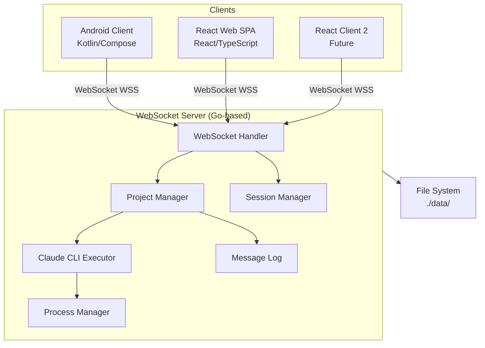
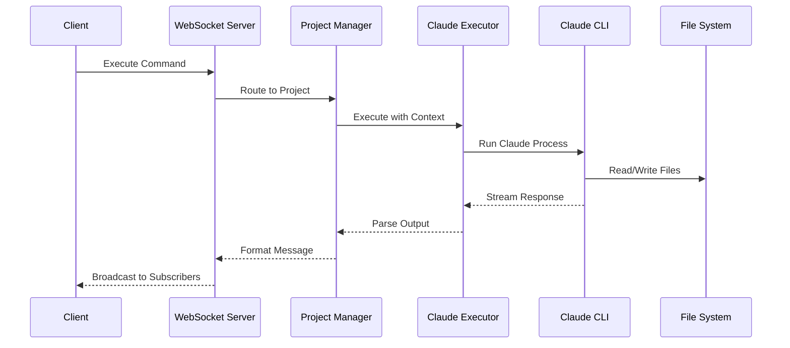

# Pocket Agent - System Architecture

## Executive Summary

Pocket Agent is a distributed system that enables remote control of Claude CLI instances through mobile and web interfaces. The system follows a multi-module monorepo architecture with clear separation between server-side execution, mobile clients, and web interfaces.

## System Overview

### High-Level Architecture



### Core Components

1. **Server Module** - WebSocket server that manages Claude CLI execution
2. **Frontend-Android Module** - Native Android client application
3. **Frontend-SPA Module** - React-based web single-page application
4. **Claude-Mock Module** - Testing tool for development without API usage

## Module Architecture

### Server Module (Go)

**Purpose**: Central hub for Claude CLI execution and client communication

**Key Responsibilities**:
- WebSocket API for real-time bidirectional communication
- Project-based execution model with session persistence
- Claude CLI process management with timeout controls
- Multi-client broadcasting and subscription management
- Message logging with automatic rotation

**Technology Stack**:
- Language: Go 1.21+
- WebSocket: Gorilla WebSocket library
- Architecture: Hexagonal (Ports & Adapters)
- Storage: File-based with atomic operations

**Internal Structure**:
```
server/
├── internal/
│   ├── config/        # Configuration management
│   ├── executor/      # Claude CLI execution logic
│   ├── models/        # Domain models (Project, Session, Message)
│   ├── project/       # Project lifecycle management
│   ├── storage/       # Message logs and persistence
│   ├── validation/    # Input validation and security
│   └── websocket/     # WebSocket server and routing
├── test/
│   ├── integration/   # Integration tests
│   ├── mocks/         # Claude mock for testing
│   └── performance/   # Load and performance tests
└── cmd/server/        # Application entry point
```

### Frontend-Android Module (Kotlin)

**Purpose**: Native Android application for mobile Claude interaction

**Key Responsibilities**:
- Native Android UI with Material Design 3
- Secure credential storage using Android Keystore
- Background monitoring and notifications
- Offline capabilities with local data persistence
- Voice input integration

**Technology Stack**:
- Language: Kotlin 2.2.0
- UI: Jetpack Compose
- Architecture: Clean Architecture + MVVM
- DI: Hilt
- Storage: Room + Encrypted SharedPreferences

**Internal Structure**:
```
frontend-android/
├── src/main/kotlin/com/pocketagent/mobile/
│   ├── data/          # Data layer (repositories, storage)
│   ├── domain/        # Business logic (use cases, models)
│   ├── presentation/  # UI layer (Compose, ViewModels)
│   ├── di/            # Dependency injection modules
│   └── background/    # Background services
```

### Frontend-SPA Module (React)

**Purpose**: Web-based single-page application for browser access

**Key Responsibilities**:
- Responsive web interface for desktop and mobile browsers
- Real-time WebSocket communication with server
- Project management and monitoring dashboard
- No server-side rendering (pure client-side SPA)

**Technology Stack**:
- Framework: React 18+
- Language: TypeScript
- Build Tool: Vite
- Styling: TailwindCSS
- Components: shadcn/ui

**Planned Structure**:
```
frontend-spa/
├── src/
│   ├── components/    # Reusable UI components
│   ├── pages/         # Page components
│   ├── features/      # Feature-specific modules
│   ├── hooks/         # Custom React hooks
│   ├── services/      # API and WebSocket services
│   ├── store/         # State management
│   └── types/         # TypeScript definitions
```

### Claude-Mock Module (Go)

**Purpose**: Development and testing tool that simulates Claude CLI

**Key Responsibilities**:
- Replay conversations from JSONL log files
- Drop-in replacement for Claude CLI during development
- Zero API cost testing
- Session continuity support

**Technology Stack**:
- Language: Go
- Architecture: Simple CLI tool
- Input: JSONL conversation logs

## Inter-Module Communication

### Communication Patterns

1. **Client � Server Communication**
   - Protocol: WebSocket (WSS)
   - Format: JSON messages
   - Pattern: Request-Response with streaming
   - Authentication: None in MVP (planned: SSH key-based)

2. **Server � Claude CLI**
   - Method: Process execution via os/exec
   - Arguments: `-p` for prompts, `-c` for session continuation
   - Output: JSON stream parsing
   - Timeout: 5-minute default with kill support

3. **Server � Clients Broadcasting**
   - Pattern: Pub/Sub per project
   - Delivery: Real-time WebSocket push
   - Scope: All subscribers to a project

### Message Protocol

#### Core Message Types

**Client to Server:**
- `project_create` - Create new project
- `project_delete` - Delete project
- `project_join` - Subscribe to project updates
- `project_leave` - Unsubscribe from project
- `execute` - Execute Claude command
- `agent_kill` - Terminate execution
- `agent_new_session` - Reset conversation

**Server to Client:**
- `project_state` - Project state updates
- `agent_message` - Claude response streaming
- `error` - Error notifications
- `server_stats` - Server metrics

#### Message Structure

```typescript
// Client � Server
interface ClientMessage {
  type: string;
  project_id?: string;
  data?: any;
  request_id?: string;
}

// Server � Client
interface ServerMessage {
  type: string;
  project_id?: string;
  data: any;
  timestamp: string;
  request_id?: string;
}
```

## Data Architecture

### Data Flow



**State Persistence**:
- Projects: JSON metadata files per project
- Messages: JSONL logs with rotation (100MB/10K messages)
- Sessions: Claude session IDs for conversation continuity

### Storage Strategy

**Server Storage**:
- Location: `./data/projects/{project-id}/`
- Format: JSON metadata + JSONL message logs
- Rotation: Automatic at size/count thresholds
- Recovery: Survives server restarts

**Android Storage**:
- Database: Room SQLite for structured data
- Security: Android Keystore for credentials
- Cache: In-memory with StateFlow
- Sync: Eventual consistency model

**Web Storage**:
- Local Storage: User preferences
- Session Storage: Temporary state
- IndexedDB: Future offline support

## Security Architecture

### Current State (MVP)

- TLS/WSS encryption for transport security
- Input validation and sanitization
- Path traversal prevention
- Process isolation for Claude execution
- No authentication (planned for future)

### Planned Security Features

1. **Authentication**:
   - SSH key-based authentication
   - Biometric authentication (Android)
   - Session management with expiry

2. **Authorization**:
   - Project-level access control
   - Read/write permissions
   - Audit logging

3. **Data Protection**:
   - Encrypted storage for sensitive data
   - Secure key management
   - Certificate pinning (mobile)

## Performance Characteristics

### Server Performance

- **Connections**: 100+ concurrent WebSocket connections
- **Latency**: <10ms message routing
- **Throughput**: 1000+ messages/second
- **Memory**: ~2MB per idle connection
- **CPU**: <5% baseline with 100 connections

### Mobile Performance

- **Startup**: <2 seconds cold start
- **Memory**: <100MB typical usage
- **Battery**: Optimized background services
- **Offline**: Full offline capability

### Web Performance

- **Bundle Size**: Target <500KB initial
- **Time to Interactive**: <3 seconds
- **Runtime Performance**: 60fps UI
- **Memory**: <200MB typical usage

## Deployment Architecture

### Server Deployment

**Development**:
```bash
# Local development
go run cmd/server/main.go

# With claude-mock
./server --claude-path ./claude-mock
```

**Production**:
- Containerized with Docker
- Orchestration via Kubernetes (future)
- Health checks and monitoring
- Graceful shutdown support

### Mobile Deployment

- Distribution: Google Play Store
- Updates: In-app updates API
- Crash Reporting: Firebase Crashlytics
- Analytics: Privacy-focused metrics

### Web Deployment

- Hosting: Static file hosting (CDN)
- Build: Vite production build
- Updates: Cache-busting strategies
- Monitoring: Error tracking

## Monitoring and Observability

### Metrics

**Server Metrics**:
- Active connections count
- Projects count and state
- Execution duration and success rate
- Message throughput
- Resource utilization

**Client Metrics**:
- Session duration
- Feature usage
- Error rates
- Performance metrics

### Logging

**Log Levels**:
- ERROR: Actionable errors
- WARN: Potential issues
- INFO: Key operations
- DEBUG: Detailed troubleshooting

**Log Format**:
```json
{
  "timestamp": "2024-01-01T12:00:00.123Z",
  "level": "info",
  "msg": "Execution completed",
  "project_id": "uuid",
  "duration_ms": 1234,
  "correlation_id": "req-123"
}
```

## Development Workflow

### Repository Structure

```
pocket_agent/
├── server/              # Go WebSocket server
├── frontend-android/    # Android client
├── frontend-spa/        # React web client
├── claude-mock/         # Testing tool
├── documentation/       # System documentation
│   ├── modules/         # Module-specific docs
│   ├── features/        # Feature specifications
│   └── architecture.md  # This document
├── .spec/               # Specification workflow
└── README.md            # Project overview
```

### Testing Strategy

1. **Unit Tests**: Component-level testing
2. **Integration Tests**: Module interaction testing
3. **E2E Tests**: Full system flow testing
4. **Performance Tests**: Load and stress testing
5. **Mock Testing**: Using claude-mock for development

### CI/CD Pipeline

**Automated Checks**:
- Code formatting and linting
- Unit and integration tests
- Security vulnerability scanning
- Build verification
- Documentation generation

## Future Enhancements

### Planned Features

1. **Authentication & Authorization**
   - Multi-user support
   - Role-based access control
   - API key management

2. **Advanced Features**
   - Multiple Claude model support
   - Collaborative sessions
   - Plugin system
   - REST API addition

3. **Platform Expansion**
   - iOS client
   - Desktop applications
   - CLI tools

4. **Enterprise Features**
   - LDAP/SSO integration
   - Audit logging
   - Compliance tools
   - Advanced monitoring

### Technical Debt

1. **Current Limitations**:
   - No Windows support (Unix/POSIX only)
   - Single server instance (no HA)
   - Basic error recovery
   - Limited monitoring

2. **Improvement Areas**:
   - Horizontal scaling
   - Advanced caching
   - Connection pooling
   - Performance optimization

## Conclusion

Pocket Agent's architecture is designed for extensibility, security, and performance. The modular structure allows independent development and deployment of components while maintaining clear contracts through well-defined APIs. The system prioritizes real-time performance, security, and user experience across all platforms.

---

*Architecture Version: 1.0*  
*Last Updated: 2025-08-01*  
*Status: Partially Implemented*  
*Next Review: Q2 2025*