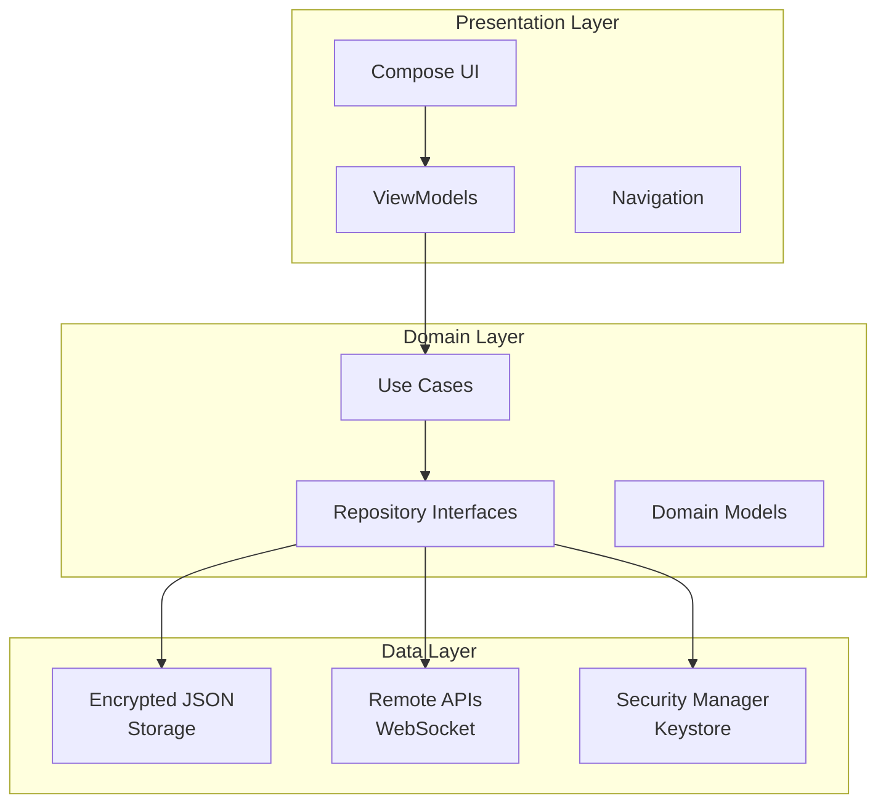
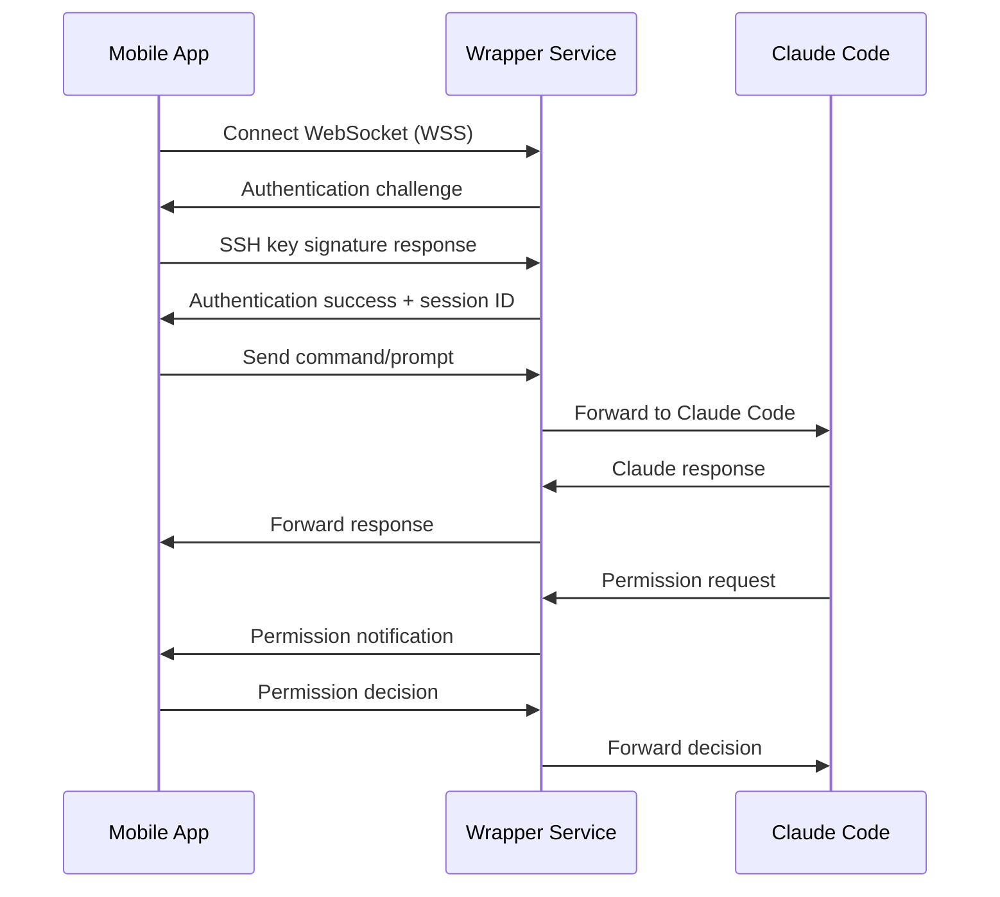
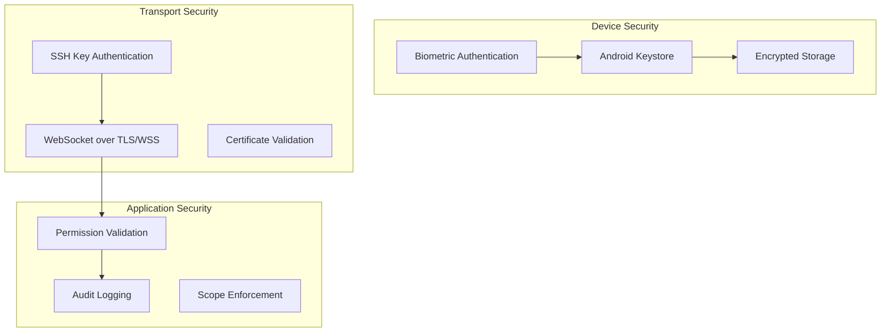

# Pocket Agent - System Architecture

## Table of Contents
1. [System Overview](#system-overview)
2. [Architecture Philosophy](#architecture-philosophy)
3. [Technology Stack](#technology-stack)
4. [Component Architecture](#component-architecture)
5. [Mobile Application Architecture](#mobile-application-architecture)
6. [Server Architecture](#server-architecture)
7. [Communication Patterns](#communication-patterns)
8. [Security Architecture](#security-architecture)
9. [Development Guidelines](#development-guidelines)
10. [Architecture Decision Records](#architecture-decision-records)

---

## System Overview

### Purpose
Pocket Agent is a mobile interface that enables developers to remotely control Claude Code instances running on development servers through their Android devices. The system addresses the fundamental incompatibility between mobile connectivity patterns and terminal-based AI development tools by providing a native mobile interface for AI-powered development workflows while maintaining full functionality including interactive permission handling.

### System Components
The Pocket Agent system consists of three primary components:
1. **Mobile Application** - Native Android app providing the user interface
2. **Wrapper Service** - Server-side WebSocket service that manages Claude Code
3. **Claude Code Process** - The actual Claude Code instance being controlled

### Key Capabilities
- Multi-server Claude Code session management with connection state control
- Real-time Claude Code interaction through chat interface
- Secure credential storage with biometric authentication
- Background monitoring with intelligent notifications
- File browsing and git status monitoring
- Quick action automation with project script integration
- Progress tracking with sub-agent monitoring

### Core Problems Solved
1. **TUI Incompatibility**: Claude Code's terminal interface cannot be reliably parsed on mobile
2. **Permission Bottleneck**: Interactive permission prompts block non-interactive execution
3. **Mobile Connectivity**: Frequent disconnections disrupt development workflows
4. **Context Loss**: Mobile app backgrounding/killing loses conversation state

---

## Architecture Philosophy

### Design Principles
1. **Mobile-First Communication**: Structured data exchange instead of terminal UI parsing
2. **Disconnection Resilience**: Handle frequent mobile network interruptions gracefully
3. **Unattended Operation**: Continue Claude Code execution during mobile disconnections
4. **Security First**: SSH key authentication for all connections
5. **Session Persistence**: Maintain conversation context across app lifecycle events
6. **Task-Focused UI**: Minimize friction for common development operations
7. **Information Dense**: Efficiently display complex technical information
8. **Context Aware**: Adapt UI based on current project and connection state
9. **Accessibility First**: Full support for screen readers and alternative input methods

### Architectural Patterns
- **Clean Architecture**: Clear separation between presentation, domain, and data layers
- **Repository Pattern**: Abstract data sources behind consistent interfaces
- **MVVM Pattern**: ViewModels manage UI state and business logic
- **Observer Pattern**: Reactive state management with Kotlin Flow
- **Dependency Injection**: Hilt for managing dependencies
- **Command Pattern**: Encapsulate operations as commands for undo/redo support

---

## Technology Stack

### Mobile Application (Android)
| Component | Technology | Version | Purpose |
|-----------|------------|---------|---------|
| Platform | Native Android | API 26+ (Android 8.0+) | Base platform |
| Language | Kotlin | Latest stable | Primary development language |
| UI Framework | Jetpack Compose | Latest | Modern reactive UI |
| Design System | Material Design 3 | Latest | Consistent UI components |
| Networking | OkHttp3 | 4.x | WebSocket client |
| SSH Operations | Bouncy Castle | Latest | SSH key handling |
| Security | Android Keystore | System | Credential encryption |
| Biometrics | BiometricPrompt | AndroidX | User authentication |
| Data Storage | Encrypted JSON | Custom | Secure local storage |
| Serialization | Kotlinx.serialization | Latest | JSON parsing |
| DI Framework | Hilt | Latest | Dependency injection |
| Background | WorkManager | AndroidX | Background tasks |
| Services | Foreground Services | Android | Persistent operations |

### Server Components (Development Machine)
| Component | Technology | Version | Purpose |
|-----------|------------|---------|---------|
| Runtime | Node.js | 18+ | Server runtime environment |
| Language | TypeScript | 5.0+ | Type safety and modern JavaScript |
| Claude Integration | @anthropic/claude-code | Latest | Claude Code SDK integration |
| Permission Handling | @modelcontextprotocol/server | Latest | MCP server for permissions |
| WebSocket | ws | 8.0+ | Real-time bidirectional communication |
| Session Storage | File-based | Custom | Conversation persistence |

### Communication Layer
| Component | Technology | Purpose |
|-----------|------------|---------|
| Protocol | WebSocket Secure (WSS) | Real-time communication |
| Encryption | TLS 1.3+ | Transport security |
| Authentication | SSH Key Challenge-Response | Identity verification |
| Message Format | JSON | Structured data exchange |
| Compression | Per-message deflate | Bandwidth optimization |

---

## Component Architecture

### High-Level System Architecture
```
┌─────────────────┐     Direct WSS    ┌──────────────────────────────────┐
│   Mobile App    │◄─────────────────►│      Development Server          │
│   (Android)     │  SSH Key Auth     │                                  │
└─────────────────┘                   │  ┌─────────────┐  ┌─────────────┐│
                                      │  │   Wrapper   │  │ Claude Code ││
                                      │  │  Service    │◄─┤   Process   ││
                                      │  │             │  │             ││
                                      │  │ ┌─────────┐ │  └─────────────┘│
                                      │  │ │ MCP     │ │                 │
                                      │  │ │ Server  │ │                 │
                                      │  │ └─────────┘ │                 │
                                      │  │ ┌─────────┐ │                 │
                                      │  │ │WebSocket│ │                 │
                                      │  │ │ Server  │ │                 │
                                      │  │ └─────────┘ │                 │
                                      │  └─────────────┘                 │
                                      └──────────────────────────────────┘
```

### Entity Relationships
The mobile app manages three core entity types with clear hierarchical relationships:

```
SSH Identity (1) ──────► (N) Server Profile ──────► (N) Project
     │                            │                        │
     ├─ id: String               ├─ id: String            ├─ id: String
     ├─ name: String             ├─ name: String          ├─ name: String
     ├─ keyAlias: String         ├─ hostname: String      ├─ serverProfileId: String
     ├─ publicKey: String        ├─ port: Int             ├─ projectPath: String
     └─ created: Instant         ├─ username: String      ├─ scriptsFolder: String
                                 ├─ sshIdentityId: String ├─ claudeSessionId: String?
                                 └─ lastConnected: Instant └─ lastActive: Instant
```

### Key Relationships
- **SSH Identity**: Represents an imported SSH private key, encrypted and stored securely
- **Server Profile**: Connection details for a development server, references which SSH key to use
- **Project**: Individual Claude Code session on a specific server with its own working directory

---

## Mobile Application Architecture

### Layered Architecture


### Module Structure
```
app/
├── presentation/     # UI, ViewModels, Navigation
│   ├── screens/     # Screen composables
│   ├── components/  # Reusable UI components
│   ├── theme/       # Material Design theme
│   └── navigation/  # Navigation graph
├── domain/          # Use Cases, Repository Interfaces, Models
│   ├── usecase/     # Business logic
│   ├── repository/  # Repository interfaces
│   └── model/       # Domain models
├── data/            # JSON Storage, Remote APIs, Security
│   ├── local/       # Local storage implementation
│   ├── remote/      # WebSocket client
│   └── security/    # Keystore and biometric
└── di/              # Dependency Injection
    └── modules/     # Hilt modules
```

### Component Hierarchy
Total Components: **70**

By Category:
- **Screen Components**: 10
- **Connection & Status Components**: 4
- **Chat Interface Components**: 2
- **Permission & Notification Components**: 6
- **Quick Actions Components**: 6
- **File Management Components**: 5
- **Security Components**: 5
- **Progress & Monitoring Components**: 5
- **Background Service Components**: 4
- **Data Management Components**: 6
- **Utility Components**: 6
- **Dialog & Modal Components**: 5
- **Accessibility Components**: 4
- **Global Services**: 3

### Navigation Architecture
```
App Root
├── WelcomeScreen (Initial)
│   └── → ProjectsListScreen
├── ProjectsListScreen (Main Hub)
│   ├── ProjectCreationScreen
│   ├── ServerManagementScreen
│   ├── SSHIdentityManagementScreen
│   ├── AppSettingsScreen
│   └── → Project View (Bottom Tab Navigation)
└── Project View (Selected Project Context)
    ├── DashboardScreen (Tab 1)
    ├── ChatScreen (Tab 2)
    ├── FilesScreen (Tab 3)
    └── ProjectSettingsScreen (Tab 4)
```

---

## Server Architecture

### Wrapper Service Components
1. **WebSocket Server**: Handles mobile app connections with TLS/WSS
2. **MCP Server**: Model Context Protocol server for permission handling
3. **Session Manager**: Manages Claude Code sessions and state
4. **Message Queue**: Stores messages during mobile disconnection
5. **Authentication Manager**: Handles SSH key challenge-response
6. **Process Supervisor**: Manages Claude Code process lifecycle

### Claude Code Integration
The wrapper service integrates with Claude Code SDK to:
- Start and manage Claude Code processes
- Handle permission requests through MCP
- Parse unstructured Claude output into structured messages
- Track session state and conversation history
- Monitor tool usage and progress

### Session Persistence
```typescript
interface SessionState {
  id: string;
  created_at: string;
  last_activity: string;
  status: 'active' | 'paused' | 'completed';
  claude_conversation_id: string;
  message_history: Message[];
  pending_permissions: PendingPermission[];
  user_preferences: PermissionPolicy[];
}
```

---

## Communication Patterns

### Message Flow Architecture


### Message Types

#### Authentication Messages
- **auth_challenge**: Server challenges mobile app with nonce
- **auth_response**: Mobile app signs challenge with SSH key
- **auth_success**: Server confirms authentication and provides session ID

#### Command Messages (Mobile → Wrapper)
- **command**: Claude prompts or shell commands to execute
- **permission_response**: Approval/denial of Claude's permission requests
- **session_control**: Resume, pause, or terminate operations
- **project_init**: Initialize new project with path and optional repository

#### Response Messages (Wrapper → Mobile)
- **claude_response**: Responses and status updates from Claude
- **permission_request**: Claude asking for tool/action approval
- **progress_update**: Operation progress and completion notifications
- **session_status**: Current session state and metrics

### Connection States
- **Connected**: Real-time bidirectional communication
- **Disconnected**: Wrapper continues execution, queues mobile updates
- **Reconnecting**: Mobile attempts to restore connection with exponential backoff
- **Synchronizing**: Mobile catches up on missed messages after reconnection

### Disconnection Handling
```kotlin
class ConnectionManager {
    private var reconnectAttempts = 0
    private val maxReconnectAttempts = 10
    private val baseBackoffDelay = 1000L // 1 second
    
    fun handleDisconnection() {
        when {
            reconnectAttempts < 3 -> immediateReconnect()
            reconnectAttempts < 10 -> exponentialBackoff()
            else -> userPromptReconnect()
        }
    }
    
    private fun exponentialBackoff() {
        val delay = baseBackoffDelay * (2.0.pow(reconnectAttempts)).toLong()
        scheduleReconnect(delay.coerceAtMost(30000L)) // Max 30s
    }
}
```

---

## Security Architecture

### Multi-Layer Security Model


### SSH Key Management
- **Secure Import**: Import existing SSH private keys into the app
- **Biometric Protection**: Keys encrypted with biometric authentication
- **Hardware Security**: Leverage Android Keystore and StrongBox when available
- **Multiple Keys**: Support different keys for different environments
- **Key Validation**: Verify imported keys and show fingerprints

### WebSocket Security
- **SSH Key Authentication**: Challenge-response authentication using SSH keys
- **TLS Enforcement**: All connections must use WSS (TLS 1.3+)
- **Session Management**: Secure session tokens with expiration
- **Rate Limiting**: Authentication attempt limits per IP
- **Certificate Pinning**: Optional certificate pinning for known servers

### Permission Security
- **Scope Validation**: Ensure operations stay within project boundaries
- **Command Sanitization**: Validate all shell commands for safety
- **User Confirmation**: Require explicit approval for destructive operations
- **Audit Trail**: Log all permissions and actions with timestamps
- **Default Policies**: Configurable policies for unattended operation

### Data Protection
- **Memory Safety**: Clear sensitive data from memory after use
- **No Persistent Secrets**: SSH keys and tokens managed by secure storage only
- **Transport Encryption**: All communication encrypted over TLS/WSS
- **Local Encryption**: Database and preferences encrypted at rest
- **Session Security**: Time-limited authentication sessions with secure renewal

---

## Development Guidelines

### Code Style and Conventions

#### Kotlin (Mobile App)
- Follow Kotlin coding conventions and idioms
- Use Jetpack Compose for all UI components
- Implement MVVM pattern with ViewModels
- Use Kotlin Coroutines for async operations
- Leverage Kotlin Flow for reactive state management
- Apply dependency injection with Hilt

#### TypeScript (Server)
- Use TypeScript strict mode
- Follow Node.js best practices
- Implement proper error handling with try-catch
- Use async/await for asynchronous operations
- Apply proper typing for all functions and objects
- Document complex logic with JSDoc comments

### Project Structure Standards
- Feature-based module organization
- Clear separation of concerns between layers
- Consistent naming conventions across the codebase
- Comprehensive unit and integration tests
- Documentation for all public APIs

### Testing Requirements
- Unit tests for all business logic
- Integration tests for API endpoints
- UI tests for critical user flows
- Performance tests for resource-intensive operations
- Security tests for authentication and authorization

### Performance Guidelines
- Optimize for mobile battery life
- Minimize network bandwidth usage
- Implement efficient caching strategies
- Use lazy loading for large datasets
- Profile and optimize memory usage

### Security Best Practices
- Never log sensitive information
- Always validate input data
- Use parameterized queries
- Implement proper authentication checks
- Follow principle of least privilege
- Regular security audits

---

## Architecture Decision Records

### ADR-001: Native Android over Cross-Platform
**Status**: Accepted  
**Context**: Need to choose between native Android or cross-platform framework  
**Decision**: Use native Android with Kotlin  
**Consequences**: 
- Optimal performance and platform integration
- Full access to Android security features
- Easier SSH and WebSocket handling
- Limited to Android platform only

### ADR-002: WebSocket over SSH Tunnel
**Status**: Accepted  
**Context**: Need secure communication between mobile and server  
**Decision**: Use WebSocket with SSH key authentication instead of SSH tunneling  
**Consequences**:
- Better mobile battery efficiency
- Compatible with mobile platform constraints
- Maintains security through challenge-response auth
- Requires custom authentication implementation

### ADR-003: Encrypted JSON over SQLite
**Status**: Accepted  
**Context**: Need local data storage solution  
**Decision**: Use encrypted JSON files instead of SQLite database  
**Consequences**:
- Simpler implementation and maintenance
- Easier data migration between versions
- Good enough performance for expected data volume
- Less sophisticated querying capabilities

### ADR-004: Foreground Service for Background Monitoring
**Status**: Accepted  
**Context**: Need to monitor Claude Code sessions when app is backgrounded  
**Decision**: Use Android Foreground Service with persistent notification  
**Consequences**:
- Reliable background operation
- Visible to user via notification
- Survives app lifecycle changes
- Requires battery optimization handling

### ADR-005: Material Design 3 with Dark Mode
**Status**: Accepted  
**Context**: Need consistent UI design system  
**Decision**: Use Material Design 3 with dark mode as primary theme  
**Consequences**:
- Modern, consistent UI appearance
- Built-in accessibility features
- OLED battery savings in dark mode
- Familiar to Android users

### ADR-006: Hilt for Dependency Injection
**Status**: Accepted  
**Context**: Need dependency injection framework  
**Decision**: Use Hilt (built on Dagger)  
**Consequences**:
- Official Android recommendation
- Compile-time verification
- Good Jetpack integration
- Slight learning curve

### ADR-007: Project Scripts for Quick Actions
**Status**: Accepted  
**Context**: Need extensible quick action system  
**Decision**: Discover and execute scripts from project directories  
**Consequences**:
- Self-extending functionality
- No app updates needed for new actions
- Security considerations for script execution
- Natural integration with development workflow

### ADR-008: Challenge-Response Authentication
**Status**: Accepted  
**Context**: Need secure authentication without exposing private keys  
**Decision**: Use SSH key challenge-response over WebSocket  
**Consequences**:
- Private keys never leave the device
- Cryptographically secure authentication
- Custom implementation required
- Compatible with existing SSH infrastructure

---

## Platform Considerations

### Android Platform Constraints
- **Battery Optimization**: Doze mode and app standby affect background operations
- **Memory Limits**: Foreground service memory constraints
- **Network Changes**: Handle transitions between WiFi and cellular
- **App Lifecycle**: Handle process death and restoration
- **Permission Model**: Request permissions at runtime
- **Storage Access**: Scoped storage restrictions

### Mobile-Specific Optimizations
- **Adaptive Polling**: Adjust frequency based on battery level
- **Connection Pooling**: Reuse WebSocket connections
- **Message Batching**: Combine updates during poor connectivity
- **Incremental Sync**: Only transfer changed data
- **Offline Support**: Queue operations during disconnection
- **Progressive Loading**: Load data as needed

### Cross-Device Compatibility
- **Screen Sizes**: Support phones and tablets
- **Input Methods**: Touch, keyboard, and voice input
- **Android Versions**: API 26+ (Android 8.0+)
- **Architecture**: Support ARM64 and x86_64
- **Performance Tiers**: Adapt to device capabilities

---

## Future Considerations

### Planned Enhancements
1. **Voice Integration**: Natural language commands via speech
2. **Multi-Platform Support**: iOS and desktop clients
3. **Team Collaboration**: Shared sessions and pair programming
4. **AI Insights**: Proactive suggestions and automation
5. **Plugin System**: Extensible architecture for custom tools

### Scalability Considerations
- **Session Management**: Support for multiple concurrent sessions
- **Message Queue**: Scalable message storage and delivery
- **Load Balancing**: Distribute wrapper services across servers
- **Monitoring**: Comprehensive metrics and alerting
- **High Availability**: Redundancy and failover support

### Integration Opportunities
- **CI/CD Integration**: Trigger deployments from mobile
- **Issue Tracking**: Create and update tickets
- **Code Review**: Review and approve PRs
- **Monitoring Tools**: View application metrics
- **Documentation**: Access and update docs

---

## Conclusion

The Pocket Agent architecture provides a robust, secure, and scalable solution for mobile Claude Code operation. By abstracting terminal complexity through structured messaging, handling mobile connectivity patterns intelligently, and maintaining security through proper authentication and encryption, the system enables effective AI-assisted development from mobile devices.

The architecture's strength lies in its:
- Clear separation of concerns across layers
- Resilient handling of mobile constraints
- Strong security model with defense in depth
- Extensible design for future enhancements
- Focus on developer productivity and experience

This architecture serves as the foundation for all feature development and should be referenced when making technical decisions or implementing new capabilities.