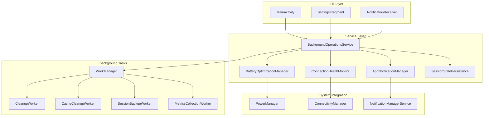
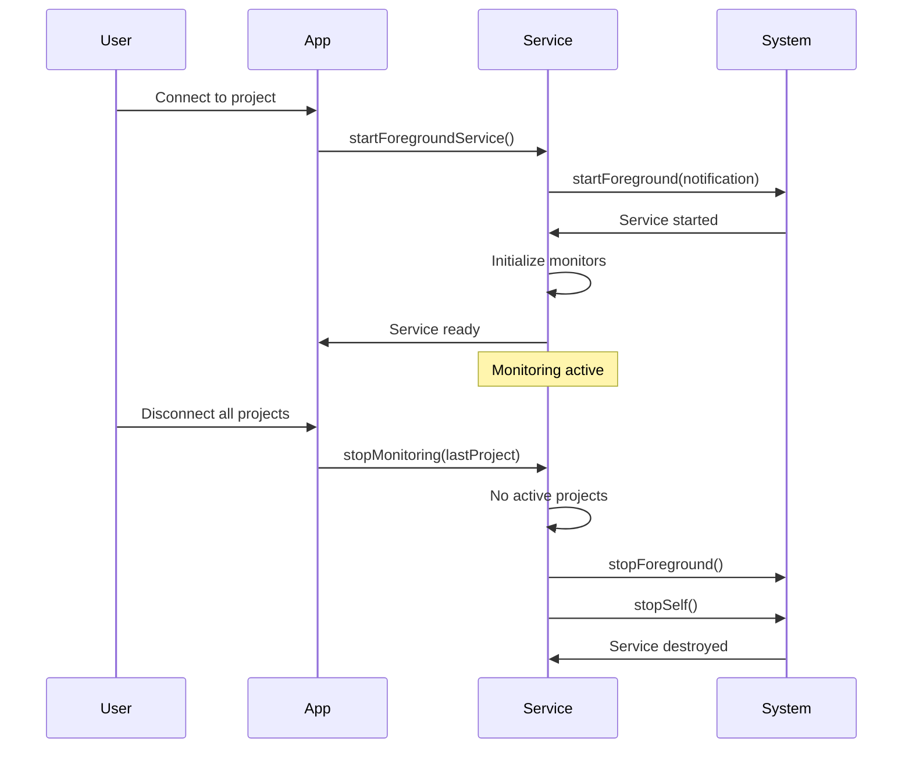
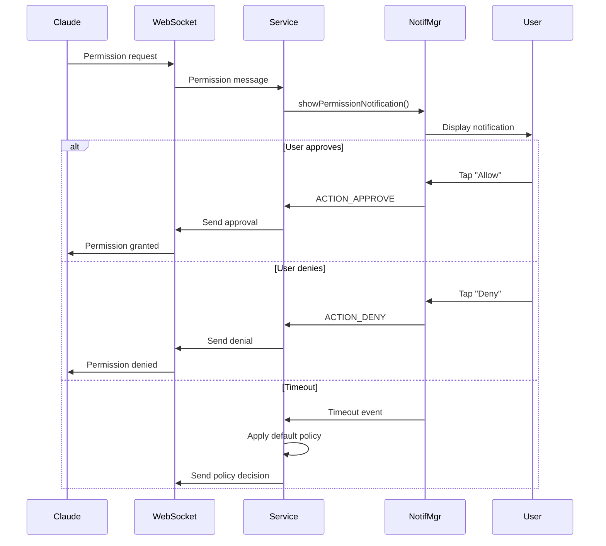

# Background Services - Design

## Architecture Overview

The Background Services feature implements a robust Android foreground service architecture that provides persistent monitoring, intelligent notifications, and adaptive resource management. The design prioritizes reliability, battery efficiency, and user control while working within Android's evolving background execution restrictions.

### Core Design Principles

1. **User Transparency**: Persistent notification keeps users informed
2. **Battery Awareness**: Adaptive behavior based on device state
3. **Graceful Degradation**: Functions with reduced capabilities when restricted
4. **State Preservation**: Survives process death and app updates
5. **Modular Architecture**: Clear separation between service, notifications, and monitoring

### Component Architecture



## Component Specifications

### 1. BackgroundOperationsService

**Purpose**: Main foreground service managing all background operations

**Purpose**: Define the main foreground service that manages all background operations and coordinates monitoring activities.
```kotlin
package com.pocketagent.service

import android.app.Notification
import android.app.Service
import android.content.Context
import android.content.Intent
import android.os.Binder
import android.os.IBinder
import androidx.core.content.ContextCompat
import androidx.lifecycle.LifecycleService
import androidx.lifecycle.lifecycleScope
import dagger.hilt.android.AndroidEntryPoint
import kotlinx.coroutines.launch
import java.util.concurrent.ConcurrentHashMap
import javax.inject.Inject

@AndroidEntryPoint
class BackgroundOperationsService : LifecycleService() {
    
    companion object {
        const val ACTION_START_MONITORING = "com.pocketagent.action.START_MONITORING"
        const val ACTION_STOP_MONITORING = "com.pocketagent.action.STOP_MONITORING"
        const val ACTION_UPDATE_PROJECT = "com.pocketagent.action.UPDATE_PROJECT"
        const val EXTRA_PROJECT_ID = "project_id"
        const val NOTIFICATION_ID = 1001
        const val CHANNEL_ID = "connection_monitoring"
        
        fun startMonitoring(context: Context, projectId: String) {
            val intent = Intent(context, BackgroundOperationsService::class.java).apply {
                action = ACTION_START_MONITORING
                putExtra(EXTRA_PROJECT_ID, projectId)
            }
            ContextCompat.startForegroundService(context, intent)
        }
    }
    
    @Inject lateinit var notificationManager: AppNotificationManager
    @Inject lateinit var connectionMonitor: ConnectionHealthMonitor
    @Inject lateinit var sessionStateManager: SessionStateManager
    @Inject lateinit var batteryManager: BatteryOptimizationManager
    @Inject lateinit var connectionManager: ConnectionManager
    
    private val activeProjects = ConcurrentHashMap<String, MonitoringSession>()
    private var serviceStarted = false
    private val binder = LocalBinder()
    
    override fun onCreate() {
        super.onCreate()
        createNotificationChannel()
        observeSystemState()
    }
    
    override fun onStartCommand(intent: Intent?, flags: Int, startId: Int): Int {
        super.onStartCommand(intent, flags, startId)
        
        when (intent?.action) {
            ACTION_START_MONITORING -> handleStartMonitoring(intent)
            ACTION_STOP_MONITORING -> handleStopMonitoring(intent)
            ACTION_UPDATE_PROJECT -> handleUpdateProject(intent)
        }
        
        return START_STICKY
    }
    
    private fun handleStartMonitoring(intent: Intent) {
        val projectId = intent.getStringExtra(EXTRA_PROJECT_ID) ?: return
        
        if (!serviceStarted) {
            startForegroundService()
            serviceStarted = true
        }
        
        lifecycleScope.launch {
            try {
                val project = loadProject(projectId)
                val session = MonitoringSession(
                    projectId = projectId,
                    project = project,
                    startTime = System.currentTimeMillis()
                )
                
                activeProjects[projectId] = session
                startMonitoringFlows(session)
                updateNotification()
                
            } catch (e: Exception) {
                handleMonitoringError(projectId, e)
            }
        }
    }
    
    inner class LocalBinder : Binder() {
        fun getService(): BackgroundOperationsService = this@BackgroundOperationsService
    }
}
```

### 2. AppNotificationManager

**Purpose**: Centralized notification creation and management

**Purpose**: Provide a centralized singleton for creating and managing all types of notifications in the application.
```kotlin
package com.pocketagent.notification

import android.app.Notification
import android.app.NotificationChannel
import android.app.NotificationManager
import android.app.PendingIntent
import android.content.Context
import android.content.Intent
import android.graphics.Color
import android.os.Build
import androidx.core.app.NotificationCompat
import androidx.core.app.NotificationManagerCompat
import dagger.hilt.android.qualifiers.ApplicationContext
import java.util.concurrent.atomic.AtomicBoolean
import javax.inject.Inject
import javax.inject.Singleton

@Singleton
class AppNotificationManager @Inject constructor(
    @ApplicationContext private val context: Context
) {
    private val notificationManager = NotificationManagerCompat.from(context)
    private val channelInitialized = AtomicBoolean(false)
    
    fun createMonitoringNotification(
        activeProjectCount: Int,
        connectionStatus: ConnectionStatus
    ): Notification {
        ensureChannelsCreated()
        
        val title = when (activeProjectCount) {
            0 -> "Pocket Agent Running"
            1 -> "Monitoring 1 project"
            else -> "Monitoring $activeProjectCount projects"
        }
        
        val content = when (connectionStatus) {
            ConnectionStatus.CONNECTED -> "All connections active"
            ConnectionStatus.CONNECTING -> "Establishing connections..."
            ConnectionStatus.ERROR -> "Connection issues detected"
            else -> "Ready to connect"
        }
        
        return NotificationCompat.Builder(context, CHANNEL_MONITORING)
            .setContentTitle(title)
            .setContentText(content)
            .setSmallIcon(R.drawable.ic_notification)
            .setContentIntent(createMainActivityIntent())
            .setOngoing(true)
            .setShowWhen(false)
            .setCategory(NotificationCompat.CATEGORY_SERVICE)
            .setForegroundServiceBehavior(NotificationCompat.FOREGROUND_SERVICE_IMMEDIATE)
            .build()
    }
    
    fun showPermissionRequestNotification(
        projectName: String,
        tool: String,
        action: String,
        requestId: String,
        riskLevel: RiskLevel,
        timeout: Int
    ) {
        val notificationId = PERMISSION_REQUEST_ID_BASE + requestId.hashCode()
        
        val riskColor = when (riskLevel) {
            RiskLevel.HIGH -> Color.RED
            RiskLevel.MEDIUM -> Color.YELLOW
            RiskLevel.LOW -> Color.GREEN
        }
        
        val notification = NotificationCompat.Builder(context, CHANNEL_PERMISSIONS)
            .setContentTitle("Permission Request: $projectName")
            .setContentText("Claude wants to use $tool to $action")
            .setSmallIcon(R.drawable.ic_permission)
            .setColor(riskColor)
            .setCategory(NotificationCompat.CATEGORY_STATUS)
            .setPriority(NotificationCompat.PRIORITY_HIGH)
            .setAutoCancel(true)
            .setTimeoutAfter(timeout * 1000L)
            .addAction(createApproveAction(requestId, notificationId))
            .addAction(createDenyAction(requestId, notificationId))
            .setDeleteIntent(createTimeoutIntent(requestId))
            .build()
        
        notificationManager.notify(notificationId, notification)
    }
    
    private fun ensureChannelsCreated() {
        if (channelInitialized.getAndSet(true)) return
        
        if (Build.VERSION.SDK_INT >= Build.VERSION_CODES.O) {
            val channels = listOf(
                createMonitoringChannel(),
                createPermissionsChannel(),
                createTasksChannel(),
                createErrorsChannel(),
                createProgressChannel(),
                createAlertsChannel()
            )
            
            notificationManager.createNotificationChannels(channels)
        }
    }
}
```

### 3. ConnectionHealthMonitor

**Purpose**: Monitors WebSocket connection health with adaptive polling

**Purpose**: Monitor WebSocket connection health and implement adaptive polling based on connection status and battery state.
```kotlin
package com.pocketagent.monitoring

import kotlinx.coroutines.*
import kotlinx.coroutines.flow.MutableStateFlow
import kotlinx.coroutines.flow.StateFlow
import java.util.concurrent.ConcurrentHashMap
import javax.inject.Inject
import javax.inject.Singleton

@Singleton
class ConnectionHealthMonitor @Inject constructor(
    private val webSocketManager: WebSocketManager,
    private val connectionManager: ConnectionManager,
    private val batteryOptimizationManager: BatteryOptimizationManager,
    private val notificationManager: AppNotificationManager,
    private val coroutineScope: CoroutineScope
) {
    private val monitoringJobs = ConcurrentHashMap<String, Job>()
    private val healthStates = MutableStateFlow<Map<String, HealthState>>(emptyMap())
    
    companion object {
        private const val HEALTH_CHECK_TIMEOUT = 5000L
        private const val MESSAGE_STALENESS_THRESHOLD = 60000L // 1 minute
    }
    
    data class HealthState(
        val projectId: String,
        val status: HealthStatus,
        val lastCheck: Long,
        val latency: Long? = null,
        val errorCount: Int = 0
    )
    
    enum class HealthStatus {
        HEALTHY,
        UNHEALTHY,
        DISCONNECTED,
        STALE,
        TIMEOUT,
        UNKNOWN
    }
    
    fun startMonitoring(projectId: String, frequency: Long) {
        stopMonitoring(projectId)
        
        monitoringJobs[projectId] = coroutineScope.launch {
            while (isActive) {
                val healthState = performHealthCheck(projectId)
                updateHealthState(projectId, healthState)
                
                if (healthState.status != HealthStatus.HEALTHY) {
                    handleUnhealthyConnection(projectId, healthState)
                }
                
                delay(frequency)
            }
        }
    }
    
    private suspend fun performHealthCheck(projectId: String): HealthState {
        val startTime = System.currentTimeMillis()
        
        return try {
            withTimeout(HEALTH_CHECK_TIMEOUT) {
                val isConnected = webSocketManager.isConnected(projectId)
                if (!isConnected) {
                    return@withTimeout HealthState(
                        projectId = projectId,
                        status = HealthStatus.DISCONNECTED,
                        lastCheck = startTime
                    )
                }
                
                val pingSuccess = webSocketManager.sendPing(projectId)
                val latency = System.currentTimeMillis() - startTime
                
                if (!pingSuccess) {
                    return@withTimeout HealthState(
                        projectId = projectId,
                        status = HealthStatus.UNHEALTHY,
                        lastCheck = startTime,
                        latency = latency
                    )
                }
                
                val lastMessageTime = connectionManager.getLastMessageTime(projectId)
                val messageAge = System.currentTimeMillis() - lastMessageTime
                
                val status = when {
                    messageAge > MESSAGE_STALENESS_THRESHOLD -> HealthStatus.STALE
                    else -> HealthStatus.HEALTHY
                }
                
                HealthState(
                    projectId = projectId,
                    status = status,
                    lastCheck = startTime,
                    latency = latency
                )
            }
        } catch (e: TimeoutCancellationException) {
            HealthState(
                projectId = projectId,
                status = HealthStatus.TIMEOUT,
                lastCheck = startTime
            )
        } catch (e: Exception) {
            HealthState(
                projectId = projectId,
                status = HealthStatus.UNKNOWN,
                lastCheck = startTime,
                errorCount = getErrorCount(projectId) + 1
            )
        }
    }
}
```

### 4. BatteryOptimizationManager

**Purpose**: Adapts service behavior based on battery state

**Purpose**: Manage battery optimization by adapting service behavior based on current battery level and charging state.
```kotlin
package com.pocketagent.battery

import android.content.BroadcastReceiver
import android.content.Context
import android.content.Intent
import android.content.IntentFilter
import android.os.BatteryManager
import android.os.Build
import android.os.PowerManager
import dagger.hilt.android.qualifiers.ApplicationContext
import kotlinx.coroutines.flow.MutableStateFlow
import kotlinx.coroutines.flow.StateFlow
import kotlinx.coroutines.flow.asStateFlow
import javax.inject.Inject
import javax.inject.Singleton

@Singleton
class BatteryOptimizationManager @Inject constructor(
    @ApplicationContext private val context: Context
) {
    private val batteryManager = context.getSystemService(Context.BATTERY_SERVICE) as BatteryManager
    private val powerManager = context.getSystemService(Context.POWER_SERVICE) as PowerManager
    
    private val _batteryState = MutableStateFlow(getCurrentBatteryState())
    val batteryState: StateFlow<BatteryState> = _batteryState.asStateFlow()
    
    companion object {
        const val FREQUENCY_CHARGING = 3_000L      // 3 seconds
        const val FREQUENCY_NORMAL = 5_000L        // 5 seconds  
        const val FREQUENCY_LOW = 15_000L          // 15 seconds
        const val FREQUENCY_CRITICAL = 30_000L     // 30 seconds
        const val FREQUENCY_POWER_SAVE = 60_000L   // 60 seconds
    }
    
    init {
        registerBatteryReceiver()
    }
    
    fun getPollingFrequency(state: BatteryState = batteryState.value): Long {
        return when {
            state.isCharging -> FREQUENCY_CHARGING
            state.isPowerSaveMode -> FREQUENCY_POWER_SAVE
            state.level == BatteryLevel.CRITICAL -> FREQUENCY_CRITICAL
            state.level == BatteryLevel.LOW -> FREQUENCY_LOW
            else -> FREQUENCY_NORMAL
        }
    }
    
    fun shouldReduceBackgroundActivity(state: BatteryState = batteryState.value): Boolean {
        return state.level == BatteryLevel.CRITICAL || 
               state.isPowerSaveMode ||
               isDozing()
    }
    
    fun shouldShowNotification(priority: NotificationPriority): Boolean {
        val state = batteryState.value
        return when (priority) {
            NotificationPriority.CRITICAL -> true
            NotificationPriority.HIGH -> state.level != BatteryLevel.CRITICAL
            NotificationPriority.NORMAL -> state.level == BatteryLevel.NORMAL || state.level == BatteryLevel.FULL
            NotificationPriority.LOW -> state.isCharging
        }
    }
    
    private fun getCurrentBatteryState(): BatteryState {
        val batteryStatus = IntentFilter(Intent.ACTION_BATTERY_CHANGED).let { filter ->
            context.registerReceiver(null, filter)
        }
        
        val level = batteryStatus?.getIntExtra(BatteryManager.EXTRA_LEVEL, -1) ?: -1
        val scale = batteryStatus?.getIntExtra(BatteryManager.EXTRA_SCALE, -1) ?: -1
        val percentage = if (level >= 0 && scale > 0) {
            (level * 100 / scale.toFloat()).toInt()
        } else {
            50 // Default to middle if unknown
        }
        
        val chargingStatus = batteryStatus?.getIntExtra(BatteryManager.EXTRA_STATUS, -1) ?: -1
        val isCharging = chargingStatus == BatteryManager.BATTERY_STATUS_CHARGING ||
                        chargingStatus == BatteryManager.BATTERY_STATUS_FULL
        
        return BatteryState(
            percentage = percentage,
            isCharging = isCharging,
            isPowerSaveMode = powerManager.isPowerSaveMode,
            level = determineBatteryLevel(percentage, isCharging)
        )
    }
    
    private fun isDozing(): Boolean {
        return if (Build.VERSION.SDK_INT >= Build.VERSION_CODES.M) {
            powerManager.isDeviceIdleMode
        } else {
            false
        }
    }
}
```

### 5. SessionStatePersistence

**Purpose**: Persists and restores session state across service lifecycle

**Purpose**: Handle persistence and restoration of session state to survive service restarts and app updates.
```kotlin
package com.pocketagent.persistence

import android.content.Context
import android.content.SharedPreferences
import android.util.Log
import com.google.gson.Gson
import dagger.hilt.android.qualifiers.ApplicationContext
import kotlinx.coroutines.Dispatchers
import kotlinx.coroutines.withContext
import java.util.concurrent.TimeUnit
import javax.inject.Inject
import javax.inject.Singleton

@Singleton
class SessionStatePersistence @Inject constructor(
    @ApplicationContext private val context: Context,
    private val encryptionService: EncryptionService
) {
    companion object {
        private const val PREFS_NAME = "background_service_state"
        private const val KEY_ACTIVE_PROJECTS = "active_projects"
        private const val KEY_CONNECTION_STATES = "connection_states"
        private const val KEY_MESSAGE_CACHE = "message_cache"
        private const val KEY_LAST_SAVE = "last_save_time"
    }
    
    private val prefs = context.getSharedPreferences(PREFS_NAME, Context.MODE_PRIVATE)
    private val gson = Gson()
    
    suspend fun saveState(
        activeProjects: Set<String>,
        connectionStates: Map<String, ConnectionState>,
        messageCache: List<CachedMessage>
    ) = withContext(Dispatchers.IO) {
        try {
            val state = ServiceState(
                activeProjects = activeProjects,
                connectionStates = connectionStates,
                messageCache = messageCache.takeLast(100), // Limit cache size
                savedAt = System.currentTimeMillis()
            )
            
            val json = gson.toJson(state)
            val encrypted = encryptionService.encrypt(json)
            
            prefs.edit()
                .putString(KEY_ACTIVE_PROJECTS, encrypted)
                .putLong(KEY_LAST_SAVE, System.currentTimeMillis())
                .apply()
                
        } catch (e: Exception) {
            Log.e("SessionState", "Failed to save state", e)
        }
    }
    
    suspend fun restoreState(): ServiceState? = withContext(Dispatchers.IO) {
        try {
            val encrypted = prefs.getString(KEY_ACTIVE_PROJECTS, null) ?: return@withContext null
            val json = encryptionService.decrypt(encrypted)
            
            val state = gson.fromJson(json, ServiceState::class.java)
            
            // Check if state is too old (>24 hours)
            val age = System.currentTimeMillis() - state.savedAt
            if (age > TimeUnit.HOURS.toMillis(24)) {
                return@withContext null
            }
            
            state
        } catch (e: Exception) {
            Log.e("SessionState", "Failed to restore state", e)
            null
        }
    }
    
    fun saveEmergencyState(activeProjects: Set<String>) {
        // Synchronous save for emergency situations
        try {
            prefs.edit()
                .putStringSet("emergency_projects", activeProjects)
                .commit() // Use commit() for synchronous save
        } catch (e: Exception) {
            Log.e("SessionState", "Emergency save failed", e)
        }
    }
    
    data class ServiceState(
        val activeProjects: Set<String>,
        val connectionStates: Map<String, ConnectionState>,
        val messageCache: List<CachedMessage>,
        val savedAt: Long
    )
}
```

### 6. WorkManager Integration

**Purpose**: Scheduled background tasks for maintenance

**Purpose**: Schedule and manage periodic background tasks using WorkManager for maintenance operations.
```kotlin
package com.pocketagent.work

import androidx.work.*
import java.util.concurrent.TimeUnit
import javax.inject.Inject
import javax.inject.Singleton

@Singleton
class BackgroundTaskScheduler @Inject constructor(
    private val workManager: WorkManager
) {
    companion object {
        const val TAG_PERIODIC = "periodic_tasks"
        const val WORK_CLEANUP = "cleanup_work"
        const val WORK_CACHE_CLEANUP = "cache_cleanup_work"
        const val WORK_SESSION_BACKUP = "session_backup_work"
        const val WORK_METRICS = "metrics_work"
    }
    
    fun schedulePeriodicTasks() {
        scheduleCleanupWork()
        scheduleCacheCleanupWork()
        scheduleSessionBackupWork()
        scheduleMetricsWork()
    }
    
    private fun scheduleCleanupWork() {
        val constraints = Constraints.Builder()
            .setRequiresCharging(true)
            .setRequiresBatteryNotLow(true)
            .build()
        
        val cleanupRequest = PeriodicWorkRequestBuilder<CleanupWorker>(
            repeatInterval = 1,
            repeatIntervalTimeUnit = TimeUnit.DAYS
        )
            .setConstraints(constraints)
            .addTag(TAG_PERIODIC)
            .setBackoffCriteria(
                BackoffPolicy.EXPONENTIAL,
                WorkRequest.MIN_BACKOFF_MILLIS,
                TimeUnit.MILLISECONDS
            )
            .build()
        
        workManager.enqueueUniquePeriodicWork(
            WORK_CLEANUP,
            ExistingPeriodicWorkPolicy.KEEP,
            cleanupRequest
        )
    }
}

**Purpose**: Implement a periodic cleanup worker that removes old messages and inactive sessions.
```kotlin
package com.pocketagent.work

import android.content.Context
import android.util.Log
import androidx.hilt.work.HiltWorker
import androidx.work.CoroutineWorker
import androidx.work.WorkerParameters
import dagger.assisted.Assisted
import dagger.assisted.AssistedFactory
import dagger.assisted.AssistedInject
import java.util.concurrent.TimeUnit

@HiltWorker
class CleanupWorker @AssistedInject constructor(
    @Assisted context: Context,
    @Assisted workerParams: WorkerParameters,
    private val messageRepository: MessageRepository,
    private val sessionRepository: SessionRepository
) : CoroutineWorker(context, workerParams) {
    
    companion object {
        private const val MESSAGE_RETENTION_DAYS = 30
        private const val SESSION_RETENTION_DAYS = 90
    }
    
    override suspend fun doWork(): Result {
        return try {
            val cutoffTime = System.currentTimeMillis() - 
                TimeUnit.DAYS.toMillis(MESSAGE_RETENTION_DAYS.toLong())
            
            val deletedMessages = messageRepository.deleteMessagesOlderThan(cutoffTime)
            val deletedSessions = sessionRepository.deleteInactiveSessionsOlderThan(
                System.currentTimeMillis() - TimeUnit.DAYS.toMillis(SESSION_RETENTION_DAYS.toLong())
            )
            
            Log.i("CleanupWorker", "Deleted $deletedMessages messages and $deletedSessions sessions")
            
            Result.success()
        } catch (e: Exception) {
            Log.e("CleanupWorker", "Cleanup failed", e)
            if (runAttemptCount < 3) {
                Result.retry()
            } else {
                Result.failure()
            }
        }
    }
    
    @AssistedFactory
    interface Factory {
        fun create(context: Context, workerParams: WorkerParameters): CleanupWorker
    }
}
```

## Integration Flows

### Service Lifecycle Flow



### Permission Notification Flow



### Battery Adaptation Flow

```mermaid
stateDiagram-v2
    [*] --> Normal: Battery > 30%
    Normal --> Low: Battery 15-30%
    Low --> Critical: Battery < 15%
    Critical --> Low: Battery > 15%
    Low --> Normal: Battery > 30%
    Normal --> Charging: Plugged in
    Low --> Charging: Plugged in
    Critical --> Charging: Plugged in
    Charging --> Normal: Unplugged
    
    state Normal {
        Polling: 5 seconds
        Notifications: All
        Background: Full
    }
    
    state Low {
        Polling: 15 seconds
        Notifications: High priority
        Background: Reduced
    }
    
    state Critical {
        Polling: 30 seconds
        Notifications: Critical only
        Background: Minimal
    }
    
    state Charging {
        Polling: 3 seconds
        Notifications: All
        Background: Full
    }
```

## Error Handling Strategy

### Service-Level Errors

**Purpose**: Define a sealed class hierarchy for all possible service-level errors with specific handling strategies.
```kotlin
package com.pocketagent.service.error

sealed class ServiceError : Exception() {
    data class ProjectNotFound(val projectId: String) : ServiceError()
    data class NotificationPermissionDenied(val message: String) : ServiceError()
    data class ServiceStartFailed(val reason: String) : ServiceError()
    data class StateCorrupted(val message: String) : ServiceError()
    object MemoryPressure : ServiceError()
}

private fun handleServiceError(error: ServiceError) {
    when (error) {
        is ServiceError.ProjectNotFound -> {
            // Remove from active projects
            activeProjects.remove(error.projectId)
            updateNotification()
        }
        is ServiceError.NotificationPermissionDenied -> {
            // Fallback to in-app notifications
            enableInAppNotificationMode()
        }
        is ServiceError.ServiceStartFailed -> {
            // Log and attempt recovery
            scheduleServiceRestart()
        }
        is ServiceError.StateCorrupted -> {
            // Clear corrupted state and restart fresh
            clearPersistedState()
            restartService()
        }
        is ServiceError.MemoryPressure -> {
            // Reduce memory usage
            trimMemoryUsage()
        }
    }
}
```

### Notification Delivery Failures

**Purpose**: Handle notification delivery failures with appropriate fallback strategies.
```kotlin
package com.pocketagent.notification

import android.os.RemoteException

private fun handleNotificationFailure(notificationId: Int, error: Exception) {
    when (error) {
        is SecurityException -> {
            // Missing notification permission
            requestNotificationPermission()
        }
        is RemoteServiceException -> {
            // System notification service issue
            retryNotificationWithBackoff(notificationId)
        }
        else -> {
            // Fallback to in-app display
            queueForInAppDisplay(notificationId)
        }
    }
}
```

## Performance Optimizations

### Memory Management

**Purpose**: Implement memory management callbacks to handle different memory pressure levels.
```kotlin
package com.pocketagent.service

import android.content.ComponentCallbacks2

override fun onTrimMemory(level: Int) {
    super.onTrimMemory(level)
    
    when (level) {
        ComponentCallbacks2.TRIM_MEMORY_UI_HIDDEN -> {
            // Release UI-related resources
            notificationManager.clearCachedBitmaps()
        }
        ComponentCallbacks2.TRIM_MEMORY_RUNNING_LOW -> {
            // Reduce cache sizes
            messageCache.trimToSize(50)
            connectionMonitor.reduceHistorySize()
        }
        ComponentCallbacks2.TRIM_MEMORY_RUNNING_CRITICAL -> {
            // Emergency measures
            sessionStatePersistence.saveEmergencyState(activeProjects.keys)
            messageCache.clear()
            System.gc()
        }
    }
}
```

### CPU Optimization

**Purpose**: Implement CPU optimization strategies including notification batching and efficient polling.
```kotlin
package com.pocketagent.service.optimization

import kotlinx.coroutines.*
import kotlinx.coroutines.flow.MutableSharedFlow
import kotlinx.coroutines.flow.debounce

// Batch notification updates
private val notificationUpdateDebouncer = MutableSharedFlow<Unit>()

init {
    notificationUpdateDebouncer
        .debounce(500) // Wait 500ms for additional updates
        .collect {
            actuallyUpdateNotification()
        }
}

// Efficient polling with coroutines
private fun startEfficientPolling(projectId: String, interval: Long) {
    lifecycleScope.launch {
        while (isActive) {
            ensureActive() // Check cancellation
            
            withContext(Dispatchers.IO) {
                performHealthCheck(projectId)
            }
            
            delay(interval)
        }
    }
}
```

### Battery Optimization

**Purpose**: Implement battery optimization strategies including wake lock management and network batching.
```kotlin
package com.pocketagent.battery.optimization

// Coalesce wake locks
private val wakeLockManager = WakeLockManager()

suspend fun <T> withWakeLock(block: suspend () -> T): T {
    return wakeLockManager.withWakeLock("operation", 30_000L) {
        block()
    }
}

// Batch network operations
private val networkBatcher = NetworkBatcher()

fun queueHealthCheck(projectId: String) {
    networkBatcher.queue {
        performHealthCheck(projectId)
    }
}
```

## Security Measures

### Service Security

**Purpose**: Implement security measures to validate all incoming intents and prevent unauthorized access.
```kotlin
package com.pocketagent.service.security

import android.content.Intent
import android.os.Binder
import android.util.Log

// Validate all incoming intents
override fun onStartCommand(intent: Intent?, flags: Int, startId: Int): Int {
    // Verify caller
    val callingUid = Binder.getCallingUid()
    if (callingUid != applicationInfo.uid) {
        Log.w(TAG, "Rejected intent from UID: $callingUid")
        return START_NOT_STICKY
    }
    
    // Validate action
    val action = intent?.action
    if (action != null && !isValidAction(action)) {
        Log.w(TAG, "Invalid action: $action")
        return START_NOT_STICKY
    }
    
    // Validate extras
    intent?.extras?.let { extras ->
        if (!validateExtras(extras)) {
            Log.w(TAG, "Invalid extras")
            return START_NOT_STICKY
        }
    }
    
    return super.onStartCommand(intent, flags, startId)
}
```

### Notification Security

**Purpose**: Create secure PendingIntents with timestamp and nonce to prevent replay attacks.
```kotlin
package com.pocketagent.notification.security

import android.app.PendingIntent
import android.content.Context
import android.content.Intent
import android.os.Bundle
import java.util.UUID

// Secure PendingIntent creation
private fun createSecurePendingIntent(
    action: String,
    requestCode: Int,
    extras: Bundle? = null
): PendingIntent {
    val intent = Intent(context, NotificationActionReceiver::class.java).apply {
        this.action = action
        extras?.let { putExtras(it) }
        // Add timestamp to prevent replay
        putExtra("timestamp", System.currentTimeMillis())
        // Add nonce for additional security
        putExtra("nonce", UUID.randomUUID().toString())
    }
    
    return PendingIntent.getBroadcast(
        context,
        requestCode,
        intent,
        PendingIntent.FLAG_UPDATE_CURRENT or PendingIntent.FLAG_IMMUTABLE
    )
}
```

## Testing Strategies

### Service Testing

**Purpose**: Test service lifecycle and foreground notification behavior using Android testing framework.
```kotlin
package com.pocketagent.service.test

import android.app.Notification
import android.content.Context
import androidx.test.ext.junit.runners.AndroidJUnit4
import androidx.test.rule.ServiceTestRule
import org.junit.Test
import org.junit.runner.RunWith
import org.robolectric.Shadows.shadowOf
import kotlin.test.assertNotNull
import kotlin.test.assertNull
import kotlin.test.assertTrue

@RunWith(AndroidJUnit4::class)
class BackgroundOperationsServiceTest {
    
    @Test
    fun testServiceLifecycle() {
        val scenario = ServiceTestRule()
        
        // Start service
        val intent = BackgroundOperationsService.createStartIntent(context, "project1")
        scenario.startService(intent)
        
        // Verify foreground notification
        val notification = shadowOf(notificationManager)
            .getNotification(BackgroundOperationsService.NOTIFICATION_ID)
        assertNotNull(notification)
        assertTrue(notification.flags and Notification.FLAG_ONGOING_EVENT != 0)
        
        // Stop service
        val stopIntent = BackgroundOperationsService.createStopIntent(context, "project1")
        scenario.startService(stopIntent)
        
        // Verify service stopped
        assertNull(shadowOf(notificationManager)
            .getNotification(BackgroundOperationsService.NOTIFICATION_ID))
    }
}
```

### Integration Testing

**Purpose**: Test complete notification flow including user interaction using UI Automator.
```kotlin
package com.pocketagent.integration.test

import androidx.test.filters.LargeTest
import androidx.test.platform.app.InstrumentationRegistry.getInstrumentation
import androidx.test.uiautomator.By
import androidx.test.uiautomator.UiDevice
import androidx.test.uiautomator.Until
import org.junit.Test
import kotlin.test.assertEquals

@LargeTest
class NotificationIntegrationTest {
    
    @Test
    fun testPermissionNotificationFlow() {
        // Start monitoring
        BackgroundOperationsService.startMonitoring(context, "project1")
        
        // Simulate permission request
        val request = createPermissionRequest()
        sendMockWebSocketMessage(request)
        
        // Wait for notification
        UiDevice.getInstance(getInstrumentation())
            .wait(Until.hasObject(By.text("Permission Request")), 5000)
        
        // Click Allow
        val allowButton = device.findObject(By.text("Allow"))
        allowButton.click()
        
        // Verify response sent
        val response = captureWebSocketMessage()
        assertEquals("approved", response.decision)
    }
}
```

## Future Enhancements

1. **Advanced Monitoring**
   - ML-based anomaly detection
   - Predictive failure analysis
   - Resource usage forecasting

2. **Enhanced Notifications**
   - Rich media notifications
   - Voice interaction support
   - Wear OS integration

3. **Power Management**
   - Solar charging detection
   - Thermal throttling awareness
   - 5G vs WiFi optimization

4. **Platform Integration**
   - Android Auto support
   - Assistant actions
   - Widget implementation