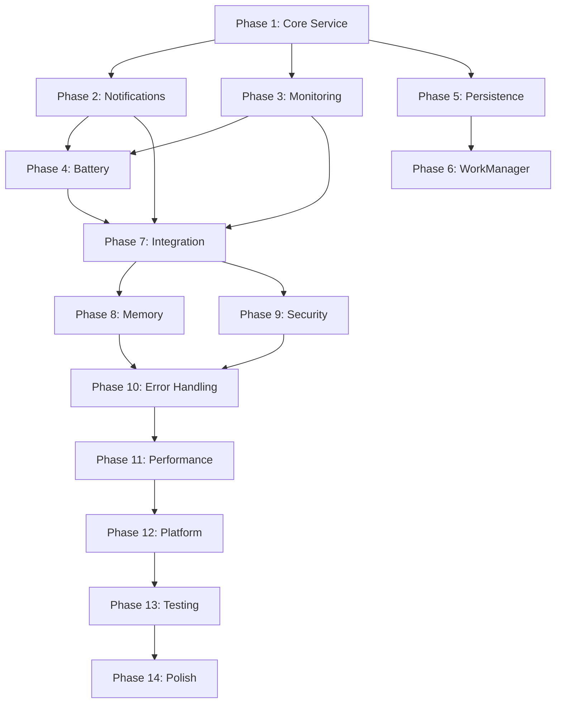

# Background Services - Tasks

## Prerequisites

### Required Reading
- [ ] Review `context.md` for business understanding
- [ ] Review `research.md` for technical decisions
- [ ] Review `requirements.md` for all user stories
- [ ] Review `design.md` for implementation approach
- [ ] Review global `architecture.md` for system context

### Development Environment
- [ ] Android Studio configured
- [ ] Kotlin 1.9+ installed
- [ ] Required dependencies available
- [ ] Test devices/emulators ready

### Dependencies
- [ ] Data Layer feature completed (if applicable)
- [ ] Communication Layer available (if applicable)

## Implementation Phases

### Phase 1: Core Service Infrastructure

#### Task 1.1: Setup Service Foundation
- [ ] Create BackgroundOperationsService class extending LifecycleService
- [ ] Add service declaration to AndroidManifest.xml
- [ ] Configure foreground service permissions
- _Requirements: 1.1, 1.2, 1.3, 1.5_

#### Task 1.2: Implement Service Lifecycle
- [ ] Handle onCreate, onStartCommand, onDestroy
- [ ] Implement START_STICKY return behavior
- [ ] Add service binding support
- _Requirements: 1.1, 1.2, 7.1, 7.3_

#### Task 1.3: Create Notification Channel
- [ ] Define notification channel constants
- [ ] Create monitoring channel with LOW importance
- [ ] Handle channel creation for Android O+
- _Requirements: 1.3, 2.1_

#### Task 1.4: Implement Foreground Notification
- [ ] Create persistent monitoring notification
- [ ] Show active project count
- [ ] Display connection status
- _Requirements: 1.3, 3.2, 3.5_

### Phase 2: Notification System

#### Task 2.1: Create NotificationManager
- [ ] Implement AppNotificationManager singleton
- [ ] Add dependency injection with Hilt
- [ ] Create notification builder methods
- _Requirements: 2.1, 2.2, 2.3_

#### Task 2.2: Define Notification Channels
- [ ] Create all 6 notification channels
- [ ] Set appropriate importance levels
- [ ] Configure channel settings
- _Requirements: 2.1, 4.2, 5.1_

#### Task 2.3: Implement Permission Notifications
- [ ] Create permission request notification layout
- [ ] Add Allow/Deny action buttons
- [ ] Implement timeout handling
- _Requirements: 2.1, 2.2, 2.3, 2.6_

#### Task 2.4: Create Notification Actions
- [ ] Implement NotificationActionReceiver
- [ ] Handle ACTION_APPROVE and ACTION_DENY
- [ ] Create secure PendingIntents
- _Requirements: 2.3, 2.4, 2.5_

#### Task 2.5: Implement Other Notification Types
- [ ] Task completion notifications
- [ ] Error notifications with retry
- [ ] Progress notifications
- [ ] Authentication alerts
- _Requirements: 5.1, 5.2, 5.3, 5.5_

### Phase 3: Connection Monitoring

#### Task 3.1: Create ConnectionHealthMonitor
- [ ] Implement health check logic
- [ ] Add timeout handling
- [ ] Define health states
- _Requirements: 3.1, 3.4, 7.3_

#### Task 3.2: Implement Health Check Protocol
- [ ] WebSocket connection verification
- [ ] Ping/pong implementation
- [ ] Message flow monitoring
- _Requirements: 3.1, 7.2, 7.3_

#### Task 3.3: Add Adaptive Polling
- [ ] Implement polling frequency adjustment
- [ ] Create monitoring job management
- [ ] Handle monitoring lifecycle
- _Requirements: 4.1, 4.3, 4.5_

#### Task 3.4: Implement Failure Detection
- [ ] Detect unhealthy connections
- [ ] Trigger automatic reconnection
- [ ] Send failure notifications
- _Requirements: 3.3, 7.3_

### Phase 4: Battery Optimization

#### Task 4.1: Create BatteryOptimizationManager
- [ ] Monitor battery state changes
- [ ] Implement BatteryReceiver
- [ ] Track charging status
- _Requirements: 4.1, 4.2, 4.3_

#### Task 4.2: Implement Adaptive Behavior
- [ ] Define polling frequencies per battery level
- [ ] Create notification filtering logic
- [ ] Implement background activity reduction
- _Requirements: 4.1, 4.2, 4.5_

#### Task 4.3: Handle Power Save Mode
- [ ] Detect power save mode activation
- [ ] Adjust service behavior accordingly
- [ ] Show user notification about reduced activity
- _Requirements: 4.4_

#### Task 4.4: Implement Doze Mode Compliance
- [ ] Detect Doze mode state
- [ ] Batch non-critical operations
- [ ] Use high-priority notifications when needed
- _Requirements: 4.5_

### Phase 5: State Persistence

#### Task 5.1: Create SessionStatePersistence
- [ ] Implement state data classes
- [ ] Add encryption for sensitive data
- [ ] Create save/restore methods
- _Requirements: 7.3, 7.4_

#### Task 5.2: Implement State Triggers
- [ ] Save on app lifecycle events
- [ ] Handle low memory warnings
- [ ] Periodic auto-save implementation
- _Requirements: 7.4, 7.5_

#### Task 5.3: Add Emergency State Save
- [ ] Implement synchronous save method
- [ ] Handle process death scenarios
- [ ] Minimal state preservation
- _Requirements: 7.4_

#### Task 5.4: Implement State Recovery
- [ ] Restore state on service start
- [ ] Validate restored state age
- [ ] Handle corrupted state
- _Requirements: 7.1, 7.2, 7.3_

### Phase 6: WorkManager Integration

#### Task 6.1: Setup WorkManager
- [ ] Add WorkManager dependencies
- [ ] Create work request builders
- [ ] Configure work constraints
- _Requirements: 8.1, 8.2, 8.3_

#### Task 6.2: Implement CleanupWorker
- [ ] Create daily cleanup task
- [ ] Delete old messages
- [ ] Remove orphaned sessions
- _Requirements: 8.1, 8.3, 8.4_

#### Task 6.3: Create CacheCleanupWorker
- [ ] Implement cache size management
- [ ] Clear temporary files
- [ ] Optimize database
- _Requirements: 8.2, 8.5_

#### Task 6.4: Add SessionBackupWorker
- [ ] Backup active sessions periodically
- [ ] Save conversation history
- [ ] Preserve user preferences
- _Requirements: 7.3, 7.5_

#### Task 6.5: Implement MetricsCollectionWorker
- [ ] Collect usage statistics
- [ ] Track performance metrics
- [ ] Aggregate error data
- _Requirements: 6.4_

### Phase 7: Service Integration

#### Task 7.1: Integrate with WebSocketManager
- [ ] Monitor active connections
- [ ] Receive connection state updates
- [ ] Handle connection events
- _Requirements: 1.1, 3.1, 3.3_

#### Task 7.2: Connect Permission System
- [ ] Receive permission requests
- [ ] Send permission responses
- [ ] Track permission history
- _Requirements: 2.1, 2.4, 2.6_

#### Task 7.3: Implement Project Management
- [ ] Track active projects
- [ ] Handle project additions/removals
- [ ] Update notification accordingly
- _Requirements: 3.1, 3.2, 3.4_

#### Task 7.4: Add Service Binding
- [ ] Create service binder interface
- [ ] Implement bound service pattern
- [ ] Handle client connections
- _Requirements: 1.4, 3.5_

### Phase 8: Memory Management

#### Task 8.1: Implement Memory Monitoring
- [ ] Override onTrimMemory callback
- [ ] Define memory pressure levels
- [ ] Create trimming strategies
- _Requirements: 7.4_

#### Task 8.2: Add Cache Management
- [ ] Implement message cache with size limits
- [ ] Create LRU eviction policy
- [ ] Add cache trimming methods
- _Requirements: 8.2_

#### Task 8.3: Optimize Bitmap Usage
- [ ] Recycle notification icons
- [ ] Use appropriate image sizes
- [ ] Implement bitmap pooling
- _Requirements: 4.1, 4.2_

#### Task 8.4: Handle Memory Pressure
- [ ] Save critical state on low memory
- [ ] Clear non-essential caches
- [ ] Reduce polling frequency
- _Requirements: 7.4, 4.1_

### Phase 9: Security Implementation

#### Task 9.1: Secure Service Access
- [ ] Validate calling UIDs
- [ ] Check intent actions
- [ ] Verify intent extras
- _Requirements: 6.5_

#### Task 9.2: Implement Notification Security
- [ ] Use FLAG_IMMUTABLE for PendingIntents
- [ ] Add timestamp validation
- [ ] Implement nonce generation
- _Requirements: 2.4, 2.5_

#### Task 9.3: Secure State Storage
- [ ] Encrypt persisted state
- [ ] Use Android Keystore
- [ ] Implement secure wipe
- _Requirements: 7.3, 7.4_

#### Task 9.4: Add Security Logging
- [ ] Log security events
- [ ] Track access attempts
- [ ] Monitor permission usage
- _Requirements: 2.4, 6.4_

### Phase 10: Error Handling

#### Task 10.1: Define Error Types
- [ ] Create ServiceError sealed class
- [ ] Define specific error cases
- [ ] Add error metadata
- _Requirements: 6.5_

#### Task 10.2: Implement Error Handlers
- [ ] Handle each error type appropriately
- [ ] Add recovery mechanisms
- [ ] Log errors for debugging
- _Requirements: 6.5, 7.3_

#### Task 10.3: Add Retry Logic
- [ ] Implement exponential backoff
- [ ] Set maximum retry limits
- [ ] Handle permanent failures
- _Requirements: 2.1, 7.3_

#### Task 10.4: Create Fallback Mechanisms
- [ ] In-app notification fallback
- [ ] Graceful degradation
- [ ] User error communication
- _Requirements: 6.5, 2.6_

### Phase 11: Performance Optimization

#### Task 11.1: Implement Notification Batching
- [ ] Create notification debouncer
- [ ] Batch similar notifications
- [ ] Reduce notification churn
- _Requirements: 5.5, 4.5_

#### Task 11.2: Optimize Coroutine Usage
- [ ] Use appropriate dispatchers
- [ ] Implement structured concurrency
- [ ] Add cancellation checks
- _Requirements: 4.1, 4.5_

#### Task 11.3: Add Wake Lock Management
- [ ] Create WakeLockManager
- [ ] Implement wake lock pooling
- [ ] Add timeout protection
- _Requirements: 4.1, 4.3_

#### Task 11.4: Implement Network Batching
- [ ] Queue network operations
- [ ] Batch requests during Doze
- [ ] Optimize radio usage
- _Requirements: 4.5_

### Phase 12: Platform-Specific Handling

#### Task 12.1: Handle Manufacturer Variations
- [ ] Detect device manufacturer
- [ ] Implement manufacturer workarounds
- [ ] Add battery optimization guides
- _Requirements: 6.1, 6.2_

#### Task 12.2: Support Android Versions
- [ ] Handle API level differences
- [ ] Implement compatibility wrappers
- [ ] Test on multiple versions
- _Requirements: 6.5_

#### Task 12.3: Handle Permission Changes
- [ ] Support Android 13 notification permission
- [ ] Handle permission denial gracefully
- [ ] Show permission rationale
- _Requirements: 6.1, 6.5_

#### Task 12.4: Implement Doze Workarounds
- [ ] High-priority FCM integration
- [ ] User education dialogs
- [ ] Battery optimization exemption
- _Requirements: 4.5, 6.2_

### Phase 13: Testing Implementation

#### Task 13.1: Create Unit Tests
- [ ] Test service lifecycle
- [ ] Test notification creation
- [ ] Test battery optimization logic
- _Requirements: All functional requirements_

#### Task 13.2: Implement Integration Tests
- [ ] Test full notification flow
- [ ] Test WorkManager tasks
- [ ] Test state persistence
- _Requirements: 2.1-2.6, 7.1-7.5, 8.1-8.5_

#### Task 13.3: Add UI Tests
- [ ] Test notification interactions
- [ ] Test permission flows
- [ ] Test service controls
- _Requirements: 1.4, 2.3, 6.3_

#### Task 13.4: Performance Testing
- [ ] Measure battery impact
- [ ] Monitor memory usage
- [ ] Track CPU utilization
- _Requirements: Performance Requirements_

### Phase 14: Documentation and Polish

#### Task 14.1: Write User Documentation
- [ ] Battery optimization guide
- [ ] Notification settings guide
- [ ] Troubleshooting guide
- _Requirements: 6.1, 6.2, 6.4_

#### Task 14.2: Add Developer Documentation
- [ ] API documentation
- [ ] Architecture overview
- [ ] Testing guide
- _Requirements: All technical requirements_

#### Task 14.3: Implement Analytics
- [ ] Track service uptime
- [ ] Monitor notification engagement
- [ ] Measure battery impact
- _Requirements: 6.4_

#### Task 14.4: Final Polish
- [ ] Optimize notification text
- [ ] Refine UI interactions
- [ ] Performance tuning
- _Requirements: All usability requirements_

## Task Dependencies

## Estimated Timeline

- **Phase 1-2**: 1 week (Core service and notifications)
- **Phase 3-4**: 1 week (Monitoring and battery optimization)
- **Phase 5-6**: 1 week (Persistence and WorkManager)
- **Phase 7-8**: 1 week (Integration and memory management)
- **Phase 9-10**: 1 week (Security and error handling)
- **Phase 11-12**: 1 week (Performance and platform support)
- **Phase 13-14**: 1 week (Testing and documentation)

**Total Estimated Duration**: 7 weeks

## Risk Mitigation

1. **Technical Risks**
   - Service killed by system → Implement proper foreground service
   - Battery drain complaints → Extensive battery testing and optimization
   - Notification delivery failures → Multiple fallback mechanisms

2. **Platform Risks**
   - Android version fragmentation → Compatibility library usage
   - Manufacturer customizations → Device-specific testing
   - Permission changes → Graceful degradation

3. **User Experience Risks**
   - Notification fatigue → Smart grouping and importance levels
   - Complex permissions → Clear user education
   - Battery anxiety → Transparent battery usage display

## Success Criteria

1. Service maintains 99.9% uptime during active monitoring
2. All permission requests generate notifications within 3 seconds
3. Battery usage under 3% per hour during normal operation
4. Zero data loss during service lifecycle events
5. Successful operation on 95% of Android devices
6. User satisfaction rating >4.5/5 for reliability
7. All automated tests passing with >90% coverage