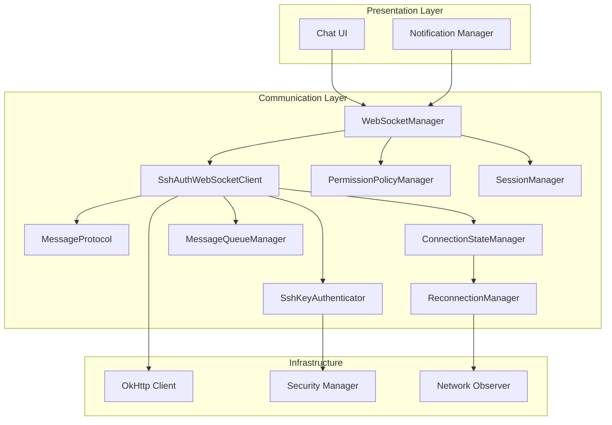
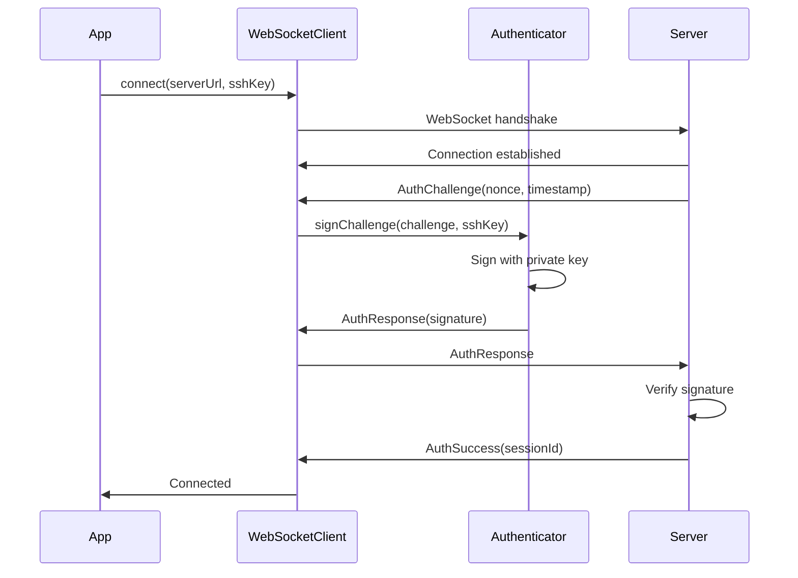
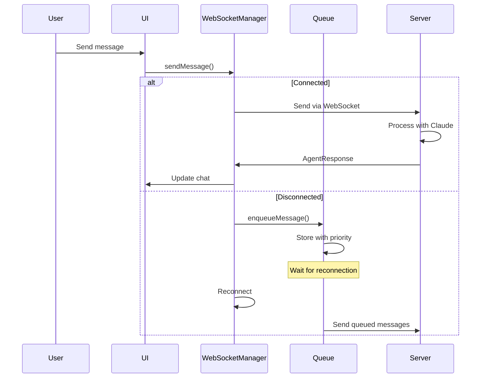
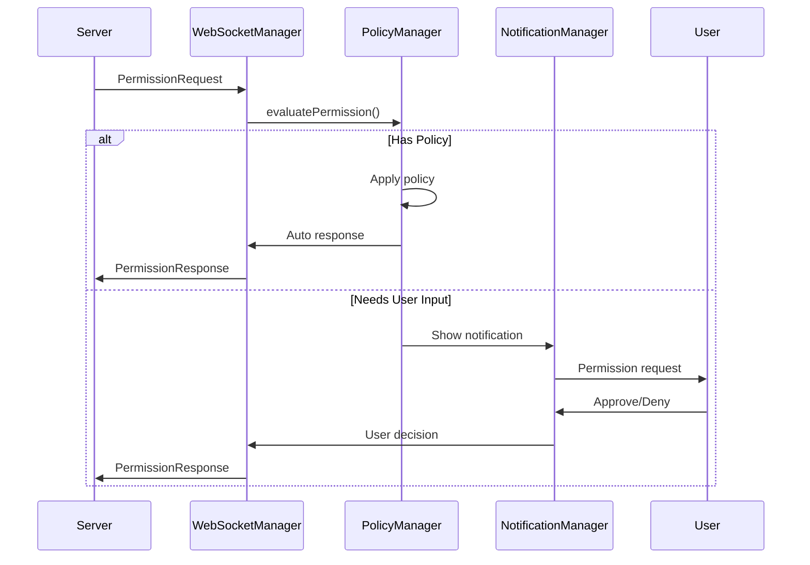

# Communication Layer - Design

## Architecture Overview

The Communication Layer implements a robust, secure WebSocket-based communication system between the Pocket Agent mobile app and Claude Code wrapper services. The architecture prioritizes reliability, security, and efficient resource usage on mobile devices.

### Core Design Principles

1. **Separation of Concerns**: Each component has a single, well-defined responsibility
2. **Resilience**: Automatic recovery from failures with minimal user intervention
3. **Security First**: SSH key authentication and encrypted communications throughout
4. **Mobile Optimized**: Battery-efficient with adaptive behavior based on device state
5. **Observable State**: All connection states and messages flows are reactive streams

### Component Architecture



## Component Specifications

### 1. SshAuthWebSocketClient

**Purpose**: Core WebSocket client with integrated SSH key authentication

**Purpose**: This class manages WebSocket connections with SSH-based authentication, handling connection lifecycle, message flow, and authentication state transitions.

```kotlin
package com.pocketagent.communication.websocket

import com.pocketagent.communication.auth.SshKeyAuthenticator
import com.pocketagent.communication.protocol.MessageProtocol
import com.pocketagent.communication.state.ConnectionStateManager
import com.pocketagent.communication.queue.MessageQueueManager
import com.pocketagent.communication.security.CertificateValidator
import com.pocketagent.communication.security.SecurityAuditLogger
import com.pocketagent.data.entity.SshIdentityEntity
import kotlinx.coroutines.*
import kotlinx.coroutines.flow.*
import okhttp3.*
import javax.inject.Inject
import javax.inject.Singleton
@Singleton
class SshAuthWebSocketClient @Inject constructor(
    private val okHttpClient: OkHttpClient,
    private val sshKeyAuthenticator: SshKeyAuthenticator,
    private val messageProtocol: MessageProtocol,
    private val connectionStateManager: ConnectionStateManager,
    private val messageQueueManager: MessageQueueManager,
    private val certificateValidator: CertificateValidator,
    private val securityAuditLogger: SecurityAuditLogger
) {
    companion object {
        private const val NORMAL_CLOSURE_STATUS = 1000
        private const val PING_INTERVAL_MS = 30000L
        private const val PONG_TIMEOUT_MS = 10000L
        private const val AUTH_TIMEOUT_MS = 60000L
    }
    
    private var webSocket: WebSocket? = null
    private var pingJob: Job? = null
    private var projectId: String? = null
    private var sessionId: String? = null
    private var isAuthenticated = false
    
    private val _incomingMessages = MutableSharedFlow<MessageProtocol.Message>()
    val incomingMessages: SharedFlow<MessageProtocol.Message> = _incomingMessages.asSharedFlow()
    
    private val _authState = MutableStateFlow<AuthState>(AuthState.NotAuthenticated)
    val authState: StateFlow<AuthState> = _authState.asStateFlow()
    
    sealed class AuthState {
        object NotAuthenticated : AuthState()
        object Authenticating : AuthState()
        data class Authenticated(val sessionId: String) : AuthState()
        data class AuthenticationFailed(val error: String) : AuthState()
    }
    
    suspend fun connect(
        projectId: String,
        serverUrl: String,
        sshIdentity: SshIdentityEntity
    ) = withContext(Dispatchers.IO) {
        this@SshAuthWebSocketClient.projectId = projectId
        _authState.value = AuthState.NotAuthenticated
        
        connectionStateManager.updateState(projectId, ConnectionState.CONNECTING)
        
        try {
            val request = Request.Builder().url(serverUrl).build()
            
            val client = if (certificateValidator.shouldPinCertificate(serverUrl)) {
                okHttpClient.newBuilder()
                    .certificatePinner(certificateValidator.getCertificatePinner(serverUrl))
                    .build()
            } else {
                okHttpClient
            }
            
            webSocket = client.newWebSocket(request, createAuthWebSocketListener(projectId, sshIdentity))
            
            val authResult = withTimeout(AUTH_TIMEOUT_MS) {
                authState.first { it !is AuthState.Authenticating }
            }
            
            when (authResult) {
                is AuthState.Authenticated -> {
                    sessionId = authResult.sessionId
                    isAuthenticated = true
                    connectionStateManager.updateState(projectId, ConnectionState.CONNECTED)
                    startPingMonitoring()
                    launchMessageSender()
                    drainQueuedMessages()
                }
                is AuthState.AuthenticationFailed -> {
                    disconnect()
                    throw SecurityException("Authentication failed: ${authResult.error}")
                }
                else -> {
                    disconnect()
                    throw IllegalStateException("Unexpected auth state: $authResult")
                }
            }
        } catch (e: Exception) {
            connectionStateManager.updateState(
                projectId, 
                ConnectionState.ERROR("Connection failed: ${e.message}")
            )
            throw e
        }
    }
}
```

### 2. SshKeyAuthenticator

**Purpose**: Handles SSH key-based challenge-response authentication

**Purpose**: This class implements SSH key cryptographic operations for authenticating WebSocket connections using challenge-response patterns.

```kotlin
package com.pocketagent.communication.auth

import com.pocketagent.data.entity.SshIdentityEntity
import com.pocketagent.security.SshKeyImportManager
import com.pocketagent.security.SecurityAuditLogger
import com.pocketagent.BuildConfig
import kotlinx.coroutines.Dispatchers
import kotlinx.coroutines.withContext
import kotlinx.serialization.Serializable
import java.security.PrivateKey
import java.security.Signature
import java.util.Base64
import javax.inject.Inject
import javax.inject.Singleton
@Singleton
class SshKeyAuthenticator @Inject constructor(
    private val sshKeyImportManager: SshKeyImportManager,
    private val securityAuditLogger: SecurityAuditLogger
) {
    @Serializable
    data class AuthChallenge(
        val type: String = "auth_challenge",
        val nonce: String,
        val timestamp: Long,
        val serverVersion: String
    )
    
    @Serializable
    data class AuthResponse(
        val type: String = "auth_response",
        val publicKey: String,
        val signature: String,
        val clientVersion: String,
        val sessionId: String? = null
    )
    
    suspend fun signChallenge(
        challenge: AuthChallenge,
        sshIdentity: SshIdentityEntity
    ): Result<AuthResponse> = withContext(Dispatchers.IO) {
        try {
            val privateKeyBytes = sshKeyImportManager.decryptSshPrivateKey(
                encryptedPrivateKey = sshIdentity.encryptedPrivateKey,
                keyAlias = sshIdentity.keyAlias
            )
            
            val privateKey = parsePrivateKey(privateKeyBytes)
            val dataToSign = "${challenge.nonce}${challenge.timestamp}"
            val signature = signData(privateKey, dataToSign.toByteArray())
            
            val authResponse = AuthResponse(
                publicKey = sshIdentity.publicKey,
                signature = Base64.getEncoder().encodeToString(signature),
                clientVersion = BuildConfig.VERSION_NAME
            )
            
            privateKeyBytes.fill(0) // Clear sensitive data
            
            Result.success(authResponse)
        } catch (e: Exception) {
            securityAuditLogger.logAuthenticationAttempt(false, e.message)
            Result.failure(e)
        }
    }
    
    private fun signData(privateKey: PrivateKey, data: ByteArray): ByteArray {
        return when (privateKey.algorithm) {
            "RSA" -> {
                val signature = Signature.getInstance("SHA256withRSA")
                signature.initSign(privateKey)
                signature.update(data)
                signature.sign()
            }
            "EC" -> {
                val signature = Signature.getInstance("SHA256withECDSA")
                signature.initSign(privateKey)
                signature.update(data)
                signature.sign()
            }
            "Ed25519" -> {
                val signature = Signature.getInstance("Ed25519")
                signature.initSign(privateKey)
                signature.update(data)
                signature.sign()
            }
            else -> throw IllegalArgumentException("Unsupported algorithm: ${privateKey.algorithm}")
        }
    }
}
```

### 3. MessageProtocol

**Purpose**: Type-safe message serialization and protocol definition

**Purpose**: This class defines the message protocol for WebSocket communication, providing type-safe serialization and deserialization of all message types.

```kotlin
package com.pocketagent.communication.protocol

import kotlinx.serialization.*
import kotlinx.serialization.json.Json
import kotlinx.serialization.modules.SerializersModule
import kotlinx.serialization.modules.polymorphic
import kotlinx.serialization.modules.subclass
import java.util.UUID
import javax.inject.Inject
import javax.inject.Singleton
@Singleton
class MessageProtocol @Inject constructor() {
    private val json = Json {
        ignoreUnknownKeys = true
        encodeDefaults = true
        serializersModule = createSerializersModule()
    }
    
    @Serializable
    sealed class Message {
        abstract val id: String
        abstract val timestamp: Long
        abstract val type: ProtocolMessageType
    }
    
    // Outgoing messages
    @Serializable
    @SerialName("command")
    data class CommandMessage(
        override val id: String = UUID.randomUUID().toString(),
        override val timestamp: Long = System.currentTimeMillis(),
        override val type: ProtocolMessageType = ProtocolMessageType.COMMAND,
        val command: String,
        val isShellCommand: Boolean = false
    ) : Message()
    
    @Serializable
    @SerialName("permission_response")
    data class PermissionResponse(
        override val id: String = UUID.randomUUID().toString(),
        override val timestamp: Long = System.currentTimeMillis(),
        override val type: ProtocolMessageType = ProtocolMessageType.PERMISSION_RESPONSE,
        val requestId: String,
        val approved: Boolean,
        val remember: Boolean = false
    ) : Message()
    
    // Incoming messages
    @Serializable
    @SerialName("agent_response")
    data class AgentResponse(
        override val id: String,
        override val timestamp: Long,
        override val type: ProtocolMessageType = ProtocolMessageType.AGENT_RESPONSE,
        val content: String,
        val isPartial: Boolean = false,
        val conversationId: String?,
        val metadata: Map<String, String> = emptyMap()
    ) : Message()
    
    @Serializable
    @SerialName("permission_request")
    data class PermissionRequest(
        override val id: String,
        override val timestamp: Long,
        override val type: ProtocolMessageType = ProtocolMessageType.PERMISSION_REQUEST,
        val tool: String,
        val action: String,
        val details: Map<String, @Contextual Any>,
        val risk: RiskLevel = RiskLevel.MEDIUM
    ) : Message()
    
    fun encodeMessage(message: Message): String = json.encodeToString(Message.serializer(), message)
    fun decodeMessage(jsonString: String): Message = json.decodeFromString(Message.serializer(), jsonString)
}
```

### 4. WebSocketManager

**Purpose**: High-level manager for multiple WebSocket connections

**Purpose**: This class provides a high-level API for managing multiple WebSocket connections across different projects, handling connection lifecycle and message routing.

```kotlin
package com.pocketagent.communication

import com.pocketagent.communication.websocket.SshAuthWebSocketClient
import com.pocketagent.communication.protocol.MessageProtocol
import com.pocketagent.communication.state.ConnectionStateManager
import com.pocketagent.data.entity.ServerProfileEntity
import com.pocketagent.data.entity.SshIdentityEntity
import kotlinx.coroutines.CoroutineScope
import kotlinx.coroutines.flow.first
import kotlinx.coroutines.launch
import java.util.concurrent.ConcurrentHashMap
import javax.inject.Inject
import javax.inject.Provider
import javax.inject.Singleton
@Singleton
class WebSocketManager @Inject constructor(
    private val sshAuthWebSocketClient: Provider<SshAuthWebSocketClient>,
    private val messageProtocol: MessageProtocol,
    private val connectionStateManager: ConnectionStateManager,
    private val scope: CoroutineScope
) {
    private val activeConnections = ConcurrentHashMap<String, WebSocketConnection>()
    
    data class WebSocketConnection(
        val projectId: String,
        val serverUrl: String,
        val sessionId: String?,
        val client: SshAuthWebSocketClient
    )
    
    suspend fun createConnection(
        projectId: String,
        serverProfile: ServerProfileEntity,
        sshIdentity: SshIdentityEntity
    ): Result<WebSocketConnection> {
        return try {
            val serverUrl = "wss://${serverProfile.hostname}:${serverProfile.websocketPort}/ws"
            val client = sshAuthWebSocketClient.get()
            
            client.connect(projectId, serverUrl, sshIdentity)
            
            val authState = client.authState.first { it is SshAuthWebSocketClient.AuthState.Authenticated }
            val sessionId = (authState as SshAuthWebSocketClient.AuthState.Authenticated).sessionId
            
            val connection = WebSocketConnection(projectId, serverUrl, sessionId, client)
            activeConnections[projectId] = connection
            
            launchMessageHandler(projectId, client)
            
            Result.success(connection)
        } catch (e: Exception) {
            Result.failure(e)
        }
    }
    
    private fun launchMessageHandler(projectId: String, client: SshAuthWebSocketClient) {
        scope.launch {
            client.incomingMessages.collect { message ->
                handleIncomingMessage(projectId, message)
            }
        }
    }
    
    suspend fun sendMessage(projectId: String, message: MessageProtocol.Message): Result<Unit> {
        val connection = activeConnections[projectId]
            ?: return Result.failure(IllegalStateException("No active connection for project"))
        
        return try {
            connection.client.sendMessage(message)
            Result.success(Unit)
        } catch (e: Exception) {
            Result.failure(e)
        }
    }
}
```

### 5. ConnectionStateManager

**Purpose**: Centralized connection state tracking

**Purpose**: This class maintains the connection state for all active WebSocket connections, providing reactive state updates to UI components.

```kotlin
package com.pocketagent.communication.state

import kotlinx.coroutines.flow.*
import javax.inject.Inject
import javax.inject.Singleton
@Singleton
class ConnectionStateManager @Inject constructor() {
    private val _connectionStates = MutableStateFlow<Map<String, ConnectionState>>(emptyMap())
    val connectionStates: StateFlow<Map<String, ConnectionState>> = _connectionStates.asStateFlow()
    
    fun updateState(projectId: String, state: ConnectionState) {
        _connectionStates.update { current ->
            current + (projectId to state)
        }
    }
    
    fun getState(projectId: String): ConnectionState {
        return _connectionStates.value[projectId] ?: ConnectionState.DISCONNECTED
    }
    
    fun getProjectConnectionState(projectId: String): Flow<ConnectionState> {
        return connectionStates
            .map { it[projectId] ?: ConnectionState.DISCONNECTED }
            .distinctUntilChanged()
    }
}

sealed class ConnectionState {
    object DISCONNECTED : ConnectionState()
    object CONNECTING : ConnectionState()
    object CONNECTED : ConnectionState()
    data class DISCONNECTING(val reason: String) : ConnectionState()
    data class ERROR(val message: String) : ConnectionState()
    data class RECONNECTING(val attempt: Int) : ConnectionState()
}
```

### 6. MessageQueueManager

**Purpose**: Manages offline message queuing with priority support

**Purpose**: This class implements a priority-based message queue for handling offline scenarios and ensuring critical messages are delivered first.

```kotlin
package com.pocketagent.communication.queue

import com.pocketagent.communication.protocol.MessageProtocol
import com.pocketagent.communication.storage.MessageStorage
import kotlinx.coroutines.CoroutineScope
import kotlinx.coroutines.flow.Flow
import kotlinx.coroutines.flow.flow
import java.util.PriorityQueue
import java.util.concurrent.ConcurrentHashMap
import javax.inject.Inject
import javax.inject.Singleton
@Singleton
class MessageQueueManager @Inject constructor(
    private val messageStorage: MessageStorage,
    private val scope: CoroutineScope
) {
    private val messageQueues = ConcurrentHashMap<String, PriorityQueue<QueuedMessage>>()
    
    data class QueuedMessage(
        val message: MessageProtocol.Message,
        val timestamp: Long = System.currentTimeMillis(),
        val priority: MessagePriority = MessagePriority.NORMAL,
        val retryCount: Int = 0
    ) : Comparable<QueuedMessage> {
        override fun compareTo(other: QueuedMessage): Int {
            return when {
                priority != other.priority -> other.priority.ordinal - priority.ordinal
                else -> timestamp.compareTo(other.timestamp)
            }
        }
    }
    
    enum class MessagePriority {
        HIGH,    // Permission responses
        NORMAL,  // Regular messages
        LOW      // Status updates
    }
    
    suspend fun enqueueMessage(
        projectId: String,
        message: MessageProtocol.Message,
        priority: MessagePriority = MessagePriority.NORMAL
    ) {
        val queue = messageQueues.getOrPut(projectId) { PriorityQueue() }
        val queuedMessage = QueuedMessage(message, priority = priority)
        
        synchronized(queue) {
            queue.offer(queuedMessage)
        }
        
        if (priority == MessagePriority.HIGH) {
            messageStorage.persistMessage(projectId, queuedMessage)
        }
    }
    
    fun drainQueue(projectId: String): Flow<MessageProtocol.Message> = flow {
        val queue = messageQueues[projectId] ?: return@flow
        
        synchronized(queue) {
            while (queue.isNotEmpty()) {
                emit(queue.poll().message)
            }
        }
    }
}
```

### 7. ReconnectionManager

**Purpose**: Implements exponential backoff reconnection strategy

**Purpose**: This class manages automatic reconnection attempts with exponential backoff and jitter to prevent server overload.

```kotlin
package com.pocketagent.communication.reconnect

import android.content.Context
import com.pocketagent.communication.state.ConnectionState
import com.pocketagent.communication.state.ConnectionStateManager
import kotlinx.coroutines.*
import kotlin.math.min
import kotlin.random.Random
import javax.inject.Inject
import javax.inject.Singleton
@Singleton
class ReconnectionManager @Inject constructor(
    private val context: Context,
    private val connectionStateManager: ConnectionStateManager,
    private val scope: CoroutineScope
) {
    companion object {
        private const val INITIAL_DELAY_MS = 1000L
        private const val MAX_DELAY_MS = 60000L
        private const val BACKOFF_MULTIPLIER = 2.0
        private const val JITTER_FACTOR = 0.1
        private const val MAX_ATTEMPTS = 10
    }
    
    private val reconnectionJobs = mutableMapOf<String, Job>()
    private val reconnectionAttempts = mutableMapOf<String, Int>()
    
    fun startReconnection(
        projectId: String,
        reconnectAction: suspend () -> Result<Unit>
    ) {
        reconnectionJobs[projectId]?.cancel()
        
        reconnectionJobs[projectId] = scope.launch {
            var attempt = 0
            
            while (isActive && attempt < MAX_ATTEMPTS) {
                connectionStateManager.updateState(
                    projectId,
                    ConnectionState.RECONNECTING(attempt + 1)
                )
                
                val result = reconnectAction()
                
                if (result.isSuccess) {
                    reconnectionAttempts.remove(projectId)
                    reconnectionJobs.remove(projectId)
                    return@launch
                }
                
                attempt++
                val delay = calculateBackoffDelay(attempt)
                delay(delay)
            }
            
            connectionStateManager.updateState(
                projectId,
                ConnectionState.ERROR("Max reconnection attempts reached")
            )
        }
    }
    
    private fun calculateBackoffDelay(attempt: Int): Long {
        val exponentialDelay = INITIAL_DELAY_MS * Math.pow(BACKOFF_MULTIPLIER, (attempt - 1).toDouble()).toLong()
        val boundedDelay = min(exponentialDelay, MAX_DELAY_MS)
        val jitter = (boundedDelay * JITTER_FACTOR * Random.nextDouble()).toLong()
        return boundedDelay + jitter
    }
}
```

### 8. SessionManager

**Purpose**: Manages session lifecycle and persistence

**Purpose**: This class handles session state persistence and restoration, enabling users to resume conversations after app restarts.

```kotlin
package com.pocketagent.communication.session

import com.pocketagent.communication.protocol.MessageProtocol
import com.pocketagent.data.repository.SessionRepository
import kotlinx.coroutines.flow.MutableStateFlow
import kotlinx.coroutines.flow.StateFlow
import kotlinx.coroutines.flow.asStateFlow
import kotlinx.coroutines.flow.update
import javax.inject.Inject
import javax.inject.Singleton
@Singleton
class SessionManager @Inject constructor(
    private val sessionRepository: SessionRepository,
    private val messageProtocol: MessageProtocol
) {
    private val _activeSessions = MutableStateFlow<Map<String, SessionState>>(emptyMap())
    val activeSessions: StateFlow<Map<String, SessionState>> = _activeSessions.asStateFlow()
    
    data class SessionState(
        val sessionId: String,
        val projectId: String,
        val conversationId: String?,
        val lastMessageId: String?,
        val lastMessageTimestamp: Long,
        val turnNumber: Int = 0,
        val isActive: Boolean = true
    )
    
    suspend fun resumeSession(
        sessionId: String,
        projectId: String
    ): Result<SessionState> {
        return try {
            val persistedSession = sessionRepository.getSession(sessionId)
                ?: return Result.failure(IllegalStateException("Session not found"))
            
            val sessionState = SessionState(
                sessionId = sessionId,
                projectId = projectId,
                conversationId = persistedSession.conversationId,
                lastMessageId = persistedSession.lastMessageId,
                lastMessageTimestamp = persistedSession.lastMessageTimestamp,
                turnNumber = persistedSession.turnNumber
            )
            
            _activeSessions.update { current ->
                current + (projectId to sessionState)
            }
            
            Result.success(sessionState)
        } catch (e: Exception) {
            Result.failure(e)
        }
    }
}
```

### 9. PermissionPolicyManager

**Purpose**: Automated permission handling based on user-defined policies

**Purpose**: This class evaluates permission requests against user-defined policies, enabling automated decision-making when users are not actively monitoring.

```kotlin
package com.pocketagent.communication.permission

import com.pocketagent.communication.protocol.MessageProtocol
import com.pocketagent.communication.protocol.RiskLevel
import com.pocketagent.security.EncryptedStorageManager
import com.pocketagent.security.SecurityAuditLogger
import kotlinx.coroutines.flow.MutableStateFlow
import kotlinx.coroutines.flow.StateFlow
import kotlinx.coroutines.flow.asStateFlow
import java.util.concurrent.ConcurrentHashMap
import javax.inject.Inject
import javax.inject.Singleton
@Singleton
class PermissionPolicyManager @Inject constructor(
    private val encryptedStorageManager: EncryptedStorageManager,
    private val securityAuditLogger: SecurityAuditLogger
) {
    private val decisionCache = ConcurrentHashMap<String, CachedDecision>()
    private val _defaultPolicies = MutableStateFlow(loadDefaultPolicies())
    val defaultPolicies: StateFlow<DefaultPolicies> = _defaultPolicies.asStateFlow()
    
    data class DefaultPolicies(
        val allowLowRiskByDefault: Boolean = true,
        val allowMediumRiskByDefault: Boolean = false,
        val denyHighRiskByDefault: Boolean = true,
        val timeoutSeconds: Int = 30,
        val timeoutAction: TimeoutAction = TimeoutAction.DENY
    )
    
    fun evaluatePermission(
        request: MessageProtocol.PermissionRequest,
        isConnected: Boolean
    ): PermissionDecision {
        // Check cached decision
        getCachedDecision(request.id)?.let { cached ->
            if (System.currentTimeMillis() < cached.expiresAt) {
                return cached.decision
            }
        }
        
        // If connected, wait for user
        if (isConnected) {
            return PermissionDecision(
                approved = false,
                reason = "Awaiting user decision",
                policyApplied = PolicyType.USER_DECISION
            )
        }
        
        // Apply default policies
        return applyDefaultPolicies(request.tool, request.action, request.risk)
    }
}
```

## Message Flow Diagrams

### Connection and Authentication Flow



### Message Handling Flow



### Permission Request Flow



## Error Handling Strategy

### Connection Errors

```kotlin
**Purpose**: This sealed class hierarchy defines all possible connection errors for proper error handling and recovery strategies.

```kotlin
package com.pocketagent.communication.error

sealed class ConnectionError : Exception() {
    data class NetworkUnavailable(override val message: String) : ConnectionError()
    data class AuthenticationFailed(override val message: String) : ConnectionError()
    data class ServerUnreachable(override val message: String) : ConnectionError()
    data class ProtocolMismatch(override val message: String) : ConnectionError()
    data class SessionExpired(override val message: String) : ConnectionError()
}
```

// Error handling in WebSocketClient
private fun handleConnectionError(error: Throwable) {
    when (error) {
        is NetworkUnavailable -> {
            // Queue messages and wait for network
            messageQueueManager.enableOfflineMode(projectId)
            reconnectionManager.scheduleReconnection(projectId)
        }
        is AuthenticationFailed -> {
            // Notify user, clear session
            notificationManager.showAuthError(error.message)
            sessionManager.clearSession(projectId)
        }
        is ServerUnreachable -> {
            // Exponential backoff retry
            reconnectionManager.startReconnection(projectId) {
                connect(projectId, lastServerUrl, lastSshIdentity)
            }
        }
        is ProtocolMismatch -> {
            // Fatal error, notify user to update app
            notificationManager.showUpdateRequired()
        }
        else -> {
            // Log and attempt recovery
            logger.error("Unexpected error", error)
            connectionStateManager.updateState(projectId, ConnectionState.ERROR(error.message ?: "Unknown error"))
        }
    }
}
```

## Performance Optimizations

### 1. Message Batching

**Purpose**: This class batches multiple messages together to reduce network overhead and improve throughput.

```kotlin
package com.pocketagent.communication.optimization

import com.pocketagent.communication.protocol.MessageProtocol.Message
import kotlinx.coroutines.flow.*
import javax.inject.Inject

class MessageBatcher @Inject constructor() {
    private val batchWindow = 100L // milliseconds
    private val maxBatchSize = 10
    
    fun batchMessages(messages: Flow<Message>): Flow<List<Message>> = flow {
        val batch = mutableListOf<Message>()
        var lastEmit = System.currentTimeMillis()
        
        messages.collect { message ->
            batch.add(message)
            
            if (batch.size >= maxBatchSize || 
                System.currentTimeMillis() - lastEmit > batchWindow) {
                emit(batch.toList())
                batch.clear()
                lastEmit = System.currentTimeMillis()
            }
        }
        
        if (batch.isNotEmpty()) {
            emit(batch.toList())
        }
    }
}
```

### 2. Connection Pooling

**Purpose**: This class manages a pool of WebSocket connections to enable connection reuse and limit resource usage.

```kotlin
package com.pocketagent.communication.pool

import com.pocketagent.communication.WebSocketConnection
import java.util.concurrent.ConcurrentHashMap
import javax.inject.Inject

class ConnectionPool @Inject constructor() {
    private val pool = ConcurrentHashMap<String, WebSocketConnection>()
    private val maxPoolSize = 5
    
    fun getOrCreate(key: String, factory: () -> WebSocketConnection): WebSocketConnection {
        return pool.computeIfAbsent(key) { factory() }
    }
    
    fun evictOldest() {
        if (pool.size > maxPoolSize) {
            val oldest = pool.entries.minByOrNull { it.value.lastUsed }
            oldest?.let {
                it.value.close()
                pool.remove(it.key)
            }
        }
    }
}
```

### 3. Adaptive Ping Intervals

**Purpose**: This class dynamically adjusts ping intervals based on battery level and network type to optimize power consumption.

```kotlin
package com.pocketagent.communication.optimization

import com.pocketagent.communication.NetworkType
import javax.inject.Inject

class AdaptivePingManager @Inject constructor() {
    fun calculatePingInterval(batteryLevel: Int, networkType: NetworkType): Long {
        return when {
            batteryLevel < 15 -> 120000L // 2 minutes on low battery
            batteryLevel < 30 -> 60000L  // 1 minute on medium battery
            networkType == NetworkType.CELLULAR -> 45000L // 45 seconds on cellular
            else -> 30000L // 30 seconds default
        }
    }
}
```

## Security Measures

### 1. Message Encryption Layer

**Purpose**: This class provides AES-GCM encryption for sensitive messages, ensuring end-to-end security.

```kotlin
package com.pocketagent.communication.security

import com.pocketagent.security.KeyManager
import java.security.SecureRandom
import javax.crypto.Cipher
import javax.crypto.SecretKey
import javax.crypto.spec.GCMParameterSpec
import javax.inject.Inject

class MessageEncryption @Inject constructor(
    private val keyManager: KeyManager
) {
    fun encryptMessage(message: String, sessionKey: SecretKey): ByteArray {
        val cipher = Cipher.getInstance("AES/GCM/NoPadding")
        val iv = ByteArray(12).apply { SecureRandom().nextBytes(this) }
        cipher.init(Cipher.ENCRYPT_MODE, sessionKey, GCMParameterSpec(128, iv))
        
        val encrypted = cipher.doFinal(message.toByteArray())
        return iv + encrypted // Prepend IV for decryption
    }
}
```

### 2. Certificate Pinning

**Purpose**: This class implements certificate pinning to prevent man-in-the-middle attacks by validating server certificates against known pins.

```kotlin
package com.pocketagent.communication.security

import okhttp3.CertificatePinner
import javax.inject.Inject

class CertificatePinning @Inject constructor() {
    private val pins = mapOf(
        "example.com" to listOf(
            "sha256/AAAAAAAAAAAAAAAAAAAAAAAAAAAAAAAAAAAAAAAAAAA=",
            "sha256/BBBBBBBBBBBBBBBBBBBBBBBBBBBBBBBBBBBBBBBBBBB="
        )
    )
    
    fun createPinner(hostname: String): CertificatePinner {
        val builder = CertificatePinner.Builder()
        pins[hostname]?.forEach { pin ->
            builder.add(hostname, pin)
        }
        return builder.build()
    }
}
```

## Testing Considerations

### Unit Testing

- Mock WebSocket connections using MockWebServer
- Test message encoding/decoding with property-based testing
- Verify reconnection logic with controlled time advancement
- Test authentication flows with mock SSH keys

### Integration Testing

- Use TestWebSocketServer for full connection flows
- Test network transitions using Android emulator network controls
- Verify message delivery guarantees with chaos testing
- Test permission policy evaluation with various scenarios

### Performance Testing

- Measure message throughput under various network conditions
- Test battery impact with extended connection periods
- Verify memory usage with large message queues
- Benchmark reconnection times across network types

## Future Enhancements

1. **Message Compression**: Implement gzip compression for large messages
2. **Connection Multiplexing**: Support multiple logical channels over single WebSocket
3. **Offline Sync**: Full offline capability with conflict resolution
4. **E2E Encryption**: Additional encryption layer for sensitive operations
5. **Protocol Versioning**: Support for backward compatibility
6. **Metrics Collection**: Detailed performance and reliability metrics
7. **Advanced Policies**: ML-based permission prediction
8. **Multi-Device Sync**: Synchronize sessions across user's devices