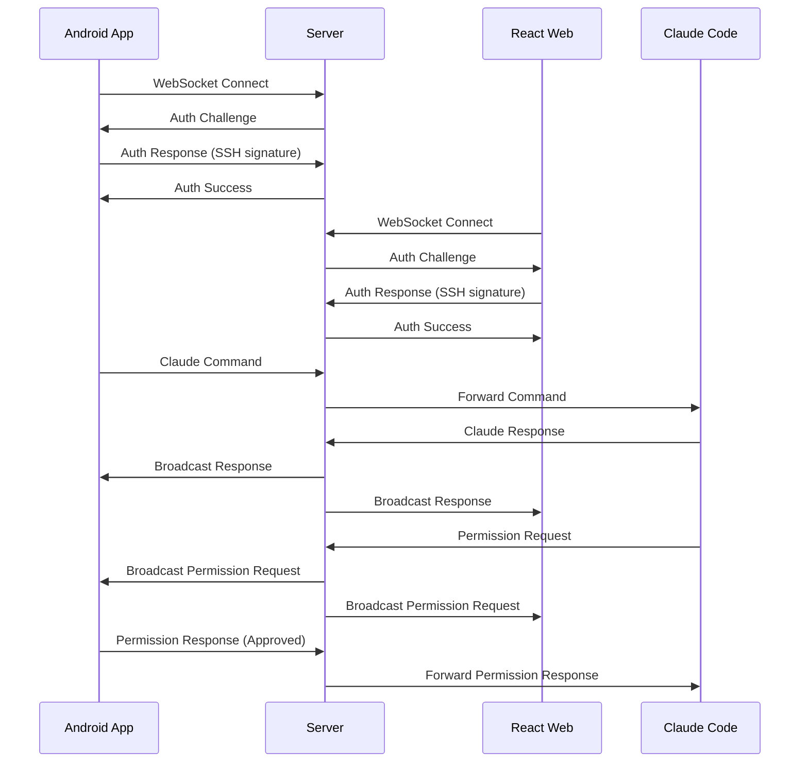

# Integration Design - Communication Layer

## Overview

The Communication Layer integrates WebSocket communication across server, Android mobile, and React web modules to provide seamless real-time interaction with Claude Code from any supported client device.

## Module Responsibilities

### Server Module
- **Role**: Central communication hub and Claude Code proxy
- **APIs**: WebSocket server endpoint, session management endpoints
- **Data**: Active sessions, client connections, Claude Code process state
- **Events**: Client connection/disconnection, Claude Code events, authentication events

### Frontend-React Module  
- **Role**: Web-based client for desktop and tablet access
- **Components**: WebSocket service, chat interface, project dashboard, settings
- **State**: Global state management for sessions, messages, connection status
- **API Calls**: WebSocket connection, authentication, real-time messaging

### Frontend-Android Module
- **Role**: Mobile client optimized for on-the-go access
- **Activities/Fragments**: Chat activity, project list, permission dialogs
- **Services**: Background service for persistent connections, notification service
- **Data Sync**: Real-time sync with server, offline message queuing

## Integration Points

### Data Flow
```mermaid
graph LR
    A[Android App] --|WebSocket| B[Server]
    C[React Web] --|WebSocket| B
    B --|stdin/stdout| D[Claude Code]
    D --|output| B
    B --|broadcast| A
    B --|broadcast| C
```

### API Contracts

#### WebSocket Endpoints
- **Server Endpoint**: `ws://server:8080/ws`
- **Authentication**: SSH key challenge-response on connection
- **Message Format**: JSON with type, sessionId, payload structure
- **Heartbeat**: Ping/pong every 30 seconds for connection health

#### Message Types
```json
{
  "type": "auth_challenge",
  "payload": {
    "challenge": "base64-encoded-challenge",
    "timestamp": "2025-01-27T10:00:00Z"
  }
}

{
  "type": "auth_response", 
  "payload": {
    "signature": "ssh-signature-of-challenge",
    "publicKey": "ssh-public-key"
  }
}

{
  "type": "claude_command",
  "sessionId": "session-uuid",
  "payload": {
    "command": "user message text",
    "projectPath": "/path/to/project"
  }
}

{
  "type": "claude_response",
  "sessionId": "session-uuid", 
  "payload": {
    "content": "Claude response text",
    "type": "message|permission_request|error"
  }
}

{
  "type": "permission_request",
  "sessionId": "session-uuid",
  "payload": {
    "id": "permission-uuid",
    "action": "file_write|command_execute|etc",
    "details": "description of action",
    "timeout": 300
  }
}

{
  "type": "permission_response",
  "sessionId": "session-uuid",
  "payload": {
    "permissionId": "permission-uuid",
    "approved": true,
    "reason": "optional reason text"
  }
}
```

### Authentication Flow
SSH key-based challenge-response authentication:
1. Client connects to WebSocket endpoint
2. Server sends authentication challenge
3. Client signs challenge with SSH private key
4. Server validates signature against public key
5. On success, client is authenticated for session

### Error Handling
- **Connection Errors**: Exponential backoff reconnection
- **Authentication Errors**: Clear error messages, re-authentication flow
- **Message Errors**: Error codes with human-readable descriptions
- **Timeout Errors**: Configurable timeouts with retry mechanisms

## Real-time Communication

### WebSocket Events
- **Connection Events**: connect, disconnect, reconnect
- **Authentication Events**: auth_challenge, auth_response, auth_success, auth_failure
- **Session Events**: session_start, session_end, session_status
- **Message Events**: claude_command, claude_response, permission_request, permission_response
- **System Events**: heartbeat, error, status_update

### Message Format
All messages follow consistent JSON structure:
```json
{
  "type": "message_type",
  "sessionId": "optional-session-id",
  "payload": {},
  "timestamp": "ISO-8601-timestamp",
  "id": "unique-message-id"
}
```

### Connection Management
- **Heartbeat**: 30-second ping/pong to detect disconnections
- **Reconnection**: Automatic reconnection with exponential backoff
- **Session Recovery**: Resume sessions after reconnection
- **Multiple Clients**: Server broadcasts to all authenticated clients

## Sequence Diagrams

### Primary Use Case Flow


## Cross-Module Dependencies

### Shared Models
Data structures common across all modules:

```typescript
interface Session {
  id: string;
  projectPath: string;
  status: 'active' | 'inactive' | 'error';
  createdAt: Date;
  lastActivity: Date;
}

interface Message {
  id: string;
  type: string;
  sessionId?: string;
  payload: any;
  timestamp: Date;
}

interface PermissionRequest {
  id: string;
  sessionId: string;
  action: string;
  details: string;
  timeout: number;
  createdAt: Date;
}
```

### Synchronization Requirements
- **Data Consistency**: All clients show the same session state and message history
- **Conflict Resolution**: Last-writer-wins for permission responses
- **Offline Handling**: Mobile queues messages, web shows connection status

## Testing Strategy

### Integration Testing
- **WebSocket Communication**: Test message flow between all module combinations
- **Authentication Flow**: Verify SSH key authentication across all clients
- **Multi-Client Scenarios**: Test broadcasting and state synchronization

### Cross-Module Contracts
- **Protocol Validation**: Ensure all modules use consistent message format
- **Mock Services**: Server can run with mock Claude Code for client testing
- **Error Scenarios**: Test network failures, authentication failures, timeout scenarios

## Deployment Considerations

### Versioning
- **Protocol Versioning**: WebSocket protocol includes version negotiation
- **Backward Compatibility**: Maintain compatibility across client versions
- **Feature Flags**: Enable/disable features per client type

### Monitoring
- **Connection Metrics**: Active connections, connection duration, disconnect reasons
- **Message Metrics**: Message throughput, error rates, authentication success rates
- **Performance Metrics**: Message latency, reconnection frequency

## Security Considerations

### Authentication Flow
- **SSH Key Validation**: Server validates SSH signatures against authorized keys
- **Session Security**: Secure session tokens prevent session hijacking
- **Connection Security**: WSS (WebSocket Secure) for encrypted communication

### Data Protection
- **Message Encryption**: All WebSocket traffic encrypted via WSS
- **No Credential Storage**: Server validates but doesn't store SSH private keys
- **Access Control**: Session-based access control for multi-client scenarios

## Rollout Plan

### Phase 1: Basic WebSocket Communication
- Server WebSocket endpoint with basic message routing
- Android client WebSocket connection
- Simple message exchange without authentication

### Phase 2: Authentication and Security
- SSH key-based authentication implementation
- Secure WebSocket connections (WSS)
- Session management and multi-client support

### Phase 3: React Web Client
- React WebSocket client implementation
- Multi-client session broadcasting
- Web-optimized user interface

### Phase 4: Advanced Features
- Offline message queuing
- Advanced error handling and recovery
- Performance optimization and monitoring

## Risk Mitigation

### Technical Risks
- **WebSocket Compatibility**: Test across different browsers and network conditions
- **Authentication Complexity**: Provide clear setup documentation for SSH keys
- **Performance Scaling**: Monitor and optimize for high connection counts

### Operational Risks
- **Multi-Module Deployment**: Coordinate server and client deployments
- **Protocol Changes**: Maintain backward compatibility during updates
- **Network Issues**: Robust handling of various network failure scenarios

## Success Metrics

### Functional Metrics
- **Message Delivery Rate**: 99.9% successful message delivery
- **Authentication Success Rate**: 95% first-attempt authentication success
- **Multi-Client Sync**: 100% consistency across connected clients

### Performance Metrics
- **Connection Latency**: Sub-100ms WebSocket connection establishment
- **Message Latency**: Sub-50ms message routing between clients
- **Reconnection Time**: Sub-5-second reconnection after network failure

### Operational Metrics
- **Uptime**: 99.9% WebSocket server availability
- **Concurrent Connections**: Support 100+ simultaneous connections
- **Error Rates**: <1% message transmission errors

---

*Last Updated: 2025-01-27*
*Modules Involved: server, frontend-android, frontend-react*