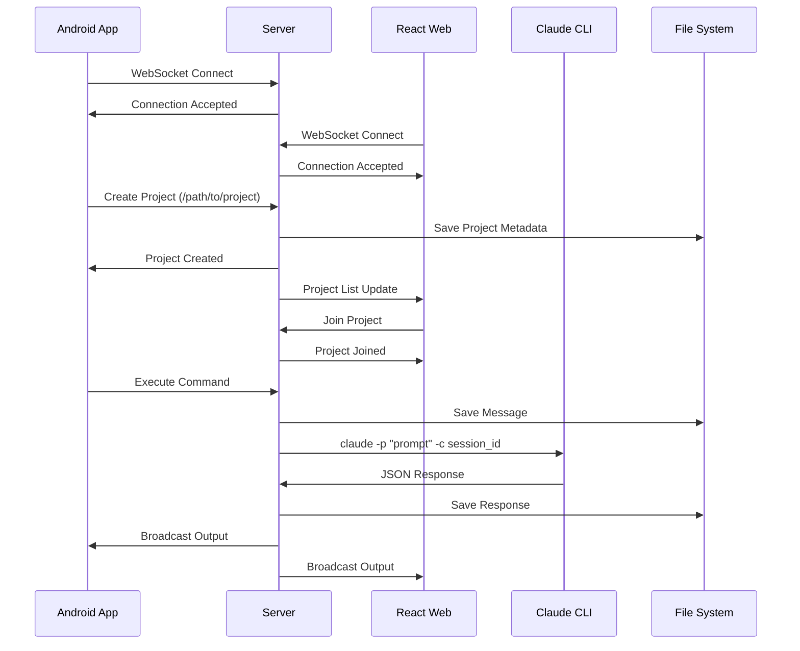

# Integration Design - Communication Layer

## Overview

The Communication Layer integrates WebSocket communication across server, Android mobile, and React web modules to provide seamless real-time interaction with Claude CLI through a project-based execution model with persistent message storage.

## Module Responsibilities

### Server Module
- **Role**: Central communication hub and Claude CLI executor
- **APIs**: WebSocket server endpoint only (no REST API)
- **Data**: Projects, message history, client subscriptions, Claude session IDs
- **Events**: Project lifecycle, execution status, client join/leave, message broadcasts

### Frontend-React Module  
- **Role**: Web-based client for desktop and tablet access
- **Components**: WebSocket service, chat interface, project dashboard, settings
- **State**: Global state management for sessions, messages, connection status
- **API Calls**: WebSocket connection, authentication, real-time messaging

### Frontend-Android Module
- **Role**: Mobile client optimized for on-the-go access
- **Activities/Fragments**: Chat activity, project list, permission dialogs
- **Services**: Background service for persistent connections, notification service
- **Data Sync**: Real-time sync with server, offline message queuing

## Integration Points

### Data Flow
```mermaid
graph LR
    A[Android App] --|WebSocket| B[Server]
    C[React Web] --|WebSocket| B
    B --|claude -p| D[Claude CLI]
    B --|Persistence| E[File System]
    E --|Projects & Messages| B
    B --|broadcast| A
    B --|broadcast| C
```

### API Contracts

#### WebSocket Endpoints
- **Server Endpoint**: `ws://server:8080/ws` (WebSocket only, no REST)
- **Authentication**: None in MVP (future work)
- **Message Format**: JSON with type, projectId, payload structure
- **Heartbeat**: Ping/pong every 30 seconds for connection health

#### Message Types
```json
// Project Management
{
  "type": "project_create",
  "payload": {
    "path": "/absolute/path/to/project"
  }
}

{
  "type": "project_delete",
  "payload": {
    "project_id": "project-uuid"
  }
}

{
  "type": "project_join",
  "payload": {
    "project_id": "project-uuid"
  }
}

// Execution
{
  "type": "execute",
  "payload": {
    "project_id": "project-uuid",
    "prompt": "user message to Claude"
  }
}

{
  "type": "agent_new_session",
  "payload": {
    "project_id": "project-uuid"
  }
}

// Updates (Server to Client)
{
  "type": "update",
  "payload": {
    "project_id": "project-uuid",
    "update_type": "execution_started|execution_output|execution_complete|error|session_reset",
    "data": {
      // Update-specific data
    }
  }
}
```

### Connection Flow
Simple connection without authentication (MVP):
1. Client connects to WebSocket endpoint
2. Server accepts connection immediately
3. Client can list projects or create new ones
4. Client joins projects to receive updates
5. Future: Add authentication layer

### Error Handling
- **Connection Errors**: Exponential backoff reconnection
- **Authentication Errors**: Clear error messages, re-authentication flow
- **Message Errors**: Error codes with human-readable descriptions
- **Timeout Errors**: Configurable timeouts with retry mechanisms

## Real-time Communication

### WebSocket Events
- **Connection Events**: connect, disconnect, reconnect
- **Project Events**: project_created, project_deleted, project_joined, project_left
- **Execution Events**: execution_started, execution_output, execution_complete, execution_error
- **Session Events**: session_reset, session_timeout
- **System Events**: heartbeat, error, server_stats

### Message Format
All messages follow consistent JSON structure:
```json
{
  "type": "message_type",
  "payload": {
    "project_id": "project-uuid-when-relevant",
    // Type-specific fields
  },
  "timestamp": "ISO-8601-timestamp"
}
```

### Connection Management
- **Heartbeat**: 30-second ping/pong to detect disconnections
- **Reconnection**: Automatic reconnection with exponential backoff
- **Project Persistence**: Projects and messages survive server restarts
- **Multiple Clients**: Server broadcasts to all project subscribers

## Sequence Diagrams

### Primary Use Case Flow


## Cross-Module Dependencies

### Shared Models
Data structures common across all modules:

```typescript
interface Project {
  id: string;
  path: string;
  status: 'idle' | 'executing' | 'error';
  sessionId: string; // Claude CLI session ID
  subscribers: string[]; // Connected client IDs
  createdAt: Date;
  lastActive: Date;
}

interface Message {
  type: string;
  payload: {
    project_id?: string;
    [key: string]: any;
  };
  timestamp: Date;
}

interface ExecutionResult {
  project_id: string;
  output: string;
  error?: string;
  session_id: string;
  duration: number;
}
```

### Synchronization Requirements
- **Data Consistency**: All clients show the same session state and message history
- **Conflict Resolution**: Last-writer-wins for permission responses
- **Offline Handling**: Mobile queues messages, web shows connection status

## Testing Strategy

### Integration Testing
- **WebSocket Communication**: Test message flow between all module combinations
- **Project Operations**: Test create, delete, join, leave across clients
- **Multi-Client Scenarios**: Test broadcasting and state synchronization
- **Claude Mock**: Use mock Claude CLI (FORBIDDEN: real Claude API in tests)

### Cross-Module Contracts
- **Protocol Validation**: Ensure all modules use consistent message format
- **Mock Services**: Server MUST run with mock Claude CLI for all testing
- **Error Scenarios**: Test network failures, execution timeouts, server restarts
- **Platform Testing**: Test on Linux and macOS (Windows not supported)

## Deployment Considerations

### Versioning
- **Protocol Versioning**: WebSocket protocol includes version negotiation
- **Backward Compatibility**: Maintain compatibility across client versions
- **Feature Flags**: Enable/disable features per client type

### Monitoring
- **Connection Metrics**: Active connections, connection duration, disconnect reasons
- **Message Metrics**: Message throughput, error rates, authentication success rates
- **Performance Metrics**: Message latency, reconnection frequency

## Security Considerations

### Security Model (MVP)
- **No Authentication**: MVP has no authentication (future work)
- **Path Validation**: Server validates all project paths
- **Connection Security**: WSS (WebSocket Secure) recommended
- **Command Injection**: Proper escaping of Claude CLI arguments

### Data Protection
- **Message Persistence**: All messages saved to disk with rotation
- **Atomic Operations**: File writes use atomic rename pattern
- **Project Isolation**: Each project has separate message history
- **Platform Security**: Unix file permissions for data protection

## Rollout Plan

### Phase 1: Core Infrastructure
- Server WebSocket endpoint with project management
- Message persistence and rotation
- Claude CLI integration with timeout
- Server restart recovery

### Phase 2: Basic Clients
- Android WebSocket client
- React WebSocket client  
- Project list and execution UI
- Real-time update handling

### Phase 3: Multi-Client Support
- Project subscription model
- Broadcasting to subscribers
- Message history queries
- Connection health monitoring

### Phase 4: Production Features
- Resource limits and monitoring
- Platform optimizations (Linux/macOS)
- Comprehensive error handling
- Future: Authentication layer

## Risk Mitigation

### Technical Risks
- **Platform Compatibility**: Ensure server works on Linux and macOS only
- **Claude CLI Integration**: Handle process timeouts and JSON parsing
- **Performance Scaling**: Monitor message storage growth and rotation
- **Testing Requirements**: Enforce mock Claude CLI usage in all tests

### Operational Risks
- **Multi-Module Deployment**: Coordinate server and client deployments
- **Protocol Changes**: Maintain backward compatibility during updates
- **Network Issues**: Robust handling of various network failure scenarios

## Success Metrics

### Functional Metrics
- **Message Delivery Rate**: 99.9% successful message delivery
- **Project Persistence**: 100% recovery after server restart
- **Multi-Client Sync**: 100% consistency across project subscribers
- **Execution Timeout**: 100% compliance with 5-minute timeout

### Performance Metrics
- **Connection Latency**: Sub-100ms WebSocket connection establishment
- **Message Latency**: Sub-50ms message routing between clients
- **Reconnection Time**: Sub-5-second reconnection after network failure

### Operational Metrics
- **Uptime**: 99.9% WebSocket server availability
- **Concurrent Connections**: Support 100+ simultaneous connections
- **Error Rates**: <1% message transmission errors

---

*Last Updated: 2025-01-27*
*Modules Involved: server, frontend-android, frontend-react*
*Platform: Server on Unix/POSIX only (Linux, macOS)*
*Testing: MUST use mock Claude CLI (FORBIDDEN: real Claude API)*