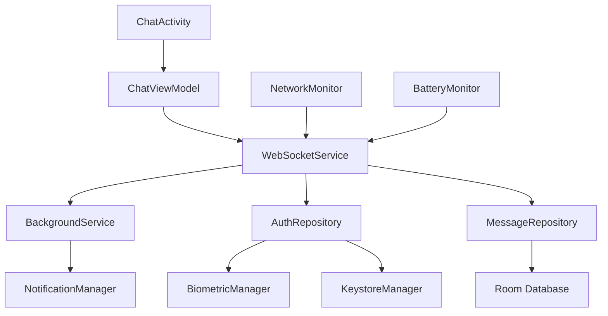

# Communication Layer - Frontend-Android Design

## Module Context

**Module**: Frontend-Android
**Technology Stack**: Kotlin, Jetpack Compose, OkHttp, Hilt
**Module Directory**: frontend-android/

## Overview

The frontend-android module provides a mobile-optimized WebSocket client that enables real-time communication with Claude Code through the server, with emphasis on battery efficiency, network resilience, and mobile UX patterns.

## Module Scope

### What This Module Owns
- WebSocket client implementation optimized for mobile networks
- Android-specific background service for persistent connections
- Biometric authentication and secure SSH key storage
- Mobile UI for chat, permission requests, and connection management
- Offline message queuing and network change handling

### Module Boundaries
- **Does NOT handle**: Server-side logic, WebSocket server implementation, web browser compatibility
- **Dependencies on other modules**: Server module for WebSocket API
- **Interfaces exposed to other modules**: None (end-user mobile client)

## Architecture

### Module-Specific Architecture


### Android-Specific Patterns
- **MVVM Architecture**: ViewModels with StateFlow for UI state management
- **Repository Pattern**: Data repositories with Room and WebSocket data sources
- **Dependency Injection**: Hilt for dependency management
- **Background Services**: Foreground service for persistent connections

## Components and Interfaces

### Internal Components

#### WebSocketService
- **Purpose**: Manages WebSocket connection lifecycle and message handling
- **Technology**: OkHttp WebSocket client with Kotlin coroutines
- **Dependencies**: AuthRepository, MessageRepository, NetworkMonitor
- **Interface**: Connection management, message sending/receiving

#### BackgroundService
- **Purpose**: Maintains WebSocket connection when app is backgrounded
- **Technology**: Android Foreground Service with persistent notification
- **Dependencies**: WebSocketService, NotificationManager
- **Interface**: Service lifecycle management, notification updates

#### AuthRepository
- **Purpose**: Handles SSH key authentication and secure storage
- **Technology**: Android Keystore, BiometricPrompt, Bouncy Castle
- **Dependencies**: KeystoreManager, BiometricManager
- **Interface**: Authentication flow, key management

#### ChatViewModel
- **Purpose**: Manages chat UI state and user interactions
- **Technology**: Android ViewModel with StateFlow
- **Dependencies**: WebSocketService, MessageRepository
- **Interface**: UI state exposure, user action handling

#### MessageRepository
- **Purpose**: Handles message persistence and offline queuing
- **Technology**: Room database with Entity/DAO pattern
- **Dependencies**: Room Database
- **Interface**: Message CRUD operations, offline queue management

### External Interfaces

#### Server WebSocket Integration
- **Type**: WebSocket client connection
- **Purpose**: Real-time communication with server
- **Contract**: JSON message protocol with authentication
- **Authentication**: SSH key challenge-response

### Module Dependencies

#### Server WebSocket API
- **Source**: Server module
- **Type**: WebSocket connection with JSON protocol
- **Fallback**: Offline mode with message queuing

## Data Models

### Module-Specific Models
```kotlin
@Entity(tableName = "messages")
data class MessageEntity(
    @PrimaryKey val id: String,
    val sessionId: String,
    val type: MessageType,
    val content: String,
    val timestamp: Long,
    val status: MessageStatus,
    val isFromUser: Boolean
)

@Entity(tableName = "connection_status")
data class ConnectionStatus(
    @PrimaryKey val id: Int = 1,
    val isConnected: Boolean,
    val lastConnected: Long,
    val serverUrl: String,
    val reconnectAttempts: Int
)

data class WebSocketState(
    val isConnected: Boolean,
    val isAuthenticating: Boolean,
    val connectionError: String?,
    val lastMessage: ClaudeMessage?
)
```

### Shared Models
```kotlin
data class ClaudeMessage(
    val id: String,
    val type: String,
    val sessionId: String?,
    val payload: JsonElement,
    val timestamp: Instant
)

data class PermissionRequest(
    val id: String,
    val sessionId: String,
    val action: String,
    val details: String,
    val timeout: Duration
)

data class AuthChallenge(
    val challenge: String,
    val timestamp: String
)
```

## Android-Specific Implementation

### Foreground Service Patterns
```kotlin
class WebSocketForegroundService : Service() {
    private val webSocketClient by lazy { 
        hiltEntryPoint.webSocketClient() 
    }
    
    override fun onStartCommand(intent: Intent?, flags: Int, startId: Int): Int {
        startForeground(NOTIFICATION_ID, createNotification())
        webSocketClient.connect()
        return START_STICKY
    }
}
```

### Network Change Handling
```kotlin
@Singleton
class NetworkMonitor @Inject constructor(
    @ApplicationContext private val context: Context
) {
    private val connectivityManager = context.getSystemService<ConnectivityManager>()
    
    val networkState = callbackFlow {
        val callback = object : ConnectivityManager.NetworkCallback() {
            override fun onAvailable(network: Network) {
                trySend(NetworkState.Available(network))
            }
            
            override fun onLost(network: Network) {
                trySend(NetworkState.Lost)
            }
        }
        
        connectivityManager?.registerDefaultNetworkCallback(callback)
        awaitClose { connectivityManager?.unregisterNetworkCallback(callback) }
    }
}
```

### Battery Optimization
```kotlin
@Singleton 
class BatteryOptimizedConnection @Inject constructor(
    private val batteryMonitor: BatteryMonitor,
    private val webSocketClient: WebSocketClient
) {
    fun adjustConnectionFrequency() {
        val batteryLevel = batteryMonitor.getBatteryLevel()
        val isCharging = batteryMonitor.isCharging()
        
        val interval = when {
            isCharging -> NORMAL_HEARTBEAT_INTERVAL
            batteryLevel < 20 -> BATTERY_SAVER_INTERVAL
            batteryLevel < 50 -> REDUCED_INTERVAL
            else -> NORMAL_HEARTBEAT_INTERVAL
        }
        
        webSocketClient.setHeartbeatInterval(interval)
    }
}
```

### Error Handling
```kotlin
sealed class WebSocketError : Exception() {
    object ConnectionFailed : WebSocketError()
    object AuthenticationFailed : WebSocketError()
    object MessageSendFailed : WebSocketError()
    data class UnexpectedError(override val message: String) : WebSocketError()
}

class WebSocketErrorHandler @Inject constructor() {
    fun handleError(error: WebSocketError): ErrorAction {
        return when (error) {
            is WebSocketError.ConnectionFailed -> ErrorAction.Retry
            is WebSocketError.AuthenticationFailed -> ErrorAction.ReAuthenticate
            is WebSocketError.MessageSendFailed -> ErrorAction.QueueMessage
            is WebSocketError.UnexpectedError -> ErrorAction.ShowError(error.message)
        }
    }
}
```

### Configuration
```kotlin
@Module
@InstallIn(SingletonComponent::class)
object WebSocketModule {
    
    @Provides
    @Singleton
    fun provideWebSocketConfig(): WebSocketConfig {
        return WebSocketConfig(
            serverUrl = BuildConfig.WEBSOCKET_URL,
            connectTimeout = 30.seconds,
            heartbeatInterval = 30.seconds,
            maxReconnectAttempts = 5,
            backoffMultiplier = 2.0
        )
    }
}
```

## Testing Strategy

### Module-Level Testing
```kotlin
@RunWith(AndroidJUnit4::class)
class WebSocketServiceTest {
    
    @get:Rule
    val hiltRule = HiltAndroidRule(this)
    
    @Test
    fun `when connection established, should send authentication challenge`() {
        // Test WebSocket connection and authentication flow
    }
    
    @Test
    fun `when network changes, should reconnect automatically`() {
        // Test network change handling
    }
}

class ChatViewModelTest {
    @Test
    fun `when message sent, should update UI state correctly`() {
        // Test ViewModel state management
    }
}
```

### Cross-Module Testing
- **WebSocket Protocol Testing**: Verify message format compatibility with server
- **Authentication Flow Testing**: Test SSH key challenge-response with server
- **Reconnection Testing**: Test behavior during server restarts

## Performance Considerations

### Module-Specific Performance
- **Memory Management**: Efficient message caching with LRU eviction
- **Network Efficiency**: Message batching and compression
- **Battery Optimization**: Adaptive heartbeat based on battery state
- **UI Responsiveness**: Background threading for all network operations

### Cross-Module Performance
- **Connection Pooling**: Single persistent WebSocket connection
- **Message Compression**: Use WebSocket compression extension
- **Protocol Optimization**: Minimal JSON message overhead

## Security Considerations

### Module Security
- **SSH Key Protection**: Private keys stored in Android Keystore
- **Biometric Authentication**: BiometricPrompt for accessing keys
- **Certificate Pinning**: Pin server certificates for WebSocket connections
- **Input Validation**: Validate all incoming messages

### Cross-Module Security
- **Secure WebSocket**: Use WSS (secure WebSocket) connections
- **Message Encryption**: End-to-end message integrity
- **Authentication**: Secure SSH key-based authentication

## Deployment and Operations

### Module Deployment
```gradle
android {
    buildTypes {
        debug {
            buildConfigField "String", "WEBSOCKET_URL", "\"ws://10.0.2.2:8080/ws\""
            isDebuggable = true
        }
        
        release {
            buildConfigField "String", "WEBSOCKET_URL", "\"wss://your-server.com/ws\""
            isMinifyEnabled = true
            proguardFiles(getDefaultProguardFile("proguard-android-optimize.txt"))
        }
    }
}
```

### Monitoring and Observability
```kotlin
@Singleton
class ConnectionMetrics @Inject constructor() {
    private val connectionAttempts = AtomicInteger(0)
    private val successfulConnections = AtomicInteger(0)
    private val authenticationFailures = AtomicInteger(0)
    
    fun recordConnectionAttempt() = connectionAttempts.incrementAndGet()
    fun recordSuccessfulConnection() = successfulConnections.incrementAndGet()
    fun recordAuthFailure() = authenticationFailures.incrementAndGet()
    
    fun getMetrics() = ConnectionMetricsData(
        attempts = connectionAttempts.get(),
        successes = successfulConnections.get(),
        authFailures = authenticationFailures.get()
    )
}
```

## Migration and Compatibility

### Version Compatibility
- **Protocol Versioning**: Support multiple server protocol versions
- **Graceful Degradation**: Handle missing server features
- **Migration**: Room database migrations for schema changes

### Legacy Support
- **SSH Key Migration**: Import keys from previous app versions
- **Message History**: Preserve conversation history during updates
- **Settings Migration**: Maintain user preferences across updates

---

*Module: Frontend-Android*
*Last Updated: 2025-01-27*
*Technology Stack: Kotlin, Jetpack Compose, OkHttp, Hilt*