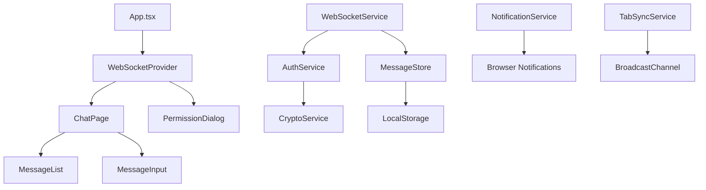

# Communication Layer - Frontend-React Design

## Module Context

**Module**: Frontend-React
**Technology Stack**: React, TypeScript, WebSocket API, Web Crypto API
**Module Directory**: frontend-react/

## Overview

The frontend-react module provides a browser-based WebSocket client that enables real-time communication with Claude Code through the server, optimized for desktop and tablet use with responsive design and cross-browser compatibility.

## Module Scope

### What This Module Owns
- Browser WebSocket client implementation
- Web-based SSH key authentication using Web Crypto API
- Responsive React UI for chat and permission management
- Browser notification system for permission requests
- Tab synchronization and session management
- Cross-browser compatibility layer

### Module Boundaries
- **Does NOT handle**: Server-side logic, mobile-specific features, native device APIs
- **Dependencies on other modules**: Server module for WebSocket API
- **Interfaces exposed to other modules**: None (end-user web client)

## Architecture

### Module-Specific Architecture


### React-Specific Patterns
- **Functional Components**: All components using React hooks
- **Context API**: Global state management for WebSocket and auth
- **Custom Hooks**: Business logic encapsulated in reusable hooks
- **Error Boundaries**: Graceful error handling for WebSocket failures

## Components and Interfaces

### Internal Components

#### WebSocketService
- **Purpose**: Manages WebSocket connection lifecycle and message handling
- **Technology**: Native WebSocket API with TypeScript
- **Dependencies**: AuthService, MessageStore
- **Interface**: Connection management, message sending/receiving

#### AuthService
- **Purpose**: Handles SSH key authentication using Web Crypto API
- **Technology**: Web Crypto API, SubtleCrypto for SSH signatures
- **Dependencies**: CryptoService
- **Interface**: Authentication flow, key management

#### MessageStore
- **Purpose**: Manages message state and persistence
- **Technology**: Zustand or Redux with localStorage persistence
- **Dependencies**: LocalStorage adapter
- **Interface**: Message CRUD operations, real-time updates

#### NotificationService
- **Purpose**: Manages browser notifications for permission requests
- **Technology**: Notification API, Service Worker (optional)
- **Dependencies**: None
- **Interface**: Notification creation, permission management

#### TabSyncService
- **Purpose**: Synchronizes state across browser tabs
- **Technology**: BroadcastChannel API
- **Dependencies**: MessageStore
- **Interface**: Cross-tab communication, state synchronization

### External Interfaces

#### Server WebSocket Integration
- **Type**: WebSocket client connection
- **Purpose**: Real-time communication with server
- **Contract**: JSON message protocol with authentication
- **Authentication**: SSH key challenge-response via Web Crypto

### Module Dependencies

#### Server WebSocket API
- **Source**: Server module
- **Type**: WebSocket connection with JSON protocol
- **Fallback**: Offline mode with localStorage queuing

## Data Models

### Module-Specific Models
```typescript
interface WebSocketState {
  isConnected: boolean;
  isConnecting: boolean;
  isAuthenticated: boolean;
  error: string | null;
  lastActivity: Date | null;
}

interface MessageState {
  messages: ChatMessage[];
  unsentMessages: ChatMessage[];
  isTyping: boolean;
  lastRead: Date;
}

interface AuthState {
  isAuthenticated: boolean;
  publicKey: string | null;
  privateKey: CryptoKey | null;
  challenge: string | null;
}

interface NotificationState {
  permission: NotificationPermission;
  pendingRequests: PermissionRequest[];
}
```

### Shared Models
```typescript
interface ChatMessage {
  id: string;
  type: 'user' | 'claude' | 'system';
  content: string;
  timestamp: Date;
  sessionId: string;
  status: 'pending' | 'sent' | 'delivered' | 'failed';
}

interface PermissionRequest {
  id: string;
  sessionId: string;
  action: string;
  details: string;
  timeout: number;
  createdAt: Date;
}

interface WebSocketMessage {
  type: string;
  sessionId?: string;
  payload: unknown;
  timestamp: Date;
  id: string;
}
```

## React-Specific Implementation

### Context Providers
```typescript
interface WebSocketContextValue {
  state: WebSocketState;
  sendMessage: (message: ChatMessage) => void;
  connect: () => void;
  disconnect: () => void;
}

export const WebSocketProvider: React.FC<{ children: ReactNode }> = ({ children }) => {
  const [state, setState] = useState<WebSocketState>(initialState);
  const webSocketRef = useRef<WebSocket | null>(null);
  
  const connect = useCallback(() => {
    // WebSocket connection logic
  }, []);
  
  return (
    <WebSocketContext.Provider value={{ state, sendMessage, connect, disconnect }}>
      {children}
    </WebSocketContext.Provider>
  );
};
```

### Custom Hooks
```typescript
export const useWebSocket = () => {
  const context = useContext(WebSocketContext);
  if (!context) {
    throw new Error('useWebSocket must be used within WebSocketProvider');
  }
  return context;
};

export const useAuth = () => {
  const [authState, setAuthState] = useState<AuthState>(initialAuthState);
  
  const signChallenge = useCallback(async (challenge: string, privateKey: CryptoKey) => {
    const encoder = new TextEncoder();
    const data = encoder.encode(challenge);
    const signature = await crypto.subtle.sign('RSASSA-PKCS1-v1_5', privateKey, data);
    return Array.from(new Uint8Array(signature));
  }, []);
  
  return { authState, signChallenge };
};
```

### Browser API Integration
```typescript
class NotificationService {
  async requestPermission(): Promise<NotificationPermission> {
    if (!('Notification' in window)) {
      throw new Error('Notifications not supported');
    }
    return await Notification.requestPermission();
  }
  
  createNotification(title: string, options: NotificationOptions): Notification {
    return new Notification(title, {
      icon: '/favicon.ico',
      badge: '/badge.png',
      tag: 'permission-request',
      requireInteraction: true,
      ...options
    });
  }
}

class TabSyncService {
  private channel: BroadcastChannel;
  
  constructor() {
    this.channel = new BroadcastChannel('pocket-agent-sync');
    this.channel.addEventListener('message', this.handleMessage);
  }
  
  broadcastStateUpdate(state: Partial<AppState>) {
    this.channel.postMessage({
      type: 'STATE_UPDATE',
      payload: state,
      timestamp: Date.now()
    });
  }
}
```

### Error Handling
```typescript
class WebSocketErrorBoundary extends React.Component<Props, State> {
  constructor(props: Props) {
    super(props);
    this.state = { hasError: false };
  }
  
  static getDerivedStateFromError(error: Error): State {
    return { hasError: true, error };
  }
  
  componentDidCatch(error: Error, errorInfo: React.ErrorInfo) {
    console.error('WebSocket error:', error, errorInfo);
    // Send error to monitoring service
  }
  
  render() {
    if (this.state.hasError) {
      return <ErrorFallback error={this.state.error} />;
    }
    
    return this.props.children;
  }
}
```

### Configuration
```typescript
interface WebSocketConfig {
  serverUrl: string;
  reconnectInterval: number;
  maxReconnectAttempts: number;
  heartbeatInterval: number;
}

const config: WebSocketConfig = {
  serverUrl: process.env.REACT_APP_WEBSOCKET_URL || 'ws://localhost:8080/ws',
  reconnectInterval: 1000,
  maxReconnectAttempts: 5,
  heartbeatInterval: 30000
};
```

## Testing Strategy

### Module-Level Testing
```typescript
// Component Testing with React Testing Library
describe('ChatComponent', () => {
  test('sends message when form submitted', async () => {
    const mockSendMessage = jest.fn();
    render(
      <WebSocketContext.Provider value={{ sendMessage: mockSendMessage }}>
        <ChatComponent />
      </WebSocketContext.Provider>
    );
    
    const input = screen.getByRole('textbox');
    const submitButton = screen.getByRole('button', { name: /send/i });
    
    await user.type(input, 'Hello Claude');
    await user.click(submitButton);
    
    expect(mockSendMessage).toHaveBeenCalledWith(
      expect.objectContaining({ content: 'Hello Claude' })
    );
  });
});

// Hook Testing
describe('useWebSocket', () => {
  test('handles connection state correctly', () => {
    const { result } = renderHook(() => useWebSocket(), {
      wrapper: WebSocketProvider
    });
    
    expect(result.current.state.isConnected).toBe(false);
    
    act(() => {
      result.current.connect();
    });
    
    expect(result.current.state.isConnecting).toBe(true);
  });
});
```

### Cross-Module Testing
- **WebSocket Protocol Testing**: Mock server for testing message protocol
- **Authentication Flow Testing**: Test SSH key challenge-response
- **Cross-Browser Testing**: Automated testing across browser matrix

## Performance Considerations

### Module-Specific Performance
- **React Optimization**: useMemo and useCallback for expensive operations
- **Virtual Scrolling**: For large message histories
- **Code Splitting**: Lazy loading of non-critical components
- **Bundle Optimization**: Tree shaking and dead code elimination

### Cross-Module Performance
- **Connection Efficiency**: Single WebSocket connection with message multiplexing
- **Message Batching**: Batch multiple messages when possible
- **Compression**: WebSocket compression for large messages

## Security Considerations

### Module Security
- **XSS Prevention**: Sanitize all user input and message content
- **CSP Headers**: Content Security Policy to prevent injection attacks
- **Key Security**: Private keys stored in memory only, never persisted
- **Input Validation**: Validate all incoming WebSocket messages

### Cross-Module Security
- **Secure WebSocket**: Use WSS (secure WebSocket) in production
- **Authentication**: Web Crypto API for SSH key operations
- **Session Security**: Secure session management across tabs

## Deployment and Operations

### Module Deployment
```json
{
  "scripts": {
    "build": "vite build",
    "preview": "vite preview",
    "test": "vitest",
    "lint": "eslint src --ext ts,tsx",
    "type-check": "tsc --noEmit"
  }
}
```

### Build Configuration
```typescript
// vite.config.ts
export default defineConfig({
  plugins: [react()],
  build: {
    rollupOptions: {
      output: {
        manualChunks: {
          vendor: ['react', 'react-dom'],
          websocket: ['./src/services/websocket']
        }
      }
    }
  },
  define: {
    'process.env.NODE_ENV': JSON.stringify(process.env.NODE_ENV)
  }
});
```

### Monitoring and Observability
```typescript
class WebPerformanceMonitor {
  trackWebSocketLatency(startTime: number) {
    const latency = performance.now() - startTime;
    // Send to analytics service
  }
  
  trackUserInteraction(action: string) {
    // Track user actions for UX analysis
  }
  
  trackError(error: Error, context: string) {
    // Error tracking and reporting
  }
}
```

## Migration and Compatibility

### Browser Compatibility
- **WebSocket Support**: Fallback for older browsers
- **Web Crypto API**: Polyfill for browsers without native support
- **Notification API**: Graceful degradation when not available
- **BroadcastChannel**: Fallback to localStorage events

### Version Management
- **API Versioning**: Handle different server API versions
- **Feature Detection**: Progressive enhancement based on browser capabilities
- **Graceful Degradation**: Core functionality works in all supported browsers

---

*Module: Frontend-React*
*Last Updated: 2025-01-27*
*Technology Stack: React, TypeScript, WebSocket API, Web Crypto API*