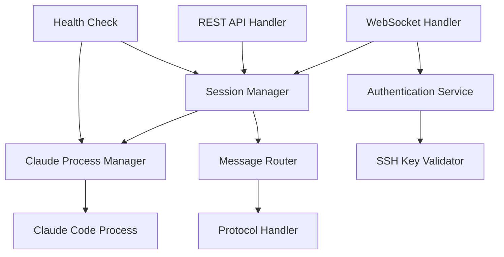

# Communication Layer - Server Design

## Module Context

**Module**: Server
**Technology Stack**: Go, WebSocket, REST API
**Module Directory**: server/

## Overview

The server module provides the central WebSocket communication hub that enables real-time bidirectional communication between Claude Code processes and multiple client applications (Android mobile and React web).

## Module Scope

### What This Module Owns
- WebSocket server implementation and connection management
- SSH key-based authentication and session management
- Claude Code process lifecycle management
- Message routing and protocol implementation
- Multi-client session broadcasting

### Module Boundaries
- **Does NOT handle**: Client UI, mobile-specific features, browser compatibility
- **Dependencies on other modules**: None (standalone server)
- **Interfaces exposed to other modules**: WebSocket API, REST API endpoints

## Architecture

### Module-Specific Architecture


### Technology-Specific Patterns
- **Goroutines**: Concurrent handling of multiple WebSocket connections
- **Channels**: Inter-goroutine communication for message passing
- **Context**: Request cancellation and timeout handling
- **Middleware**: Authentication and logging middleware for HTTP/WebSocket

## Components and Interfaces

### Internal Components

#### WebSocket Handler
- **Purpose**: Manages WebSocket connections and message routing
- **Technology**: Gorilla WebSocket library
- **Dependencies**: Session Manager, Authentication Service
- **Interface**: Accepts WebSocket upgrade requests, handles message routing

#### Authentication Service
- **Purpose**: Validates SSH key signatures for client authentication
- **Technology**: Go SSH library
- **Dependencies**: SSH Key Validator
- **Interface**: Challenge-response authentication API

#### Session Manager
- **Purpose**: Tracks active sessions and client connections
- **Technology**: In-memory session store with sync.Map
- **Dependencies**: Claude Process Manager
- **Interface**: Session CRUD operations, client broadcasting

#### Claude Process Manager
- **Purpose**: Manages Claude Code process lifecycle
- **Technology**: os/exec package for process control
- **Dependencies**: None
- **Interface**: Process start/stop, stdin/stdout handling

#### Message Router
- **Purpose**: Routes messages between Claude Code and clients
- **Technology**: JSON encoding/decoding
- **Dependencies**: Protocol Handler, Session Manager
- **Interface**: Message validation and routing API

### External Interfaces

#### WebSocket API
- **Type**: WebSocket server endpoint
- **Purpose**: Real-time communication with client applications
- **Contract**: JSON message protocol with authentication
- **Authentication**: SSH key challenge-response

#### REST API (Future)
- **Type**: HTTP REST endpoints
- **Purpose**: Non-real-time operations and health checks
- **Contract**: JSON request/response
- **Authentication**: Bearer token or API key

### Module Dependencies

#### Claude Code Process
- **Source**: Local Claude Code executable
- **Type**: Process stdin/stdout communication
- **Fallback**: Graceful error handling and process restart

## Data Models

### Module-Specific Models
```go
type Server struct {
    wsHandler    *WebSocketHandler
    authService  *AuthService
    sessionMgr   *SessionManager
    claudeMgr    *ClaudeManager
    config       *Config
}

type WebSocketConnection struct {
    conn         *websocket.Conn
    clientID     string
    authenticated bool
    sessionID    string
    sendChan     chan []byte
    closeChan    chan struct{}
}

type Session struct {
    ID           string
    ClientIDs    []string
    ProjectPath  string
    Status       SessionStatus
    CreatedAt    time.Time
    LastActivity time.Time
}
```

### Shared Models
```go
type Message struct {
    Type      string      `json:"type"`
    SessionID string      `json:"session_id,omitempty"`
    Payload   interface{} `json:"payload"`
    Timestamp time.Time   `json:"timestamp"`
    ID        string      `json:"id"`
}

type AuthChallenge struct {
    Challenge string `json:"challenge"`
    Timestamp string `json:"timestamp"`
}

type AuthResponse struct {
    Signature string `json:"signature"`
    PublicKey string `json:"public_key"`
}
```

## Go-Specific Implementation

### Goroutine Patterns
- **Connection Handler**: One goroutine per WebSocket connection
- **Message Reader**: Dedicated goroutine for reading from WebSocket
- **Message Writer**: Dedicated goroutine for writing to WebSocket
- **Claude Process**: Goroutine for handling Claude Code stdin/stdout

### Error Handling
- **Panic Recovery**: Recover from panics in goroutines
- **Structured Errors**: Custom error types with context
- **Error Propagation**: Channel-based error reporting
- **Graceful Shutdown**: Context-based cancellation

### Configuration
```go
type Config struct {
    WebSocketPort     int           `env:"WS_PORT" default:"8080"`
    ClaudeCommand     string        `env:"CLAUDE_CMD" default:"claude"`
    AuthTimeout       time.Duration `env:"AUTH_TIMEOUT" default:"30s"`
    HeartbeatInterval time.Duration `env:"HEARTBEAT" default:"30s"`
    MaxConnections    int           `env:"MAX_CONN" default:"100"`
    LogLevel          string        `env:"LOG_LEVEL" default:"info"`
}
```

## Testing Strategy

### Module-Level Testing
```go
// Unit tests for individual components
func TestAuthService_ValidateSignature(t *testing.T) { ... }
func TestSessionManager_CreateSession(t *testing.T) { ... }
func TestMessageRouter_RouteMessage(t *testing.T) { ... }

// Integration tests for module interactions
func TestWebSocketHandler_AuthFlow(t *testing.T) { ... }
func TestClaudeManager_ProcessComm(t *testing.T) { ... }
```

### Cross-Module Testing
- **WebSocket Client Testing**: Automated client for testing server responses
- **Claude Process Mocking**: Mock Claude Code process for testing
- **Load Testing**: Multiple concurrent connections testing

## Performance Considerations

### Module-Specific Performance
- **Connection Pooling**: Reuse goroutines where possible
- **Memory Management**: Efficient message buffering with limited queues
- **CPU Usage**: Optimize JSON marshaling/unmarshaling
- **Goroutine Limits**: Bounded goroutine pools for connection handling

### Cross-Module Performance
- **Message Broadcasting**: Efficient fan-out to multiple clients
- **Protocol Overhead**: Minimize JSON message size
- **Network Optimization**: WebSocket compression and keep-alive

## Security Considerations

### Module Security
- **Input Validation**: Validate all incoming WebSocket messages
- **Process Isolation**: Run Claude Code with limited privileges
- **Resource Limits**: Prevent resource exhaustion attacks
- **Audit Logging**: Log all authentication and critical events

### Cross-Module Security
- **WebSocket Security**: WSS (secure WebSocket) for encryption
- **Authentication**: SSH key validation prevents unauthorized access
- **Session Security**: Secure session token generation

## Deployment and Operations

### Module Deployment
```dockerfile
FROM golang:1.21-alpine AS builder
WORKDIR /app
COPY go.mod go.sum ./
RUN go mod download
COPY . .
RUN go build -o server ./cmd/server

FROM alpine:latest
RUN apk --no-cache add ca-certificates
COPY --from=builder /app/server /usr/local/bin/server
EXPOSE 8080
CMD ["server"]
```

### Monitoring and Observability
```go
// Prometheus metrics
var (
    connectionsTotal = prometheus.NewCounterVec(
        prometheus.CounterOpts{
            Name: "websocket_connections_total",
            Help: "Total number of WebSocket connections",
        },
        []string{"status"},
    )
    
    messagesTotal = prometheus.NewCounterVec(
        prometheus.CounterOpts{
            Name: "messages_total", 
            Help: "Total number of messages processed",
        },
        []string{"type", "direction"},
    )
)
```

## Migration and Compatibility

### Version Compatibility
- **Protocol Versioning**: Support multiple protocol versions
- **Graceful Degradation**: Handle older client versions
- **API Evolution**: Backward-compatible API changes

### Legacy Support
- **Configuration Migration**: Migrate from old config formats
- **Data Migration**: No persistent data to migrate
- **Client Compatibility**: Support existing client implementations

---

*Module: Server*
*Last Updated: 2025-01-27*
*Technology Stack: Go, WebSocket, REST API*