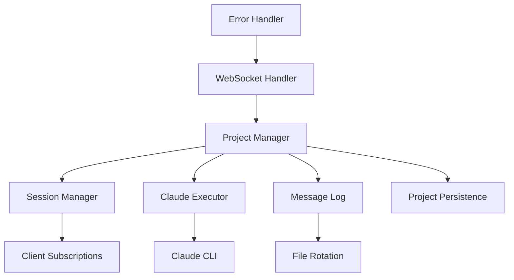

# Communication Layer - Server Design

## Module Context

**Module**: Server
**Technology Stack**: Go, WebSocket only (no REST API)
**Module Directory**: server/
**Platform**: Unix/POSIX only (Linux, macOS)

## Overview

The server module provides the central WebSocket communication hub that manages project-based Claude CLI executions with persistent message storage and multi-client broadcasting.

## Module Scope

### What This Module Owns
- WebSocket server implementation (no REST API)
- Project creation, deletion, and management
- Claude CLI execution with timeout management
- Message persistence with file rotation
- Multi-client project subscription and broadcasting

### Module Boundaries
- **Does NOT handle**: Client UI, authentication (future work), Windows support
- **Dependencies on other modules**: None (standalone server)
- **Interfaces exposed to other modules**: WebSocket API only

## Architecture

### Module-Specific Architecture


### Technology-Specific Patterns
- **Goroutines**: Concurrent handling of multiple WebSocket connections
- **Channels**: Inter-goroutine communication for message passing
- **Context**: Request cancellation and timeout handling
- **Middleware**: Authentication and logging middleware for HTTP/WebSocket

## Components and Interfaces

### Internal Components

#### WebSocket Handler
- **Purpose**: Manages WebSocket connections and message routing
- **Technology**: Gorilla WebSocket library
- **Dependencies**: Session Manager, Authentication Service
- **Interface**: Accepts WebSocket upgrade requests, handles message routing

#### Project Manager
- **Purpose**: Manages project lifecycle and state
- **Technology**: In-memory with disk persistence
- **Dependencies**: Message Log, Claude Executor
- **Interface**: Create, delete, join, leave projects

#### Session Manager
- **Purpose**: Tracks client subscriptions to projects
- **Technology**: In-memory subscription map
- **Dependencies**: Project Manager
- **Interface**: Subscribe/unsubscribe clients, broadcast to subscribers

#### Claude Executor
- **Purpose**: Executes Claude CLI with proper arguments
- **Technology**: os/exec with timeout context
- **Dependencies**: None
- **Interface**: Execute with timeout, kill active execution

#### Message Log
- **Purpose**: Persists messages with automatic rotation
- **Technology**: File-based append log with rotation
- **Dependencies**: File system
- **Interface**: Append message, query by timestamp, rotate

### External Interfaces

#### WebSocket API
- **Type**: WebSocket server endpoint
- **Purpose**: Real-time communication with client applications
- **Contract**: JSON message protocol with authentication
- **Authentication**: SSH key challenge-response

#### Project Persistence
- **Type**: File-based metadata storage
- **Purpose**: Survive server restarts
- **Contract**: JSON metadata files per project
- **Pattern**: Atomic writes with rename

### Module Dependencies

#### Claude CLI Process
- **Source**: Local `claude` executable
- **Type**: Command execution with `-p` and `-c` flags
- **Timeout**: 5-minute execution limit
- **Output**: JSON-formatted responses

## Data Models

### Module-Specific Models
```go
type Server struct {
    wsHandler    *WebSocketHandler
    projectMgr   *ProjectManager
    sessionMgr   *SessionManager
    executor     *ClaudeExecutor
    config       *Config
}

type WebSocketConnection struct {
    conn         *websocket.Conn
    clientID     string
    projects     map[string]bool // Subscribed projects
    sendChan     chan []byte
    closeChan    chan struct{}
}

type Project struct {
    ID           string
    Path         string
    Status       ProjectStatus // idle, executing, error
    SessionID    string        // Claude CLI session
    Subscribers  []string      // Client IDs
    MessageLog   string        // Path to message file
    CreatedAt    time.Time
    LastActive   time.Time
}
```

### Shared Models
```go
type ClientMessage struct {
    Type    string                 `json:"type"`
    Payload map[string]interface{} `json:"payload"`
}

type UpdateMessage struct {
    Type    string                 `json:"type"`
    Payload UpdatePayload          `json:"payload"`
}

type UpdatePayload struct {
    ProjectID   string                 `json:"project_id"`
    UpdateType  string                 `json:"update_type"`
    Data        map[string]interface{} `json:"data"`
    Timestamp   time.Time              `json:"timestamp"`
}
```

## Go-Specific Implementation

### Goroutine Patterns
- **Connection Handler**: One goroutine per WebSocket connection
- **Message Reader**: Dedicated goroutine for reading from WebSocket
- **Message Writer**: Dedicated goroutine for writing to WebSocket
- **Claude Executor**: Goroutine per project execution with timeout
- **File Rotation**: Background goroutine for message log rotation

### Error Handling
- **Panic Recovery**: Recover from panics in goroutines
- **Structured Errors**: Custom error types with context
- **Error Propagation**: Channel-based error reporting
- **Graceful Shutdown**: Context-based cancellation

### Configuration
```go
type Config struct {
    WebSocketPort     int           `env:"WS_PORT" default:"8080"`
    ClaudeCommand     string        `env:"CLAUDE_CMD" default:"claude"`
    ExecutionTimeout  time.Duration `env:"EXEC_TIMEOUT" default:"5m"`
    HeartbeatInterval time.Duration `env:"HEARTBEAT" default:"30s"`
    MaxConnections    int           `env:"MAX_CONN" default:"100"`
    MaxProjects       int           `env:"MAX_PROJECTS" default:"100"`
    MessageRotateSize int64         `env:"MSG_ROTATE_SIZE" default:"1073741824"` // 1GB
    MessageRotateDays int           `env:"MSG_ROTATE_DAYS" default:"30"`
    LogLevel          string        `env:"LOG_LEVEL" default:"info"`
}
```

## Testing Strategy

### Module-Level Testing
```go
// Unit tests for individual components
func TestProjectManager_CreateProject(t *testing.T) { ... }
func TestProjectManager_PathValidation(t *testing.T) { ... }
func TestMessageLog_Rotation(t *testing.T) { ... }
func TestClaudeExecutor_Timeout(t *testing.T) { ... }

// Integration tests with mock Claude CLI
func TestWebSocketHandler_ProjectFlow(t *testing.T) { ... }
func TestServerRestart_Recovery(t *testing.T) { ... }
```

### Cross-Module Testing
- **WebSocket Client Testing**: Automated client for testing server responses
- **Claude CLI Mocking**: MUST use mock Claude CLI (FORBIDDEN: real API)
- **Platform Testing**: Test on Linux and macOS only
- **Persistence Testing**: Verify server restart recovery

## Performance Considerations

### Module-Specific Performance
- **Connection Pooling**: Reuse goroutines where possible
- **Memory Management**: Efficient message buffering with limited queues
- **CPU Usage**: Optimize JSON marshaling/unmarshaling
- **Goroutine Limits**: Bounded goroutine pools for connection handling

### Cross-Module Performance
- **Message Broadcasting**: Efficient fan-out to multiple clients
- **Protocol Overhead**: Minimize JSON message size
- **Network Optimization**: WebSocket compression and keep-alive

## Security Considerations

### Module Security
- **Path Validation**: Validate project paths, prevent traversal
- **Process Isolation**: Run Claude CLI with limited privileges
- **Command Injection**: Proper argument escaping for Claude CLI
- **Resource Limits**: Limit projects, connections, message size
- **Audit Logging**: Log all project operations and executions

### Cross-Module Security
- **WebSocket Security**: WSS (secure WebSocket) recommended
- **No Authentication**: MVP has no auth (future work)
- **Project Isolation**: Each project has separate execution context
- **Platform Security**: Unix file permissions for data protection

## Deployment and Operations

### Module Deployment
```dockerfile
FROM golang:1.21-alpine AS builder
WORKDIR /app
COPY go.mod go.sum ./
RUN go mod download
COPY . .
RUN go build -o server ./cmd/server

FROM alpine:latest
RUN apk --no-cache add ca-certificates
COPY --from=builder /app/server /usr/local/bin/server
EXPOSE 8080
CMD ["server"]
```

### Monitoring and Observability
```go
// Prometheus metrics
var (
    connectionsTotal = prometheus.NewCounterVec(
        prometheus.CounterOpts{
            Name: "websocket_connections_total",
            Help: "Total number of WebSocket connections",
        },
        []string{"status"},
    )
    
    messagesTotal = prometheus.NewCounterVec(
        prometheus.CounterOpts{
            Name: "messages_total", 
            Help: "Total number of messages processed",
        },
        []string{"type", "direction"},
    )
)
```

## Migration and Compatibility

### Version Compatibility
- **Protocol Versioning**: Support multiple protocol versions
- **Graceful Degradation**: Handle older client versions
- **API Evolution**: Backward-compatible API changes

### Legacy Support
- **Configuration Migration**: Migrate from old config formats
- **Data Migration**: No persistent data to migrate
- **Client Compatibility**: Support existing client implementations

---

*Module: Server*
*Last Updated: 2025-01-27*
*Technology Stack: Go, WebSocket only (no REST API)*
*Platform: Unix/POSIX only (Linux, macOS)*
*Testing: MUST use mock Claude CLI*