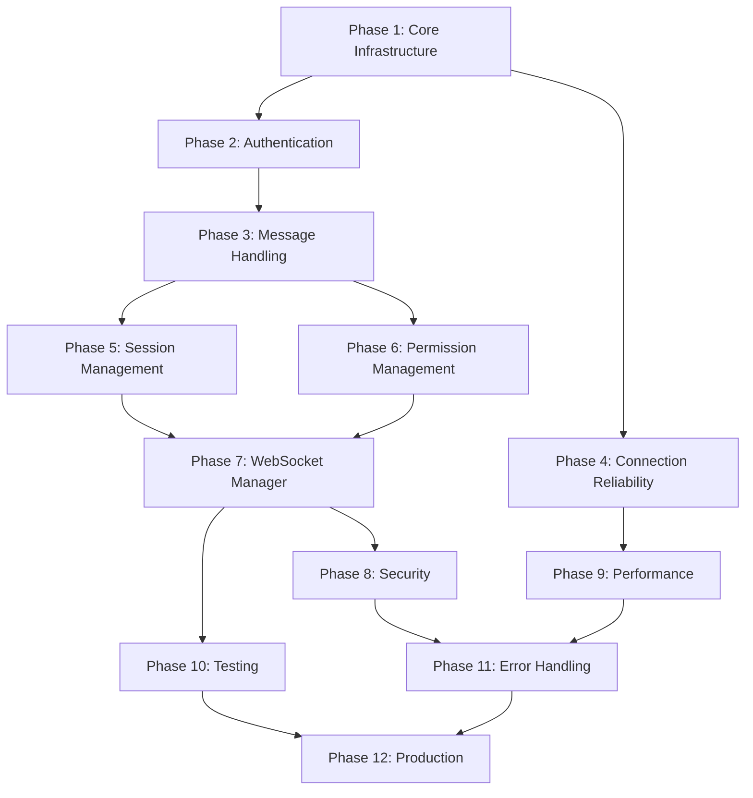

# Communication Layer - Tasks

## Prerequisites

### Required Reading
- [ ] Review `context.md` for business understanding
- [ ] Review `research.md` for technical decisions
- [ ] Review `requirements.md` for all user stories
- [ ] Review `design.md` for implementation approach
- [ ] Review global `architecture.md` for system context

### Development Environment
- [ ] Android Studio configured
- [ ] Kotlin 1.9+ installed
- [ ] Required dependencies available
- [ ] Test devices/emulators ready

### Dependencies
- [ ] Data Layer feature completed (if applicable)

## Implementation Phases

### Phase 1: Core WebSocket Infrastructure

#### Task 1.1: Setup WebSocket Dependencies
- [ ] 1.1 Setup WebSocket Dependencies
  - Add OkHttp WebSocket dependencies to build.gradle
  - Configure ProGuard rules for WebSocket classes
  - Add network permissions to AndroidManifest.xml
  - _Requirements: 1.1, 4.1_

#### Task 1.2: Create Base WebSocket Client
- [ ] 1.2 Create Base WebSocket Client
  - Implement WebSocketListener class
  - Create connection establishment logic
  - Add basic error handling
  - _Requirements: 1.1, 1.2_

#### Task 1.3: Implement Connection State Manager
- [ ] 1.3 Implement Connection State Manager
  - Create ConnectionState sealed class hierarchy
  - Implement state transition logic
  - Add StateFlow for reactive updates
  - _Requirements: 1.3, 4.1, 4.3_

#### Task 1.4: Create Message Protocol Base
- [ ] 1.4 Create Message Protocol Base
  - Define Message base class with serialization
  - Setup Kotlinx.serialization configuration
  - Create basic message types (Command, Response)
  - _Requirements: 2.1, 2.2_

### Phase 2: Authentication System

#### Task 2.1: Implement SSH Key Parser
- [ ] 2.1 Implement SSH Key Parser
  - Add Bouncy Castle dependencies
  - Create private key parsing logic
  - Support RSA, EC, and Ed25519 keys
  - _Requirements: 1.2_

#### Task 2.2: Create Authentication Flow
- [ ] 2.2 Create Authentication Flow
  - Implement AuthChallenge data class
  - Create challenge signing logic
  - Implement AuthResponse generation
  - _Requirements: 1.2, 1.3, 1.4_

#### Task 2.3: Integrate Authentication with WebSocket
- [ ] 2.3 Integrate Authentication with WebSocket
  - Add authentication state management
  - Implement auth timeout handling
  - Create authenticated message channel
  - _Requirements: 1.2, 1.3, 1.4_

#### Task 2.4: Add Security Audit Logging
- [ ] 2.4 Add Security Audit Logging
  - Create SecurityAuditLogger class
  - Log authentication attempts
  - Track permission decisions
  - _Requirements: 3.4, 6.2_

### Phase 3: Message Handling System

#### Task 3.1: Complete Message Protocol Implementation
- [ ] 3.1 Complete Message Protocol Implementation
  - Add all message types from specification
  - Implement polymorphic serialization
  - Add message validation
  - _Requirements: 2.1, 2.2, 2.3, 3.1_

#### Task 3.2: Create Message Handler Registry
- [ ] 3.2 Create Message Handler Registry
  - Implement handler interface
  - Create message type routing
  - Add handler registration system
  - _Requirements: 2.1, 2.2, 3.1_

#### Task 3.3: Implement Core Message Handlers
- [ ] 3.3 Implement Core Message Handlers
  - Create AgentResponseHandler
  - Implement PermissionRequestHandler
  - Add SessionStatusHandler
  - _Requirements: 2.2, 2.3, 3.1, 3.2, 3.3, 3.4, 5.1, 5.2, 5.3_

#### Task 3.4: Setup Message Queue Manager
- [ ] 3.4 Setup Message Queue Manager
  - Create priority queue implementation
  - Add message persistence interface
  - Implement queue draining logic
  - _Requirements: 2.4, 2.5, 4.3, 4.4_

### Phase 4: Connection Reliability

#### Task 4.1: Implement Reconnection Manager
- [ ] 4.1 Implement Reconnection Manager
  - Create exponential backoff calculator
  - Add jitter to prevent thundering herd
  - Implement max attempts logic
  - _Requirements: 4.1, 4.5_

#### Task 4.2: Add Network State Observer
- [ ] 4.2 Add Network State Observer
  - Create ConnectivityManager callback
  - Implement network type detection
  - Add reactive network state flow
  - _Requirements: 4.1, 4.2_

#### Task 4.3: Implement Ping/Pong Monitoring
- [ ] 4.3 Implement Ping/Pong Monitoring
  - Add ping timer with configurable interval
  - Implement pong timeout detection
  - Create adaptive ping intervals
  - _Requirements: 1.5, 5.4_

#### Task 4.4: Create Offline Message Queue
- [ ] 4.4 Create Offline Message Queue
  - Implement persistent storage for messages
  - Add message expiration logic
  - Create queue size limits
  - _Requirements: 2.4, 4.4_

### Phase 5: Session Management

#### Task 5.1: Create Session Manager
- [ ] 5.1 Create Session Manager
  - Define SessionState data class
  - Implement session persistence
  - Add session expiration handling
  - _Requirements: 7.1, 7.2, 7.3_

#### Task 5.2: Implement Session Resumption
- [ ] 5.2 Implement Session Resumption
  - Create resume message protocol
  - Add session validation logic
  - Implement conversation ID tracking
  - _Requirements: 7.1, 7.2, 7.5_

#### Task 5.3: Add Session Repository
- [ ] 5.3 Add Session Repository
  - Create database schema for sessions
  - Implement CRUD operations
  - Add session cleanup logic
  - _Requirements: 7.1, 7.4_

#### Task 5.4: Integrate Session with WebSocket
- [ ] 5.4 Integrate Session with WebSocket
  - Add session ID to auth response
  - Implement auto-resume on connect
  - Handle session expiration
  - _Requirements: 7.1, 7.3, 7.5_

### Phase 6: Permission Management

#### Task 6.1: Create Permission Policy Manager
- [ ] 6.1 Create Permission Policy Manager
  - Define policy data structures
  - Implement policy evaluation logic
  - Add decision caching
  - _Requirements: 6.1, 6.2, 6.3_

#### Task 6.2: Implement Policy Storage
- [ ] 6.2 Implement Policy Storage
  - Create encrypted storage for policies
  - Add policy import/export
  - Implement default policy sets
  - _Requirements: 6.1, 6.4_

#### Task 6.3: Add Permission UI Integration
- [ ] 6.3 Add Permission UI Integration
  - Create permission notification builder
  - Implement quick actions
  - Add permission history view
  - _Requirements: 3.1, 3.2, 3.3_

#### Task 6.4: Implement Timeout Handling
- [ ] 6.4 Implement Timeout Handling
  - Create timeout timer for permissions
  - Apply timeout policies
  - Log timeout decisions
  - _Requirements: 3.5, 6.4_

### Phase 7: WebSocket Manager

#### Task 7.1: Create High-Level Manager
- [ ] 7.1 Create High-Level Manager
  - Implement connection factory
  - Add multi-project support
  - Create connection pooling
  - _Requirements: 1.1, 7.4_

#### Task 7.2: Add Manager API Methods
- [ ] 7.2 Add Manager API Methods
  - Implement sendMessage with routing
  - Add health check functionality
  - Create permission response methods
  - _Requirements: 2.1, 3.4, 5.4_

#### Task 7.3: Integrate with Background Service
- [ ] 7.3 Integrate with Background Service
  - Create service binding interface
  - Add lifecycle management
  - Implement wake lock handling
  - _Requirements: 1.5, 4.3_

#### Task 7.4: Add Connection Monitoring
- [ ] 7.4 Add Connection Monitoring
  - Create connection health metrics
  - Implement quality indicators
  - Add performance tracking
  - _Requirements: 5.4, 5.5_

### Phase 8: Security Enhancements

#### Task 8.1: Implement Certificate Pinning
- [ ] 8.1 Implement Certificate Pinning
  - Create certificate validator
  - Add pinning configuration
  - Implement pin rotation support
  - _Requirements: Security Requirements_

#### Task 8.2: Add Message Encryption
- [ ] 8.2 Add Message Encryption
  - Implement AES-GCM encryption
  - Create key exchange protocol
  - Add encryption performance metrics
  - _Requirements: Security Requirements_

#### Task 8.3: Enhance Audit Logging
- [ ] 8.3 Enhance Audit Logging
  - Add structured logging format
  - Implement log rotation
  - Create audit report generator
  - _Requirements: 6.2_

#### Task 8.4: Security Testing
- [ ] 8.4 Security Testing
  - Perform penetration testing
  - Audit authentication flow
  - Verify encryption implementation
  - _Requirements: Security Requirements_

### Phase 9: Performance Optimization

#### Task 9.1: Implement Message Batching
- [ ] 9.1 Implement Message Batching
  - Create batch accumulator
  - Add batch size limits
  - Implement flush timers
  - _Requirements: Performance Requirements_

#### Task 9.2: Add Connection Pooling
- [ ] 9.2 Add Connection Pooling
  - Implement pool size management
  - Add connection reuse logic
  - Create eviction policies
  - _Requirements: 7.4_

#### Task 9.3: Optimize Battery Usage
- [ ] 9.3 Optimize Battery Usage
  - Implement adaptive strategies
  - Add Doze mode compatibility
  - Create power-save profiles
  - _Requirements: Performance Requirements_

#### Task 9.4: Memory Optimization
- [ ] 9.4 Memory Optimization
  - Add message size limits
  - Implement streaming for large messages
  - Create memory pressure handling
  - _Requirements: Performance Requirements_

### Phase 10: Testing Implementation

#### Task 10.1: Create Unit Test Suite
- [ ] 10.1 Create Unit Test Suite
  - Test message encoding/decoding
  - Verify authentication logic
  - Test reconnection behavior
  - _Requirements: All functional requirements_

#### Task 10.2: Implement Integration Tests
- [ ] 10.2 Implement Integration Tests
  - Create MockWebServer tests
  - Test full connection flows
  - Verify message delivery
  - _Requirements: 1.1, 1.2, 2.1, 2.2_

#### Task 10.3: Add UI Tests
- [ ] 10.3 Add UI Tests
  - Test permission notifications
  - Verify connection status display
  - Test offline mode behavior
  - _Requirements: 1.3, 3.1, 3.2, 5.4_

#### Task 10.4: Performance Testing
- [ ] 10.4 Performance Testing
  - Measure message throughput
  - Test battery impact
  - Verify memory usage
  - _Requirements: Performance Requirements_

### Phase 11: Error Handling & Recovery

#### Task 11.1: Implement Error Classification
- [ ] 11.1 Implement Error Classification
  - Create error type hierarchy
  - Add error severity levels
  - Implement error context capture
  - _Requirements: 1.4, 5.3_

#### Task 11.2: Add Recovery Strategies
- [ ] 11.2 Add Recovery Strategies
  - Implement automatic recovery
  - Add user intervention flows
  - Create fallback mechanisms
  - _Requirements: 4.1, 4.5, 7.5_

#### Task 11.3: Error Reporting
- [ ] 11.3 Error Reporting
  - Create error analytics
  - Add crash reporting integration
  - Implement error rate monitoring
  - _Requirements: Reliability Requirements_

#### Task 11.4: User Error Communication
- [ ] 11.4 User Error Communication
  - Design error UI components
  - Create helpful error messages
  - Add troubleshooting guides
  - _Requirements: 1.4, 2.5, 7.5_

### Phase 12: Production Readiness

#### Task 12.1: Add Monitoring & Metrics
- [ ] 12.1 Add Monitoring & Metrics
  - Implement connection metrics
  - Add message flow tracking
  - Create performance dashboards
  - _Requirements: 5.4, 5.5_

#### Task 12.2: Documentation
- [ ] 12.2 Documentation
  - Write API documentation
  - Create integration guides
  - Document troubleshooting steps
  - _Requirements: All requirements_

#### Task 12.3: Migration Support
- [ ] 12.3 Migration Support
  - Create data migration tools
  - Add backward compatibility
  - Implement version negotiation
  - _Requirements: Compatibility Requirements_

#### Task 12.4: Release Preparation
- [ ] 12.4 Release Preparation
  - Perform security audit
  - Complete performance testing
  - Create release notes
  - _Requirements: All non-functional requirements_

## Task Dependencies

## Estimated Timeline

- **Phase 1-2**: 2 weeks (Core infrastructure and authentication)
- **Phase 3-4**: 2 weeks (Message handling and reliability)
- **Phase 5-6**: 2 weeks (Session and permission management)
- **Phase 7-8**: 2 weeks (Manager and security)
- **Phase 9-10**: 2 weeks (Optimization and testing)
- **Phase 11-12**: 2 weeks (Error handling and production readiness)

**Total Estimated Duration**: 12 weeks

## Risk Mitigation

1. **Technical Risks**
   - SSH key compatibility issues → Early testing with various key formats
   - WebSocket connection stability → Comprehensive reconnection logic
   - Battery drain concerns → Adaptive connection strategies

2. **Schedule Risks**
   - Authentication complexity → Allocate buffer time in Phase 2
   - Testing discoveries → Continuous testing from Phase 1
   - Performance issues → Early performance benchmarks

3. **Integration Risks**
   - Server compatibility → Test against actual Claude Code wrapper
   - Android version differences → Test on multiple API levels
   - Network provider issues → Test on various carriers

## Success Criteria

1. All unit tests passing with >90% coverage
2. Integration tests passing on all supported Android versions
3. Performance benchmarks meeting requirements
4. Security audit passed with no critical issues
5. User acceptance testing completed successfully
6. Documentation reviewed and approved
7. Production metrics meeting SLAs