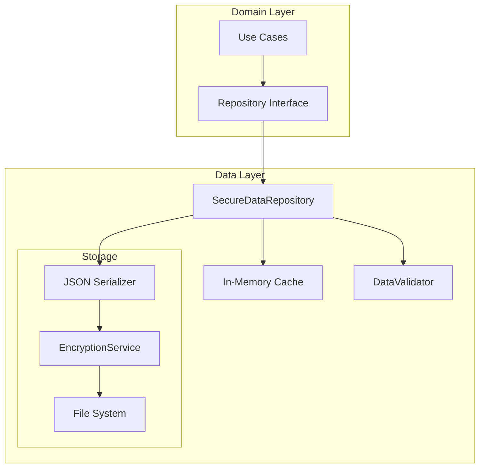
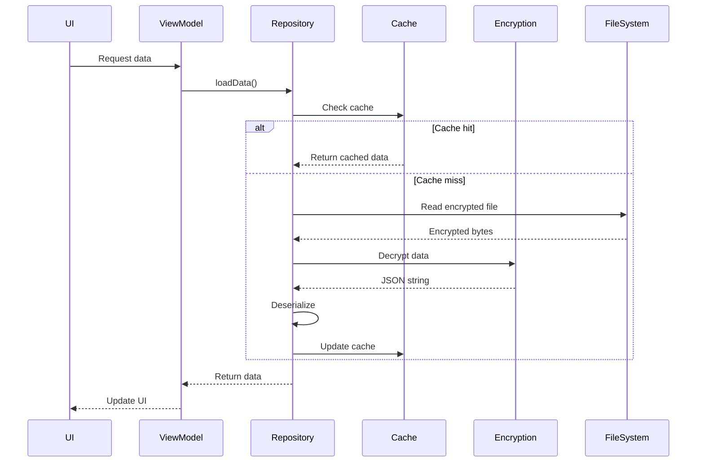
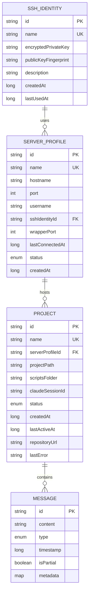

# Data Layer - Design

## Overview

The Data Layer implements a secure, efficient storage solution using encrypted JSON files with in-memory caching. This design prioritizes simplicity, security, and performance for mobile-scale data while providing a clean repository interface that abstracts storage implementation details from the rest of the application.

## Architecture

### Component Structure

**Purpose**: Visualize the layered architecture showing how the Data Layer integrates with Domain Layer through repository interfaces.



### Data Flow

**Purpose**: Illustrate the sequence of operations for data retrieval, showing cache hits and misses with encryption handling.



## Component Specifications

### Data Models

**Purpose**: Define the structure of all persisted entities with validation rules and proper serialization annotations.

```kotlin
package com.pocketagent.data.model

import kotlinx.serialization.Serializable
import java.util.UUID

@Serializable
data class AppData(
    val version: Int = 1,
    val sshIdentities: List<SshIdentity> = emptyList(),
    val serverProfiles: List<ServerProfile> = emptyList(),
    val projects: List<Project> = emptyList(),
    val messages: Map<String, List<Message>> = emptyMap(), // projectId -> messages
    val lastModified: Long = System.currentTimeMillis(),
    val metadata: AppMetadata = AppMetadata()
)

@Serializable
data class AppMetadata(
    val createdAt: Long = System.currentTimeMillis(),
    val deviceId: String = UUID.randomUUID().toString(),
    val backupEnabled: Boolean = true
)

@Serializable
data class SshIdentity(
    val id: String = UUID.randomUUID().toString(),
    val name: String,
    val encryptedPrivateKey: String, // Already encrypted by SshKeyImportManager
    val publicKeyFingerprint: String,
    val description: String? = null,
    val createdAt: Long = System.currentTimeMillis(),
    val lastUsedAt: Long? = null
) {
    init {
        require(name.isNotBlank()) { "SSH Identity name cannot be blank" }
        require(name.length <= 100) { "SSH Identity name too long (max 100 chars)" }
        require(publicKeyFingerprint.matches(Regex("^[A-Fa-f0-9:]+$"))) { 
            "Invalid fingerprint format" 
        }
    }
}

@Serializable
data class ServerProfile(
    val id: String = UUID.randomUUID().toString(),
    val name: String,
    val hostname: String,
    val port: Int = 22,
    val username: String,
    val sshIdentityId: String,
    val wrapperPort: Int = 8080,
    val lastConnectedAt: Long? = null,
    val status: ConnectionStatus = ConnectionStatus.NEVER_CONNECTED,
    val createdAt: Long = System.currentTimeMillis()
) {
    init {
        require(name.isNotBlank()) { "Server profile name cannot be blank" }
        require(hostname.matches(Regex("^[a-zA-Z0-9.-]+$"))) { "Invalid hostname" }
        require(port in 1..65535) { "Port must be between 1 and 65535" }
        require(username.matches(Regex("^[a-zA-Z0-9_-]+$"))) { "Invalid username" }
    }
}

@Serializable
enum class ConnectionStatus {
    NEVER_CONNECTED,
    DISCONNECTED,
    CONNECTING,
    CONNECTED,
    ERROR
}

@Serializable
data class Project(
    val id: String = UUID.randomUUID().toString(),
    val name: String,
    val serverProfileId: String,
    val projectPath: String,
    val scriptsFolder: String = "scripts",
    val claudeSessionId: String? = null,
    val status: ProjectStatus = ProjectStatus.INACTIVE,
    val createdAt: Long = System.currentTimeMillis(),
    val lastActiveAt: Long? = null,
    val repositoryUrl: String? = null,
    val lastError: String? = null
) {
    init {
        require(name.isNotBlank()) { "Project name cannot be blank" }
        require(projectPath.isNotBlank()) { "Project path cannot be blank" }
    }
}

@Serializable
enum class ProjectStatus {
    INACTIVE,
    CONNECTING,
    ACTIVE,
    DISCONNECTED,
    ERROR
}

@Serializable
data class Message(
    val id: String = UUID.randomUUID().toString(),
    val content: String,
    val type: MessageType,
    val timestamp: Long = System.currentTimeMillis(),
    val isPartial: Boolean = false,
    val metadata: Map<String, String> = emptyMap()
)

@Serializable
enum class MessageType {
    USER_INPUT,
    CLAUDE_RESPONSE,
    SYSTEM_MESSAGE,
    ERROR_MESSAGE,
    STATUS_UPDATE
}
```

### Repository Implementation

**Purpose**: Provide secure, thread-safe data persistence with in-memory caching and automatic backup handling.

```kotlin
package com.pocketagent.data.repository

import android.content.Context
import kotlinx.coroutines.Dispatchers
import kotlinx.coroutines.flow.*
import kotlinx.coroutines.sync.Mutex
import kotlinx.coroutines.sync.withLock
import kotlinx.coroutines.withContext
import kotlinx.serialization.json.Json
import java.io.File
import javax.inject.Inject
import javax.inject.Singleton
import dagger.hilt.android.qualifiers.ApplicationContext

@Singleton
class SecureDataRepository @Inject constructor(
    @ApplicationContext private val context: Context,
    private val encryptionService: EncryptionService,
    private val dataValidator: DataValidator
) {
    companion object {
        private const val DATA_FILE_NAME = "app_data.enc"
        private const val BACKUP_FILE_NAME = "app_data_backup.enc"
        private const val MAX_MESSAGES_PER_PROJECT = 1000
    }
    
    private val dataFile = File(context.filesDir, DATA_FILE_NAME)
    private val backupFile = File(context.filesDir, BACKUP_FILE_NAME)
    
    // Thread-safe in-memory cache
    private var cachedData: AppData? = null
    private val mutex = Mutex()
    
    // Observable data flows
    private val _dataFlow = MutableStateFlow<AppData?>(null)
    val dataFlow: StateFlow<AppData?> = _dataFlow.asStateFlow()
    
    private val json = Json {
        ignoreUnknownKeys = true // For backwards compatibility
        prettyPrint = true
        encodeDefaults = true
    }
    
    /**
     * Initialize repository and load data
     */
    suspend fun initialize() = withContext(Dispatchers.IO) {
        mutex.withLock {
            loadDataInternal()?.let { data ->
                cachedData = data
                _dataFlow.emit(data)
            }
        }
    }
    
    /**
     * Load data from encrypted file
     */
    suspend fun loadData(): AppData = withContext(Dispatchers.IO) {
        mutex.withLock {
            cachedData ?: loadDataInternal() ?: AppData()
        }
    }
    
    private suspend fun loadDataInternal(): AppData? {
        if (!dataFile.exists()) {
            // Check for backup
            if (backupFile.exists()) {
                backupFile.copyTo(dataFile, overwrite = true)
            } else {
                return null
            }
        }
        
        return try {
            val encryptedData = dataFile.readBytes()
            val decryptedJson = encryptionService.decrypt(
                encryptedData = encryptedData,
                keyAlias = "app_data_key"
            )
            json.decodeFromString(AppData.serializer(), decryptedJson.decodeToString())
        } catch (e: Exception) {
            // Try backup if main file is corrupted
            if (backupFile.exists()) {
                val backupData = backupFile.readBytes()
                val decryptedBackup = encryptionService.decrypt(backupData, "app_data_key")
                json.decodeFromString(AppData.serializer(), decryptedBackup.decodeToString())
            } else {
                throw DataException.CorruptedDataException("Failed to load data", e)
            }
        }
    }
    
    /**
     * Save data to encrypted file with atomic operations
     */
    suspend fun saveData(data: AppData) = withContext(Dispatchers.IO) {
        mutex.withLock {
            // Validate before saving
            dataValidator.validateAppData(data)
            
            // Create backup of current file
            if (dataFile.exists()) {
                dataFile.copyTo(backupFile, overwrite = true)
            }
            
            try {
                val jsonString = json.encodeToString(AppData.serializer(), data)
                val encrypted = encryptionService.encrypt(
                    data = jsonString.toByteArray(),
                    keyAlias = "app_data_key"
                )
                
                // Write to temporary file first
                val tempFile = File(context.filesDir, "${DATA_FILE_NAME}.tmp")
                tempFile.writeBytes(encrypted)
                
                // Atomic rename
                tempFile.renameTo(dataFile)
                
                // Update cache
                cachedData = data
                _dataFlow.emit(data)
                
            } catch (e: Exception) {
                // Restore from backup on failure
                backupFile.copyTo(dataFile, overwrite = true)
                throw DataException.SaveFailedException("Failed to save data", e)
            }
        }
    }
    
    // Additional CRUD operations follow similar pattern...
}
```

### Data Validator

**Purpose**: Ensure data integrity and enforce business rules through comprehensive validation checks.

```kotlin
package com.pocketagent.data.repository

import javax.inject.Inject
import javax.inject.Singleton

@Singleton
class DataValidator @Inject constructor() {
    
    fun validateAppData(data: AppData) {
        // Check for duplicate names
        val identityNames = data.sshIdentities.map { it.name }
        require(identityNames.size == identityNames.toSet().size) { 
            "Duplicate SSH identity names found" 
        }
        
        val serverNames = data.serverProfiles.map { it.name }
        require(serverNames.size == serverNames.toSet().size) { 
            "Duplicate server profile names found" 
        }
        
        val projectNames = data.projects.map { it.name }
        require(projectNames.size == projectNames.toSet().size) { 
            "Duplicate project names found" 
        }
        
        // Validate relationships
        val identityIds = data.sshIdentities.map { it.id }.toSet()
        data.serverProfiles.forEach { server ->
            require(server.sshIdentityId in identityIds) {
                "Server '${server.name}' references non-existent SSH identity"
            }
        }
        
        val serverIds = data.serverProfiles.map { it.id }.toSet()
        data.projects.forEach { project ->
            require(project.serverProfileId in serverIds) {
                "Project '${project.name}' references non-existent server profile"
            }
        }
    }
    
    fun validateSshIdentity(identity: SshIdentity) {
        require(identity.name.length in 1..100) { "Name must be 1-100 characters" }
        require(identity.encryptedPrivateKey.isNotEmpty()) { "Private key cannot be empty" }
        require(identity.publicKeyFingerprint.matches(Regex("^[A-Fa-f0-9:]+$"))) {
            "Invalid fingerprint format"
        }
    }
    
    fun validateServerProfile(profile: ServerProfile) {
        require(profile.name.length in 1..100) { "Name must be 1-100 characters" }
        require(profile.hostname.matches(Regex("^[a-zA-Z0-9.-]+$"))) { "Invalid hostname format" }
        require(profile.port in 1..65535) { "Port must be between 1 and 65535" }
        require(profile.wrapperPort in 1..65535) { "Wrapper port must be between 1 and 65535" }
        require(profile.username.matches(Regex("^[a-zA-Z0-9_-]+$"))) { "Invalid username format" }
    }
    
    fun validateProject(project: Project) {
        require(project.name.length in 1..100) { "Name must be 1-100 characters" }
        require(project.projectPath.isNotBlank()) { "Project path cannot be blank" }
        require(!project.projectPath.contains("..")) { "Project path cannot contain .." }
        project.repositoryUrl?.let { url ->
            require(url.matches(Regex("^https?://.*$"))) { "Invalid repository URL" }
        }
    }
}
```

### Query Extensions

**Purpose**: Provide efficient in-memory query operations as extension functions for common data access patterns.

```kotlin
package com.pocketagent.data.repository

import kotlinx.coroutines.flow.Flow
import kotlinx.coroutines.flow.filterNotNull
import kotlinx.coroutines.flow.map

// Extension functions for common queries
suspend fun SecureDataRepository.getProjectsForServer(serverId: String): List<Project> =
    loadData().projects.filter { it.serverProfileId == serverId }

suspend fun SecureDataRepository.getServerProfilesForIdentity(identityId: String): List<ServerProfile> =
    loadData().serverProfiles.filter { it.sshIdentityId == identityId }

suspend fun SecureDataRepository.searchProjects(query: String): List<Project> =
    loadData().projects.filter { 
        it.name.contains(query, ignoreCase = true) ||
        it.projectPath.contains(query, ignoreCase = true)
    }

suspend fun SecureDataRepository.getRecentProjects(limit: Int = 5): List<Project> =
    loadData().projects
        .filter { it.lastActiveAt != null }
        .sortedByDescending { it.lastActiveAt }
        .take(limit)

suspend fun SecureDataRepository.getActiveProjects(): List<Project> =
    loadData().projects.filter { it.status == ProjectStatus.ACTIVE }

// Observable flows
fun SecureDataRepository.observeSshIdentities(): Flow<List<SshIdentity>> =
    dataFlow.filterNotNull().map { it.sshIdentities }

fun SecureDataRepository.observeServerProfiles(): Flow<List<ServerProfile>> =
    dataFlow.filterNotNull().map { it.serverProfiles }

fun SecureDataRepository.observeProjects(): Flow<List<Project>> =
    dataFlow.filterNotNull().map { it.projects }

fun SecureDataRepository.observeProject(projectId: String): Flow<Project?> =
    dataFlow.filterNotNull().map { data ->
        data.projects.find { it.id == projectId }
    }

fun SecureDataRepository.observeProjectMessages(projectId: String): Flow<List<Message>> =
    dataFlow.filterNotNull().map { data ->
        data.messages[projectId] ?: emptyList()
    }
```

## Data Models

### Entity Relationships

**Purpose**: Document the relational structure between SSH identities, server profiles, projects, and messages.



## API Specifications

### Repository Interface

**Purpose**: Define the contract for data operations that all repository implementations must follow.

```kotlin
interface DataRepository {
    // Initialization
    suspend fun initialize()
    suspend fun unlockWithBiometric(activity: FragmentActivity): Boolean
    
    // SSH Identity operations
    suspend fun getAllSshIdentities(): List<SshIdentity>
    suspend fun getSshIdentityById(id: String): SshIdentity?
    suspend fun addSshIdentity(identity: SshIdentity)
    suspend fun updateSshIdentity(identity: SshIdentity)
    suspend fun deleteSshIdentity(id: String)
    
    // Server Profile operations
    suspend fun getAllServerProfiles(): List<ServerProfile>
    suspend fun getServerProfileById(id: String): ServerProfile?
    suspend fun addServerProfile(profile: ServerProfile)
    suspend fun updateServerProfile(profile: ServerProfile)
    suspend fun deleteServerProfile(id: String)
    
    // Project operations
    suspend fun getAllProjects(): List<Project>
    suspend fun getProjectById(id: String): Project?
    suspend fun addProject(project: Project)
    suspend fun updateProject(project: Project)
    suspend fun deleteProject(id: String)
    
    // Message operations
    suspend fun getProjectMessages(projectId: String, limit: Int = 100): List<Message>
    suspend fun addMessage(projectId: String, message: Message)
    suspend fun clearProjectMessages(projectId: String)
    
    // Utility operations
    suspend fun exportData(): String
    suspend fun importData(jsonData: String)
    suspend fun clearAllData()
    
    // Observable flows
    val dataFlow: StateFlow<AppData?>
}
```

## Error Handling Strategy

### Exception Hierarchy

**Purpose**: Establish a structured exception hierarchy for handling various data layer error scenarios.

```kotlin
sealed class DataException(message: String, cause: Throwable? = null) : Exception(message, cause) {
    class DuplicateNameException(message: String) : DataException(message)
    class ConstraintViolationException(message: String) : DataException(message)
    class CorruptedDataException(message: String, cause: Throwable) : DataException(message, cause)
    class SaveFailedException(message: String, cause: Throwable) : DataException(message, cause)
    class ValidationException(message: String) : DataException(message)
    class EncryptionException(message: String, cause: Throwable) : DataException(message, cause)
}
```

### Recovery Strategies

1. **Corrupted Data**: Automatic restore from backup file
2. **Save Failure**: Retry with exponential backoff, restore from backup if needed
3. **Validation Failure**: Return specific error message to user
4. **Encryption Failure**: Prompt for biometric re-authentication

## Security Considerations

### Encryption Strategy
- All data encrypted with AES-256-GCM before storage
- Encryption keys stored in Android Keystore
- Unique IV generated for each encryption operation
- Keys require biometric authentication for access

### Data Protection
- SSH private keys double-encrypted (app level + storage level)
- Sensitive data cleared from memory after use
- No logging of sensitive information
- Backup files also encrypted

### Access Control
- Repository requires biometric unlock on app start
- Operations validate user authentication state
- Timeout after 5 minutes of inactivity

## Performance Considerations

### Caching Strategy
- Entire dataset loaded into memory after biometric unlock
- All queries operate on in-memory data
- Changes immediately reflected in cache
- Write-through to encrypted storage

### Optimization Techniques
- Lazy loading on app start
- Atomic file operations prevent corruption
- Message trimming prevents unbounded growth
- Efficient JSON serialization with Kotlinx

### Memory Management
- Maximum 1000 messages per project
- Estimated memory usage: ~50MB for full dataset
- Graceful degradation under memory pressure
- Background app releases non-essential data

## Testing Strategy

### Unit Tests
- Mock encryption service for deterministic testing
- Validate all CRUD operations
- Test constraint violations
- Verify data validation rules
- Test concurrent access scenarios

### Integration Tests
- Test actual file persistence
- Verify encryption/decryption roundtrip
- Test backup and restore functionality
- Validate data migration scenarios
- Test memory pressure handling

### Performance Tests
- Measure operation latency
- Test with maximum dataset size
- Verify query performance
- Monitor memory usage
- Test concurrent access performance