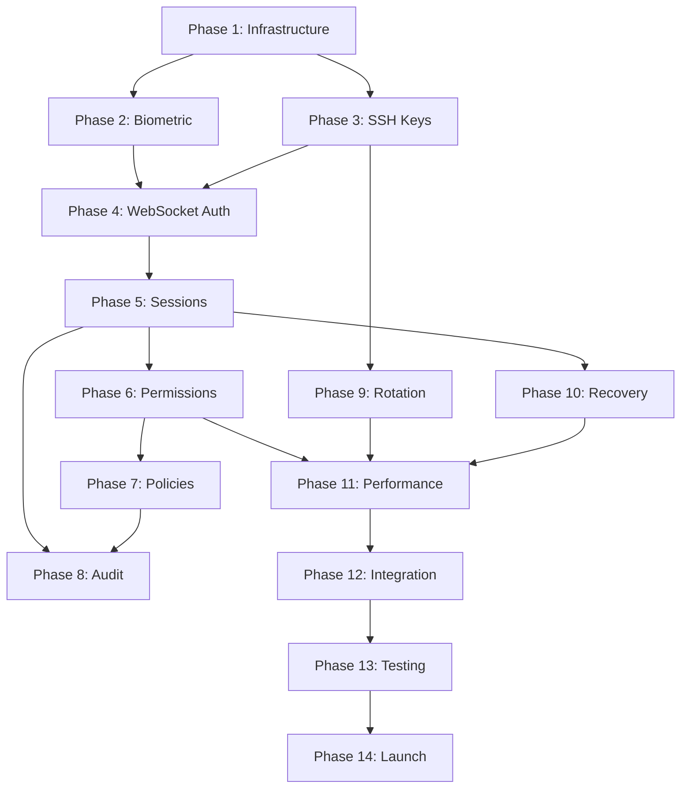

# Security Authentication - Tasks

## Prerequisites

### Required Reading
- [ ] Review `context.md` for business understanding
- [ ] Review `research.md` for technical decisions
- [ ] Review `requirements.md` for all user stories
- [ ] Review `design.md` for implementation approach
- [ ] Review global `architecture.md` for system context

### Development Environment
- [ ] Android Studio configured
- [ ] Kotlin 1.9+ installed
- [ ] Required dependencies available
- [ ] Test devices/emulators ready

### Dependencies
- [ ] Data Layer feature completed (if applicable)

## Implementation Phases

### Phase 1: Core Security Infrastructure

- [ ] 1.1 Setup Android Keystore Integration
  - Configure Keystore provider initialization
  - Create KeyGenerator and KeyStore instances
  - Implement key alias management
  - Add StrongBox detection and fallback
  - _Requirements: 1.3_

- [ ] 1.2 Create CryptoManager
  - Implement AES-GCM encryption/decryption
  - Add secure random IV generation
  - Create key derivation functions
  - Implement secure memory clearing
  - _Requirements: 2.5, 3.3_

- [ ] 1.3 Implement Secure Storage
  - Set up EncryptedSharedPreferences
  - Create encrypted Room database
  - Implement secure file storage
  - Add data migration from unencrypted storage
  - _Requirements: 2.5, 3.3_

- [ ] 1.4 Create Security Hardening Module
  - Implement root detection
  - Add debugger detection
  - Enable screenshot prevention
  - Create app signature verification
  - _Requirements: 1.3_

### Phase 2: Biometric Authentication

- [ ] 2.1 Create BiometricAuthManager
  - Implement BiometricPrompt integration
  - Add hardware capability detection
  - Create authentication callbacks
  - Handle biometric enrollment state
  - _Requirements: 1.1, 1.2, 1.4_

- [ ] 2.2 Implement Crypto-Object Binding
  - Create cipher initialization for biometrics
  - Implement key-biometric binding
  - Add authentication validity duration
  - Handle cipher exceptions
  - _Requirements: 1.3_

- [ ] 2.3 Create Biometric UI Components
  - Design biometric prompt dialogs
  - Implement fallback to device credentials
  - Add enrollment guidance UI
  - Create success/failure animations
  - _Requirements: 1.1, 1.5_

- [ ] 2.4 Implement Biometric Settings
  - Create biometric preference screen
  - Add enable/disable toggles
  - Implement re-enrollment detection
  - Show biometric type and status
  - _Requirements: 7.1, 7.2_

### Phase 3: SSH Key Management

- [ ] 3.1 Create SSH Key Parser
  - Implement OpenSSH format parser
  - Add RSA key parsing
  - Implement Ed25519 support
  - Handle encrypted private keys
  - _Requirements: 2.3, 2.4_

- [ ] 3.2 Implement Key Import UI
  - Create import method selection
  - Implement QR code scanner
  - Add file picker integration
  - Create paste from clipboard option
  - _Requirements: 2.1, 2.2, 2.3_

- [ ] 3.3 Build Secure Key Storage
  - Encrypt private keys with master key
  - Store public keys and metadata
  - Implement key fingerprint calculation
  - Add key usage tracking
  - _Requirements: 2.5_

- [ ] 3.4 Create Key Management UI
  - Design key list screen
  - Add key detail view
  - Implement key deletion
  - Show key usage statistics
  - _Requirements: 8.1, 8.2_

### Phase 4: WebSocket Authentication

- [ ] 4.1 Implement SSH Authentication Protocol
  - Create challenge-response handler
  - Implement signature generation
  - Add nonce validation
  - Handle authentication timeouts
  - _Requirements: 3.1, 3.2_

- [ ] 4.2 Create WebSocketAuthenticator
  - Build authentication state machine
  - Implement retry logic
  - Add connection encryption
  - Create session establishment
  - _Requirements: 3.3, 3.4, 3.5_

- [ ] 4.3 Implement Certificate Pinning
  - Add certificate pins
  - Create pin rotation mechanism
  - Handle pin failures
  - Add backup pins
  - _Requirements: 3.1_

- [ ] 4.4 Build Connection Security
  - Implement TLS 1.3 configuration
  - Add cipher suite selection
  - Create secure headers
  - Handle security exceptions
  - _Requirements: 3.1_

### Phase 5: Session Management

- [ ] 5.1 Create SessionAuthManager
  - Implement session lifecycle
  - Add token management
  - Create heartbeat mechanism
  - Handle session expiration
  - _Requirements: 3.3, 3.5, 3.6_

- [ ] 5.2 Build Token Vault
  - Implement secure token storage
  - Add token encryption/decryption
  - Create token rotation logic
  - Handle token revocation
  - _Requirements: 3.3, 5.4_

- [ ] 5.3 Implement Session Persistence
  - Store active sessions
  - Add crash recovery
  - Implement session backup
  - Create migration logic
  - _Requirements: 3.6, 5.1_

- [ ] 5.4 Create Session UI
  - Design active sessions list
  - Add session detail view
  - Implement revoke controls
  - Show session activity
  - _Requirements: 5.1, 5.2, 5.3, 5.5, 5.6_

### Phase 6: Permission Verification

- [ ] 6.1 Create PermissionVerifier
  - Implement signature verification
  - Add timestamp validation
  - Create request parsing
  - Handle malformed requests
  - _Requirements: 4.1_

- [ ] 6.2 Build Risk Assessment
  - Define risk calculation logic
  - Implement operation categorization
  - Add contextual risk factors
  - Create risk level thresholds
  - _Requirements: 4.4_

- [ ] 6.3 Implement Permission UI
  - Design permission dialog
  - Add risk level indicators
  - Create action descriptions
  - Implement quick actions
  - _Requirements: 4.1, 4.2, 4.3, 4.4, 4.6_

- [ ] 6.4 Create Permission History
  - Store permission decisions
  - Build history UI
  - Add search and filters
  - Implement bulk operations
  - _Requirements: 6.1, 6.2, 6.3, 6.6_

### Phase 7: Security Policies

- [ ] 7.1 Create PolicyManager
  - Implement policy engine
  - Add policy evaluation
  - Create default policies
  - Handle policy conflicts
  - _Requirements: 7.1, 7.4_

- [ ] 7.2 Build Policy Types
  - Implement tool-based policies
  - Add time-based restrictions
  - Create risk-based policies
  - Add frequency limiters
  - _Requirements: 7.2, 7.3_

- [ ] 7.3 Design Policy UI
  - Create policy list screen
  - Add policy editor
  - Implement policy templates
  - Show policy effects
  - _Requirements: 7.1, 7.2, 7.4_

- [ ] 7.4 Implement Policy Import/Export
  - Create policy serialization
  - Add validation logic
  - Implement conflict resolution
  - Build sharing mechanism
  - _Requirements: 7.6, 10.1, 10.2, 10.3_

### Phase 8: Audit Logging

- [ ] 8.1 Create AuditLogger
  - Implement event logging
  - Add event categorization
  - Create metadata capture
  - Handle log rotation
  - _Requirements: 6.1, 6.2_

- [ ] 8.2 Build Audit Database
  - Design audit schema
  - Implement efficient storage
  - Add indexing strategy
  - Create cleanup jobs
  - _Requirements: 6.5_

- [ ] 8.3 Implement Audit UI
  - Create audit log viewer
  - Add filtering and search
  - Implement event details
  - Build export functionality
  - _Requirements: 6.1, 6.2, 6.3, 6.4, 6.6_

- [ ] 8.4 Add Security Alerts
  - Implement anomaly detection
  - Create alert thresholds
  - Add notification system
  - Build alert management
  - _Requirements: 5.5, 9.3_

### Phase 9: Key Rotation

- [ ] 9.1 Implement Rotation Logic
  - Create key age tracking
  - Add rotation scheduling
  - Implement key generation
  - Handle rotation failures
  - _Requirements: 8.1, 8.3, 8.6_

- [ ] 9.2 Build Rotation UI
  - Add rotation reminders
  - Create rotation wizard
  - Show rotation history
  - Implement bulk rotation
  - _Requirements: 8.1, 8.2_

- [ ] 9.3 Server Coordination
  - Implement key update protocol
  - Add rollback mechanism
  - Create transition period
  - Handle partial updates
  - _Requirements: 8.5_

- [ ] 9.4 Archive Management
  - Store rotated keys
  - Implement secure deletion
  - Add recovery options
  - Create archive viewer
  - _Requirements: 8.4_

### Phase 10: Recovery Mechanisms

- [ ] 10.1 Implement Device Recovery
  - Create device registration
  - Add remote revocation
  - Build recovery protocol
  - Handle device conflicts
  - _Requirements: 9.1, 9.2, 9.5_

- [ ] 10.2 Build Recovery UI
  - Design device list
  - Add revocation controls
  - Create recovery wizard
  - Show device status
  - _Requirements: 9.1, 9.2, 9.6_

- [ ] 10.3 Emergency Access
  - Implement lockout override
  - Create recovery codes
  - Add emergency contacts
  - Build access restoration
  - _Requirements: 9.4_

- [ ] 10.4 Backup Systems
  - Create encrypted backups
  - Implement cloud sync
  - Add local backup
  - Build restore functionality
  - _Requirements: 10.1, 10.3, 10.4_

### Phase 11: Performance Optimization

- [ ] 11.1 Optimize Crypto Operations
  - Implement operation caching
  - Add parallel processing
  - Create batch operations
  - Optimize memory usage
  - _Requirements: Performance Requirements_

- [ ] 11.2 Biometric Pre-warming
  - Implement cipher pre-creation
  - Add predictive loading
  - Create resource pooling
  - Optimize UI transitions
  - _Requirements: 4.5_

- [ ] 11.3 Session Optimization
  - Implement connection pooling
  - Add request batching
  - Create efficient heartbeats
  - Optimize token refresh
  - _Requirements: 3.5, 3.6_

- [ ] 11.4 Database Optimization
  - Add query optimization
  - Implement data pruning
  - Create efficient indices
  - Optimize encryption overhead
  - _Requirements: 6.5_

### Phase 12: Integration

- [ ] 12.1 Integrate with Main App
  - Connect to navigation
  - Add deep linking
  - Implement state sharing
  - Create unified UI
  - _Requirements: All UI stories_

- [ ] 12.2 Server Integration
  - Implement API contracts
  - Add version negotiation
  - Create fallback modes
  - Handle compatibility
  - _Requirements: 3.1, 3.2, 3.3_

- [ ] 12.3 Third-party Integration
  - Add crash reporting hooks
  - Implement analytics
  - Create security vendors API
  - Add compliance tools
  - _Requirements: Compliance Requirements_

- [ ] 12.4 Testing Integration
  - Create test harnesses
  - Add mock services
  - Implement test data
  - Build CI/CD hooks
  - _Requirements: All test requirements_

### Phase 13: Security Testing

- [ ] 13.1 Unit Testing
  - Test crypto operations
  - Verify key management
  - Test policy engine
  - Validate audit logging
  - _Requirements: Security Requirements_

- [ ] 13.2 Integration Testing
  - Test authentication flows
  - Verify session management
  - Test permission system
  - Validate recovery mechanisms
  - _Requirements: All stories_

- [ ] 13.3 Security Testing
  - Perform penetration testing
  - Run static analysis
  - Execute dynamic analysis
  - Conduct code review
  - _Requirements: Security Requirements_

- [ ] 13.4 Performance Testing
  - Measure crypto performance
  - Test under load
  - Verify memory usage
  - Profile battery impact
  - _Requirements: Performance Requirements_

### Phase 14: Documentation and Launch

- [ ] 14.1 User Documentation
  - Write setup guides
  - Create security guides
  - Document best practices
  - Add troubleshooting
  - _Requirements: All stories_

- [ ] 14.2 Developer Documentation
  - Document APIs
  - Create integration guides
  - Add security guidelines
  - Write migration guides
  - _Requirements: All technical requirements_

- [ ] 14.3 Compliance Documentation
  - Create security audit docs
  - Document compliance
  - Add certification docs
  - Build assessment guides
  - _Requirements: Compliance Requirements_

- [ ] 14.4 Launch Preparation
  - Final security review
  - Performance validation
  - User acceptance testing
  - Production deployment
  - _Requirements: Success Metrics_

## Task Dependencies

## Estimated Timeline

- **Phase 1**: 2 weeks (Foundation)
- **Phase 2-3**: 2 weeks (Authentication)
- **Phase 4-5**: 2 weeks (Connections)
- **Phase 6-7**: 2 weeks (Permissions)
- **Phase 8-9**: 1 week (Audit & Rotation)
- **Phase 10**: 1 week (Recovery)
- **Phase 11**: 1 week (Optimization)
- **Phase 12**: 1 week (Integration)
- **Phase 13**: 2 weeks (Testing)
- **Phase 14**: 1 week (Documentation)

**Total Estimated Duration**: 15 weeks

## Risk Mitigation

1. **Technical Risks**
   - Keystore compatibility issues → Implement fallbacks
   - Biometric hardware variations → Test on multiple devices
   - Performance bottlenecks → Early profiling and optimization

2. **Security Risks**
   - Zero-day vulnerabilities → Regular security updates
   - Key compromise → Hardware binding and rotation
   - Session hijacking → Multi-factor verification

3. **User Experience Risks**
   - Complex setup → Guided wizards
   - Authentication fatigue → Smart caching
   - Recovery difficulties → Multiple recovery options

## Success Criteria

1. All biometric operations complete in <2 seconds
2. Zero security incidents during beta testing
3. 95% of users successfully complete setup
4. All cryptographic operations use hardware security
5. Complete audit trail for all security events
6. Successful penetration test with no critical findings
7. Performance benchmarks meet or exceed requirements