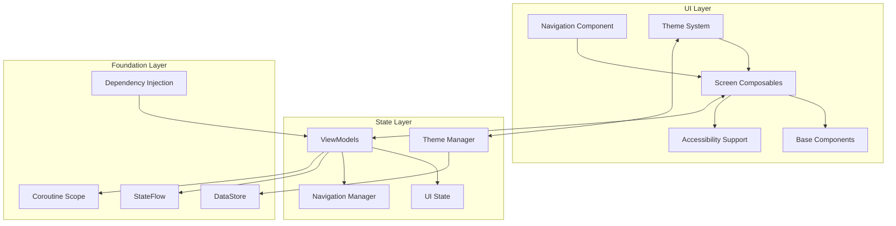
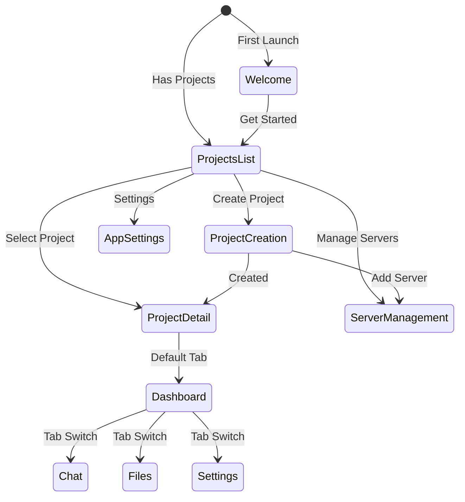
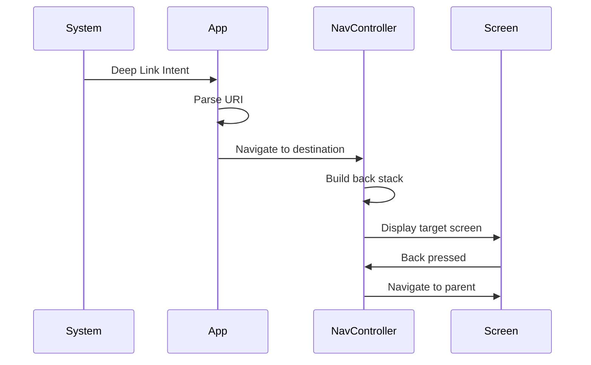

# UI Navigation Foundation - Design

## Architecture Overview

The UI Navigation Foundation implements a modern Android architecture using Jetpack Compose for the UI layer, Navigation Compose for routing, and Material Design 3 for the design system. The architecture follows the single-activity pattern with composable screens, providing a consistent and performant user experience.

### Core Design Principles

1. **Declarative UI**: Everything is a composable function
2. **Unidirectional Data Flow**: State flows down, events flow up  
3. **Composition over Inheritance**: Build complex UI from simple parts
4. **Single Source of Truth**: Each piece of state has one owner
5. **Immutable State**: All UI state is immutable data classes

### System Architecture



## Component Specifications

### 1. Navigation Architecture

**Purpose**: Provides type-safe, hierarchical navigation with deep linking support

```kotlin
package com.pocket.agent.ui.navigation

import androidx.compose.animation.fadeIn
import androidx.compose.animation.fadeOut
import androidx.compose.animation.slideInHorizontally
import androidx.compose.animation.slideOutHorizontally
import androidx.compose.runtime.Composable
import androidx.navigation.NavHostController
import androidx.navigation.compose.NavHost
import androidx.navigation.compose.composable
import androidx.navigation.compose.rememberNavController
import com.pocket.agent.ui.screens.Screen
import com.pocket.agent.ui.screens.ProjectDetailScreen
import com.pocket.agent.ui.screens.ProjectsListScreen
import com.pocket.agent.ui.screens.WelcomeScreen

@Composable
fun AppNavigation(
    navController: NavHostController = rememberNavController(),
    startDestination: Screen = Screen.Welcome
) {
    // Handle deep links
    HandleDeepLinks(navController)
    
    // Observe navigation events
    val navigationManager = LocalNavigationManager.current
    ObserveAsEvents(navigationManager.navigationEvents) { event ->
        when (event) {
            is NavigationEvent.NavigateToProject -> {
                navController.navigate(Screen.ProjectDetail(event.projectId))
            }
            is NavigationEvent.NavigateBack -> {
                navController.popBackStack()
            }
            // Handle other navigation events
        }
    }
    
    NavHost(
        navController = navController,
        startDestination = startDestination,
        enterTransition = { slideInHorizontally { it / 4 } + fadeIn() },
        exitTransition = { slideOutHorizontally { -it / 4 } + fadeOut() }
    ) {
        // Screen definitions
        composable<Screen.Welcome> {
            WelcomeScreen(
                onNavigateToProjects = {
                    navController.navigate(Screen.ProjectsList) {
                        popUpTo(Screen.Welcome) { inclusive = true }
                    }
                }
            )
        }
        
        composable<Screen.ProjectsList> {
            ProjectsListScreen(
                onNavigateToProject = { projectId ->
                    navController.navigate(Screen.ProjectDetail(projectId))
                }
            )
        }
        
        // Nested navigation for project detail
        composable<Screen.ProjectDetail> { backStackEntry ->
            val args = backStackEntry.toRoute<Screen.ProjectDetail>()
            ProjectDetailScreen(
                projectId = args.projectId,
                onNavigateBack = { navController.popBackStack() }
            )
        }
    }
}
```

### 2. Theme System Architecture

**Purpose**: Implements Material Design 3 with dynamic color support and persistence

```kotlin
package com.pocket.agent.ui.theme

import android.os.Build
import androidx.compose.foundation.isSystemInDarkTheme
import androidx.compose.material3.ColorScheme
import androidx.compose.material3.MaterialTheme
import androidx.compose.material3.darkColorScheme
import androidx.compose.material3.dynamicDarkColorScheme
import androidx.compose.material3.dynamicLightColorScheme
import androidx.compose.material3.lightColorScheme
import androidx.compose.runtime.Composable
import androidx.compose.runtime.CompositionLocalProvider
import androidx.compose.runtime.SideEffect
import androidx.compose.runtime.remember
import androidx.compose.ui.graphics.Color
import androidx.compose.ui.platform.LocalContext
import com.google.accompanist.systemuicontroller.rememberSystemUiController

@Composable
fun PocketAgentTheme(
    themeConfig: ThemeConfig = rememberThemeConfig(),
    content: @Composable () -> Unit
) {
    val colorScheme = rememberColorScheme(themeConfig)
    
    CompositionLocalProvider(
        LocalThemeConfig provides themeConfig
    ) {
        MaterialTheme(
            colorScheme = colorScheme,
            typography = PocketAgentTypography,
            shapes = PocketAgentShapes,
            content = {
                // Handle system UI
                val systemUiController = rememberSystemUiController()
                val useDarkIcons = !themeConfig.isDark()
                
                SideEffect {
                    systemUiController.setSystemBarsColor(
                        color = Color.Transparent,
                        darkIcons = useDarkIcons
                    )
                }
                
                content()
            }
        )
    }
}

@Composable
private fun rememberColorScheme(themeConfig: ThemeConfig): ColorScheme {
    val context = LocalContext.current
    
    return remember(themeConfig) {
        when {
            themeConfig.useDynamicColor && Build.VERSION.SDK_INT >= 31 -> {
                if (themeConfig.isDark()) {
                    dynamicDarkColorScheme(context)
                } else {
                    dynamicLightColorScheme(context)
                }
            }
            themeConfig.isDark() -> darkColorScheme(
                primary = PocketAgentColors.PrimaryGreenDark,
                surface = PocketAgentColors.SurfaceDark
            )
            else -> lightColorScheme(
                primary = PocketAgentColors.PrimaryGreenLight,
                surface = PocketAgentColors.SurfaceLight
            )
        }
    }
}
```

### 3. Base Component Library

**Purpose**: Provides reusable UI components with consistent styling and behavior

```kotlin
package com.pocket.agent.ui.components

import androidx.compose.animation.AnimatedContent
import androidx.compose.animation.core.tween
import androidx.compose.animation.fadeIn
import androidx.compose.animation.fadeOut
import androidx.compose.animation.togetherWith
import androidx.compose.foundation.interaction.MutableInteractionSource
import androidx.compose.foundation.layout.Arrangement
import androidx.compose.foundation.layout.Row
import androidx.compose.foundation.layout.Spacer
import androidx.compose.foundation.layout.height
import androidx.compose.foundation.layout.size
import androidx.compose.foundation.layout.width
import androidx.compose.material3.Button
import androidx.compose.material3.ButtonDefaults
import androidx.compose.material3.CircularProgressIndicator
import androidx.compose.material3.Icon
import androidx.compose.material3.MaterialTheme
import androidx.compose.material3.Text
import androidx.compose.runtime.Composable
import androidx.compose.runtime.remember
import androidx.compose.ui.Alignment
import androidx.compose.ui.Modifier
import androidx.compose.ui.graphics.vector.ImageVector
import androidx.compose.ui.semantics.contentDescription
import androidx.compose.ui.semantics.semantics
import androidx.compose.ui.unit.dp

// Component composition pattern
@Composable
fun PrimaryActionButton(
    text: String,
    onClick: () -> Unit,
    modifier: Modifier = Modifier,
    enabled: Boolean = true,
    loading: Boolean = false,
    icon: ImageVector? = null
) {
    val interactionSource = remember { MutableInteractionSource() }
    
    Button(
        onClick = onClick,
        modifier = modifier
            .height(48.dp)
            .semantics {
                if (loading) {
                    contentDescription = "$text, loading"
                }
            },
        enabled = enabled && !loading,
        interactionSource = interactionSource,
        elevation = ButtonDefaults.buttonElevation(
            defaultElevation = 2.dp,
            pressedElevation = 8.dp
        )
    ) {
        AnimatedContent(
            targetState = loading,
            transitionSpec = {
                fadeIn(animationSpec = tween(150)) togetherWith
                fadeOut(animationSpec = tween(150))
            }
        ) { isLoading ->
            if (isLoading) {
                CircularProgressIndicator(
                    modifier = Modifier.size(20.dp),
                    color = MaterialTheme.colorScheme.onPrimary,
                    strokeWidth = 2.dp
                )
            } else {
                Row(
                    horizontalArrangement = Arrangement.Center,
                    verticalAlignment = Alignment.CenterVertically
                ) {
                    icon?.let {
                        Icon(
                            imageVector = it,
                            contentDescription = null,
                            modifier = Modifier.size(20.dp)
                        )
                        Spacer(modifier = Modifier.width(8.dp))
                    }
                    Text(
                        text = text,
                        style = MaterialTheme.typography.labelLarge
                    )
                }
            }
        }
    }
}
```

### 4. Screen Scaffolding System

**Purpose**: Provides consistent screen structure with proper state management

```kotlin
package com.pocket.agent.ui.screens

import androidx.compose.animation.AnimatedContent
import androidx.compose.animation.core.tween
import androidx.compose.animation.fadeIn
import androidx.compose.animation.fadeOut
import androidx.compose.animation.togetherWith
import androidx.compose.foundation.layout.PaddingValues
import androidx.compose.foundation.layout.RowScope
import androidx.compose.foundation.layout.fillMaxSize
import androidx.compose.material.icons.Icons
import androidx.compose.material.icons.automirrored.filled.ArrowBack
import androidx.compose.material.icons.filled.Inbox
import androidx.compose.material3.ExperimentalMaterial3Api
import androidx.compose.material3.Icon
import androidx.compose.material3.IconButton
import androidx.compose.material3.Scaffold
import androidx.compose.material3.SnackbarDuration
import androidx.compose.material3.SnackbarHost
import androidx.compose.material3.SnackbarHostState
import androidx.compose.material3.Text
import androidx.compose.material3.TopAppBar
import androidx.compose.material3.TopAppBarDefaults
import androidx.compose.runtime.Composable
import androidx.compose.runtime.collectAsState
import androidx.compose.runtime.getValue
import androidx.compose.runtime.remember
import androidx.compose.ui.Modifier
import androidx.compose.ui.input.nestedscroll.nestedScroll
import androidx.compose.ui.text.style.TextOverflow
import com.pocket.agent.ui.state.BaseViewModel
import com.pocket.agent.ui.state.UiEvent
import com.pocket.agent.ui.state.UiState
import com.pocket.agent.ui.utils.ObserveAsEvents

@OptIn(ExperimentalMaterial3Api::class)
@Composable
fun <T> StatefulScreen(
    title: String,
    viewModel: BaseViewModel<T>,
    onNavigateBack: (() -> Unit)? = null,
    actions: @Composable RowScope.() -> Unit = {},
    floatingActionButton: @Composable () -> Unit = {},
    content: @Composable (data: T, paddingValues: PaddingValues) -> Unit
) {
    val uiState by viewModel.uiState.collectAsState()
    val snackbarHostState = remember { SnackbarHostState() }
    val scrollBehavior = TopAppBarDefaults.pinnedScrollBehavior()
    
    // Handle events
    ObserveAsEvents(viewModel.events) { event ->
        when (event) {
            is UiEvent.ShowSnackbar -> {
                snackbarHostState.showSnackbar(
                    message = event.message,
                    actionLabel = event.action?.label,
                    duration = SnackbarDuration.Short
                )
            }
            is UiEvent.Navigate -> {
                // Navigation handled by parent
            }
        }
    }
    
    Scaffold(
        modifier = Modifier.nestedScroll(scrollBehavior.nestedScrollConnection),
        topBar = {
            TopAppBar(
                title = { 
                    Text(
                        text = title,
                        maxLines = 1,
                        overflow = TextOverflow.Ellipsis
                    )
                },
                navigationIcon = onNavigateBack?.let {
                    {
                        IconButton(onClick = it) {
                            Icon(
                                Icons.AutoMirrored.Filled.ArrowBack,
                                contentDescription = "Navigate back"
                            )
                        }
                    }
                } ?: {},
                actions = actions,
                scrollBehavior = scrollBehavior
            )
        },
        floatingActionButton = floatingActionButton,
        snackbarHost = { SnackbarHost(hostState = snackbarHostState) }
    ) { paddingValues ->
        AnimatedContent(
            targetState = uiState,
            transitionSpec = {
                fadeIn(animationSpec = tween(300)) togetherWith
                fadeOut(animationSpec = tween(300))
            },
            modifier = Modifier.fillMaxSize()
        ) { state ->
            when (state) {
                is UiState.Loading -> LoadingState()
                is UiState.Success -> content(state.data, paddingValues)
                is UiState.Error -> ErrorState(
                    error = state.message,
                    onRetry = { viewModel.retry() }
                )
                is UiState.Empty -> EmptyState(
                    icon = Icons.Default.Inbox,
                    title = "No data",
                    description = "Nothing to show here"
                )
            }
        }
    }
}
```

### 5. State Management Architecture

**Purpose**: Provides reactive state management with proper lifecycle handling

```kotlin
package com.pocket.agent.ui.state

import androidx.lifecycle.ViewModel
import androidx.lifecycle.viewModelScope
import kotlinx.coroutines.CoroutineExceptionHandler
import kotlinx.coroutines.flow.Flow
import kotlinx.coroutines.flow.MutableSharedFlow
import kotlinx.coroutines.flow.MutableStateFlow
import kotlinx.coroutines.flow.SharedFlow
import kotlinx.coroutines.flow.StateFlow
import kotlinx.coroutines.flow.asSharedFlow
import kotlinx.coroutines.flow.asStateFlow
import kotlinx.coroutines.flow.catch
import kotlinx.coroutines.flow.map
import kotlinx.coroutines.flow.onStart
import kotlinx.coroutines.launch
import kotlinx.coroutines.plus
import timber.log.Timber

abstract class BaseViewModel<T> : ViewModel() {
    
    private val _uiState = MutableStateFlow<UiState<T>>(UiState.Loading)
    val uiState: StateFlow<UiState<T>> = _uiState.asStateFlow()
    
    private val _events = MutableSharedFlow<UiEvent>()
    val events: SharedFlow<UiEvent> = _events.asSharedFlow()
    
    protected val exceptionHandler = CoroutineExceptionHandler { _, throwable ->
        Timber.e(throwable, "Coroutine exception")
        setState(UiState.Error(throwable.userMessage()))
    }
    
    protected fun setState(state: UiState<T>) {
        _uiState.value = state
    }
    
    protected fun emitEvent(event: UiEvent) {
        viewModelScope.launch {
            _events.emit(event)
        }
    }
    
    protected fun <R> Flow<R>.executeWithState(
        transform: (R) -> T,
        onError: (Throwable) -> String = { it.userMessage() }
    ) {
        onStart { setState(UiState.Loading) }
            .catch { throwable ->
                setState(UiState.Error(onError(throwable), throwable))
            }
            .map { result ->
                setState(UiState.Success(transform(result)))
            }
            .launchIn(viewModelScope + exceptionHandler)
    }
    
    abstract fun retry()
}
```

### 6. Accessibility Architecture

**Purpose**: Ensures full accessibility support throughout the UI

```kotlin
package com.pocket.agent.ui.accessibility

import android.content.Context
import android.view.accessibility.AccessibilityEvent
import android.view.accessibility.AccessibilityManager
import androidx.compose.foundation.layout.Box
import androidx.compose.runtime.Composable
import androidx.compose.runtime.CompositionLocalProvider
import androidx.compose.runtime.LaunchedEffect
import androidx.compose.runtime.compositionLocalOf
import androidx.compose.runtime.remember
import androidx.compose.ui.Modifier
import androidx.compose.ui.platform.LocalContext
import androidx.compose.ui.semantics.semantics
import androidx.compose.ui.semantics.testTag

val LocalAccessibilityManager = compositionLocalOf<AccessibilityManager> { error("No AccessibilityManager provided") }
val LocalIsScreenReaderEnabled = compositionLocalOf { false }

@Composable
fun AccessibilityAwareComponent(
    modifier: Modifier = Modifier,
    content: @Composable () -> Unit
) {
    val context = LocalContext.current
    val accessibilityManager = remember {
        context.getSystemService(Context.ACCESSIBILITY_SERVICE) as AccessibilityManager
    }
    
    val isScreenReaderEnabled = accessibilityManager.isEnabled &&
        accessibilityManager.isTouchExplorationEnabled
    
    CompositionLocalProvider(
        LocalAccessibilityManager provides accessibilityManager,
        LocalIsScreenReaderEnabled provides isScreenReaderEnabled
    ) {
        Box(
            modifier = modifier.semantics {
                if (isScreenReaderEnabled) {
                    // Add additional semantics for screen readers
                    testTag = "accessible_component"
                }
            }
        ) {
            content()
        }
    }
}

// Custom accessibility announcements
@Composable
fun AnnounceForAccessibility(
    message: String,
    polite: Boolean = true
) {
    val context = LocalContext.current
    val accessibilityManager = LocalAccessibilityManager.current
    
    LaunchedEffect(message) {
        if (accessibilityManager.isEnabled) {
            val event = AccessibilityEvent.obtain().apply {
                eventType = if (polite) {
                    AccessibilityEvent.TYPE_ANNOUNCEMENT
                } else {
                    AccessibilityEvent.TYPE_VIEW_ACCESSIBILITY_FOCUSED
                }
                className = context.javaClass.name
                packageName = context.packageName
                text.add(message)
            }
            accessibilityManager.sendAccessibilityEvent(event)
        }
    }
}
```

## Navigation Flows

### App Launch Flow



### Deep Link Flow



## Performance Optimizations

### Composition Optimization

**Purpose**: Optimizes recomposition by using stable classes and proper key management

```kotlin
package com.pocket.agent.ui.models

import androidx.compose.runtime.Immutable

// Stable class for skip optimization
@Immutable
data class ProjectUiModel(
    val id: String,
    val name: String,
    val status: ConnectionStatus
)

// Optimized list with stable keys

**Purpose**: Renders project lists efficiently with minimal recomposition using stable keys

```kotlin
package com.pocket.agent.ui.screens.projects

import androidx.compose.foundation.layout.Arrangement
import androidx.compose.foundation.layout.PaddingValues
import androidx.compose.foundation.layout.fillMaxSize
import androidx.compose.foundation.lazy.LazyColumn
import androidx.compose.foundation.lazy.items
import androidx.compose.runtime.Composable
import androidx.compose.runtime.remember
import androidx.compose.ui.Modifier
import androidx.compose.ui.unit.dp
import com.pocket.agent.ui.components.ProjectCard
import com.pocket.agent.ui.models.ProjectUiModel

@Composable
fun ProjectsList(
    projects: List<ProjectUiModel>,
    onProjectClick: (String) -> Unit
) {
    LazyColumn(
        modifier = Modifier.fillMaxSize(),
        contentPadding = PaddingValues(16.dp),
        verticalArrangement = Arrangement.spacedBy(8.dp)
    ) {
        items(
            items = projects,
            key = { it.id }, // Stable key prevents unnecessary recomposition
            contentType = { "project" } // Helps Compose optimize
        ) { project ->
            ProjectCard(
                project = project,
                onClick = remember(project.id) { 
                    { onProjectClick(project.id) } 
                }
            )
        }
    }
}
```

### Memory Management

**Purpose**: Demonstrates proper resource cleanup to prevent memory leaks

```kotlin
package com.pocket.agent.ui.utils

import androidx.compose.runtime.Composable
import androidx.compose.runtime.DisposableEffect
import androidx.compose.runtime.getValue
import androidx.compose.runtime.mutableStateOf
import androidx.compose.runtime.remember
import androidx.compose.runtime.setValue

// Proper cleanup in effects
@Composable
fun MemoryAwareScreen() {
    var heavyObject by remember { mutableStateOf<HeavyObject?>(null) }
    
    DisposableEffect(Unit) {
        heavyObject = createHeavyObject()
        
        onDispose {
            heavyObject?.cleanup()
            heavyObject = null
        }
    }
}

// Image loading with proper sampling

**Purpose**: Loads images efficiently with proper memory management and crossfade animations

```kotlin
package com.pocket.agent.ui.components

import androidx.compose.runtime.Composable
import androidx.compose.ui.Modifier
import androidx.compose.ui.layout.ContentScale
import androidx.compose.ui.platform.LocalContext
import coil.compose.AsyncImage
import coil.request.ImageRequest
import coil.scale.Scale
import coil.size.Size

@Composable
fun OptimizedImage(
    url: String,
    modifier: Modifier = Modifier
) {
    AsyncImage(
        model = ImageRequest.Builder(LocalContext.current)
            .data(url)
            .crossfade(true)
            .scale(Scale.FILL)
            .size(Size.ORIGINAL) // Let Coil handle sizing
            .build(),
        contentDescription = null,
        modifier = modifier,
        contentScale = ContentScale.Crop
    )
}
```

## Error Handling

### UI Error States

**Purpose**: Defines comprehensive error types for consistent error handling across the app

```kotlin
package com.pocket.agent.ui.state

sealed class UiError : Exception() {
    object NetworkError : UiError()
    object ValidationError : UiError()
    data class ServerError(val code: Int) : UiError()
    data class UnknownError(override val message: String) : UiError()
}

**Purpose**: Provides centralized error handling UI based on error type

```kotlin
package com.pocket.agent.ui.components.error

import androidx.compose.runtime.Composable
import com.pocket.agent.ui.state.UiError

@Composable
fun ErrorHandler(
    error: UiError,
    onRetry: () -> Unit,
    onDismiss: () -> Unit
) {
    when (error) {
        is UiError.NetworkError -> NetworkErrorScreen(onRetry)
        is UiError.ValidationError -> ValidationErrorDialog(onDismiss)
        is UiError.ServerError -> ServerErrorScreen(error.code, onRetry)
        is UiError.UnknownError -> GenericErrorScreen(error.message, onRetry)
    }
}
```

## Testing Support

### Composable Testing

**Purpose**: Defines semantic test tags for UI testing and accessibility

```kotlin
package com.pocket.agent.ui.testing

// Test tags for UI testing
object TestTags {
    const val WELCOME_SCREEN = "welcome_screen"
    const val GET_STARTED_BUTTON = "get_started_button"
    const val PROJECTS_LIST = "projects_list"
    const val PROJECT_CARD = "project_card"
}

// Testable composable

**Purpose**: Demonstrates how to make components testable with proper test tags

```kotlin
package com.pocket.agent.ui.components

import androidx.compose.foundation.layout.fillMaxWidth
import androidx.compose.material3.Card
import androidx.compose.runtime.Composable
import androidx.compose.ui.Modifier
import androidx.compose.ui.semantics.semantics
import androidx.compose.ui.semantics.testTag
import com.pocket.agent.domain.models.Project
import com.pocket.agent.ui.testing.TestTags

@Composable
fun TestableProjectCard(
    project: Project,
    onClick: () -> Unit
) {
    Card(
        onClick = onClick,
        modifier = Modifier
            .fillMaxWidth()
            .testTag("${TestTags.PROJECT_CARD}_${project.id}")
    ) {
        // Content
    }
}
```

## Future Enhancements

1. **Tablet Layouts**: Implement master-detail navigation for large screens
2. **Advanced Animations**: Shared element transitions between screens
3. **Gesture Controls**: Custom gesture recognizers for power users
4. **Widget Support**: Home screen widgets for quick access
5. **Offline Support**: Navigation state caching for offline mode