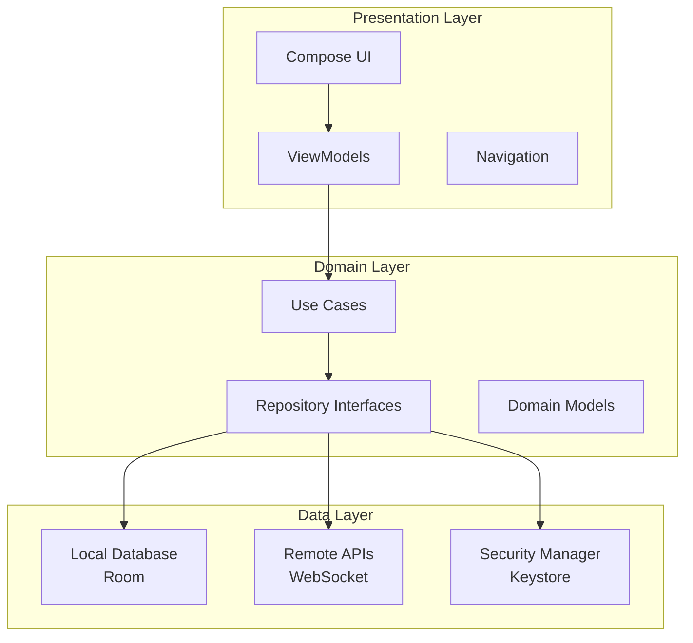
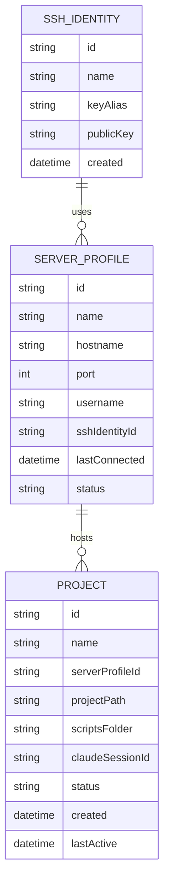
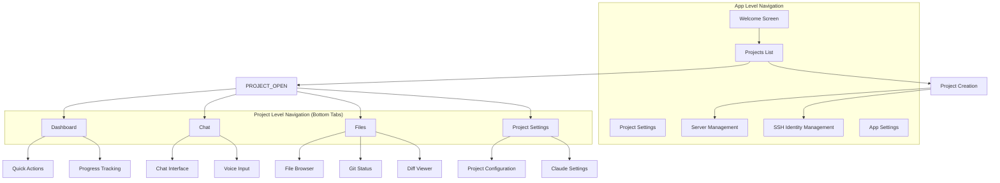
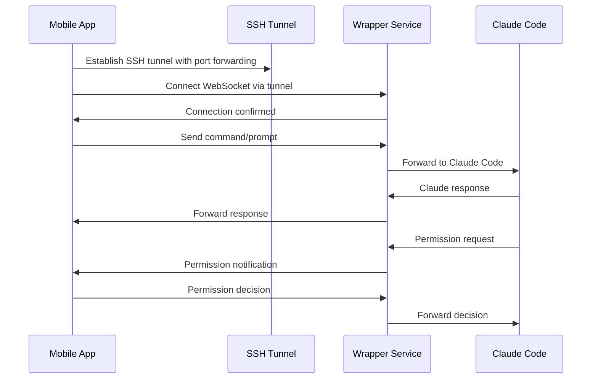
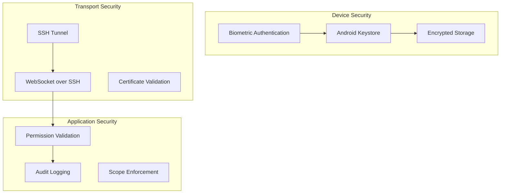

# Claude Code Mobile App
## Frontend Technical Specification v1.0

### Table of Contents
1. [System Overview](#system-overview)
2. [Architecture & Technology Stack](#architecture--technology-stack)
3. [Core Features Specification](#core-features-specification)
4. [UI/UX Design System](#uiux-design-system)
5. [Communication Protocol](#communication-protocol)
6. [Security Implementation](#security-implementation)
7. [Performance & Optimization](#performance--optimization)
8. [Accessibility Features](#accessibility-features)
9. [Implementation Timeline](#implementation-timeline)

---

## Future Enhancements

### Intelligent Build System Integration (v2)
Automatically discover and present commands from common project build systems:

**JavaScript/TypeScript Projects**
- Parse `package.json` scripts section for npm/yarn/pnpm/bun commands
- Auto-detect monorepo tools (lerna, nx, rush)

**Build System Files**
- **Makefile**: Extract available targets from make output
- **justfile**: Parse just command definitions
- **Taskfile.yml**: Parse task runner configurations

**Language-Specific Tooling**
- **Rust**: Standard cargo commands (build, test, check, clippy, fmt)
- **Go**: Common go commands (test, build, mod tidy, vet)
- **Python**: Commands from pyproject.toml, setup.py, tox.ini
- **Java**: Gradle tasks and Maven goals from build files

**Smart Categorization**
- Automatic grouping by command type (build, test, lint, deploy)
- Context-aware suggestions based on project changes
- Integration with CI/CD pipeline definitions

### Advanced Features (v3+)
- **Multi-project orchestration**: Coordinate related projects across servers
- **Custom workflow automation**: Chain quick actions with conditions
- **Team collaboration**: Share project configurations and scripts
- **Performance analytics**: Track and optimize development workflows

---

## System Overview

### Purpose
The Claude Code Mobile App enables developers to remotely control Claude Code instances running on development servers through their Android devices. The app provides a native mobile interface for AI-powered development workflows while maintaining full functionality including interactive permission handling.

### Target Platform
- **Primary**: Android 8.0+ (API level 26+)
- **Target SDK**: Android 15 (API level 35)
- **Architecture**: ARM64, x86_64
- **Minimum RAM**: 2GB
- **Storage**: 50MB app size, ~200MB with cache

### Key Capabilities
- Multi-server Claude Code session management with connection state control
- Real-time Claude Code interaction through chat interface
- Secure credential storage with biometric authentication
- Background monitoring with intelligent notifications
- Voice input integration for natural language prompts
- File browsing and git status monitoring
- Quick action automation with project script integration
- Progress tracking with sub-agent monitoring

---

## Architecture & Technology Stack

### Core Technology Stack
- **Platform**: Native Android with Kotlin
- **UI Framework**: Jetpack Compose with Material Design 3
- **Networking**: OkHttp3 for WebSocket communication
- **SSH Client**: JSch (mwiede/jsch fork) for secure tunneling
- **Security**: Android Keystore + BiometricPrompt + EncryptedSharedPreferences
- **Database**: Room for local data persistence
- **Dependency Injection**: Hilt
- **Background Processing**: WorkManager + Foreground Services
- **Voice**: Android Speech Recognition API

### Application Architecture



### Module Structure
```
app/
├── presentation/     # UI, ViewModels, Navigation
├── domain/          # Use Cases, Repository Interfaces, Models
├── data/            # Local DB, Remote APIs, Security
└── di/              # Dependency Injection
```

---

## Core Features Specification

### 1. Profile and Project Management

#### Entity Relationships
The app manages three distinct entity types with clear relationships:

**SSH Identity (1) → (N) Server Profile → (N) Project**



#### SSH Identity Management
SSH identities represent cryptographic key pairs and authentication credentials:

- **Key Generation**: Create SSH key pairs in Android Keystore
- **Multi-Server Usage**: One SSH identity can authenticate to multiple servers
- **Context Separation**: Separate identities for work, personal, client environments
- **Secure Storage**: Private keys never leave hardware security module

Examples:
- "Home SSH Key" → Used for personal development servers
- "Work SSH Key" → Used for company development infrastructure
- "Client Project Key" → Used for specific client environments

#### Server Profile Management
Server profiles define connection endpoints and configuration:

- **Connection Details**: Hostname, port, username
- **SSH Identity Reference**: Links to specific SSH identity for authentication
- **Server Grouping**: Multiple projects can exist on the same server
- **Connection Persistence**: Remember connection state and preferences

Examples:
- "Home Dev Server" (uses "Home SSH Key") → Hosts multiple personal projects
- "Work Main Server" (uses "Work SSH Key") → Hosts work projects
- "Work GPU Server" (uses "Work SSH Key") → Hosts ML/AI projects

#### Project Management
Projects represent individual Claude Code sessions and codebases:

- **Server Association**: Each project belongs to specific server
- **Path Configuration**: Project directory path on the server
- **Script Integration**: Configurable scripts folder location (default: "scripts")
- **Session State**: Claude Code session ID and conversation history
- **Independent Configuration**: Each project can have different Claude settings

Examples:
- "Personal Website" on "Home Dev Server" at `/home/user/projects/website`
- "API Service" on "Work Main Server" at `/opt/projects/api-service`
- "ML Pipeline" on "Work GPU Server" at `/data/ml-projects/pipeline`

#### Connection State Management
Each project maintains independent connection states:

- **DISCONNECTED**: No active Claude Code session
- **CONNECTING**: Establishing connection and starting wrapper
- **CONNECTED**: Active real-time communication with Claude Code
- **DISCONNECTING**: Closing mobile connection, keeping Claude Code running
- **SHUTDOWN**: Stopping Claude Code processes and disconnecting

#### User Operations
**Connect**: 
- Establish SSH tunnel to project's server
- Check wrapper service installation and version
- If wrapper is missing or outdated, prompt user to install/update:
  - Display installation dialog with version information
  - Execute installation command (fetch install script from git repository)
  - Typical command: `curl -sSL https://install.claude-wrapper.dev | sh`
  - Show installation progress and handle potential errors
- Start or connect to existing wrapper service for the project
- Resume Claude Code session or start new conversation

**Disconnect**: 
- Close mobile connection while leaving Claude Code running
- Useful for battery saving during long operations

**Shutdown**: 
- Stop Claude Code processes, wrapper service, and MCP server
- Clean termination of all remote processes
- Close SSH connection

#### Project Initialization Workflow
When creating a new project:

1. **Choose Server**: Select from existing server profiles or create new one
2. **Repository Setup** (optional):
   - Provide GitHub/GitLab URL
   - Provide access token if repository is private
   - System will clone repository to specified path
3. **Project Configuration**:
   - Specify project directory path on server
   - Configure scripts folder location
   - Set Claude Code parameters
4. **Initialization**: App creates project entry and establishes initial connection

### 2. Secure Token Vault

#### Security Architecture
The token vault leverages Android's hardware-backed security features:

- **Android Keystore**: Hardware security module for key storage when available
- **StrongBox**: Dedicated security chip on newer devices (Pixel 3+, flagships)
- **Biometric Authentication**: Unified fingerprint/face/iris recognition
- **Encrypted Storage**: Automatic encryption tied to user authentication

#### Supported Services
- GitHub (Personal Access Tokens)
- GitLab (Personal/Project Access Tokens)
- Custom Git servers

#### Authentication Flow
1. User requests token access
2. Biometric prompt appears
3. On successful authentication, decrypt and return token
4. Auto-lock after 5 minutes of inactivity

### 3. Quick Actions Dashboard

#### Action Types
Quick actions come in two simple types:

**Claude Prompts**: Natural language text sent directly to Claude
- Examples: "run the tests", "fix the failing tests", "deploy to staging"
- Output appears in chat interface as Claude responses

**Shell Commands**: Direct command execution on the server
- Examples: "git status", "git push", "npm test", "./deploy.sh"
- Output displayed in expandable terminal-style view with:
  - Syntax highlighting for command output
  - Copy-to-clipboard functionality
  - Scroll-to-bottom for long outputs
  - Exit code and execution time display

#### Action Sources

**Project Scripts**: Automatically discovered from the project's scripts folder
- App scans configurable scripts directory (default: `/scripts`)
- Executable files (.sh, .py, .js, etc.) become available as quick actions
- **Name Conversion Rules**:
  - Remove file extension: `deploy.sh` → `deploy`
  - Replace underscores/hyphens with spaces: `run_tests.sh` → `run tests`
  - Capitalize first letter: `run tests` → `Run tests`
  - Handle common abbreviations: `db_migrate.sh` → `DB Migrate`
- Self-extending: ask Claude to create scripts, they automatically appear on next refresh

#### UI Organization
Actions display the following information:
- Friendly name and icon
- Action type indicator (speech bubble for prompts, terminal icon for shell)
- Source type (Project Scripts)
- Last execution timestamp and status

All project scripts are grouped together in a "Scripts" section, as the app cannot reliably determine their purpose from filenames alone.

### 4. Background Monitoring Service

#### Service Architecture
A persistent foreground service monitors active Claude Code sessions even when the app is closed or backgrounded.

#### Battery-Aware Status Checking
While the WebSocket provides real-time communication, the background service performs periodic status checks to ensure system health and handle edge cases:

**What Gets Polled**:
- WebSocket connection health (ping/pong)
- SSH tunnel stability
- Remote wrapper service status
- Claude Code process monitoring
- System resource usage on remote server

**Polling Frequency Adjustment** (user preference, enabled by default):
- **High frequency (3s)**: When device is charging
- **Normal frequency (5s)**: Normal battery levels (>30%)
- **Reduced frequency (15s)**: Battery below 30%
- **Minimal frequency (30s)**: Battery below 15%

**Why Polling is Needed**:
- SSH tunnels can silently fail without WebSocket notification
- Network changes (WiFi to cellular) may require tunnel re-establishment
- Remote processes may crash without sending WebSocket messages
- Battery optimization may kill background connections

#### Notification Categories

**Permission Requests**: High-priority notifications when Claude needs approval
- Show tool/action details
- Provide Allow/Deny action buttons
- Auto-timeout with default policies

**Task Completion**: Standard notifications when operations finish
- Success/failure status
- Brief summary of work completed
- Tap to open session details

**Error Conditions**: Alert notifications for issues requiring attention
- Connection failures
- Claude Code crashes
- Permission conflicts

**Progress Updates**: Ongoing operation status
- Current step in multi-step processes
- Estimated completion time
- Percentage complete indicator

### 5. Voice Integration

#### Speech-to-Text Input
Voice integration provides a natural way to interact with Claude:

- **Simple Transcription**: Convert speech to text and send as Claude prompt
- **No Command Parsing**: Whatever is spoken is sent directly to Claude
- **Partial Results**: Show real-time transcription as user speaks
- **Error Handling**: Clear feedback for recognition failures

#### Text-to-Speech Output
Enhanced voice feedback for Claude responses:

- **Response Reading**: Read Claude messages aloud with optional summarization
- **Smart Summarization**: For long Claude responses, send additional prompt:
  ```
  "Please provide a short summary of your previous response suitable for text-to-speech, 
  focusing on the key actions taken and results. Keep it under 50 words and surround 
  with <speak></speak> tags."
  ```
- **Action Confirmation**: Speak confirmation when actions execute
- **Error Announcements**: Audio alerts for critical issues
- **User Control**: Per-message voice control and global voice settings

#### Voice UI Components
- **Voice Input Button**: Large, accessible button for triggering speech recognition
- **Visual Feedback**: Real-time transcription display during recording
- **Audio Indicators**: Visual waveform or level meters during recording

### 6. Progress Tracking

#### Task Progress Monitoring
Track multi-step operations with detailed progress information:

- **Current Step**: What Claude is working on now
- **Completed Steps**: List of finished operations
- **Pending Steps**: Estimated remaining work
- **Progress Percentage**: Visual completion indicator
- **Time Estimates**: Completion time based on historical data

#### Sub-Agent Monitoring
Track Claude Code's internal agent orchestration:

- **Sub-Agent Start**: When Claude spawns specialized agents (testing, deployment, etc.)
- **Sub-Agent Progress**: Individual agent task completion
- **Sub-Agent Completion**: Success/failure status of each sub-agent
- **Agent Hierarchy**: Visual representation of agent relationships
- **Resource Usage**: Track compute resources used by different agents

#### Progress Visualization
- **Timeline View**: Chronological display of operations and agent activities
- **Hierarchical Display**: Show main task with sub-agent breakdown
- **Real-time Updates**: Live progress bars and status indicators
- **Historical Data**: Past operation timings for better estimates

---

## UI/UX Design System

### Design Philosophy
The app follows Material Design 3 principles with modifications for developer workflows:

- **Task-Focused**: Minimize friction for common development operations
- **Information Dense**: Efficiently display complex technical information
- **Context Aware**: Adapt UI based on current project and connection state
- **Accessibility First**: Full support for screen readers and alternative input methods

### Navigation Structure



#### Top-Level Navigation Flow
1. **Welcome Screen**: First-time setup and project selection
2. **Projects List**: Overview of all configured projects with status
3. **Project Creation**: Wizard for setting up new projects
4. **Server Management**: Configure and manage server profiles
5. **SSH Identity Management**: Create and manage SSH key pairs
6. **App Settings**: Global application preferences

#### Project-Level Navigation
Once a project is selected, users navigate within project context using bottom tabs.

### Screen Layouts

#### Top-Level Screens

**Projects List Screen**
Primary landing screen showing:
- List of all configured projects with status indicators
- Quick project creation button
- Access to server and SSH identity management
- Global app settings

**Server Management Screen**
Configuration of development servers:
- List of server profiles with connection status
- Add/edit server profiles
- Test connections and view server information
- Link to SSH identity management

**SSH Identity Management Screen**
Cryptographic key management:
- List of SSH identities with usage information
- Generate new SSH key pairs
- Export public keys for server configuration
- Security settings and key rotation

#### Project-Level Screens

**Dashboard Screen**
Project-specific overview showing:
- Current connection status to Claude Code
- Quick actions grid organized by category
- Progress indicators for running tasks
- Recent activity and session history

**Chat Screen**
Real-time conversation interface with:
- Message history with Claude responses
- Input field with voice button
- File reference tools for mentioning specific files/lines
- Message actions (copy, share, read aloud)

**Files Screen**
Project file navigation featuring:
- Hierarchical file browser with search
- Git status indicators (modified, added, deleted files)
- Quick file content preview
- Diff viewing for changed files
- File reference selection for chat integration

**Project Settings Screen**
Project-specific configuration:
- Claude Code parameters (max turns, allowed tools)
- Project path and scripts folder configuration
- Session history management
- Project-specific preferences

### Color Scheme

#### Dark Mode (User Selectable)
- **Primary**: Bright green (#00E676) for actions and highlights
- **Background**: True black (#000000) for OLED power savings
- **Surface**: Dark gray (#121212) for content areas
- **Error**: Red (#FF5252) for errors and warnings
- **Success**: Green variants for completed operations

#### Light Mode (User Selectable)
- **Primary**: Dark green (#00C853) for actions and highlights
- **Background**: White (#FFFFFF) for clean appearance
- **Surface**: Light gray (#F5F5F5) for content areas
- **Error**: Red (#D32F2F) for errors and warnings
- **Success**: Green variants for completed operations

#### Theme Selection
- **User Preference**: Manual selection between light and dark modes
- **System Default**: Option to follow system theme setting
- **Automatic Switching**: Optional time-based theme switching

---

## Communication Protocol

### Message Flow Architecture



### Message Types

#### Mobile to Wrapper
- **Command Messages**: Claude prompts or shell commands to execute
- **Permission Responses**: Approval/denial of Claude's permission requests
- **Session Control**: Resume, pause, or terminate operations
- **Heartbeat**: Keep-alive messages for connection monitoring

#### Wrapper to Mobile
- **Claude Messages**: Responses and status updates from Claude
- **Permission Requests**: Claude asking for tool/action approval
- **Session Status**: Operation progress and completion notifications
- **Error Reports**: Connection issues or execution failures

### Connection Recovery
The app handles network interruptions gracefully:

1. **Automatic Reconnection**: Exponential backoff strategy for reconnecting
2. **State Synchronization**: Retrieve missed messages after reconnection
3. **Message Queuing**: Server queues messages during mobile disconnection
4. **Conflict Resolution**: Server state takes precedence in sync conflicts

---

## Security Implementation

### Multi-Layer Security Architecture



### SSH Key Management
- **Hardware Generation**: Create SSH keys in Android Keystore when possible
- **Secure Storage**: Private keys never leave secure hardware
- **Public Key Distribution**: Safe sharing of public keys for server authentication
- **Key Rotation**: Support for periodic key updates

### Permission Security
- **Scope Validation**: Ensure operations stay within project boundaries
- **Command Sanitization**: Validate all shell commands for safety
- **User Confirmation**: Require explicit approval for destructive operations
- **Audit Trail**: Log all permissions and actions with timestamps

### Data Protection
- **Memory Safety**: Clear sensitive data from memory after use
- **No Persistent Secrets**: SSH keys and tokens managed by secure storage only
- **Session Encryption**: All communication encrypted over SSH tunnel
- **Local Encryption**: Database and preferences encrypted at rest

---

## Performance & Optimization

### Memory Management
- **Message Caching**: LRU cache for recent conversation history
- **Image Optimization**: Efficient loading and caching of file icons
- **Background Cleanup**: Automatic cleanup of old sessions and logs
- **Memory Monitoring**: Track and limit memory usage per component

### Network Optimization
- **Connection Pooling**: Reuse SSH connections when possible
- **Message Batching**: Combine multiple updates during disconnection
- **Compression**: Enable gzip compression over SSH tunnel
- **Bandwidth Awareness**: Adapt update frequency based on connection quality

### Battery Optimization
- **Intelligent Polling**: Adjust monitoring frequency based on battery level (user preference, enabled by default)
- **Background Limits**: Minimize processing when app is backgrounded
- **WiFi Preference**: Prefer WiFi over cellular for data-intensive operations (user preference, enabled by default)
- **Doze Mode Compliance**: Proper handling of Android power management

### Storage Optimization
- **Database Maintenance**: Regular cleanup of old messages and sessions
- **Cache Management**: Intelligent cache eviction policies
- **Incremental Sync**: Only sync changed data between app and server
- **Compression**: Compress stored conversation history

---

## Accessibility Features

### Screen Reader Support
- **Semantic Markup**: Proper content descriptions for all UI elements
- **Navigation Hints**: Clear instructions for screen reader users
- **State Announcements**: Audio feedback for connection and operation status
- **Action Descriptions**: Detailed descriptions of what each button does

### Visual Accessibility
- **High Contrast Mode**: Enhanced contrast ratios for better visibility
- **Large Text Support**: Support for text scaling up to 200%
- **Color Independence**: Information not conveyed through color alone
- **Focus Indicators**: Clear visual focus for keyboard navigation

### Motor Accessibility
- **Large Touch Targets**: Minimum 44dp touch targets for all interactive elements
- **Voice Alternative**: Voice input as alternative to typing
- **Gesture Alternatives**: Multiple ways to perform each action
- **Timeout Extensions**: Extended timeouts for users who need more time

### Cognitive Accessibility
- **Simple Navigation**: Clear, consistent navigation patterns
- **Progress Indicators**: Clear feedback on operation status
- **Error Prevention**: Confirmation dialogs for destructive actions
- **Help Integration**: Contextual help and documentation

---

## Implementation Timeline

### Phase 1: Core Infrastructure (4 weeks)
**Foundation & Basic Connectivity**
- Project setup with dependency configuration
- Basic UI navigation structure with bottom tabs
- SSH connection management and tunnel establishment
- WebSocket communication layer with message handling
- Local database setup with Room
- Basic server profile creation and management

**Deliverables:**
- App connects to development servers via SSH
- Basic navigation between main screens
- Server profiles can be created and stored
- WebSocket communication established

### Phase 2: Essential Features (6 weeks)
**Chat Interface & Quick Actions**
- Chat interface with message history and real-time updates
- Quick actions dashboard with system actions
- File browser with project navigation
- Background monitoring service with notifications
- Connection resilience and auto-reconnection
- Basic git status integration

**Deliverables:**
- Functional chat interface with Claude Code
- Quick actions for common development tasks
- File browsing with git status indicators
- Background operation monitoring
- Reliable connection management

### Phase 3: Advanced Features (4 weeks)
**Voice, Security & Project Scripts**
- Voice input integration with speech-to-text
- Token vault with biometric authentication
- Project script discovery and integration
- Progress tracking and smart suggestions
- Advanced file operations and diff viewing
- Custom action creation and management

**Deliverables:**
- Voice input for natural interaction
- Secure credential storage
- Dynamic quick actions from project scripts
- Progress tracking for multi-step operations
- Enhanced file management capabilities

### Phase 4: Polish & Optimization (2 weeks)
**Performance, Accessibility & User Experience**
- Performance optimization and memory management
- Accessibility improvements and screen reader support
- Error handling refinement and user feedback
- UI/UX polish and animation improvements
- Comprehensive testing and bug fixes
- Documentation and help system

**Deliverables:**
- Optimized, production-ready application
- Full accessibility compliance
- Comprehensive error handling
- Polished user interface
- Complete documentation

### Total Development Time: ~16 weeks

---

## Conclusion

This frontend specification provides a comprehensive blueprint for building a production-ready Claude Code mobile application. The architecture leverages Android's native capabilities while maintaining security, performance, and accessibility standards.

### Key Technical Decisions
- **Native Android**: Optimal SSH and WebSocket handling with full platform integration
- **Jetpack Compose**: Modern, reactive UI development with Material Design 3
- **Android Keystore**: Hardware-backed security for credentials and SSH keys
- **Modular Architecture**: Clean separation of concerns for maintainability
- **Voice Integration**: Natural language interaction through speech-to-text
- **Script Integration**: Self-extending quick actions through project script discovery
- **Entity Separation**: Clear distinction between SSH identities, servers, and projects

### Success Criteria
The mobile app will be considered successful when it enables developers to:
- Manage multiple Claude Code sessions across different servers and projects
- Interact naturally with Claude Code through chat and voice
- Execute common development tasks with single taps
- Monitor long-running operations and sub-agent activities while mobile
- Maintain security without sacrificing usability
- Work effectively on mobile devices with intermittent connectivity
- Extend functionality through project-specific scripts

This specification balances feature richness with implementation feasibility, providing a clear roadmap for creating a mobile development tool that extends Claude Code's capabilities to mobile devices without compromising functionality or security.