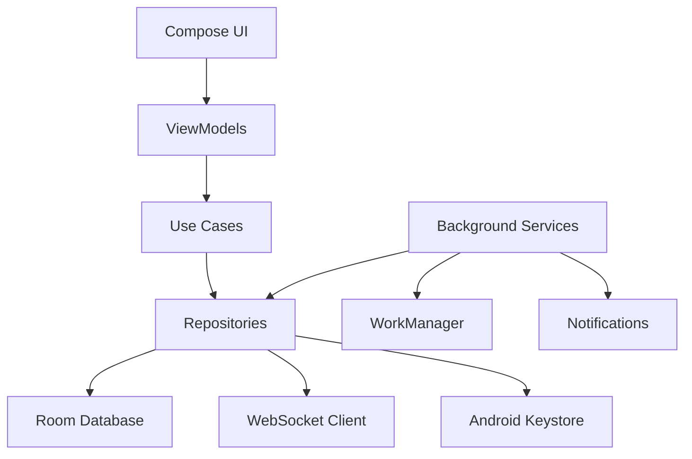

# Frontend-Android Module Architecture

## Module Overview

**Module Name**: Frontend-Android
**Description**: Native Android mobile application for Pocket Agent
**Technology Stack**: Kotlin, Jetpack Compose, Room, Hilt, OkHttp
**Directory**: frontend-android/

## Purpose and Scope

### Module Responsibilities
- Provide native Android user interface for Claude Code interaction
- Handle secure local data storage and credential management
- Implement background monitoring services and notifications
- Manage WebSocket connections to server components
- Provide biometric authentication and security features
- Implement offline capabilities and data synchronization

### Module Boundaries
- **Does NOT handle**: Server-side Claude Code execution, WebSocket server implementation, multi-platform UI frameworks
- **Integrates with**: Pocket Agent server/wrapper service via WebSocket protocol
- **Exposes**: Mobile client interface for Claude Code interactions

## Technology Stack

### Core Technologies
- **Language**: Kotlin 2.2.0
- **UI Framework**: Jetpack Compose (BOM 2024.12.01)
- **Build Tool**: Gradle with Kotlin DSL
- **Package Manager**: Gradle with Version Catalogs

### Android Framework
- **Min SDK**: 26 (Android 8.0)
- **Target SDK**: 35 (Android 15)
- **Compile SDK**: 35
- **JVM Target**: 21

### Key Dependencies
- **Database**: Room 2.6.1 for local data persistence
- **DI**: Hilt 2.56.2 for dependency injection
- **Networking**: OkHttp 4.12.0 for WebSocket connections
- **Serialization**: Kotlinx Serialization 1.9.0
- **Coroutines**: Kotlinx Coroutines 1.10.2 for async operations
- **Security**: Android Security Crypto 1.1.0-alpha06, Biometric 1.1.0
- **Background**: WorkManager 2.10.0 for background tasks

### Development Tools
- **Code Quality**: Detekt 1.23.8, KtLint 1.6.0, Spotless 7.1.0
- **Testing**: JUnit 4.13.2, Mockito 5.14.1, Espresso 3.6.1
- **Debugging**: Compose UI Tooling, Flipper integration planned

## Module Structure

### Directory Organization
```
frontend-android/
├── app/
│   ├── src/
│   │   ├── main/
│   │   │   ├── java/com/pocketagent/
│   │   │   │   ├── MainActivity.kt
│   │   │   │   ├── PocketAgentApplication.kt
│   │   │   │   ├── data/           # Data layer (Room, repositories)
│   │   │   │   ├── domain/         # Business logic and use cases
│   │   │   │   ├── presentation/   # UI components and ViewModels
│   │   │   │   ├── di/             # Hilt dependency injection
│   │   │   │   └── services/       # Background services
│   │   │   ├── res/                # Android resources
│   │   │   └── AndroidManifest.xml
│   │   ├── test/                   # Unit tests
│   │   └── androidTest/            # Instrumentation tests
│   ├── build.gradle.kts            # App-level build configuration
│   └── proguard-rules.pro          # Proguard rules
├── gradle/
│   ├── libs.versions.toml          # Version catalog
│   └── wrapper/                    # Gradle wrapper
├── build.gradle.kts                # Project-level build configuration
└── settings.gradle.kts             # Gradle settings
```

### Key Entry Points
- **Main File**: app/src/main/java/com/pocketagent/MainActivity.kt
- **Application**: app/src/main/java/com/pocketagent/PocketAgentApplication.kt
- **Configuration**: app/build.gradle.kts
- **Manifest**: app/src/main/AndroidManifest.xml

## Internal Architecture

### Architectural Patterns
- **Pattern**: Clean Architecture with MVVM
- **Justification**: Separation of concerns, testability, maintainability for complex mobile app
- **Implementation**: 
  - Data layer (repositories, Room database)
  - Domain layer (use cases, business logic)
  - Presentation layer (Compose UI, ViewModels)

### Component Organization


### Data Flow
1. **Input**: User interactions via Compose UI components
2. **Processing**: ViewModels coordinate with use cases for business logic
3. **Storage**: Repositories manage data persistence via Room and secure storage
4. **Output**: UI updates via StateFlow/LiveData, notifications via Android system

## Module APIs and Interfaces

### Public Interfaces
This module exposes interfaces to other modules:

#### WebSocket Client Interface
- **Type**: WebSocket client connection
- **Purpose**: Connect to Pocket Agent server for Claude Code interaction
- **Contract**: JSON-based message protocol
- **Authentication**: SSH key-based challenge-response
- **Example**: Establishes connection to ws://server:port/claude

### Integration Points
How this module integrates with others:

#### Server WebSocket Integration
- **Target Module**: Server (when implemented)
- **Method**: WebSocket connection with JSON message protocol
- **Data**: Claude commands, permission requests, session state
- **Frequency**: Real-time bidirectional communication

## Data Management

### Data Models
Core data structures used in this module:

```kotlin
@Entity(tableName = "server_profiles")
data class ServerProfile(
    @PrimaryKey val id: String,
    val name: String,
    val hostname: String,
    val port: Int,
    val sshIdentityId: String,
    val isDefault: Boolean = false
)

@Entity(tableName = "projects")
data class Project(
    @PrimaryKey val id: String,
    val name: String,
    val serverProfileId: String,
    val path: String,
    val description: String?,
    val lastAccessed: Long
)

@Entity(tableName = "ssh_identities")
data class SshIdentity(
    @PrimaryKey val id: String,
    val name: String,
    val publicKeyPath: String,
    val privateKeyEncrypted: String, // Encrypted with Android Keystore
    val createdAt: Long
)
```

### Data Storage
- **Local Storage**: Room SQLite database for structured data
- **Secure Storage**: Android Keystore for SSH private keys and sensitive data
- **Caching**: In-memory caching with StateFlow for UI reactivity
- **Persistence**: All user data persists across app restarts

### Data Validation
- **Input Validation**: UI-level validation with Compose state management
- **Business Rules**: Domain layer use cases enforce business logic
- **Error Handling**: Result-based error propagation with user-friendly messages

## Configuration and Environment

### Configuration Management
- **Config Files**: app/build.gradle.kts for build configuration
- **Environment Variables**: Build variants (debug/release) with different settings
- **Runtime Config**: SharedPreferences/DataStore for user preferences
- **Secrets**: SSH keys stored in Android Keystore, no hardcoded secrets

### Environment Support
- **Development**: Debug build variant with logging enabled
- **Testing**: Android Test variants with in-memory database
- **Release**: Optimized build with ProGuard/R8 code shrinking

## Security Architecture

### Authentication and Authorization
- **Authentication**: Biometric authentication (fingerprint/face) for app access
- **SSH Keys**: SSH key-based authentication for server connections
- **Session Management**: Secure session tokens with automatic expiration
- **Local Auth**: Android BiometricPrompt API for secure unlock

### Data Security
- **Encryption**: SSH private keys encrypted with Android Keystore
- **Validation**: Input sanitization and validation throughout UI
- **Audit Logging**: Security events logged for debugging and compliance
- **Network Security**: Certificate pinning for WebSocket connections

## Performance and Scalability

### Performance Characteristics
- **App Launch**: Cold start under 2 seconds on mid-range devices
- **UI Responsiveness**: 60 FPS animations with Compose
- **Memory Usage**: Under 200MB RAM for typical usage
- **Battery Usage**: Under 3% drain per hour during background monitoring

### Scaling Strategies
- **Data Pagination**: Room with paging for large datasets
- **Background Limits**: Respect Android battery optimization
- **Network Efficiency**: Connection pooling and request batching
- **Storage Management**: Automatic cleanup of old data

## Testing Strategy

### Test Structure
```
src/
├── test/                   # Unit tests
│   ├── data/              # Repository and database tests
│   ├── domain/            # Use case and business logic tests
│   └── presentation/      # ViewModel tests
└── androidTest/           # Integration tests
    ├── database/          # Room database tests
    ├── ui/                # Compose UI tests
    └── services/          # Background service tests
```

### Testing Approach
- **Unit Testing**: Isolated component testing with Mockito
- **Integration Testing**: Room database and repository integration
- **UI Testing**: Compose testing with semantic tree navigation
- **Background Testing**: WorkManager and service testing

### Test Dependencies
- **Mocking**: Mockito for dependency mocking
- **Test Data**: Builder pattern for test data creation
- **Test Database**: In-memory Room database for tests

## Deployment and Operations

### Build Process
1. **Dependencies**: Gradle resolves dependencies from libs.versions.toml
2. **Compilation**: Kotlin compiler with Compose compiler
3. **Testing**: Automated unit and integration tests
4. **Code Quality**: Detekt, KtLint, and Spotless checks
5. **Packaging**: APK/AAB generation with ProGuard optimization

### Monitoring and Observability
- **Crash Reporting**: Android vitals and potential Firebase Crashlytics
- **Performance**: Android profiler integration
- **Logging**: Structured logging with different levels per build type
- **Analytics**: User interaction tracking (privacy-compliant)

### Health Checks
- **Database Health**: Room database integrity checks
- **Network Health**: WebSocket connection monitoring
- **Service Health**: Background service status monitoring

## Development Workflow

### Local Development
1. **Setup**: Clone repo, open in Android Studio
2. **Dependencies**: Gradle sync downloads all dependencies
3. **Running**: Use Android Studio run configurations
4. **Testing**: Run unit tests with Gradle, UI tests with connected device

### Code Quality
- **Linting**: Detekt for Kotlin code analysis
- **Formatting**: KtLint and Spotless for consistent formatting
- **Review Process**: Feature branch workflow with code review
- **Documentation**: KDoc for public APIs

## Dependencies and Integration

### External Dependencies
- **Android Framework**: Core Android APIs and Jetpack libraries
- **Networking**: OkHttp for WebSocket and HTTP networking
- **Database**: Room for local data persistence
- **Security**: Android Security and Biometric libraries

### Module Dependencies
- **Server Module**: WebSocket API for Claude Code interaction
- **Shared Models**: Data transfer objects for cross-module communication

## Migration and Evolution

### Version Management
- **App Versioning**: Semantic versioning with build numbers
- **Database Migrations**: Room migration strategy for schema changes
- **API Compatibility**: Graceful handling of server API changes

### Technical Debt
- **Known Issues**: None currently identified in new architecture
- **Improvement Plans**: Performance optimization, enhanced offline support
- **Refactoring**: Continuous refactoring for maintainability

## Troubleshooting

### Common Issues
- **Connection Failures**: Check network connectivity and server availability
- **Performance Issues**: Monitor memory usage and background processing
- **Authentication Problems**: Verify biometric setup and SSH key validity

### Debugging Guide
- **Logs**: Check Android Logcat for application logs
- **Database**: Use Room database inspector in Android Studio
- **Network**: Use network profiler to monitor WebSocket traffic

---

*Module: Frontend-Android*
*Architecture Version: 1.0*
*Last Updated: 2025-01-27*
*Technology Stack: Kotlin, Jetpack Compose, Room, Hilt*