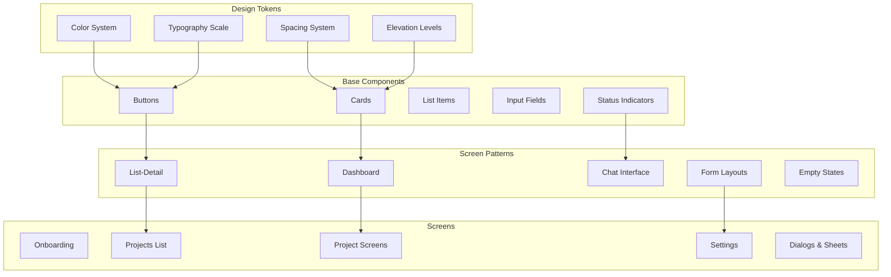

# Screen Design - Design

## Architecture Overview

The Screen Design architecture implements a comprehensive design system for the Pocket Agent mobile application, providing detailed specifications for every screen, component, and interaction pattern. The design follows Material Design 3 principles while maintaining a developer-focused aesthetic that prioritizes clarity, efficiency, and professional appearance.

### Core Design Principles

1. **Information Hierarchy**: Most important information always visible
2. **Progressive Disclosure**: Show details only when needed
3. **Consistent Patterns**: Same actions work the same way everywhere
4. **Clear Feedback**: Every action has immediate visual response
5. **Efficient Workflows**: Minimize taps for common tasks

### Design System Architecture



## Screen Specifications

### 1. Splash Screen

**Purpose**: Brief branded loading screen during app initialization

```kotlin
package com.pocketagent.ui.screens.splash

import androidx.compose.foundation.Image
import androidx.compose.foundation.background
import androidx.compose.foundation.layout.*
import androidx.compose.material3.CircularProgressIndicator
import androidx.compose.material3.MaterialTheme
import androidx.compose.material3.Text
import androidx.compose.runtime.Composable
import androidx.compose.ui.Alignment
import androidx.compose.ui.Modifier
import androidx.compose.ui.graphics.Brush
import androidx.compose.ui.res.painterResource
import androidx.compose.ui.unit.dp
import com.pocketagent.BuildConfig
import com.pocketagent.R

@Composable
fun SplashScreen() {
    Box(
        modifier = Modifier
            .fillMaxSize()
            .background(
                Brush.verticalGradient(
                    colors = listOf(
                        MaterialTheme.colorScheme.primary,
                        MaterialTheme.colorScheme.primaryContainer
                    )
                )
            ),
        contentAlignment = Alignment.Center
    ) {
        Column(
            horizontalAlignment = Alignment.CenterHorizontally
        ) {
            Image(
                painter = painterResource(R.drawable.ic_pocket_agent_logo),
                contentDescription = null,
                modifier = Modifier.size(120.dp)
            )
            
            Spacer(modifier = Modifier.height(24.dp))
            
            Text(
                text = "Pocket Agent",
                style = MaterialTheme.typography.displayMedium,
                color = MaterialTheme.colorScheme.onPrimary
            )
            
            Spacer(modifier = Modifier.height(48.dp))
            
            CircularProgressIndicator(
                modifier = Modifier.size(24.dp),
                color = MaterialTheme.colorScheme.onPrimary,
                strokeWidth = 2.dp
            )
        }
        
        Text(
            text = "v${BuildConfig.VERSION_NAME}",
            style = MaterialTheme.typography.labelSmall,
            color = MaterialTheme.colorScheme.onPrimary.copy(alpha = 0.7f),
            modifier = Modifier
                .align(Alignment.BottomCenter)
                .padding(bottom = 32.dp)
        )
    }
}
```

### 2. Onboarding Flow

**Purpose**: Guide first-time users through setup

```kotlin
package com.pocketagent.ui.screens.onboarding

import androidx.compose.foundation.layout.*
import androidx.compose.foundation.pager.HorizontalPager
import androidx.compose.foundation.pager.rememberPagerState
import androidx.compose.material3.*
import androidx.compose.runtime.Composable
import androidx.compose.runtime.rememberCoroutineScope
import androidx.compose.ui.Modifier
import kotlinx.coroutines.launch

@Composable
fun OnboardingScreen(
    onComplete: () -> Unit
) {
    val pagerState = rememberPagerState()
    
    Scaffold(
        topBar = {
            TopAppBar(
                title = { },
                actions = {
                    TextButton(
                        onClick = onComplete
                    ) {
                        Text("Skip")
                    }
                }
            )
        }
    ) { paddingValues ->
        Column(
            modifier = Modifier
                .fillMaxSize()
                .padding(paddingValues)
        ) {
            HorizontalPager(
                count = 3,
                state = pagerState,
                modifier = Modifier.weight(1f)
            ) { page ->
                when (page) {
                    0 -> WelcomePage()
                    1 -> SshKeyImportPage()
                    2 -> FirstServerPage()
                }
            }
            
            OnboardingNavigation(
                currentPage = pagerState.currentPage,
                pageCount = 3,
                onNext = {
                    if (pagerState.currentPage < 2) {
                        pagerState.animateScrollToPage(pagerState.currentPage + 1)
                    } else {
                        onComplete()
                    }
                }
            )
        }
    }
}
```

### 3. Projects List Screen

**Purpose**: Main hub showing all projects

```kotlin
package com.pocketagent.ui.screens.projects

import androidx.compose.foundation.layout.*
import androidx.compose.foundation.lazy.LazyColumn
import androidx.compose.foundation.lazy.items
import androidx.compose.material.icons.Icons
import androidx.compose.material.icons.filled.Add
import androidx.compose.material.icons.filled.Search
import androidx.compose.material.icons.filled.Settings
import androidx.compose.material3.*
import androidx.compose.runtime.Composable
import androidx.compose.ui.Alignment
import androidx.compose.ui.Modifier
import androidx.compose.ui.res.painterResource
import androidx.compose.ui.unit.dp
import com.pocketagent.R
import com.pocketagent.domain.model.ProjectWithStatus

@Composable
fun ProjectsListScreen(
    projects: List<ProjectWithStatus>,
    onProjectClick: (String) -> Unit,
    onCreateProject: () -> Unit,
    onQuickConnect: (String) -> Unit
) {
    Scaffold(
        topBar = {
            TopAppBar(
                title = { 
                    Row(verticalAlignment = Alignment.CenterVertically) {
                        Icon(
                            painter = painterResource(R.drawable.ic_pocket_agent),
                            contentDescription = null,
                            modifier = Modifier.size(24.dp)
                        )
                        Spacer(modifier = Modifier.width(8.dp))
                        Text("Pocket Agent")
                    }
                },
                actions = {
                    IconButton(onClick = { /* Search */ }) {
                        Icon(Icons.Default.Search, contentDescription = "Search")
                    }
                    IconButton(onClick = { /* Settings */ }) {
                        Icon(Icons.Default.Settings, contentDescription = "Settings")
                    }
                }
            )
        },
        floatingActionButton = {
            ExtendedFloatingActionButton(
                onClick = onCreateProject,
                icon = { Icon(Icons.Default.Add, contentDescription = null) },
                text = { Text("New Project") }
            )
        }
    ) { paddingValues ->
        if (projects.isEmpty()) {
            EmptyProjectsState(
                onCreateProject = onCreateProject,
                modifier = Modifier.padding(paddingValues)
            )
        } else {
            LazyColumn(
                modifier = Modifier
                    .fillMaxSize()
                    .padding(paddingValues),
                contentPadding = PaddingValues(16.dp),
                verticalArrangement = Arrangement.spacedBy(8.dp)
            ) {
                items(
                    items = projects,
                    key = { it.project.id }
                ) { projectWithStatus ->
                    ProjectCard(
                        project = projectWithStatus.project,
                        connectionStatus = projectWithStatus.connectionStatus,
                        onClick = { onProjectClick(projectWithStatus.project.id) },
                        onQuickAction = { onQuickConnect(projectWithStatus.project.id) }
                    )
                }
                
                item {
                    Spacer(modifier = Modifier.height(80.dp)) // FAB space
                }
            }
        }
    }
}
```

### 4. Project Card Component

**Purpose**: Display project information in list

```kotlin
package com.pocketagent.ui.components.project

import androidx.compose.foundation.layout.*
import androidx.compose.material.icons.Icons
import androidx.compose.material.icons.filled.PlayArrow
import androidx.compose.material3.*
import androidx.compose.runtime.Composable
import androidx.compose.ui.Alignment
import androidx.compose.ui.Modifier
import androidx.compose.ui.text.style.TextOverflow
import androidx.compose.ui.unit.dp
import com.pocketagent.domain.model.ConnectionStatus
import com.pocketagent.domain.model.Project
import com.pocketagent.ui.utils.toRelativeTimeString

@OptIn(ExperimentalMaterial3Api::class)
@Composable
fun ProjectCard(
    project: Project,
    connectionStatus: ConnectionStatus,
    onClick: () -> Unit,
    onQuickAction: () -> Unit
) {
    Card(
        onClick = onClick,
        modifier = Modifier.fillMaxWidth()
    ) {
        Row(
            modifier = Modifier
                .fillMaxWidth()
                .padding(16.dp),
            horizontalArrangement = Arrangement.SpaceBetween
        ) {
            Column(modifier = Modifier.weight(1f)) {
                Row(
                    verticalAlignment = Alignment.CenterVertically
                ) {
                    Text(
                        text = project.name,
                        style = MaterialTheme.typography.titleMedium,
                        maxLines = 1,
                        overflow = TextOverflow.Ellipsis
                    )
                    Spacer(modifier = Modifier.width(8.dp))
                    ConnectionStatusChip(
                        status = connectionStatus,
                        modifier = Modifier.height(20.dp)
                    )
                }
                
                Spacer(modifier = Modifier.height(4.dp))
                
                Text(
                    text = project.serverProfile.name,
                    style = MaterialTheme.typography.bodyMedium,
                    color = MaterialTheme.colorScheme.onSurfaceVariant
                )
                
                Text(
                    text = project.projectPath,
                    style = MaterialTheme.typography.bodySmall,
                    color = MaterialTheme.colorScheme.onSurfaceVariant,
                    maxLines = 1,
                    overflow = TextOverflow.Ellipsis
                )
                
                Spacer(modifier = Modifier.height(8.dp))
                
                Text(
                    text = "Last active ${project.lastActive.toRelativeTimeString()}",
                    style = MaterialTheme.typography.labelSmall,
                    color = MaterialTheme.colorScheme.onSurfaceVariant
                )
            }
            
            if (connectionStatus == ConnectionStatus.DISCONNECTED) {
                IconButton(
                    onClick = onQuickAction,
                    modifier = Modifier.align(Alignment.CenterVertically)
                ) {
                    Icon(
                        Icons.Default.PlayArrow,
                        contentDescription = "Quick Connect",
                        tint = MaterialTheme.colorScheme.primary
                    )
                }
            }
        }
    }
}
```

### 5. Chat Screen Design

**Purpose**: Main interaction interface with Claude

```kotlin
package com.pocketagent.ui.screens.chat

import androidx.compose.foundation.layout.*
import androidx.compose.foundation.lazy.LazyColumn
import androidx.compose.foundation.lazy.items
import androidx.compose.material.icons.Icons
import androidx.compose.material.icons.filled.Clear
import androidx.compose.material.icons.filled.Mic
import androidx.compose.material3.*
import androidx.compose.runtime.Composable
import androidx.compose.ui.Modifier
import androidx.compose.ui.unit.dp
import com.pocketagent.domain.model.ChatMessage

@Composable
fun ChatScreen(
    messages: List<ChatMessage>,
    onSendMessage: (String) -> Unit,
    onPermissionResponse: (String, Boolean) -> Unit
) {
    Scaffold(
        topBar = {
            TopAppBar(
                title = { Text("Chat") },
                actions = {
                    IconButton(onClick = { /* Voice toggle */ }) {
                        Icon(Icons.Default.Mic, contentDescription = "Voice input")
                    }
                    IconButton(onClick = { /* Clear chat */ }) {
                        Icon(Icons.Default.Clear, contentDescription = "Clear chat")
                    }
                }
            )
        },
        bottomBar = {
            ChatInputBar(
                onSendMessage = onSendMessage
            )
        }
    ) { paddingValues ->
        LazyColumn(
            modifier = Modifier
                .fillMaxSize()
                .padding(paddingValues),
            reverseLayout = true,
            contentPadding = PaddingValues(16.dp),
            verticalArrangement = Arrangement.spacedBy(8.dp)
        ) {
            items(
                items = messages.reversed(),
                key = { it.id }
            ) { message ->
                when (message) {
                    is ChatMessage.User -> UserMessage(message)
                    is ChatMessage.Claude -> ClaudeMessage(message)
                    is ChatMessage.System -> SystemMessage(message)
                    is ChatMessage.Permission -> PermissionRequestCard(
                        message = message,
                        onResponse = onPermissionResponse
                    )
                    is ChatMessage.Progress -> ProgressMessage(message)
                    is ChatMessage.Error -> ErrorMessage(message)
                }
            }
        }
    }
}
```

### 6. Message Components

**Purpose**: Display different types of chat messages

```kotlin
package com.pocketagent.ui.components.chat

import androidx.compose.foundation.layout.*
import androidx.compose.foundation.shape.RoundedCornerShape
import androidx.compose.material3.*
import androidx.compose.runtime.Composable
import androidx.compose.ui.Alignment
import androidx.compose.ui.Modifier
import androidx.compose.ui.text.font.FontFamily
import androidx.compose.ui.unit.dp
import com.pocketagent.domain.model.ChatMessage
import com.pocketagent.ui.utils.getToolIcon
import com.pocketagent.ui.utils.toTimeString

@Composable
fun UserMessage(message: ChatMessage.User) {
    Row(
        modifier = Modifier.fillMaxWidth(),
        horizontalArrangement = Arrangement.End
    ) {
        Card(
            modifier = Modifier.widthIn(max = 280.dp),
            colors = CardDefaults.cardColors(
                containerColor = MaterialTheme.colorScheme.primaryContainer
            )
        ) {
            Column(
                modifier = Modifier.padding(12.dp)
            ) {
                Text(
                    text = message.content,
                    style = MaterialTheme.typography.bodyLarge,
                    color = MaterialTheme.colorScheme.onPrimaryContainer
                )
                Text(
                    text = message.timestamp.toTimeString(),
                    style = MaterialTheme.typography.labelSmall,
                    color = MaterialTheme.colorScheme.onPrimaryContainer.copy(alpha = 0.7f),
                    modifier = Modifier.align(Alignment.End)
                )
            }
        }
    }
}

**Purpose**: Display permission request cards with countdown timer and action buttons

@Composable
fun PermissionRequestCard(
    message: ChatMessage.Permission,
    onResponse: (String, Boolean) -> Unit
) {
    Card(
        modifier = Modifier.fillMaxWidth(),
        colors = CardDefaults.cardColors(
            containerColor = MaterialTheme.colorScheme.tertiaryContainer
        ),
        elevation = CardDefaults.cardElevation(defaultElevation = 4.dp)
    ) {
        Column(
            modifier = Modifier.padding(16.dp)
        ) {
            Row(
                verticalAlignment = Alignment.CenterVertically
            ) {
                Icon(
                    imageVector = getToolIcon(message.tool),
                    contentDescription = null,
                    modifier = Modifier.size(24.dp),
                    tint = MaterialTheme.colorScheme.onTertiaryContainer
                )
                Spacer(modifier = Modifier.width(12.dp))
                Column(modifier = Modifier.weight(1f)) {
                    Text(
                        text = "Permission Request",
                        style = MaterialTheme.typography.titleSmall
                    )
                    Text(
                        text = message.tool,
                        style = MaterialTheme.typography.bodySmall,
                        color = MaterialTheme.colorScheme.onTertiaryContainer.copy(alpha = 0.7f)
                    )
                }
                
                if (message.timeRemaining > 0) {
                    CircularProgressIndicator(
                        progress = message.timeRemaining / message.timeout.toFloat(),
                        modifier = Modifier.size(32.dp),
                        strokeWidth = 2.dp
                    )
                    Text(
                        text = "${message.timeRemaining}s",
                        style = MaterialTheme.typography.labelSmall,
                        modifier = Modifier.padding(start = 8.dp)
                    )
                }
            }
            
            Spacer(modifier = Modifier.height(12.dp))
            
            Text(
                text = message.action,
                style = MaterialTheme.typography.bodyMedium
            )
            
            if (message.resources.isNotEmpty()) {
                Spacer(modifier = Modifier.height(8.dp))
                Surface(
                    color = MaterialTheme.colorScheme.surface,
                    shape = RoundedCornerShape(4.dp)
                ) {
                    Column(
                        modifier = Modifier.padding(8.dp)
                    ) {
                        message.resources.forEach { resource ->
                            Text(
                                text = resource,
                                style = MaterialTheme.typography.bodySmall,
                                fontFamily = FontFamily.Monospace
                            )
                        }
                    }
                }
            }
            
            Spacer(modifier = Modifier.height(16.dp))
            
            Row(
                modifier = Modifier.fillMaxWidth(),
                horizontalArrangement = Arrangement.End
            ) {
                OutlinedButton(
                    onClick = { onResponse(message.id, false) }
                ) {
                    Text("Deny")
                }
                Spacer(modifier = Modifier.width(8.dp))
                Button(
                    onClick = { onResponse(message.id, true) }
                ) {
                    Text("Allow")
                }
            }
        }
    }
}
```

### 7. File Browser Design

**Purpose**: Navigate and view project files

```kotlin
package com.pocketagent.ui.screens.files

import androidx.compose.foundation.clickable
import androidx.compose.foundation.layout.*
import androidx.compose.foundation.lazy.LazyColumn
import androidx.compose.foundation.lazy.items
import androidx.compose.material.icons.Icons
import androidx.compose.material.icons.filled.*
import androidx.compose.material3.*
import androidx.compose.runtime.Composable
import androidx.compose.ui.Modifier
import androidx.compose.ui.unit.dp
import com.pocketagent.domain.model.FileItem

@Composable
fun FileBrowserScreen(
    currentPath: String,
    files: List<FileItem>,
    onNavigate: (String) -> Unit,
    onFileClick: (FileItem) -> Unit
) {
    Scaffold(
        topBar = {
            TopAppBar(
                title = {
                    PathBreadcrumb(
                        path = currentPath,
                        onNavigate = onNavigate
                    )
                },
                actions = {
                    IconButton(onClick = { /* Toggle view */ }) {
                        Icon(Icons.Default.ViewList, contentDescription = "View mode")
                    }
                    IconButton(onClick = { /* Sort */ }) {
                        Icon(Icons.Default.Sort, contentDescription = "Sort")
                    }
                }
            )
        }
    ) { paddingValues ->
        LazyColumn(
            modifier = Modifier
                .fillMaxSize()
                .padding(paddingValues),
            contentPadding = PaddingValues(vertical = 8.dp)
        ) {
            items(
                items = files,
                key = { it.path }
            ) { file ->
                FileListItem(
                    file = file,
                    onClick = { 
                        if (file.isDirectory) {
                            onNavigate(file.path)
                        } else {
                            onFileClick(file)
                        }
                    }
                )
            }
        }
    }
}

**Purpose**: Display individual file or folder items in the file browser list

@Composable
fun FileListItem(
    file: FileItem,
    onClick: () -> Unit
) {
    ListItem(
        modifier = Modifier.clickable(onClick = onClick),
        leadingContent = {
            Icon(
                imageVector = if (file.isDirectory) Icons.Default.Folder else Icons.Default.InsertDriveFile,
                contentDescription = null,
                tint = if (file.isDirectory) {
                    MaterialTheme.colorScheme.primary
                } else {
                    MaterialTheme.colorScheme.onSurfaceVariant
                }
            )
        },
        headlineContent = {
            Row(
                verticalAlignment = Alignment.CenterVertically
            ) {
                Text(
                    text = file.name,
                    maxLines = 1,
                    overflow = TextOverflow.Ellipsis,
                    modifier = Modifier.weight(1f)
                )
                file.gitStatus?.let { status ->
                    Spacer(modifier = Modifier.width(8.dp))
                    GitStatusBadge(status)
                }
            }
        },
        supportingContent = {
            Row {
                if (!file.isDirectory) {
                    Text(
                        text = file.size.toHumanReadableSize(),
                        style = MaterialTheme.typography.bodySmall
                    )
                    Text(
                        text = " • ",
                        style = MaterialTheme.typography.bodySmall
                    )
                }
                Text(
                    text = file.lastModified.toRelativeTimeString(),
                    style = MaterialTheme.typography.bodySmall
                )
            }
        },
        trailingContent = {
            if (file.isDirectory) {
                Icon(
                    Icons.Default.ChevronRight,
                    contentDescription = null,
                    tint = MaterialTheme.colorScheme.onSurfaceVariant
                )
            }
        }
    )
}
```

### 8. Settings Screen Design

**Purpose**: Configure app and project settings

```kotlin
package com.pocketagent.ui.screens.settings

import androidx.compose.foundation.layout.*
import androidx.compose.foundation.lazy.LazyColumn
import androidx.compose.material.icons.Icons
import androidx.compose.material.icons.automirrored.filled.ArrowBack
import androidx.compose.material3.*
import androidx.compose.runtime.Composable
import androidx.compose.ui.Modifier

@Composable
fun SettingsScreen(
    onNavigateBack: () -> Unit
) {
    Scaffold(
        topBar = {
            TopAppBar(
                title = { Text("Settings") },
                navigationIcon = {
                    IconButton(onClick = onNavigateBack) {
                        Icon(Icons.AutoMirrored.Filled.ArrowBack, contentDescription = "Back")
                    }
                }
            )
        }
    ) { paddingValues ->
        LazyColumn(
            modifier = Modifier
                .fillMaxSize()
                .padding(paddingValues)
        ) {
            item {
                SettingsSection(title = "Appearance") {
                    ThemeSettingItem()
                    DynamicColorSettingItem()
                    FontSizeSettingItem()
                }
            }
            
            item {
                SettingsSection(title = "Voice & Audio") {
                    VoiceInputSettingItem()
                    TTSSettingItem()
                    VoiceSpeedSettingItem()
                }
            }
            
            item {
                SettingsSection(title = "Notifications") {
                    PermissionNotificationSettingItem()
                    TaskCompletionSettingItem()
                    ConnectionEventSettingItem()
                }
            }
            
            item {
                SettingsSection(title = "Security") {
                    BiometricLockSettingItem()
                    AutoLockTimeoutSettingItem()
                    TokenVaultSettingItem()
                }
            }
            
            item {
                SettingsSection(title = "About") {
                    VersionInfoItem()
                    LicensesItem()
                    PrivacyPolicyItem()
                }
            }
        }
    }
}
```

## Common Components

### Empty States

**Purpose**: Display placeholder content when lists or screens have no data

```kotlin
package com.pocketagent.ui.components.common

import androidx.compose.foundation.layout.*
import androidx.compose.material3.*
import androidx.compose.runtime.Composable
import androidx.compose.ui.Alignment
import androidx.compose.ui.Modifier
import androidx.compose.ui.graphics.vector.ImageVector
import androidx.compose.ui.text.style.TextAlign
import androidx.compose.ui.unit.dp

@Composable
fun EmptyState(
    icon: ImageVector,
    title: String,
    description: String,
    actionLabel: String? = null,
    onAction: (() -> Unit)? = null
) {
    Column(
        modifier = Modifier
            .fillMaxSize()
            .padding(32.dp),
        horizontalAlignment = Alignment.CenterHorizontally,
        verticalArrangement = Arrangement.Center
    ) {
        Icon(
            imageVector = icon,
            contentDescription = null,
            modifier = Modifier.size(64.dp),
            tint = MaterialTheme.colorScheme.onSurfaceVariant.copy(alpha = 0.6f)
        )
        
        Spacer(modifier = Modifier.height(16.dp))
        
        Text(
            text = title,
            style = MaterialTheme.typography.titleLarge,
            textAlign = TextAlign.Center
        )
        
        Spacer(modifier = Modifier.height(8.dp))
        
        Text(
            text = description,
            style = MaterialTheme.typography.bodyMedium,
            color = MaterialTheme.colorScheme.onSurfaceVariant,
            textAlign = TextAlign.Center
        )
        
        if (actionLabel != null && onAction != null) {
            Spacer(modifier = Modifier.height(24.dp))
            
            Button(onClick = onAction) {
                Text(actionLabel)
            }
        }
    }
}
```

### Loading States

**Purpose**: Show loading indicator with optional message while content is being fetched

```kotlin
package com.pocketagent.ui.components.common

import androidx.compose.foundation.layout.*
import androidx.compose.material3.*
import androidx.compose.runtime.Composable
import androidx.compose.ui.Alignment
import androidx.compose.ui.Modifier
import androidx.compose.ui.unit.dp

@Composable
fun LoadingContent(
    message: String = "Loading..."
) {
    Box(
        modifier = Modifier.fillMaxSize(),
        contentAlignment = Alignment.Center
    ) {
        Column(
            horizontalAlignment = Alignment.CenterHorizontally
        ) {
            CircularProgressIndicator()
            Spacer(modifier = Modifier.height(16.dp))
            Text(
                text = message,
                style = MaterialTheme.typography.bodyMedium,
                color = MaterialTheme.colorScheme.onSurfaceVariant
            )
        }
    }
}
```

### Error States

**Purpose**: Display error information with retry option when operations fail

```kotlin
package com.pocketagent.ui.components.common

import androidx.compose.foundation.layout.*
import androidx.compose.material.icons.Icons
import androidx.compose.material.icons.filled.ErrorOutline
import androidx.compose.material3.*
import androidx.compose.runtime.Composable
import androidx.compose.ui.Alignment
import androidx.compose.ui.Modifier
import androidx.compose.ui.text.style.TextAlign
import androidx.compose.ui.unit.dp
import com.pocketagent.domain.model.UiError

@Composable
fun ErrorContent(
    error: UiError,
    onRetry: () -> Unit
) {
    Column(
        modifier = Modifier
            .fillMaxSize()
            .padding(32.dp),
        horizontalAlignment = Alignment.CenterHorizontally,
        verticalArrangement = Arrangement.Center
    ) {
        Icon(
            Icons.Default.ErrorOutline,
            contentDescription = null,
            modifier = Modifier.size(64.dp),
            tint = MaterialTheme.colorScheme.error
        )
        
        Spacer(modifier = Modifier.height(16.dp))
        
        Text(
            text = error.title,
            style = MaterialTheme.typography.titleLarge,
            textAlign = TextAlign.Center
        )
        
        Spacer(modifier = Modifier.height(8.dp))
        
        Text(
            text = error.message,
            style = MaterialTheme.typography.bodyMedium,
            color = MaterialTheme.colorScheme.onSurfaceVariant,
            textAlign = TextAlign.Center
        )
        
        Spacer(modifier = Modifier.height(24.dp))
        
        Button(onClick = onRetry) {
            Text("Try Again")
        }
        
        if (error.showSupport) {
            Spacer(modifier = Modifier.height(8.dp))
            
            TextButton(onClick = { /* Contact support */ }) {
                Text("Contact Support")
            }
        }
    }
}
```

## Design Tokens

### Color System

**Purpose**: Define brand and semantic colors for consistent theming across the app

```kotlin
package com.pocketagent.ui.theme

import androidx.compose.ui.graphics.Color

object PocketAgentColors {
    // Brand Colors
    val Primary = Color(0xFF00C853)
    val PrimaryDark = Color(0xFF00E676)
    val Secondary = Color(0xFF018786)
    
    // Semantic Colors
    val Success = Color(0xFF4CAF50)
    val Error = Color(0xFFD32F2F)
    val Warning = Color(0xFFFF6D00)
    val Info = Color(0xFF2196F3)
    
    // Status Colors
    val Connected = Success
    val Connecting = Warning
    val Disconnected = Color(0xFF9E9E9E)
    val ConnectionError = Error
}
```

### Typography Scale

**Purpose**: Define text styles following Material Design 3 type scale for consistent typography

```kotlin
package com.pocketagent.ui.theme

import androidx.compose.material3.Typography
import androidx.compose.ui.text.TextStyle
import androidx.compose.ui.text.font.FontWeight
import androidx.compose.ui.unit.sp

val PocketAgentTypography = Typography(
    displayLarge = TextStyle(
        fontSize = 57.sp,
        lineHeight = 64.sp,
        fontWeight = FontWeight.W400,
        letterSpacing = (-0.25).sp
    ),
    displayMedium = TextStyle(
        fontSize = 45.sp,
        lineHeight = 52.sp,
        fontWeight = FontWeight.W400
    ),
    displaySmall = TextStyle(
        fontSize = 36.sp,
        lineHeight = 44.sp,
        fontWeight = FontWeight.W400
    ),
    headlineLarge = TextStyle(
        fontSize = 32.sp,
        lineHeight = 40.sp,
        fontWeight = FontWeight.W500
    ),
    headlineMedium = TextStyle(
        fontSize = 28.sp,
        lineHeight = 36.sp,
        fontWeight = FontWeight.W500
    ),
    headlineSmall = TextStyle(
        fontSize = 24.sp,
        lineHeight = 32.sp,
        fontWeight = FontWeight.W500
    ),
    titleLarge = TextStyle(
        fontSize = 22.sp,
        lineHeight = 28.sp,
        fontWeight = FontWeight.W500
    ),
    titleMedium = TextStyle(
        fontSize = 16.sp,
        lineHeight = 24.sp,
        fontWeight = FontWeight.W500,
        letterSpacing = 0.15.sp
    ),
    titleSmall = TextStyle(
        fontSize = 14.sp,
        lineHeight = 20.sp,
        fontWeight = FontWeight.W500,
        letterSpacing = 0.1.sp
    ),
    bodyLarge = TextStyle(
        fontSize = 16.sp,
        lineHeight = 24.sp,
        fontWeight = FontWeight.W400,
        letterSpacing = 0.5.sp
    ),
    bodyMedium = TextStyle(
        fontSize = 14.sp,
        lineHeight = 20.sp,
        fontWeight = FontWeight.W400,
        letterSpacing = 0.25.sp
    ),
    bodySmall = TextStyle(
        fontSize = 12.sp,
        lineHeight = 16.sp,
        fontWeight = FontWeight.W400,
        letterSpacing = 0.4.sp
    ),
    labelLarge = TextStyle(
        fontSize = 14.sp,
        lineHeight = 20.sp,
        fontWeight = FontWeight.W500,
        letterSpacing = 0.1.sp
    ),
    labelMedium = TextStyle(
        fontSize = 12.sp,
        lineHeight = 16.sp,
        fontWeight = FontWeight.W500,
        letterSpacing = 0.5.sp
    ),
    labelSmall = TextStyle(
        fontSize = 11.sp,
        lineHeight = 16.sp,
        fontWeight = FontWeight.W500,
        letterSpacing = 0.5.sp
    )
)
```

### Spacing System

**Purpose**: Define consistent spacing values based on 8dp grid system

```kotlin
package com.pocketagent.ui.theme

import androidx.compose.ui.unit.dp

object Spacing {
    val xs = 4.dp
    val sm = 8.dp
    val md = 16.dp
    val lg = 24.dp
    val xl = 32.dp
    val xxl = 48.dp
    
    // Component specific
    val screenPadding = 16.dp
    val cardPadding = 16.dp
    val listItemSpacing = 8.dp
    val sectionSpacing = 24.dp
}
```

## Accessibility Implementation

### Screen Reader Support

**Purpose**: Demonstrate accessibility implementation with semantic content descriptions

```kotlin
package com.pocketagent.ui.components.accessibility

import androidx.compose.foundation.layout.*
import androidx.compose.material3.*
import androidx.compose.runtime.Composable
import androidx.compose.ui.Modifier
import androidx.compose.ui.semantics.contentDescription
import androidx.compose.ui.semantics.semantics
import com.pocketagent.domain.model.ConnectionStatus
import com.pocketagent.domain.model.Project
import com.pocketagent.ui.utils.toReadableString
import com.pocketagent.ui.utils.toRelativeTimeString

// Project card with full accessibility
@Composable
fun AccessibleProjectCard(
    project: Project,
    connectionStatus: ConnectionStatus,
    onClick: () -> Unit
) {
    Card(
        onClick = onClick,
        modifier = Modifier
            .fillMaxWidth()
            .semantics {
                contentDescription = buildString {
                    append("Project ${project.name}, ")
                    append("on server ${project.serverProfile.name}, ")
                    append("status ${connectionStatus.toReadableString()}, ")
                    append("last active ${project.lastActive.toRelativeTimeString()}")
                }
            }
    ) {
        // Card content
    }
}
```

### Focus Management

**Purpose**: Manage focus for dialogs to ensure proper keyboard navigation and accessibility

```kotlin
package com.pocketagent.ui.components.accessibility

import androidx.compose.foundation.layout.*
import androidx.compose.material3.*
import androidx.compose.runtime.*
import androidx.compose.ui.Modifier
import androidx.compose.ui.focus.FocusRequester
import androidx.compose.ui.focus.focusRequester
import androidx.compose.ui.window.Dialog

@Composable
fun FocusAwareDialog(
    onDismiss: () -> Unit,
    content: @Composable () -> Unit
) {
    val focusRequester = remember { FocusRequester() }
    
    Dialog(onDismissRequest = onDismiss) {
        Card(
            modifier = Modifier
                .focusRequester(focusRequester)
                .focusable()
        ) {
            content()
        }
    }
    
    LaunchedEffect(Unit) {
        focusRequester.requestFocus()
    }
}
```

## Responsive Design

### Adaptive Layouts

**Purpose**: Create responsive layouts that adapt to different screen sizes and orientations

```kotlin
package com.pocketagent.ui.screens.adaptive

import androidx.compose.foundation.layout.BoxWithConstraints
import androidx.compose.runtime.Composable
import androidx.compose.ui.unit.dp

@Composable
fun AdaptiveProjectsScreen() {
    BoxWithConstraints {
        when {
            maxWidth < 600.dp -> {
                // Phone layout
                CompactProjectsList()
            }
            maxWidth < 840.dp -> {
                // Small tablet
                MediumProjectsList()
            }
            else -> {
                // Large tablet (future)
                ExpandedProjectsList()
            }
        }
    }
}
```

## Future Enhancements

1. **Tablet Layouts**: Master-detail views for larger screens
2. **Advanced Animations**: Shared element transitions
3. **Theming**: More customization options
4. **Gestures**: Swipe actions on list items
5. **Widgets**: Home screen widgets for quick access