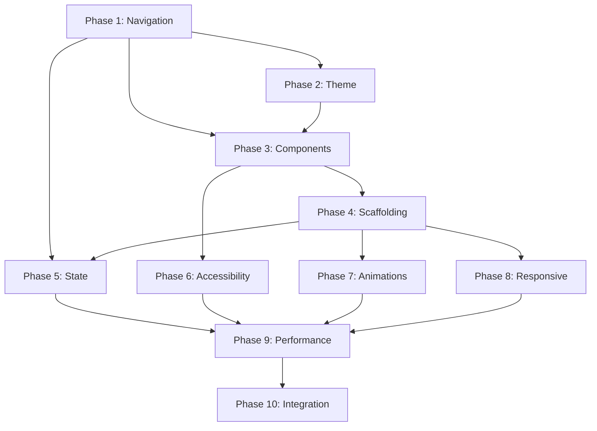

# UI Navigation Foundation - Tasks

## Prerequisites

### Required Reading
- [ ] Review `context.md` for business understanding
- [ ] Review `research.md` for technical decisions
- [ ] Review `requirements.md` for all user stories
- [ ] Review `design.md` for implementation approach
- [ ] Review global `architecture.md` for system context

### Development Environment
- [ ] Android Studio configured
- [ ] Kotlin 1.9+ installed
- [ ] Required dependencies available
- [ ] Test devices/emulators ready

### Dependencies
- [ ] Security Authentication feature completed (if applicable)

## Implementation Phases

### Phase 1: Core Navigation Setup

- [ ] 1.1: Create Navigation Structure
  - Set up Navigation Compose dependencies
  - Create Screen sealed class hierarchy
  - Implement AppNavigation composable
  - Configure navigation animations
  - _Requirements: 1.1, 1.2, 1.3, 1.4, 1.5, 1.6_

- [ ] 1.2: Implement Navigation Host
  - Create NavHost with all screen destinations
  - Set up navigation arguments
  - Configure deep link patterns
  - Handle navigation transitions
  - _Requirements: 1.2, 1.3, 6.1, 6.2, 6.3, 6.4, 6.5, 6.6_

- [ ] 1.3: Create Navigation Manager
  - Implement NavigationManager singleton
  - Create navigation event flow
  - Add navigation helper methods
  - Handle back stack operations
  - _Requirements: 1.4, 1.5, 1.6_

- [ ] 1.4: Setup Deep Link Handling
  - Configure AndroidManifest for deep links
  - Implement deep link parser
  - Create back stack builder
  - Test deep link scenarios
  - _Requirements: 6.1, 6.2, 6.3, 6.4, 6.5, 6.6_

### Phase 2: Theme System Implementation

- [ ] 2.1: Create Theme Configuration
  - Define color schemes for light/dark
  - Create custom color palette
  - Implement typography system
  - Define shape system
  - _Requirements: 2.1, 2.2, 2.6_

- [ ] 2.2: Implement Dynamic Colors
  - Add Android 12+ dynamic color support
  - Create fallback color schemes
  - Implement color extraction logic
  - Test on various wallpapers
  - _Requirements: 2.3_

- [ ] 2.3: Create Theme Manager
  - Implement theme preference storage
  - Create ThemeConfig data class
  - Add theme switching logic
  - Handle system theme following
  - _Requirements: 2.1, 2.2, 2.4, 2.5_

- [ ] 2.4: Implement Theme Persistence
  - Set up DataStore for preferences
  - Create theme preferences repository
  - Implement theme restoration
  - Add migration from SharedPreferences
  - _Requirements: 2.4_

### Phase 3: Base Components Library

- [ ] 3.1: Create Button Components
  - Implement PrimaryActionButton
  - Add loading state support
  - Create icon button variants
  - Add accessibility labels
  - _Requirements: 4.2, 5.1, 5.3_

- [ ] 3.2: Build Status Components
  - Create StatusChip component
  - Implement connection indicators
  - Add animated state transitions
  - Define semantic colors
  - _Requirements: 8.2, 9.4, 9.6_

- [ ] 3.3: Implement Card Components
  - Create ProjectCard component
  - Add click handling
  - Implement swipe actions
  - Style with Material 3
  - _Requirements: 8.1, 8.2, 8.6_

- [ ] 3.4: Create Loading Components
  - Implement LoadingOverlay
  - Create LoadingState screen
  - Add skeleton screens
  - Implement progress indicators
  - _Requirements: 4.3, 9.1, 9.5_

- [ ] 3.5: Build Error Components
  - Create ErrorState screen
  - Implement ErrorBanner
  - Add retry mechanisms
  - Create error illustrations
  - _Requirements: 4.4, 9.3_

### Phase 4: Screen Scaffolding

- [ ] 4.1: Create Base Screen
  - Implement BaseScreen composable
  - Add top app bar support
  - Configure system UI handling
  - Implement edge-to-edge
  - _Requirements: 4.1, 4.2_

- [ ] 4.2: Build Stateful Screen
  - Create StatefulScreen wrapper
  - Integrate with ViewModels
  - Handle loading/error states
  - Add pull-to-refresh
  - _Requirements: 4.3, 4.4, 10.5_

- [ ] 4.3: Implement Welcome Screen
  - Create welcome screen layout
  - Add branding elements
  - Implement get started action
  - Add animations
  - _Requirements: 1.1, 1.2_

- [ ] 4.4: Create Projects List Screen
  - Implement project list UI
  - Add empty state handling
  - Create FAB for new project
  - Implement list animations
  - _Requirements: 8.1, 8.2, 8.3, 8.4, 8.5, 8.6, 4.5_

- [ ] 4.5: Build Project Detail Container
  - Create project detail scaffold
  - Implement bottom navigation
  - Add tab switching logic
  - Handle nested navigation
  - _Requirements: 3.1, 3.2, 3.3, 3.4, 3.5, 3.6_

### Phase 5: State Management

- [ ] 5.1: Create Base ViewModel
  - Implement BaseViewModel class
  - Add UI state handling
  - Create event emission
  - Implement retry logic
  - _Requirements: 4.3, 4.4_

- [ ] 5.2: Define UI State
  - Create UiState sealed class
  - Add state transformations
  - Implement state helpers
  - Create state testing utils
  - _Requirements: 4.3, 4.4, 4.5_

- [ ] 5.3: Implement Error Handling
  - Create error message provider
  - Add error categorization
  - Implement retry policies
  - Create error logging
  - _Requirements: 4.4, 9.3_

- [ ] 5.4: Build Event System
  - Define UI event types
  - Create event handlers
  - Implement event collection
  - Add event testing
  - _Requirements: 9.2, 9.6_

### Phase 6: Accessibility Implementation

- [ ] 6.1: Add Screen Reader Support
  - Implement content descriptions
  - Create semantic properties
  - Add role definitions
  - Test with TalkBack
  - _Requirements: 5.1, 5.3, 5.4, 5.5_

- [ ] 6.2: Implement Keyboard Navigation
  - Add focus management
  - Create tab order logic
  - Handle arrow key navigation
  - Implement escape handling
  - _Requirements: 5.2_

- [ ] 6.3: Create Accessibility Components
  - Build accessible list items
  - Add skip navigation
  - Create live regions
  - Implement announcements
  - _Requirements: 5.1, 5.5_

- [ ] 6.4: Add Touch Target Sizing
  - Ensure 48dp minimum targets
  - Add touch target helpers
  - Implement click area expansion
  - Test with accessibility scanner
  - _Requirements: 5.6_

### Phase 7: Animation and Transitions

- [ ] 7.1: Implement Navigation Animations
  - Create slide transitions
  - Add fade animations
  - Implement shared elements
  - Handle animation preferences
  - _Requirements: 7.1, 7.2, 7.3, 7.4_

- [ ] 7.2: Add Component Animations
  - Animate loading states
  - Create expand/collapse
  - Add ripple effects
  - Implement state changes
  - _Requirements: 9.6, 7.5_

- [ ] 7.3: Build Gesture Support
  - Implement swipe navigation
  - Add pull-to-refresh
  - Create drag interactions
  - Handle back gestures
  - _Requirements: 10.1, 10.2, 10.3, 10.4, 10.5, 10.6_

- [ ] 7.4: Optimize Animation Performance
  - Profile animation frames
  - Reduce recomposition
  - Optimize animation specs
  - Test on low-end devices
  - _Requirements: 7.5, 7.6_

### Phase 8: Responsive Design

- [ ] 8.1: Handle Orientation Changes
  - Save navigation state
  - Preserve scroll positions
  - Maintain form data
  - Test configuration changes
  - _Requirements: 3.4, 3.5, 7.6_

- [ ] 8.2: Implement Window Size Classes
  - Detect device categories
  - Create responsive layouts
  - Handle foldables
  - Test on various devices
  - _Requirements: 2.6_

- [ ] 8.3: Add Adaptive Components
  - Create responsive grids
  - Implement flexible spacing
  - Add breakpoint handling
  - Build adaptive navigation
  - _Requirements: 4.1, 4.2_

- [ ] 8.4: Support Multi-Window
  - Handle split screen
  - Support pop-up view
  - Test picture-in-picture
  - Implement window focusing
  - _Requirements: 3.5, 1.6_

### Phase 9: Performance Optimization

- [ ] 9.1: Optimize Recomposition
  - Add stability annotations
  - Use remember correctly
  - Implement derivedStateOf
  - Profile compositions
  - _Requirements: 3.2, 7.3_

- [ ] 9.2: Implement Lazy Loading
  - Use LazyColumn efficiently
  - Add item recycling
  - Implement pagination
  - Optimize image loading
  - _Requirements: 8.3_

- [ ] 9.3: Add Performance Monitoring
  - Implement frame metrics
  - Track navigation timing
  - Monitor memory usage
  - Create performance logs
  - _Requirements: 7.5_

- [ ] 9.4: Create Baseline Profiles
  - Generate startup profiles
  - Optimize critical paths
  - Test performance gains
  - Document improvements
  - _Requirements: 3.2, 7.3_

### Phase 10: Integration and Polish

- [ ] 10.1: Integrate with Features
  - Connect navigation to features
  - Wire up view models
  - Test feature flows
  - Handle edge cases
  - _Requirements: All requirements_

- [ ] 10.2: Add Polish
  - Refine animations
  - Perfect spacing
  - Adjust colors
  - Smooth transitions
  - _Requirements: 2.6, 7.1, 7.2, 7.3, 7.6_

- [ ] 10.3: Implement Analytics
  - Track navigation events
  - Monitor theme usage
  - Log error rates
  - Create dashboards
  - _Requirements: 9.1, 9.2, 9.3, 9.4, 9.5_

- [ ] 10.4: Final Testing
  - Complete UI tests
  - Run accessibility audit
  - Performance testing
  - Device compatibility
  - _Requirements: All requirements_

## Task Dependencies

## Estimated Timeline

- **Phase 1**: 1 week (Navigation foundation)
- **Phase 2**: 3 days (Theme system)
- **Phase 3**: 1 week (Component library)
- **Phase 4**: 1 week (Screen scaffolding)
- **Phase 5**: 4 days (State management)
- **Phase 6**: 3 days (Accessibility)
- **Phase 7**: 3 days (Animations)
- **Phase 8**: 2 days (Responsive design)
- **Phase 9**: 3 days (Performance)
- **Phase 10**: 3 days (Integration)

**Total Estimated Duration**: 6 weeks

## Risk Mitigation

1. **Technical Risks**
   - Compose stability → Use stable versions only
   - Navigation complexity → Extensive testing
   - Theme migration → Gradual rollout

2. **Design Risks**
   - Inconsistent patterns → Design system documentation
   - Accessibility gaps → Early testing with TalkBack
   - Performance issues → Regular profiling

3. **Integration Risks**
   - Feature conflicts → Clear interfaces
   - State management → Centralized approach
   - Testing complexity → Comprehensive test suite

## Success Criteria

1. Navigation works flawlessly with proper back stack
2. Theme switching is instant with persistence
3. All components follow Material Design 3
4. 100% accessibility scanner pass rate
5. <16ms frame time for all animations
6. Zero crashes related to UI/navigation
7. All user stories acceptance criteria met