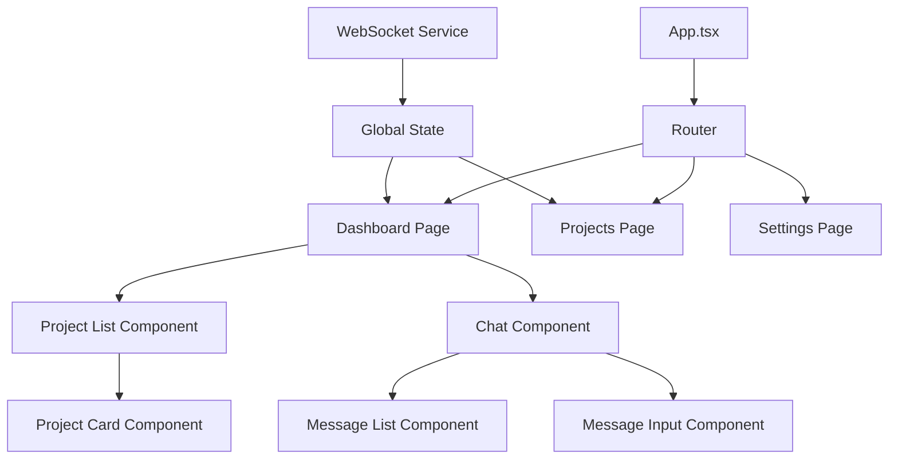

# Frontend-React Module Architecture

## Module Overview

**Module Name**: Frontend-React
**Description**: React web application frontend for Pocket Agent
**Technology Stack**: React, TypeScript, Tailwind CSS (planned)
**Directory**: frontend-react/ (to be created)

## Purpose and Scope

### Module Responsibilities
- Provide web-based user interface for Claude Code interaction
- Implement responsive design for desktop and tablet use
- Handle WebSocket connections to server components
- Provide browser-based authentication and session management
- Implement real-time updates and notifications
- Support offline capabilities with service workers

### Module Boundaries
- **Does NOT handle**: Server-side logic, mobile-specific features, native device APIs
- **Integrates with**: Pocket Agent server via WebSocket and REST APIs
- **Exposes**: Web interface accessible via browser for Claude Code interactions

## Technology Stack (Planned)

### Core Technologies
- **Language**: TypeScript 5.x
- **Framework**: React 18+ with hooks and concurrent features
- **Build Tool**: Vite for fast development and optimized builds
- **Package Manager**: npm or pnpm

### Frontend Framework
- **UI Library**: React with functional components and hooks
- **Styling**: Tailwind CSS for utility-first styling
- **State Management**: Zustand or Redux Toolkit for global state
- **Router**: React Router for client-side navigation

### Key Dependencies (Planned)
- **WebSocket**: Native WebSocket API or ws library
- **HTTP Client**: Axios or fetch API for REST calls
- **Forms**: React Hook Form for form handling
- **Validation**: Zod for runtime type validation
- **Icons**: Lucide React or Heroicons for consistent iconography
- **Notifications**: React Hot Toast for user notifications

### Development Tools (Planned)
- **Testing**: Vitest and React Testing Library
- **Type Checking**: TypeScript compiler with strict mode
- **Linting**: ESLint with React and TypeScript rules
- **Formatting**: Prettier for consistent code formatting
- **Bundling**: Vite with tree shaking and code splitting

## Module Structure (Planned)

### Directory Organization
```
frontend-react/
├── public/
│   ├── index.html          # HTML template
│   └── favicon.ico         # App icon
├── src/
│   ├── components/         # Reusable UI components
│   │   ├── ui/            # Basic UI components (Button, Input, etc.)
│   │   ├── layout/        # Layout components (Header, Sidebar)
│   │   └── features/      # Feature-specific components
│   ├── pages/             # Page components
│   │   ├── Dashboard.tsx
│   │   ├── Projects.tsx
│   │   └── Settings.tsx
│   ├── hooks/             # Custom React hooks
│   │   ├── useWebSocket.ts
│   │   ├── useAuth.ts
│   │   └── useProjects.ts
│   ├── services/          # API and business logic
│   │   ├── api.ts         # REST API client
│   │   ├── websocket.ts   # WebSocket client
│   │   └── auth.ts        # Authentication service
│   ├── store/             # Global state management
│   │   ├── index.ts       # Store configuration
│   │   ├── auth.ts        # Auth state slice
│   │   └── projects.ts    # Projects state slice
│   ├── types/             # TypeScript type definitions
│   │   ├── api.ts         # API response types
│   │   └── models.ts      # Data model types
│   ├── utils/             # Utility functions
│   │   ├── validation.ts  # Form validation schemas
│   │   └── formatters.ts  # Data formatting utilities
│   ├── styles/            # Global styles and themes
│   │   ├── globals.css    # Global CSS
│   │   └── themes.ts      # Theme configuration
│   ├── App.tsx            # Root application component
│   ├── main.tsx           # Application entry point
│   └── vite-env.d.ts      # Vite type definitions
├── package.json           # Dependencies and scripts
├── vite.config.ts         # Vite configuration
├── tailwind.config.js     # Tailwind CSS configuration
├── tsconfig.json          # TypeScript configuration
├── eslint.config.js       # ESLint configuration
└── README.md              # React app documentation
```

### Key Entry Points
- **Main File**: src/main.tsx
- **App Component**: src/App.tsx
- **Configuration**: vite.config.ts
- **Types**: src/types/

## Internal Architecture

### Architectural Patterns
- **Pattern**: Component-based architecture with hooks
- **Justification**: React's natural patterns, maintainable and testable
- **Implementation**: 
  - Functional components with React hooks
  - Custom hooks for business logic
  - Context API or Zustand for state management
  - Service layer for API interactions

### Component Organization


### Data Flow
1. **Input**: User interactions via React components
2. **State Management**: Global state updates via Zustand/Redux
3. **API Calls**: Service layer handles WebSocket and REST communication
4. **UI Updates**: React re-renders based on state changes
5. **Persistence**: Browser storage for offline capabilities

## Module APIs and Interfaces

### Public Interfaces
This module exposes interfaces to other modules:

#### Web Application Interface
- **Type**: Browser-based web application
- **Purpose**: Provide web access to Claude Code functionality
- **Contract**: Standard web technologies (HTML, CSS, JavaScript)
- **Authentication**: Browser-based session management
- **Example**: https://pocketagent.dev or http://localhost:3000

### Integration Points
How this module integrates with others:

#### Server WebSocket Integration
- **Target Module**: Server
- **Method**: WebSocket connection with JSON message protocol
- **Data**: Commands, responses, permission requests, real-time updates
- **Frequency**: Real-time bidirectional communication

#### Server REST API Integration
- **Target Module**: Server
- **Method**: HTTP REST calls for non-real-time operations
- **Data**: Configuration, user preferences, session management
- **Frequency**: On-demand API calls

## Data Management (Planned)

### Data Models
Core data structures used in this module:

```typescript
interface ServerProfile {
  id: string;
  name: string;
  hostname: string;
  port: number;
  isDefault: boolean;
}

interface Project {
  id: string;
  name: string;
  serverProfileId: string;
  path: string;
  description?: string;
  lastAccessed: Date;
}

interface ChatMessage {
  id: string;
  type: 'user' | 'claude' | 'system';
  content: string;
  timestamp: Date;
  sessionId: string;
}

interface WebSocketMessage {
  type: string;
  sessionId: string;
  payload: unknown;
  timestamp: Date;
}
```

### Data Storage
- **Global State**: Zustand/Redux for application state
- **Local Storage**: Browser localStorage for user preferences
- **Session Storage**: Browser sessionStorage for temporary data
- **Cache**: React Query or SWR for API response caching

### Data Validation
- **Form Validation**: React Hook Form with Zod schemas
- **API Validation**: Runtime type checking with Zod
- **Error Handling**: Error boundaries and user-friendly error messages

## Configuration and Environment

### Configuration Management (Planned)
- **Environment Variables**: .env files for different environments
- **Build Configuration**: Vite configuration for build optimization
- **Runtime Config**: Environment-specific API endpoints
- **Feature Flags**: Environment-based feature toggles

### Environment Support
- **Development**: Local development server with hot reload
- **Testing**: Test environment with mock services
- **Staging**: Pre-production environment for testing
- **Production**: Optimized build with CDN deployment

## Security Architecture

### Authentication and Authorization
- **Web Authentication**: Browser-based session management
- **SSH Key Handling**: Secure upload and management of SSH keys
- **Session Management**: JWT tokens or secure cookies
- **Permission Handling**: Role-based access control for different features

### Data Security
- **HTTPS**: All communication over encrypted connections
- **Input Sanitization**: XSS protection and input validation
- **CSP**: Content Security Policy headers
- **CSRF Protection**: Cross-site request forgery protection

## Performance and Scalability

### Performance Characteristics (Targets)
- **Initial Load**: Under 3 seconds on 3G networks
- **Runtime Performance**: 60 FPS animations and interactions
- **Bundle Size**: Under 500KB gzipped for initial bundle
- **Memory Usage**: Efficient memory management with cleanup

### Scaling Strategies
- **Code Splitting**: Route-based and component-based code splitting
- **Lazy Loading**: Load components and data on demand
- **Caching**: Aggressive caching of static assets
- **CDN**: Content delivery network for global distribution

## Testing Strategy (Planned)

### Test Structure
```
src/
├── components/
│   ├── __tests__/         # Component tests
│   └── ui/
│       └── __tests__/     # UI component tests
├── pages/
│   └── __tests__/         # Page component tests
├── hooks/
│   └── __tests__/         # Custom hook tests
├── services/
│   └── __tests__/         # Service layer tests
└── utils/
    └── __tests__/         # Utility function tests
```

### Testing Approach
- **Unit Testing**: Component and function testing with Vitest
- **Integration Testing**: Multi-component interaction testing
- **E2E Testing**: Playwright or Cypress for full user journeys
- **Accessibility Testing**: axe-core for accessibility compliance

### Test Dependencies
- **Testing Library**: React Testing Library for component testing
- **Mock Service Worker**: MSW for API mocking
- **User Event**: @testing-library/user-event for user interaction simulation

## Deployment and Operations

### Build Process (Planned)
1. **Dependencies**: npm install resolves package dependencies
2. **Type Checking**: TypeScript compiler validates types
3. **Linting**: ESLint checks code quality and style
4. **Testing**: Vitest runs all test suites
5. **Building**: Vite builds optimized production bundle
6. **Deployment**: Static files deployed to CDN or web server

### Monitoring and Observability (Planned)
- **Error Tracking**: Sentry or similar for error monitoring
- **Performance Monitoring**: Web Vitals and Core Web Vitals tracking
- **Analytics**: Privacy-compliant user analytics
- **Logging**: Client-side error logging and debugging

### Health Checks
- **Application Health**: Service worker health checks
- **Network Health**: WebSocket connection monitoring
- **Performance**: Runtime performance monitoring

## Development Workflow (Planned)

### Local Development
1. **Setup**: Node.js installation, npm install
2. **Development**: npm run dev for local development server
3. **Testing**: npm run test for test execution
4. **Building**: npm run build for production build

### Code Quality
- **Linting**: ESLint with TypeScript and React rules
- **Formatting**: Prettier for consistent code formatting
- **Type Checking**: TypeScript with strict mode enabled
- **Review Process**: Pull request workflow with automated checks

## Dependencies and Integration

### External Dependencies (Planned)
- **React Ecosystem**: React, React DOM, React Router
- **Build Tools**: Vite, TypeScript, PostCSS
- **UI Framework**: Tailwind CSS, Headless UI components
- **State Management**: Zustand or Redux Toolkit

### Module Dependencies
- **Server Module**: WebSocket and REST API integration
- **Shared Protocol**: Message format definitions with other frontends

## Migration and Evolution

### Version Management (Planned)
- **Semantic Versioning**: Standard semver for application releases
- **API Compatibility**: Graceful handling of server API changes
- **Feature Flags**: Toggle new features without deployment

### Technical Debt
- **Current State**: Module not yet implemented
- **Implementation Plan**: Start with basic React app and WebSocket connection
- **Future Enhancements**: Advanced UI features, offline support, PWA

## Troubleshooting (Planned)

### Common Issues
- **Connection Issues**: WebSocket connection troubleshooting
- **Performance Issues**: Bundle size and runtime performance debugging
- **Browser Compatibility**: Cross-browser testing and polyfills

### Debugging Guide
- **React DevTools**: Component tree and state inspection
- **Network Tab**: WebSocket and HTTP request monitoring
- **Console Logs**: Structured logging for debugging

## Implementation Roadmap

### Phase 1: Basic React Application
- Set up Vite + React + TypeScript project
- Implement basic routing and layout components
- Create placeholder pages for main features

### Phase 2: WebSocket Integration
- Implement WebSocket client service
- Create chat interface for Claude Code interaction
- Add real-time message handling

### Phase 3: Feature Completion
- Implement project management interface
- Add server profile configuration
- Create settings and preferences pages

### Phase 4: Production Polish
- Add comprehensive error handling
- Implement offline support with service workers
- Add monitoring and analytics

---

*Module: Frontend-React*
*Architecture Version: 1.0*
*Last Updated: 2025-01-27*
*Status: Planned - Not Yet Implemented*
*Technology Stack: React, TypeScript, Tailwind CSS (planned)*