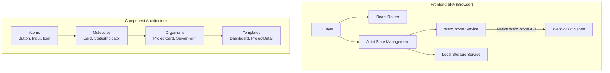

# Design Document: Application Base

## Executive Summary

This design document outlines the technical architecture and implementation approach for the application-base feature of the frontend-spa module. The design focuses on creating a mobile-first React SPA foundation with WebSocket-based real-time communication, atomic state management using Jotai, and a reusable component library following atomic design principles.

## Architecture Overview

### System Architecture



### Directory Structure

```
frontend-spa/
├── public/
│   ├── index.html          # Mobile-optimized HTML with viewport meta
│   └── favicon.ico
├── src/
│   ├── components/
│   │   ├── ui/            # Reusable component library
│   │   │   ├── atoms/
│   │   │   │   ├── Button.tsx
│   │   │   │   ├── Input.tsx
│   │   │   │   ├── IconButton.tsx
│   │   │   │   └── index.ts
│   │   │   ├── molecules/
│   │   │   │   ├── Card.tsx
│   │   │   │   ├── StatusIndicator.tsx
│   │   │   │   ├── SegmentedControl.tsx
│   │   │   │   └── index.ts
│   │   │   └── organisms/
│   │   │       ├── ProjectCard.tsx
│   │   │       ├── ServerForm.tsx
│   │   │       ├── EmptyState.tsx
│   │   │       └── index.ts
│   │   └── features/
│   │       ├── dashboard/
│   │       │   ├── Dashboard.tsx
│   │       │   ├── AddProjectModal.tsx
│   │       │   └── hooks/
│   │       └── project/
│   │           ├── ProjectDetail.tsx
│   │           ├── ProjectTabs.tsx
│   │           └── hooks/
│   ├── services/
│   │   ├── websocket/
│   │   │   ├── WebSocketService.ts
│   │   │   ├── WebSocketContext.tsx
│   │   │   └── hooks.ts
│   │   └── storage/
│   │       ├── LocalStorageService.ts
│   │       └── hooks.ts
│   ├── store/
│   │   ├── atoms/
│   │   │   ├── projects.ts
│   │   │   ├── servers.ts
│   │   │   ├── ui.ts
│   │   │   └── websocket.ts
│   │   └── hooks/
│   │       ├── useProjects.ts
│   │       ├── useServers.ts
│   │       └── useWebSocket.ts
│   ├── types/
│   │   ├── messages.ts      # From test-client
│   │   ├── models.ts        # Project, Server entities
│   │   └── index.ts
│   ├── styles/
│   │   ├── globals.css      # Tailwind imports
│   │   └── themes.ts        # Theme constants
│   ├── utils/
│   │   ├── constants.ts
│   │   └── helpers.ts
│   ├── App.tsx
│   ├── Router.tsx
│   └── main.tsx
├── .env.example
├── index.html
├── package.json
├── tsconfig.json
├── vite.config.ts
└── tailwind.config.js
```

## Component Design

### Component Library Architecture

Following atomic design principles with mobile-first approach:

#### Atoms (Basic Building Blocks)

```typescript
// Button.tsx
interface ButtonProps {
  variant?: 'primary' | 'secondary' | 'ghost';
  size?: 'sm' | 'md' | 'lg';
  fullWidth?: boolean;
  loading?: boolean;
  disabled?: boolean;
  onPress: () => void; // Touch-optimized naming
  children: React.ReactNode;
  ariaLabel?: string;
}

// Input.tsx
interface InputProps {
  type?: 'text' | 'url' | 'search';
  placeholder?: string;
  value: string;
  onChange: (value: string) => void;
  error?: string;
  label?: string;
  required?: boolean;
  autoComplete?: string;
  inputMode?: 'text' | 'url' | 'none';
}

// IconButton.tsx
interface IconButtonProps {
  icon: LucideIcon;
  onPress: () => void;
  size?: 'sm' | 'md' | 'lg';
  variant?: 'ghost' | 'solid';
  ariaLabel: string; // Required for accessibility
}
```

#### Molecules (Composite Components)

```typescript
// Card.tsx
interface CardProps {
  onPress?: () => void;
  pressed?: boolean;
  children: React.ReactNode;
  padding?: 'sm' | 'md' | 'lg';
}

// StatusIndicator.tsx
interface StatusIndicatorProps {
  status: 'connected' | 'disconnected' | 'connecting' | 'error';
  size?: 'sm' | 'md';
  label?: string;
}

// SegmentedControl.tsx
interface SegmentedControlProps<T extends string> {
  options: Array<{ value: T; label: string }>;
  value: T;
  onChange: (value: T) => void;
  fullWidth?: boolean;
}
```

#### Organisms (Feature Components)

```typescript
// ProjectCard.tsx
interface ProjectCardProps {
  project: Project;
  server: Server;
  onPress: () => void;
  onDisconnect?: () => void;
}

// ServerForm.tsx
interface ServerFormProps {
  onSubmit: (server: Omit<Server, 'id' | 'isConnected'>) => void;
  onCancel: () => void;
  initialValues?: Partial<Server>;
}
```

### Component Implementation Patterns

```typescript
// Example: Button component with mobile optimizations
import { forwardRef } from 'react';
import { cn } from '@/utils/cn';

const Button = forwardRef<HTMLButtonElement, ButtonProps>(
  ({ variant = 'primary', size = 'md', fullWidth = false, loading = false, disabled = false, onPress, children, ariaLabel }, ref) => {
    const baseClasses = 'inline-flex items-center justify-center font-medium transition-colors focus-visible:outline-none focus-visible:ring-2 disabled:opacity-50 disabled:pointer-events-none active:scale-95';
    
    const variants = {
      primary: 'bg-blue-600 text-white hover:bg-blue-700 focus-visible:ring-blue-600',
      secondary: 'bg-gray-200 text-gray-900 hover:bg-gray-300 focus-visible:ring-gray-500',
      ghost: 'hover:bg-gray-100 focus-visible:ring-gray-500'
    };
    
    const sizes = {
      sm: 'h-9 px-3 text-sm',
      md: 'h-11 px-4 text-base', // 44px height for touch targets
      lg: 'h-12 px-6 text-lg'    // 48px height
    };
    
    return (
      <button
        ref={ref}
        className={cn(
          baseClasses,
          variants[variant],
          sizes[size],
          fullWidth && 'w-full',
          loading && 'cursor-wait'
        )}
        disabled={disabled || loading}
        onClick={onPress}
        aria-label={ariaLabel}
        aria-busy={loading}
      >
        {loading ? (
          <span className="animate-spin h-4 w-4 border-2 border-current border-t-transparent rounded-full mr-2" />
        ) : null}
        {children}
      </button>
    );
  }
);

Button.displayName = 'Button';
```

## State Management Design

### Jotai Atoms Structure

```typescript
// store/atoms/projects.ts
import { atom } from 'jotai';
import { atomWithStorage } from 'jotai/utils';
import { Project } from '@/types/models';

export const projectsAtom = atomWithStorage<Project[]>('projects', []);
export const selectedProjectIdAtom = atom<string | null>(null);
export const selectedProjectAtom = atom(
  (get) => {
    const projects = get(projectsAtom);
    const selectedId = get(selectedProjectIdAtom);
    return projects.find(p => p.id === selectedId) || null;
  }
);

// store/atoms/servers.ts
import { atom } from 'jotai';
import { atomWithStorage } from 'jotai/utils';
import { Server } from '@/types/models';

export const serversAtom = atomWithStorage<Server[]>('servers', []);
export const serverConnectionStatesAtom = atom<Map<string, boolean>>(new Map());

// store/atoms/websocket.ts
import { atom } from 'jotai';
import { WebSocketService } from '@/services/websocket/WebSocketService';

export const websocketServicesAtom = atom<Map<string, WebSocketService>>(new Map());
export const websocketMessagesAtom = atom<Map<string, any[]>>(new Map());

// store/atoms/ui.ts
import { atom } from 'jotai';

export const themeAtom = atomWithStorage<'light' | 'dark'>('theme', 'light');
export const loadingAtom = atom(false);
export const errorAtom = atom<string | null>(null);
```

### Custom Hooks

```typescript
// store/hooks/useProjects.ts
import { useAtom, useSetAtom } from 'jotai';
import { projectsAtom, selectedProjectIdAtom } from '../atoms/projects';
import { v4 as uuidv4 } from 'uuid';

export function useProjects() {
  const [projects, setProjects] = useAtom(projectsAtom);
  const setSelectedProjectId = useSetAtom(selectedProjectIdAtom);
  
  const addProject = (project: Omit<Project, 'id'>) => {
    const newProject: Project = {
      ...project,
      id: uuidv4()
    };
    setProjects(prev => [...prev, newProject]);
    return newProject;
  };
  
  const removeProject = (id: string) => {
    setProjects(prev => prev.filter(p => p.id !== id));
  };
  
  const selectProject = (id: string) => {
    setSelectedProjectId(id);
  };
  
  return {
    projects,
    addProject,
    removeProject,
    selectProject
  };
}
```

## WebSocket Service Design

### WebSocket Service Implementation

```typescript
// services/websocket/WebSocketService.ts
import { EventEmitter } from 'events';
import { ClientMessage, ServerMessage } from '@/types/messages';

export class WebSocketService extends EventEmitter {
  private ws: WebSocket | null = null;
  private url: string;
  private reconnectAttempts = 0;
  private maxReconnectAttempts = 5;
  private reconnectDelay = 1000;
  private pingInterval: number | null = null;
  private joinedProjects = new Set<string>();

  constructor(url: string) {
    super();
    this.url = url;
  }

  connect(): Promise<void> {
    return new Promise((resolve, reject) => {
      try {
        // Determine protocol based on URL
        const wsUrl = this.url.startsWith('wss://') || this.url.startsWith('ws://') 
          ? this.url 
          : `${window.location.protocol === 'https:' ? 'wss://' : 'ws://'}${this.url}`;
        
        this.ws = new WebSocket(wsUrl);
        
        const timeout = setTimeout(() => {
          if (this.ws?.readyState === WebSocket.CONNECTING) {
            this.ws.close();
            reject(new Error('Connection timeout'));
          }
        }, 10000);

        this.ws.onopen = () => {
          clearTimeout(timeout);
          this.reconnectAttempts = 0;
          this.emit('connected');
          this.startPing();
          this.rejoinProjects();
          resolve();
        };

        this.ws.onmessage = (event) => {
          try {
            const message: ServerMessage = JSON.parse(event.data);
            this.emit('message', message);
            this.emit(message.type, message);
          } catch (error) {
            console.error('Failed to parse message:', error);
          }
        };

        this.ws.onerror = (error) => {
          clearTimeout(timeout);
          this.emit('error', error);
          reject(error);
        };

        this.ws.onclose = () => {
          clearTimeout(timeout);
          this.stopPing();
          this.emit('disconnected');
          this.ws = null;
          this.attemptReconnect();
        };
      } catch (error) {
        reject(error);
      }
    });
  }

  private attemptReconnect() {
    if (this.reconnectAttempts >= this.maxReconnectAttempts) {
      this.emit('reconnectFailed');
      return;
    }

    this.reconnectAttempts++;
    const delay = this.reconnectDelay * Math.pow(2, this.reconnectAttempts - 1);
    
    setTimeout(() => {
      this.emit('reconnecting', this.reconnectAttempts);
      this.connect().catch(() => {
        // Error handled in connect method
      });
    }, delay);
  }

  private startPing() {
    this.pingInterval = window.setInterval(() => {
      if (this.isConnected()) {
        // Send a ping message if needed by the protocol
      }
    }, 30000);
  }

  private stopPing() {
    if (this.pingInterval) {
      clearInterval(this.pingInterval);
      this.pingInterval = null;
    }
  }

  private rejoinProjects() {
    this.joinedProjects.forEach(projectId => {
      this.send({
        type: 'project_join',
        data: { project_id: projectId }
      });
    });
  }

  send(message: ClientMessage): void {
    if (!this.isConnected()) {
      throw new Error('WebSocket is not connected');
    }
    this.ws!.send(JSON.stringify(message));
  }

  joinProject(projectId: string) {
    this.joinedProjects.add(projectId);
    if (this.isConnected()) {
      this.send({
        type: 'project_join',
        data: { project_id: projectId }
      });
    }
  }

  leaveProject(projectId: string) {
    this.joinedProjects.delete(projectId);
    if (this.isConnected()) {
      this.send({
        type: 'project_leave',
        project_id: projectId
      });
    }
  }

  isConnected(): boolean {
    return this.ws !== null && this.ws.readyState === WebSocket.OPEN;
  }

  disconnect() {
    this.reconnectAttempts = this.maxReconnectAttempts; // Prevent auto-reconnect
    this.ws?.close();
  }
}
```

### WebSocket React Integration

```typescript
// services/websocket/hooks.ts
import { useEffect } from 'react';
import { useAtom } from 'jotai';
import { websocketServicesAtom } from '@/store/atoms/websocket';
import { WebSocketService } from './WebSocketService';

export function useWebSocket(serverId: string, url: string) {
  const [services, setServices] = useAtom(websocketServicesAtom);
  
  useEffect(() => {
    if (!services.has(serverId)) {
      const service = new WebSocketService(url);
      setServices(prev => new Map(prev).set(serverId, service));
      service.connect();
    }
    
    return () => {
      // Cleanup handled elsewhere to maintain persistent connections
    };
  }, [serverId, url]);
  
  return services.get(serverId);
}

export function useWebSocketMessage(serverId: string, messageType: string, handler: (message: any) => void) {
  const [services] = useAtom(websocketServicesAtom);
  const service = services.get(serverId);
  
  useEffect(() => {
    if (!service) return;
    
    service.on(messageType, handler);
    return () => {
      service.off(messageType, handler);
    };
  }, [service, messageType, handler]);
}
```

## Data Models

### TypeScript Interfaces

```typescript
// types/models.ts
export interface Project {
  id: string;
  name: string;
  path: string;
  serverId: string;
  createdAt: string;
  lastActive: string;
}

export interface Server {
  id: string;
  name: string;
  websocketUrl: string;
  isConnected: boolean;
}

// types/index.ts
export * from './messages'; // Re-export from test-client
export * from './models';
```

## Screen Implementations

### Dashboard Screen

```typescript
// components/features/dashboard/Dashboard.tsx
import { useProjects } from '@/store/hooks/useProjects';
import { useServers } from '@/store/hooks/useServers';
import { ProjectCard } from '@/components/ui/organisms/ProjectCard';
import { EmptyState } from '@/components/ui/organisms/EmptyState';
import { Button } from '@/components/ui/atoms/Button';
import { Plus } from 'lucide-react';

export function Dashboard() {
  const { projects } = useProjects();
  const { servers } = useServers();
  const [showAddProject, setShowAddProject] = useState(false);
  
  return (
    <div className="min-h-screen bg-gray-50 dark:bg-gray-900">
      <header className="sticky top-0 z-10 bg-white dark:bg-gray-800 border-b border-gray-200 dark:border-gray-700">
        <div className="px-4 py-4 flex items-center justify-between">
          <h1 className="text-xl font-semibold">Projects</h1>
          <Button
            variant="primary"
            size="sm"
            onPress={() => setShowAddProject(true)}
            ariaLabel="Add new project"
          >
            <Plus className="h-4 w-4 mr-1" />
            Add Project
          </Button>
        </div>
      </header>
      
      <main className="p-4">
        {projects.length === 0 ? (
          <EmptyState
            title="No projects yet"
            description="Create your first project to get started"
            action={{
              label: "Add Project",
              onPress: () => setShowAddProject(true)
            }}
          />
        ) : (
          <div className="space-y-3">
            {projects.map(project => {
              const server = servers.find(s => s.id === project.serverId);
              return server ? (
                <ProjectCard
                  key={project.id}
                  project={project}
                  server={server}
                  onPress={() => navigateToProject(project.id)}
                />
              ) : null;
            })}
          </div>
        )}
      </main>
      
      {showAddProject && (
        <AddProjectModal onClose={() => setShowAddProject(false)} />
      )}
    </div>
  );
}
```

### Project Detail Screen

```typescript
// components/features/project/ProjectDetail.tsx
import { useParams } from 'react-router-dom';
import { useAtomValue } from 'jotai';
import { selectedProjectAtom } from '@/store/atoms/projects';
import { SegmentedControl } from '@/components/ui/molecules/SegmentedControl';
import { StatusIndicator } from '@/components/ui/molecules/StatusIndicator';
import { ArrowLeft } from 'lucide-react';

type TabValue = 'chat' | 'files' | 'monitor' | 'settings';

export function ProjectDetail() {
  const { projectId } = useParams();
  const project = useAtomValue(selectedProjectAtom);
  const [activeTab, setActiveTab] = useState<TabValue>('chat');
  
  if (!project) {
    return <Navigate to="/" />;
  }
  
  return (
    <div className="min-h-screen bg-gray-50 dark:bg-gray-900">
      <header className="sticky top-0 z-10 bg-white dark:bg-gray-800 border-b border-gray-200 dark:border-gray-700">
        <div className="px-4 py-3">
          <div className="flex items-center gap-3 mb-3">
            <IconButton
              icon={ArrowLeft}
              onPress={() => navigate('/')}
              ariaLabel="Back to dashboard"
              variant="ghost"
            />
            <h1 className="text-lg font-semibold flex-1 truncate">{project.name}</h1>
            <StatusIndicator status={server?.isConnected ? 'connected' : 'disconnected'} />
          </div>
          
          <SegmentedControl
            options={[
              { value: 'chat', label: 'Chat' },
              { value: 'files', label: 'Files' },
              { value: 'monitor', label: 'Monitor' },
              { value: 'settings', label: 'Settings' }
            ]}
            value={activeTab}
            onChange={setActiveTab}
            fullWidth
          />
        </div>
      </header>
      
      <main className="p-4">
        {!server?.isConnected && (
          <Card className="mb-4 p-4 bg-yellow-50 dark:bg-yellow-900/20 border-yellow-200 dark:border-yellow-800">
            <p className="text-sm text-yellow-800 dark:text-yellow-200">
              Not connected to server. Check your connection.
            </p>
          </Card>
        )}
        
        <div className="min-h-[50vh] flex items-center justify-center text-gray-500">
          <p>Coming soon: {activeTab}</p>
        </div>
      </main>
    </div>
  );
}
```

## Error Handling Strategy

### Error Boundaries

```typescript
// components/ErrorBoundary.tsx
class ErrorBoundary extends Component<{ children: ReactNode }, { hasError: boolean }> {
  state = { hasError: false };
  
  static getDerivedStateFromError() {
    return { hasError: true };
  }
  
  componentDidCatch(error: Error, errorInfo: ErrorInfo) {
    console.error('Error caught by boundary:', error, errorInfo);
  }
  
  render() {
    if (this.state.hasError) {
      return (
        <div className="min-h-screen flex items-center justify-center p-4">
          <Card className="max-w-sm w-full p-6 text-center">
            <h2 className="text-lg font-semibold mb-2">Something went wrong</h2>
            <p className="text-gray-600 mb-4">Please refresh the page to try again.</p>
            <Button onPress={() => window.location.reload()}>Refresh</Button>
          </Card>
        </div>
      );
    }
    
    return this.props.children;
  }
}
```

### WebSocket Error Handling

```typescript
// In WebSocket hooks
export function useWebSocketError(serverId: string) {
  const [error, setError] = useAtom(errorAtom);
  const service = useWebSocket(serverId);
  
  useEffect(() => {
    if (!service) return;
    
    const handleError = (error: any) => {
      setError(error.message || 'Connection error');
    };
    
    const handleReconnectFailed = () => {
      setError('Failed to reconnect. Please check your connection.');
    };
    
    service.on('error', handleError);
    service.on('reconnectFailed', handleReconnectFailed);
    
    return () => {
      service.off('error', handleError);
      service.off('reconnectFailed', handleReconnectFailed);
    };
  }, [service]);
}
```

## Theme Implementation

### Theme Configuration

```typescript
// styles/themes.ts
export const themes = {
  light: {
    background: 'bg-gray-50',
    surface: 'bg-white',
    text: 'text-gray-900',
    border: 'border-gray-200'
  },
  dark: {
    background: 'bg-gray-900',
    surface: 'bg-gray-800',
    text: 'text-gray-100',
    border: 'border-gray-700'
  }
};

// App.tsx theme implementation
function App() {
  const [theme] = useAtom(themeAtom);
  
  useEffect(() => {
    document.documentElement.classList.toggle('dark', theme === 'dark');
  }, [theme]);
  
  return (
    <ErrorBoundary>
      <Router />
    </ErrorBoundary>
  );
}
```

## Performance Optimizations

### Code Splitting

```typescript
// Router.tsx with lazy loading
import { lazy, Suspense } from 'react';

const Dashboard = lazy(() => import('./components/features/dashboard/Dashboard'));
const ProjectDetail = lazy(() => import('./components/features/project/ProjectDetail'));
const Settings = lazy(() => import('./components/features/settings/Settings'));

export function Router() {
  return (
    <BrowserRouter>
      <Suspense fallback={<LoadingScreen />}>
        <Routes>
          <Route path="/" element={<Dashboard />} />
          <Route path="/project/:projectId" element={<ProjectDetail />} />
          <Route path="/settings" element={<Settings />} />
        </Routes>
      </Suspense>
    </BrowserRouter>
  );
}
```

### Mobile Optimizations

```typescript
// vite.config.ts
export default defineConfig({
  plugins: [react()],
  build: {
    rollupOptions: {
      output: {
        manualChunks: {
          'react-vendor': ['react', 'react-dom', 'react-router-dom'],
          'state-vendor': ['jotai'],
          'ui-vendor': ['lucide-react']
        }
      }
    },
    target: 'es2015',
    minify: 'terser',
    terserOptions: {
      compress: {
        drop_console: true
      }
    }
  }
});
```

## Testing Strategy

### Component Testing

```typescript
// __tests__/components/ui/atoms/Button.test.tsx
import { render, fireEvent } from '@testing-library/react';
import { Button } from '@/components/ui/atoms/Button';

describe('Button', () => {
  it('renders with correct text', () => {
    const { getByText } = render(
      <Button onPress={() => {}}>Click me</Button>
    );
    expect(getByText('Click me')).toBeInTheDocument();
  });
  
  it('calls onPress when clicked', () => {
    const handlePress = jest.fn();
    const { getByRole } = render(
      <Button onPress={handlePress}>Click</Button>
    );
    fireEvent.click(getByRole('button'));
    expect(handlePress).toHaveBeenCalledTimes(1);
  });
  
  it('has minimum touch target size', () => {
    const { getByRole } = render(
      <Button onPress={() => {}}>Touch</Button>
    );
    const button = getByRole('button');
    const styles = window.getComputedStyle(button);
    expect(parseInt(styles.height)).toBeGreaterThanOrEqual(44);
  });
});
```

### WebSocket Testing

```typescript
// __tests__/services/websocket/WebSocketService.test.ts
import { WebSocketService } from '@/services/websocket/WebSocketService';
import WS from 'jest-websocket-mock';

describe('WebSocketService', () => {
  let server: WS;
  let service: WebSocketService;
  
  beforeEach(async () => {
    server = new WS('ws://localhost:8443');
    service = new WebSocketService('ws://localhost:8443');
  });
  
  afterEach(() => {
    WS.clean();
  });
  
  it('connects successfully', async () => {
    const connectPromise = service.connect();
    await server.connected;
    await connectPromise;
    expect(service.isConnected()).toBe(true);
  });
  
  it('handles reconnection', async () => {
    await service.connect();
    await server.connected;
    
    server.close();
    await new Promise(resolve => setTimeout(resolve, 100));
    
    await server.connected; // Wait for reconnection
    expect(service.isConnected()).toBe(true);
  });
});
```

## Security Considerations

### Content Security Policy

```html
<!-- index.html -->
<meta http-equiv="Content-Security-Policy" 
      content="default-src 'self'; 
               connect-src 'self' ws: wss:; 
               style-src 'self' 'unsafe-inline'; 
               script-src 'self' 'unsafe-inline' 'unsafe-eval';">
```

### Input Sanitization

```typescript
// utils/sanitize.ts
export function sanitizeUrl(url: string): string {
  try {
    const parsed = new URL(url);
    if (!['ws:', 'wss:'].includes(parsed.protocol)) {
      throw new Error('Invalid protocol');
    }
    return parsed.toString();
  } catch {
    throw new Error('Invalid WebSocket URL');
  }
}

export function sanitizePath(path: string): string {
  // Remove potentially dangerous characters
  return path.replace(/[<>:"\\|?*]/g, '');
}
```

## Build Configuration

### Package.json

```json
{
  "name": "pocket-agent-frontend-spa",
  "version": "0.1.0",
  "type": "module",
  "scripts": {
    "dev": "vite",
    "build": "tsc && vite build",
    "preview": "vite preview",
    "test": "vitest",
    "lint": "eslint src --ext ts,tsx",
    "type-check": "tsc --noEmit"
  },
  "dependencies": {
    "react": "^18.2.0",
    "react-dom": "^18.2.0",
    "react-router-dom": "^6.22.0",
    "jotai": "^2.6.4",
    "lucide-react": "^0.363.0",
    "uuid": "^9.0.1",
    "clsx": "^2.1.0",
    "tailwind-merge": "^2.2.1"
  },
  "devDependencies": {
    "@types/react": "^18.2.0",
    "@types/react-dom": "^18.2.0",
    "@types/uuid": "^9.0.8",
    "@vitejs/plugin-react": "^4.2.1",
    "typescript": "^5.3.3",
    "vite": "^5.1.4",
    "tailwindcss": "^3.4.1",
    "autoprefixer": "^10.4.17",
    "postcss": "^8.4.35",
    "@testing-library/react": "^14.2.1",
    "vitest": "^1.3.1",
    "jest-websocket-mock": "^2.5.0"
  }
}
```

### Tailwind Configuration

```javascript
// tailwind.config.js
module.exports = {
  content: ['./index.html', './src/**/*.{js,ts,jsx,tsx}'],
  darkMode: 'class',
  theme: {
    extend: {
      colors: {
        primary: {
          50: '#eff6ff',
          // ... full color scale
          900: '#1e3a8a'
        }
      },
      animation: {
        'fade-in': 'fadeIn 0.2s ease-in-out',
        'slide-up': 'slideUp 0.3s ease-out'
      }
    }
  },
  plugins: []
};
```

## Implementation Plan

### Phase 1: Foundation (Sprint 1)
1. Project setup with Vite and TypeScript
2. Component library foundation (atoms and molecules)
3. Basic routing and layout structure
4. Theme implementation

### Phase 2: State & Services (Sprint 2)
1. Jotai state management setup
2. WebSocket service implementation
3. Local storage service
4. Error handling infrastructure

### Phase 3: Core Features (Sprint 3)
1. Dashboard implementation
2. Project management features
3. Server connection management
4. Mobile optimizations

### Phase 4: Polish & Testing (Sprint 4)
1. Component testing suite
2. Performance optimizations
3. Accessibility improvements
4. Production build configuration

## Summary

This design provides a comprehensive foundation for the frontend-spa module with:
- Mobile-first React SPA architecture
- Reusable component library following atomic design
- Real-time WebSocket communication
- Atomic state management with Jotai
- Robust error handling and reconnection logic
- Theme support and accessibility features
- Clear implementation roadmap

The design prioritizes mobile web experience while maintaining clean architecture principles and preparing for future feature additions.