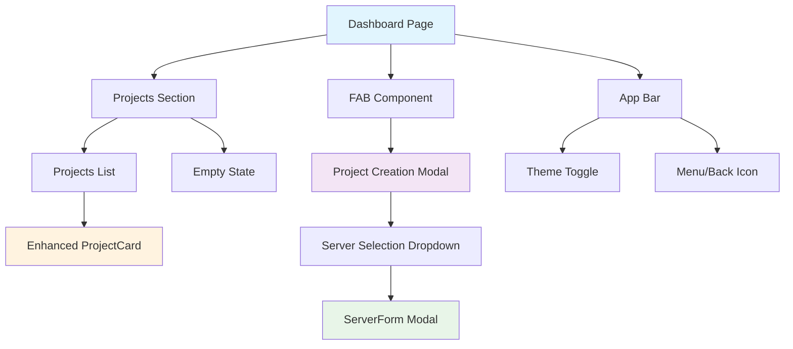
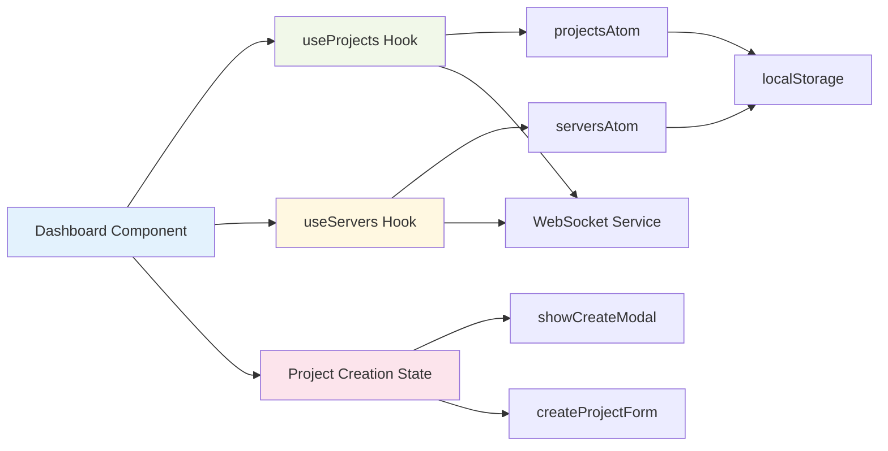
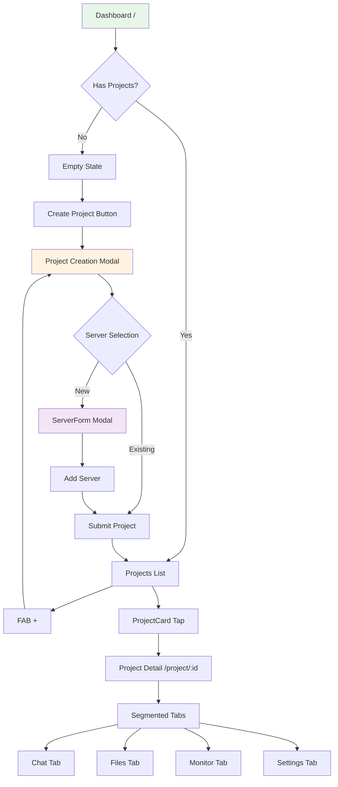

# Dashboard and Project Creation - Design

## Overview

The Dashboard and Project Creation feature provides the main entry point for the Pocket Agent frontend-spa application. This design translates the approved requirements into a comprehensive technical implementation plan that leverages the existing application-base foundation while adding new components for project management, server integration, and mobile-optimized user experience.

### Goals
- Create a mobile-first dashboard interface for project and server management
- Leverage existing application-base components (ProjectCard, ServerForm, EmptyState)
- Add new components (FAB, Project Creation Modal, Enhanced ProjectCard)
- Ensure seamless integration with Jotai state management and WebSocket communication
- Maintain 60fps performance on mobile devices with <3s load times

### Design Constraints
- **Mobile-First**: 320px-428px primary target with 44px+ touch targets
- **Existing Patterns**: Must use established atomic design and Jotai state patterns
- **No Filter Chips**: Simplified scope without project filtering functionality
- **WebSocket Integration**: Real-time updates with automatic reconnection
- **Accessibility**: WCAG 2.1 AA compliance with screen reader support

## Architecture

### Component Architecture



### State Architecture



### Navigation Flow



## Components and Interfaces

### 1. Enhanced Dashboard Page

**Location**: `src/pages/Dashboard.tsx`

**Component Interface**:
```typescript
interface DashboardProps {
  className?: string;
}

const Dashboard: React.FC<DashboardProps> = ({ className }) => {
  // Implementation
};
```

**Responsibilities**:
- Render app bar with title and theme toggle
- Display projects section header
- Render projects list or empty state
- Position FAB for project creation
- Handle project creation modal state

**Integration Points**:
- Uses `useProjects()` and `useServers()` hooks
- Integrates with existing Router for navigation
- Leverages theme system from application-base

### 2. FAB (Floating Action Button)

**Location**: `src/components/ui/atoms/FAB.tsx`

**Component Interface**:
```typescript
interface FABProps extends BaseComponentProps {
  icon?: React.ReactNode;
  position?: 'bottom-right' | 'bottom-left' | 'bottom-center';
  color?: 'primary' | 'secondary';
  size?: 'sm' | 'md' | 'lg';
}

const FAB: React.FC<FABProps> = ({
  onPress,
  icon = <Plus className="w-6 h-6" />,
  position = 'bottom-right',
  color = 'primary',
  size = 'md',
  className,
  disabled,
  ariaLabel = 'Create new item',
  ...rest
}) => {
  // Implementation
};
```

**Styling Requirements**:
- Fixed positioning with 24px margin from screen edges
- Primary color background with white icon
- 56px size (exceeds 44px touch target)
- Elevated shadow for material design
- Smooth scale animation on press

**Accessibility**:
- ARIA label for screen readers
- Focus management with visible focus ring
- Keyboard activation support

### 3. Project Creation Modal

**Location**: `src/components/ui/organisms/ProjectCreationModal.tsx`

**Component Interface**:
```typescript
interface ProjectCreationModalProps {
  isVisible: boolean;
  onClose: () => void;
  onSubmit: (project: CreateProjectData) => void;
  onAddServer: () => void;
  servers: Server[];
  isLoading?: boolean;
}

interface CreateProjectData {
  name: string;
  path: string;
  serverId: string;
}

const ProjectCreationModal: React.FC<ProjectCreationModalProps> = ({
  isVisible,
  onClose,
  onSubmit,
  onAddServer,
  servers,
  isLoading = false
}) => {
  // Implementation
};
```

**Form Fields**:
- **Project Name**: Text input with validation (required, 2+ chars)
- **Project Path**: Text input with validation (required, valid path)
- **Server Selection**: Dropdown with existing servers + "Add New Server" option

**Validation Rules**:
```typescript
const validationSchema = {
  name: { required: true, minLength: 2 },
  path: { required: true, pattern: /^[^\0]+$/ },
  serverId: { required: true }
};
```

**Modal Behavior**:
- Full-screen on mobile with proper safe area handling
- Escape key dismissal
- Form state persistence during server creation
- Optimistic UI updates

### 4. Enhanced ProjectCard

**Location**: `src/components/ui/organisms/ProjectCard.tsx` (Extension)

**Enhancement Requirements**:
- Add connection status colored icons:
  - **Green**: Connected server
  - **Yellow**: Connecting to server
  - **Gray**: Disconnected server
- Maintain existing functionality (name, server, last active, actions)
- Real-time status updates via WebSocket

**Status Icon Implementation**:
```typescript
const getConnectionStatusIcon = (status: ConnectionStatus) => {
  switch (status) {
    case 'connected':
      return <Circle className="w-3 h-3 fill-green-500 text-green-500" />;
    case 'connecting':
      return <Circle className="w-3 h-3 fill-yellow-500 text-yellow-500" />;
    case 'disconnected':
    default:
      return <Circle className="w-3 h-3 fill-gray-400 text-gray-400" />;
  }
};
```

### 5. Server Selection Integration

**Enhancement**: Extend existing ServerForm modal integration

**Workflow**:
1. User selects "Add New Server" in project creation
2. Project creation modal state is preserved
3. ServerForm modal opens with callback
4. New server is added and automatically selected
5. Return to project creation with pre-filled server

**State Management**:
```typescript
const [createProjectState, setCreateProjectState] = useAtom(createProjectStateAtom);
const [showServerForm, setShowServerForm] = useState(false);

const handleAddServer = useCallback((server: Server) => {
  addServer(server);
  setCreateProjectState(prev => ({ ...prev, serverId: server.id }));
  setShowServerForm(false);
}, [addServer, setCreateProjectState]);
```

## Data Models

### Project Creation State

```typescript
interface CreateProjectState {
  isVisible: boolean;
  formData: {
    name: string;
    path: string;
    serverId: string;
  };
  errors: {
    name?: string;
    path?: string;
    serverId?: string;
  };
  isSubmitting: boolean;
}

const createProjectStateAtom = atom<CreateProjectState>({
  isVisible: false,
  formData: { name: '', path: '', serverId: '' },
  errors: {},
  isSubmitting: false
});
```

### Connection Status Types

```typescript
type ConnectionStatus = 'connected' | 'connecting' | 'disconnected' | 'error';

interface ProjectWithStatus extends Project {
  connectionStatus: ConnectionStatus;
  serverHealth?: {
    lastPing: Date | null;
    responseTime: number | null;
    errorCount: number;
  };
}
```

### WebSocket Message Extensions

```typescript
// New message types for project creation
interface CreateProjectMessage extends ClientMessage {
  type: 'project_create';
  data: {
    name: string;
    path: string;
    serverId: string;
  };
}

interface ProjectCreatedMessage extends ServerMessage {
  type: 'project_created';
  data: {
    project: Project;
    success: boolean;
  };
}
```

## Error Handling

### Form Validation Errors

```typescript
const validateProjectForm = (data: CreateProjectData): ValidationErrors => {
  const errors: ValidationErrors = {};
  
  if (!data.name.trim()) {
    errors.name = 'Project name is required';
  } else if (data.name.length < 2) {
    errors.name = 'Project name must be at least 2 characters';
  }
  
  if (!data.path.trim()) {
    errors.path = 'Project path is required';
  }
  
  if (!data.serverId) {
    errors.serverId = 'Server selection is required';
  }
  
  return errors;
};
```

### Server Communication Errors

```typescript
const handleProjectCreationError = (error: WebSocketError) => {
  switch (error.code) {
    case 'PROJECT_EXISTS':
      setFieldError('name', 'A project with this name already exists');
      break;
    case 'INVALID_PATH':
      setFieldError('path', 'Invalid project path specified');
      break;
    case 'SERVER_UNAVAILABLE':
      setFieldError('serverId', 'Selected server is not available');
      break;
    default:
      showErrorToast('Failed to create project. Please try again.');
  }
};
```

### Connection Status Error Handling

```typescript
const handleConnectionStatusError = (serverId: string, error: Error) => {
  updateServerStatus(serverId, {
    status: 'error',
    lastError: error.message,
    errorTimestamp: new Date()
  });
  
  // Show non-intrusive status indicator
  showStatusToast(`Connection to ${getServerName(serverId)} failed`, 'warning');
};
```

## Testing Strategy

### Component Testing Approach

**Dashboard Page Tests**:
```typescript
describe('Dashboard', () => {
  it('renders projects list when projects exist', () => {
    // Test project display
  });
  
  it('renders empty state when no projects', () => {
    // Test empty state display
  });
  
  it('opens project creation modal when FAB is pressed', () => {
    // Test modal interaction
  });
  
  it('navigates to project detail on card press', () => {
    // Test navigation
  });
});
```

**FAB Component Tests**:
```typescript
describe('FAB', () => {
  it('renders with correct positioning and styling', () => {
    // Test visual appearance
  });
  
  it('handles press events correctly', () => {
    // Test interaction
  });
  
  it('meets accessibility requirements', () => {
    // Test ARIA labels, focus management
  });
});
```

**Project Creation Modal Tests**:
```typescript
describe('ProjectCreationModal', () => {
  it('validates form inputs correctly', () => {
    // Test validation logic
  });
  
  it('submits valid form data', () => {
    // Test form submission
  });
  
  it('integrates with server selection workflow', () => {
    // Test server creation flow
  });
  
  it('handles submission errors gracefully', () => {
    // Test error handling
  });
});
```

### Integration Testing

**State Management Integration**:
- Test Jotai atom updates and persistence
- Verify localStorage synchronization
- Test WebSocket message handling

**WebSocket Integration**:
- Test real-time project creation events
- Verify connection status updates
- Test error recovery scenarios

**Navigation Integration**:
- Test route transitions
- Verify lazy loading behavior
- Test browser back/forward navigation

### Mobile Testing Requirements

**Touch Interaction Testing**:
- Verify 44px+ touch target compliance
- Test gesture recognition (tap, press, swipe)
- Validate touch feedback responsiveness

**Responsive Design Testing**:
- Test on multiple viewport sizes (320px-428px)
- Verify safe area handling on iOS devices
- Test orientation changes

**Performance Testing**:
- Measure component render times
- Test scroll performance (60fps requirement)
- Verify memory usage under load

### Accessibility Testing

**Screen Reader Testing**:
- Test with NVDA, JAWS, VoiceOver
- Verify ARIA label announcements
- Test keyboard navigation flow

**Visual Accessibility**:
- Test high contrast mode compatibility
- Verify color contrast ratios (WCAG AA)
- Test focus indicator visibility

## Implementation Phases

### Phase 1: Core Dashboard Structure (Days 1-2)

**Deliverables**:
- Enhanced Dashboard.tsx with mockup-accurate layout
- Basic FAB component implementation
- Integration with existing useProjects/useServers hooks
- Empty state integration

**Success Criteria**:
- Dashboard renders projects list or empty state correctly
- FAB appears in correct position with proper styling
- Navigation to existing project detail works
- Mobile responsiveness verified

### Phase 2: Project Creation Flow (Days 3-4)

**Deliverables**:
- ProjectCreationModal component with form validation
- Server selection dropdown with "Add New Server" integration
- Form state management with Jotai atoms
- Error handling and user feedback

**Success Criteria**:
- Modal opens/closes smoothly with proper animations
- Form validation works for all fields
- Server creation workflow integrates seamlessly
- WebSocket project creation messages handled correctly

### Phase 3: Enhanced ProjectCard (Day 5)

**Deliverables**:
- Connection status colored icons implementation
- Real-time status updates via WebSocket
- Enhanced visual design while maintaining existing functionality

**Success Criteria**:
- Connection status icons display correct colors
- Status updates in real-time without page refresh
- Existing ProjectCard functionality preserved
- Performance impact minimal

### Phase 4: Polish and Testing (Days 6-7)

**Deliverables**:
- Comprehensive test suite implementation
- Accessibility compliance verification
- Performance optimization
- Error boundary integration

**Success Criteria**:
- All tests pass with >80% coverage
- WCAG 2.1 AA compliance verified
- 60fps performance on mobile devices
- Error scenarios handled gracefully

## Integration Considerations

### Existing Application-Base Dependencies

**Required Components** (Already Available):
- `ProjectCard` - Base component for extension
- `ServerForm` - Modal for server creation
- `EmptyState` - No projects display
- `Button`, `Input`, `IconButton` - Form components
- `Card`, `StatusIndicator` - UI building blocks

**Required State Management** (Already Available):
- `useProjects()` - Project CRUD operations
- `useServers()` - Server management
- `useWebSocket()` - Real-time communication
- Theme and loading state atoms

**Required Services** (Already Available):
- WebSocket service with EventEmitter pattern
- localStorage service with error handling
- Error boundaries for service failures

### New Dependencies

**Component Dependencies**:
- FAB component (new atom-level component)
- ProjectCreationModal (new organism-level component)
- Enhanced connection status logic in ProjectCard

**State Dependencies**:
- Project creation modal state atom
- Form validation state management
- Server selection state integration

**Service Dependencies**:
- Extended WebSocket message types for project creation
- Enhanced error handling for form validation

### Performance Impact Assessment

**Bundle Size Impact**:
- Estimated +15KB for new components
- No new external dependencies required
- Lazy loading maintains initial bundle size target

**Runtime Performance**:
- Modal rendering: <100ms initialization
- Form validation: <50ms per field
- WebSocket updates: <10ms handling time
- Connection status updates: Minimal re-render impact

**Memory Usage**:
- Modal state: ~1KB additional memory
- Form state: ~2KB during active use
- Connection status tracking: ~500bytes per project

## Security Considerations

### Input Validation

**Client-Side Validation**:
```typescript
const sanitizeProjectInput = (input: string): string => {
  return input
    .trim()
    .replace(/[<>]/g, '') // Remove potential HTML tags
    .substring(0, 100); // Limit length
};
```

**Server-Side Validation**:
- All form data validated again on server
- Path validation for security (no traversal)
- Project name uniqueness enforcement

### WebSocket Security

**Message Validation**:
- All outgoing messages validated against schema
- Incoming messages sanitized before state updates
- Message rate limiting to prevent abuse

**Connection Security**:
- WSS encryption required for production
- Connection timeout handling
- Automatic reconnection with exponential backoff

### Local Storage Security

**Data Sanitization**:
- No sensitive data stored locally
- Project paths validated before storage
- Server URLs validated for allowed protocols

---

## Design Summary

This design provides a comprehensive implementation plan for the Dashboard and Project Creation feature that:

1. **Leverages Existing Foundation**: Built upon the robust application-base with minimal new dependencies
2. **Mobile-First Approach**: Optimized for 320px-428px viewports with 44px+ touch targets
3. **Performance Focused**: Maintains <3s load times and 60fps animations
4. **Accessibility Compliant**: WCAG 2.1 AA standards with screen reader support
5. **Real-time Integration**: WebSocket-powered updates with automatic reconnection
6. **Comprehensive Error Handling**: Graceful degradation and user-friendly error messages

The design follows established atomic design patterns, integrates seamlessly with Jotai state management, and provides a solid foundation for future feature enhancements while maintaining the simplicity requested by removing filter chips functionality.

**Next Step**: Implementation planning with detailed task breakdown (`/spec:5_tasks`).