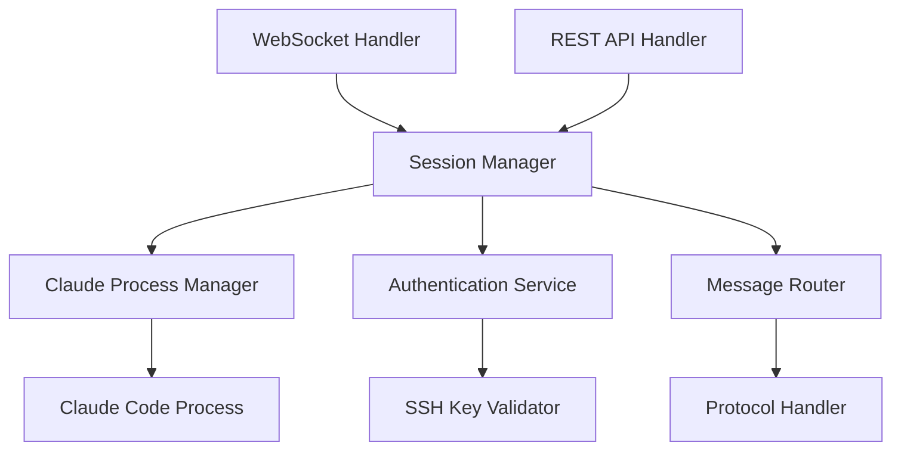

# Server Module Architecture

## Module Overview

**Module Name**: Server
**Description**: Backend server and API services for Pocket Agent
**Technology Stack**: Go, WebSocket, REST API (planned)
**Directory**: server/ (to be created)

## Purpose and Scope

### Module Responsibilities
- Provide WebSocket server for real-time communication with mobile clients
- Act as wrapper/proxy for Claude Code instances
- Handle SSH key-based authentication and session management
- Manage multiple concurrent client connections
- Provide REST APIs for non-real-time operations
- Monitor Claude Code process health and status

### Module Boundaries
- **Does NOT handle**: Mobile UI, local data storage, platform-specific features
- **Integrates with**: Claude Code process via stdin/stdout, mobile clients via WebSocket
- **Exposes**: WebSocket API and REST endpoints for client applications

## Technology Stack

### Core Technologies
- **Language**: Go (planned)
- **WebSocket**: Gorilla WebSocket or similar Go WebSocket library
- **HTTP Server**: Standard library net/http or Gin framework
- **Process Management**: os/exec for Claude Code process control

### Key Dependencies (Planned)
- **WebSocket**: WebSocket library for real-time communication
- **SSH**: Go SSH library for key validation and authentication
- **JSON**: Standard library encoding/json for message serialization
- **Logging**: Structured logging library (logrus or zap)
- **Configuration**: Environment variables and config files

### Development Tools (Planned)
- **Testing**: Go standard testing package
- **Build**: Go modules and standard toolchain
- **Deployment**: Docker containers
- **Monitoring**: Prometheus metrics (optional)

## Module Structure (Planned)

### Directory Organization
```
server/
├── main.go                 # Application entry point
├── internal/
│   ├── websocket/          # WebSocket server implementation
│   ├── auth/               # SSH authentication handling
│   ├── claude/             # Claude Code process management
│   ├── session/            # Session management
│   └── api/                # REST API handlers
├── pkg/
│   ├── protocol/           # Message protocol definitions
│   └── models/             # Shared data models
├── config/
│   ├── config.go           # Configuration management
│   └── config.yaml         # Default configuration
├── scripts/
│   ├── build.sh            # Build scripts
│   └── docker/             # Docker configuration
├── go.mod                  # Go module dependencies
├── go.sum                  # Dependency checksums
└── README.md               # Server-specific documentation
```

### Key Entry Points
- **Main File**: main.go
- **Configuration**: config/config.yaml
- **API Definition**: pkg/protocol/ (message definitions)
- **Docker**: scripts/docker/Dockerfile

## Internal Architecture

### Architectural Patterns
- **Pattern**: Hexagonal Architecture (Ports and Adapters)
- **Justification**: Clean separation between business logic and external dependencies
- **Implementation**: 
  - Core domain logic independent of WebSocket/HTTP details
  - Adapters for different communication protocols
  - Dependency injection for testability

### Component Organization


### Data Flow
1. **Input**: WebSocket connections and HTTP requests from clients
2. **Authentication**: SSH key-based challenge-response authentication
3. **Session Management**: Active session tracking and state management
4. **Claude Interaction**: Proxy commands to Claude Code process
5. **Output**: Real-time responses via WebSocket, status via REST API

## Module APIs and Interfaces

### Public Interfaces
This module exposes interfaces to other modules:

#### WebSocket API
- **Type**: WebSocket server
- **Purpose**: Real-time bidirectional communication with mobile clients
- **Contract**: JSON-based message protocol
- **Authentication**: SSH key challenge-response
- **Example**: ws://server:8080/ws

#### REST API (Planned)
- **Type**: HTTP REST endpoints
- **Purpose**: Non-real-time operations and status queries
- **Contract**: JSON request/response
- **Authentication**: Bearer token or API key
- **Example**: GET /api/v1/sessions

### Integration Points
How this module integrates with others:

#### Claude Code Process Integration
- **Target**: Local Claude Code process
- **Method**: stdin/stdout communication
- **Data**: Commands and responses via process pipes
- **Frequency**: Real-time command proxying

#### Mobile Client Integration
- **Target Module**: Frontend-Android, Frontend-React
- **Method**: WebSocket bidirectional communication
- **Data**: Commands, responses, permission requests, status updates
- **Frequency**: Real-time during active sessions

## Data Management

### Data Models (Planned)
Core data structures used in this module:

```go
type Session struct {
    ID          string    `json:"id"`
    ClientID    string    `json:"client_id"`
    ProjectPath string    `json:"project_path"`
    Status      string    `json:"status"`
    CreatedAt   time.Time `json:"created_at"`
    LastActive  time.Time `json:"last_active"`
}

type Message struct {
    Type      string      `json:"type"`
    SessionID string      `json:"session_id"`
    Payload   interface{} `json:"payload"`
    Timestamp time.Time   `json:"timestamp"`
}

type AuthChallenge struct {
    Challenge string `json:"challenge"`
    PublicKey string `json:"public_key"`
    Signature string `json:"signature"`
}
```

### Data Storage
- **Session State**: In-memory storage for active sessions
- **Configuration**: File-based configuration with environment overrides
- **Logging**: Structured logs to files or stdout
- **No Persistence**: Server is stateless, clients manage persistent data

### Data Validation
- **Input Validation**: Message format validation and sanitization
- **Business Rules**: Session lifecycle and permission validation
- **Error Handling**: Structured error responses with error codes

## Configuration and Environment

### Configuration Management (Planned)
- **Config Files**: YAML configuration with sensible defaults
- **Environment Variables**: Override config values for deployment
- **Command Line**: CLI flags for common configuration options
- **Runtime Config**: Reload configuration without restart (if needed)

### Environment Support
- **Development**: Local development with file-based logging
- **Testing**: In-memory configuration for unit tests
- **Production**: Docker deployment with environment-based config

## Security Architecture

### Authentication and Authorization
- **SSH Key Authentication**: Validate client SSH keys against authorized keys
- **Session Tokens**: Generate secure session tokens for authenticated clients
- **Rate Limiting**: Protect against abuse and DoS attacks
- **Input Validation**: Sanitize all incoming messages and commands

### Data Security
- **TLS/WSS**: Encrypted WebSocket connections (wss://)
- **No Credential Storage**: Server validates but doesn't store SSH private keys
- **Process Isolation**: Claude Code process runs with limited privileges
- **Audit Logging**: Log all authentication events and critical operations

## Performance and Scalability

### Performance Characteristics (Targets)
- **Connection Handling**: Support 100+ concurrent WebSocket connections
- **Response Time**: Sub-100ms message routing latency
- **Memory Usage**: Under 100MB base memory usage
- **CPU Usage**: Minimal CPU overhead for message routing

### Scaling Strategies
- **Horizontal Scaling**: Multiple server instances with load balancing
- **Connection Pooling**: Efficient WebSocket connection management
- **Resource Limits**: Limit resources per Claude Code process
- **Graceful Degradation**: Handle high load without cascading failures

## Testing Strategy (Planned)

### Test Structure
```
server/
├── internal/
│   ├── websocket/
│   │   └── websocket_test.go
│   ├── auth/
│   │   └── auth_test.go
│   └── session/
│       └── session_test.go
├── integration/
│   ├── websocket_integration_test.go
│   └── auth_integration_test.go
└── e2e/
    └── full_flow_test.go
```

### Testing Approach
- **Unit Testing**: Individual component testing with mocks
- **Integration Testing**: Multi-component interaction testing
- **WebSocket Testing**: Automated WebSocket client testing
- **Load Testing**: Performance testing with multiple connections

### Test Dependencies
- **Mocking**: testify/mock for dependency mocking
- **WebSocket Testing**: Gorilla WebSocket test utilities
- **Test Data**: Predefined SSH keys and test scenarios

## Deployment and Operations

### Build Process (Planned)
1. **Dependencies**: Go mod download resolves dependencies
2. **Testing**: go test runs all test suites
3. **Building**: go build creates statically linked binary
4. **Containerization**: Docker multi-stage build for minimal image
5. **Deployment**: Docker compose or Kubernetes deployment

### Monitoring and Observability (Planned)
- **Health Checks**: HTTP endpoint for liveness/readiness probes
- **Metrics**: Prometheus metrics for key performance indicators
- **Logging**: Structured JSON logging with configurable levels
- **Tracing**: Optional distributed tracing for request flows

### Health Checks
- **WebSocket Health**: Monitor active connections and throughput
- **Claude Process Health**: Monitor Claude Code process status
- **System Health**: CPU, memory, and disk usage monitoring

## Development Workflow (Planned)

### Local Development
1. **Setup**: Install Go, clone repository
2. **Dependencies**: go mod download
3. **Running**: go run main.go for local development
4. **Testing**: go test ./... for all tests

### Code Quality
- **Linting**: golangci-lint for code quality checks
- **Formatting**: gofmt for consistent code formatting
- **Review Process**: Pull request workflow with automated checks
- **Documentation**: Go doc comments for public APIs

## Dependencies and Integration

### External Dependencies (Planned)
- **Go Standard Library**: Core functionality
- **WebSocket Library**: Real-time communication
- **SSH Library**: Authentication and key validation
- **Logging Library**: Structured logging

### Module Dependencies
- **Claude Code**: Local process integration
- **Frontend Modules**: WebSocket client integration
- **Shared Protocol**: Message format definitions

## Migration and Evolution

### Version Management (Planned)
- **API Versioning**: Semantic versioning for API compatibility
- **Protocol Versioning**: Message protocol version negotiation
- **Deployment Strategy**: Blue-green deployment for zero downtime

### Technical Debt
- **Current State**: Module not yet implemented
- **Implementation Plan**: Start with minimal WebSocket server
- **Future Enhancements**: REST API, advanced authentication, monitoring

## Troubleshooting (Planned)

### Common Issues
- **Connection Failures**: Check network configuration and firewall rules
- **Authentication Issues**: Verify SSH key format and permissions
- **Performance Issues**: Monitor connection count and message throughput

### Debugging Guide
- **Logs**: Check structured logs for error details
- **Metrics**: Monitor Prometheus metrics for system health
- **Network**: Use WebSocket debugging tools for connection issues

## Implementation Roadmap

### Phase 1: Basic WebSocket Server
- Implement basic WebSocket server with connection handling
- Basic message routing and session management
- Simple authentication placeholder

### Phase 2: Claude Integration
- Integrate with Claude Code process via stdin/stdout
- Implement command proxying and response handling
- Add error handling and process monitoring

### Phase 3: Security and Authentication
- Implement SSH key-based authentication
- Add TLS/WSS support for encrypted connections
- Implement rate limiting and security measures

### Phase 4: Production Features
- Add comprehensive logging and monitoring
- Implement health checks and metrics
- Add configuration management and deployment scripts

---

*Module: Server*
*Architecture Version: 1.0*
*Last Updated: 2025-01-27*
*Status: Planned - Not Yet Implemented*
*Technology Stack: Go, WebSocket, REST API (planned)*