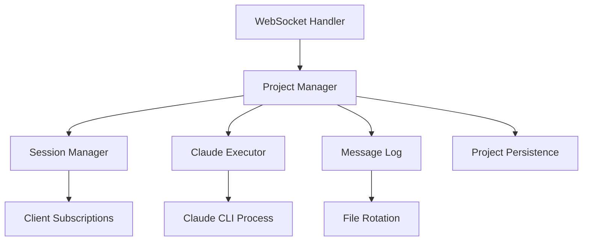

# Server Module Architecture

## Module Overview

**Module Name**: Server
**Description**: Backend WebSocket server for Pocket Agent with Claude CLI integration
**Technology Stack**: Go, WebSocket (no REST API)
**Directory**: server/ (to be created)

## Purpose and Scope

### Module Responsibilities
- Provide WebSocket server for real-time communication with mobile clients
- Act as wrapper/proxy for Claude CLI execution (`claude -p <prompt>`)
- Manage project-based execution model with sequential command processing
- Handle multi-client subscription and broadcasting per project
- Persist project metadata and message history to disk
- Monitor Claude CLI process health with timeout mechanism (5 minutes)

### Module Boundaries
- **Does NOT handle**: Mobile UI, authentication (future work), Windows support
- **Integrates with**: Claude CLI process via command execution, mobile clients via WebSocket only
- **Exposes**: WebSocket API exclusively (no REST endpoints)

## Technology Stack

### Core Technologies
- **Language**: Go (planned)
- **WebSocket**: Gorilla WebSocket or similar Go WebSocket library
- **HTTP Server**: Standard library net/http or Gin framework
- **Process Management**: os/exec for Claude Code process control

### Key Dependencies (Planned)
- **WebSocket**: WebSocket library for real-time communication
- **SSH**: Go SSH library for key validation and authentication
- **JSON**: Standard library encoding/json for message serialization
- **Logging**: Structured logging library (logrus or zap)
- **Configuration**: Environment variables and config files

### Development Tools (Planned)
- **Testing**: Go standard testing package
- **Build**: Go modules and standard toolchain
- **Deployment**: Docker containers
- **Monitoring**: Prometheus metrics (optional)

## Module Structure (Planned)

### Directory Organization
```
server/
├── main.go                 # Application entry point
├── internal/
│   ├── websocket/          # WebSocket server implementation
│   ├── project/            # Project management and persistence
│   ├── claude/             # Claude CLI execution management
│   ├── session/            # Session and subscription management
│   └── storage/            # Message history and rotation
├── pkg/
│   ├── protocol/           # Message protocol definitions
│   └── models/             # Shared data models
├── config/
│   ├── config.go           # Configuration management
│   └── config.yaml         # Default configuration
├── scripts/
│   ├── build.sh            # Build scripts
│   └── docker/             # Docker configuration
├── go.mod                  # Go module dependencies
├── go.sum                  # Dependency checksums
└── README.md               # Server-specific documentation
```

### Key Entry Points
- **Main File**: main.go
- **Configuration**: config/config.yaml
- **API Definition**: pkg/protocol/ (message definitions)
- **Docker**: scripts/docker/Dockerfile

## Internal Architecture

### Architectural Patterns
- **Pattern**: Hexagonal Architecture (Ports and Adapters)
- **Justification**: Clean separation between business logic and external dependencies
- **Implementation**: 
  - Core domain logic independent of WebSocket/HTTP details
  - Adapters for different communication protocols
  - Dependency injection for testability

### Component Organization


### Data Flow
1. **Input**: WebSocket connections from clients (no HTTP/REST)
2. **Project Management**: Create, delete, join, leave projects
3. **Execution**: Sequential command execution per project via Claude CLI
4. **Message Storage**: Persist all messages with rotation (1GB/30 days)
5. **Output**: Real-time responses via WebSocket broadcasting to project subscribers

## Module APIs and Interfaces

### Public Interfaces
This module exposes interfaces to other modules:

#### WebSocket API
- **Type**: WebSocket server
- **Purpose**: Real-time bidirectional communication with mobile clients
- **Contract**: JSON-based message protocol
- **Authentication**: SSH key challenge-response
- **Example**: ws://server:8080/ws

#### Project-Based Execution
- **Type**: Project management via WebSocket messages
- **Purpose**: Organize Claude CLI executions by project directory
- **Contract**: Sequential execution per project, parallel across projects
- **Persistence**: Project metadata and message history saved to disk
- **Example**: `{"type": "project_create", "payload": {"path": "/path/to/project"}}`

### Integration Points
How this module integrates with others:

#### Claude CLI Process Integration
- **Target**: Claude CLI executable (`claude` command)
- **Method**: Command execution with `-p` for prompts, `-c` for session continuity
- **Data**: JSON-formatted responses parsed from stdout
- **Timeout**: 5-minute execution timeout with process termination
- **Concurrency**: One active execution per project

#### Mobile Client Integration
- **Target Module**: Frontend-Android, Frontend-React
- **Method**: WebSocket bidirectional communication
- **Data**: Commands, responses, permission requests, status updates
- **Frequency**: Real-time during active sessions

## Data Management

### Data Models (Planned)
Core data structures used in this module:

```go
type Project struct {
    ID          string    `json:"id"`
    Path        string    `json:"path"`
    Status      string    `json:"status"` // idle, executing, error
    SessionID   string    `json:"session_id"` // Claude CLI session
    Subscribers []string  `json:"subscribers"` // Connected client IDs
    CreatedAt   time.Time `json:"created_at"`
    LastActive  time.Time `json:"last_active"`
}

type Message struct {
    Type      string      `json:"type"`
    SessionID string      `json:"session_id"`
    Payload   interface{} `json:"payload"`
    Timestamp time.Time   `json:"timestamp"`
}

type ProjectMetadata struct {
    ID          string    `json:"id"`
    Path        string    `json:"path"`
    SessionID   string    `json:"session_id"`
    CreatedAt   time.Time `json:"created_at"`
    MessageLog  string    `json:"message_log"` // Path to message history
}
```

### Data Storage
- **Project State**: In-memory with disk persistence (metadata.json per project)
- **Message History**: File-based append-only logs with rotation (1GB or 30 days)
- **Configuration**: Environment variables and config files
- **Server State**: Persisted to disk, survives restarts
- **Atomic Operations**: All file writes use atomic rename pattern

### Data Validation
- **Input Validation**: Message format validation and sanitization
- **Business Rules**: Session lifecycle and permission validation
- **Error Handling**: Structured error responses with error codes

## Configuration and Environment

### Configuration Management (Planned)
- **Config Files**: YAML configuration with sensible defaults
- **Environment Variables**: Override config values for deployment
- **Command Line**: CLI flags for common configuration options
- **Runtime Config**: Reload configuration without restart (if needed)

### Environment Support
- **Development**: Local development with file-based logging
- **Testing**: Mock Claude CLI for deterministic testing (FORBIDDEN: real Claude API)
- **Production**: Unix/POSIX systems only (Linux and macOS)
- **Platform**: No Windows support

## Security Architecture

### Authentication and Authorization
- **No Authentication**: MVP has no authentication (future work)
- **Project Validation**: Ensure project paths are absolute and exist
- **Path Security**: Prevent directory traversal and symbolic link attacks
- **Input Validation**: Sanitize all incoming messages and commands
- **Rate Limiting**: Connection and message rate limits

### Data Security
- **TLS/WSS**: Encrypted WebSocket connections recommended
- **Process Isolation**: Claude CLI runs with limited privileges
- **Command Injection Prevention**: Proper argument escaping for Claude CLI
- **File System Security**: Validate all paths, prevent escaping project directory
- **Audit Logging**: Log all project operations and command executions

## Performance and Scalability

### Performance Characteristics (Targets)
- **Connection Handling**: Support 100+ concurrent WebSocket connections
- **Response Time**: Sub-100ms message routing latency
- **Memory Usage**: Under 100MB base memory usage
- **CPU Usage**: Minimal CPU overhead for message routing

### Scaling Strategies
- **Horizontal Scaling**: Multiple server instances with load balancing
- **Connection Pooling**: Efficient WebSocket connection management
- **Resource Limits**: Limit resources per Claude Code process
- **Graceful Degradation**: Handle high load without cascading failures

## Testing Strategy (Planned)

### Test Structure
```
server/
├── internal/
│   ├── websocket/
│   │   └── websocket_test.go
│   ├── auth/
│   │   └── auth_test.go
│   └── session/
│       └── session_test.go
├── integration/
│   ├── websocket_integration_test.go
│   └── auth_integration_test.go
└── e2e/
    └── full_flow_test.go
```

### Testing Approach
- **Unit Testing**: Individual component testing with mocks
- **Integration Testing**: Multi-component interaction testing
- **WebSocket Testing**: Automated WebSocket client testing
- **Load Testing**: Performance testing with multiple connections

### Test Dependencies
- **Mocking**: testify/mock for dependency mocking
- **WebSocket Testing**: Gorilla WebSocket test utilities
- **Test Data**: Predefined SSH keys and test scenarios

## Deployment and Operations

### Build Process (Planned)
1. **Dependencies**: Go mod download resolves dependencies
2. **Testing**: go test runs all test suites
3. **Building**: go build creates statically linked binary
4. **Containerization**: Docker multi-stage build for minimal image
5. **Deployment**: Docker compose or Kubernetes deployment

### Monitoring and Observability (Planned)
- **Health Checks**: HTTP endpoint for liveness/readiness probes
- **Metrics**: Prometheus metrics for key performance indicators
- **Logging**: Structured JSON logging with configurable levels
- **Tracing**: Optional distributed tracing for request flows

### Health Checks
- **WebSocket Health**: Monitor active connections and throughput
- **Claude Process Health**: Monitor Claude Code process status
- **System Health**: CPU, memory, and disk usage monitoring

## Development Workflow (Planned)

### Local Development
1. **Setup**: Install Go, clone repository
2. **Dependencies**: go mod download
3. **Running**: go run main.go for local development
4. **Testing**: go test ./... for all tests

### Code Quality
- **Linting**: golangci-lint for code quality checks
- **Formatting**: gofmt for consistent code formatting
- **Review Process**: Pull request workflow with automated checks
- **Documentation**: Go doc comments for public APIs

## Dependencies and Integration

### External Dependencies (Planned)
- **Go Standard Library**: Core functionality
- **WebSocket Library**: Real-time communication
- **SSH Library**: Authentication and key validation
- **Logging Library**: Structured logging

### Module Dependencies
- **Claude Code**: Local process integration
- **Frontend Modules**: WebSocket client integration
- **Shared Protocol**: Message format definitions

## Migration and Evolution

### Version Management (Planned)
- **API Versioning**: Semantic versioning for API compatibility
- **Protocol Versioning**: Message protocol version negotiation
- **Deployment Strategy**: Blue-green deployment for zero downtime

### Technical Debt
- **Current State**: Module not yet implemented
- **Implementation Plan**: Start with minimal WebSocket server
- **Future Enhancements**: REST API, advanced authentication, monitoring

## Troubleshooting (Planned)

### Common Issues
- **Connection Failures**: Check network configuration and firewall rules
- **Authentication Issues**: Verify SSH key format and permissions
- **Performance Issues**: Monitor connection count and message throughput

### Debugging Guide
- **Logs**: Check structured logs for error details
- **Metrics**: Monitor Prometheus metrics for system health
- **Network**: Use WebSocket debugging tools for connection issues

## Implementation Roadmap

### Phase 1: Core Infrastructure
- Basic WebSocket server with project-based routing
- Project creation, deletion, and management
- Message persistence with file rotation
- Server restart recovery

### Phase 2: Claude CLI Integration  
- Execute Claude CLI with proper argument handling
- Parse JSON responses and error handling
- Implement 5-minute timeout mechanism
- Session ID management for context continuity

### Phase 3: Multi-Client Support
- Project subscription model (join/leave)
- Broadcasting to all project subscribers
- Connection health monitoring
- Concurrent project execution

### Phase 4: Production Features
- Comprehensive error handling and recovery
- Resource limits and monitoring
- Platform-specific optimizations (Linux/macOS)
- Mock Claude CLI for testing

---

*Module: Server*
*Architecture Version: 2.0*
*Last Updated: 2025-01-27*
*Status: Planned - Aligned with WebSocket API Specification*
*Technology Stack: Go, WebSocket only (no REST API)*
*Platform: Unix/POSIX (Linux and macOS) only*