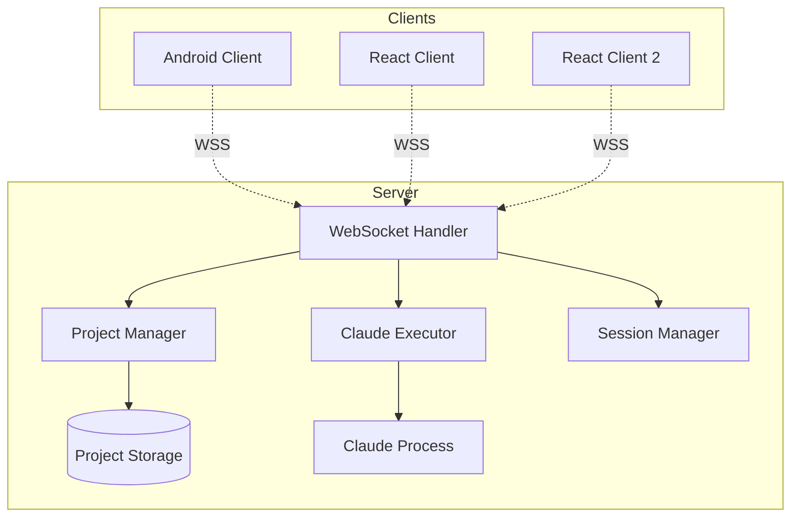
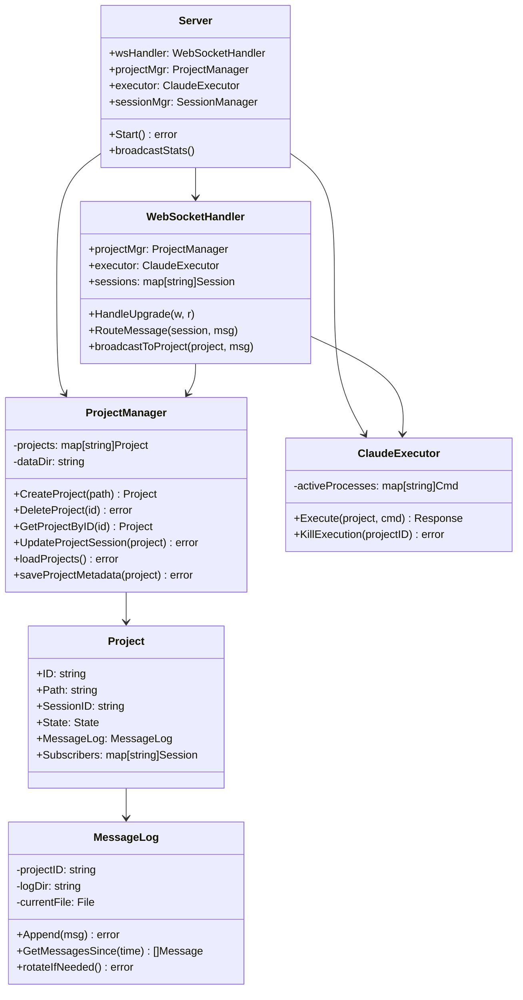
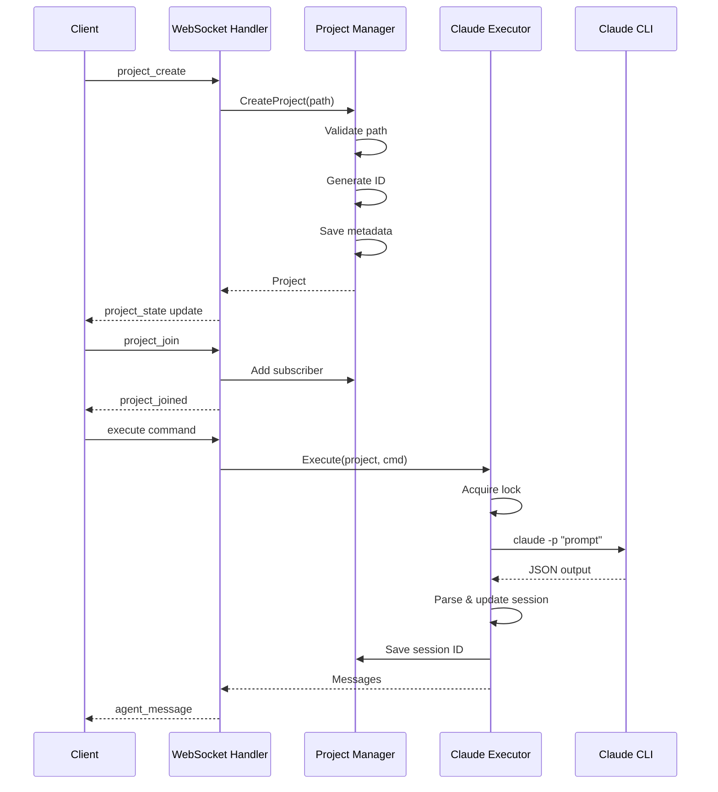
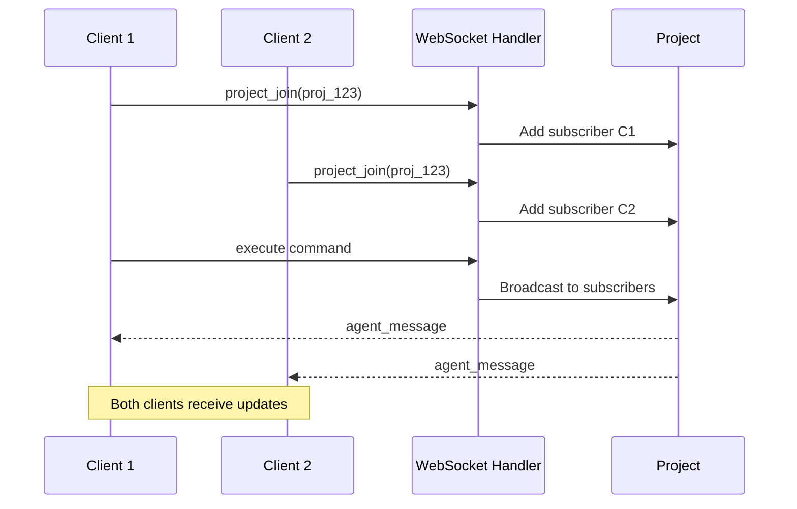

# WebSocket API Design

## Overview

The WebSocket API provides real-time bidirectional communication between Pocket Agent clients and the server. It manages Claude CLI executions on a per-project basis with persistent state management and multi-client support.

## Architecture

### System Architecture



### Component Architecture



## Component Specifications

### WebSocket Handler
**Purpose**: Manages WebSocket connections and routes messages

**Responsibilities**:
- Accept WebSocket upgrade requests
- Authenticate connections (future)
- Route messages to appropriate handlers
- Manage session lifecycle
- Broadcast updates to subscribers

**Key Methods**:
```go
func (h *WebSocketHandler) RouteMessage(session *Session, msg ClientMessage) {
    switch msg.Type {
    case "execute":          // Execute Claude command
    case "project_create":   // Create new project
    case "project_delete":   // Delete project
    case "project_list":     // List all projects
    case "project_join":     // Subscribe to project
    case "project_leave":    // Unsubscribe from project
    case "agent_new_session": // Reset Claude session
    case "agent_kill":       // Kill running process
    case "get_messages":     // Retrieve message history
    }
}
```

### Project Manager
**Purpose**: Manages project lifecycle and persistence

**Responsibilities**:
- Create/delete projects with validation
- Persist project metadata to disk
- Load projects on server startup
- Enforce no-nesting rule
- Manage project state transitions

**Persistence Strategy**:
- Atomic writes using temp file + rename
- JSON metadata files for quick loading
- Graceful handling of corrupted files

### Claude Executor
**Purpose**: Manages Claude CLI process execution

**Responsibilities**:
- Execute Claude commands with timeout
- Track active processes for cancellation
- Parse Claude JSON output
- Handle process lifecycle
- Enforce sequential execution per project

**Execution Flow**:
1. Acquire project lock (mutex)
2. Build command arguments
3. Create context with timeout
4. Execute and track process
5. Parse output and update session
6. Clean up and release lock

### Message Log
**Purpose**: Persistent message storage with rotation

**Responsibilities**:
- Append messages atomically
- Rotate logs by size and time
- Query messages by timestamp
- Handle concurrent access
- Maintain chronological order

**Rotation Strategy**:
- New file each day at midnight
- New file after 100MB or 10,000 messages
- Filename: `messages_YYYY-MM-DD_HH-MM-SS.jsonl`
- Symlink/pointer to latest file

## Data Models

### Core Models

```go
type Project struct {
    ID          string              // UUID
    Path        string              // Absolute filesystem path
    SessionID   string              // Claude session ID
    State       State               // IDLE, EXECUTING, ERROR
    CreatedAt   time.Time
    LastActive  time.Time
    MessageLog  *MessageLog
    Subscribers map[string]*Session // Active subscribers
    mu          sync.Mutex          // Project-level lock
}

type State string
const (
    IDLE      State = "IDLE"
    EXECUTING State = "EXECUTING"
    ERROR     State = "ERROR"
)

type Session struct {
    ID         string
    Conn       *websocket.Conn
    CreatedAt  time.Time
    LastPing   time.Time
}

type ProjectMetadata struct {
    ID         string    `json:"id"`
    Path       string    `json:"path"`
    SessionID  string    `json:"session_id"`
    CreatedAt  time.Time `json:"created_at"`
    LastActive time.Time `json:"last_active"`
}

type TimestampedMessage struct {
    Timestamp time.Time     `json:"timestamp"`
    Message   ClaudeMessage `json:"message"`
    Direction string        `json:"direction"` // "client" or "claude"
}
```

### Message Protocol

```go
// Client to Server
type ClientMessage struct {
    Type      string      `json:"type"`
    ProjectID string      `json:"project_id,omitempty"`
    Data      interface{} `json:"data"`
}

// Server to Client
type ServerMessage struct {
    Type      string      `json:"type"`
    ProjectID string      `json:"project_id,omitempty"`
    Data      interface{} `json:"data"`
}

// Command Messages
type ExecuteCommand struct {
    Prompt  string         `json:"prompt"`
    Options *ClaudeOptions `json:"options,omitempty"`
}

type ClaudeOptions struct {
    DangerouslySkipPermissions bool     `json:"dangerously_skip_permissions,omitempty"`
    AllowedTools              []string  `json:"allowed_tools,omitempty"`
    DisallowedTools           []string  `json:"disallowed_tools,omitempty"`
    MCPConfig                 string    `json:"mcp_config,omitempty"`
    AppendSystemPrompt        string    `json:"append_system_prompt,omitempty"`
    PermissionMode            string    `json:"permission_mode,omitempty"`
    Model                     string    `json:"model,omitempty"`
    FallbackModel             string    `json:"fallback_model,omitempty"`
    AddDirs                   []string  `json:"add_dirs,omitempty"`
    StrictMCPConfig           bool      `json:"strict_mcp_config,omitempty"`
}

// Update Messages
type UpdateMessage struct {
    UpdateType string      `json:"update_type"`
    Data       interface{} `json:"data"`
}
```

## Message Flow Diagrams

### Project Creation and Execution



### Multi-Client Broadcasting



## Error Handling

### Error Categories

1. **Validation Errors**
   - Invalid paths (traversal, relative, non-existent)
   - Project nesting violations
   - Message format errors
   - Invalid parameters

2. **Execution Errors**
   - Claude CLI not found
   - Process timeout
   - Process crash
   - JSON parsing errors

3. **Resource Errors**
   - Disk space exhaustion
   - Too many projects
   - Connection limits
   - Memory constraints

4. **System Errors**
   - File operation failures
   - Network errors
   - Corruption recovery
   - Unexpected panics

### Error Response Format

```go
type ErrorResponse struct {
    Type      string `json:"type"`      // "error"
    ProjectID string `json:"project_id,omitempty"`
    Data      struct {
        Code    string                 `json:"code"`
        Message string                 `json:"message"`
        Details map[string]interface{} `json:"details,omitempty"`
    } `json:"data"`
}
```

### Error Codes

- `INVALID_PATH`: Path validation failed
- `PROJECT_NESTING`: Project would nest with existing
- `PROJECT_NOT_FOUND`: Project ID not found
- `EXECUTION_TIMEOUT`: Claude execution exceeded timeout
- `CLAUDE_NOT_FOUND`: Claude CLI not installed
- `PROCESS_ACTIVE`: Cannot perform operation while executing
- `RESOURCE_LIMIT`: Resource limit exceeded
- `INTERNAL_ERROR`: Unexpected server error

## Testing Strategy

### Unit Testing
- Path validation edge cases
- Message parsing and routing
- Concurrent operations
- File rotation logic
- Error scenarios

### Integration Testing
- WebSocket connection lifecycle
- Multi-client synchronization
- Server restart recovery
- Process timeout handling
- Message persistence

### Load Testing
- 100+ concurrent connections
- Rapid project creation/deletion
- Message broadcasting performance
- Memory usage under load
- Disk I/O performance

### Platform Testing
- Linux process management
- macOS security permissions
- Unix signal handling
- POSIX compliance verification

## Security Considerations

### Input Validation
- Strict path validation to prevent injection
- Message size limits (1MB default)
- Parameter sanitization
- JSON schema validation

### Process Security
- Execute with minimal privileges
- Resource limits on processes
- Timeout enforcement
- Process isolation

### Data Security
- No sensitive data in logs
- Atomic file operations
- Graceful corruption handling
- Future: SSH authentication

## Performance Optimizations

### Connection Management
- Goroutine per connection
- Non-blocking message broadcast
- Efficient subscriber maps
- Connection pooling

### File Operations
- Buffered writes
- Async log rotation
- Indexed message queries
- Memory-mapped files (future)

### Process Management
- Process pool (future)
- Command caching (future)
- Output streaming
- Resource monitoring

---
*Design Complete*
*Feature: WebSocket API*
*Module: Server*