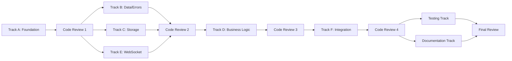

# OPTIMIZED TASK LIST: WebSocket API Implementation

## Optimization Summary
- Total tasks: 37 (all preserved)
- Completed tasks: 0 (none marked as completed yet)
- Pending tasks reorganized: 37
- Parallel tracks created: 6 (A-F)
- Code review tasks added: 5 (CR1-CR5)
- Unique agents assigned: 6 specialized agents (including new go-project-architect)
- Estimated time improvement: ~36 days sequential → ~15 days parallel (58% reduction)

## Parallel Execution Tracks

### Track A: Foundation (No Dependencies)
> Primary Agent: go-project-architect (Task 1), go-developer (Tasks 2-3)
> Can start immediately

- [ ] 1. **Set up Go module and project structure**
  - Create server/ directory with Go module
  - Set up internal/ package structure
  - Add .gitignore for Go projects
  - Create main.go entry point
  - Configure golangci-lint with comprehensive rules
  - Set up Makefile with standard targets
  - Create pre-commit hooks for code quality
  - Configure GitHub Actions CI/CD pipeline
  - Set up security scanning (gosec, govulncheck)
  - Create comprehensive README.md
  - Add CONTRIBUTING.md guide
  - Configure code coverage requirements
  - Set up automatic documentation generation
  - _Requirements: 1.1, 1.2_
  - _Agent: go-project-architect_

- [ ] 2. **Implement configuration management**
  - Create Config struct with all settings
  - Implement LoadConfig with env variable support
  - Add validation for required settings
  - Create config/config.go
  - _Requirements: 8.1, 10.1_
  - _Agent: go-developer_

- [ ] 3. **Set up structured logging**
  - Choose and integrate logging library (zap/logrus)
  - Create logger initialization
  - Define log levels and formats
  - Add correlation ID support
  - _Requirements: 9.1, 9.4_
  - _Agent: go-developer_

### Track B: Core Data & Error Handling (Dependencies: Track A)
> Primary Agent: go-developer
> Start after Track A + CR1

- [ ] 4. **Implement core data models**
  - Create models/project.go with Project struct
  - Create models/session.go with Session struct
  - Create models/messages.go with message types
  - Add validation methods
  - _Requirements: 2.1, 3.1, 6.1_
  - _Dependencies: Tasks 1-3_
  - _Agent: go-developer_

- [ ] 7. **Implement comprehensive error handling**
  - Create error types and codes (INVALID_PATH, PROJECT_NOT_FOUND, etc.)
  - Add error context and details structure
  - Implement error response formatting
  - Add panic recovery middleware
  - _Requirements: 9.1, 9.2, 9.3, 9.4, 9.5_
  - _Dependencies: Tasks 1-3_
  - _Agent: go-developer_

- [ ] 8. **Add input validation framework**
  - Path validation and sanitization functions
  - Message size limit enforcement (1MB default)
  - Parameter validation helpers
  - JSON schema validation
  - _Requirements: 2.2, 9.5, 10.1_
  - _Dependencies: Task 7_
  - _Agent: go-developer_

### Track C: Storage & Persistence (Dependencies: Track A)
> Primary Agent: go-developer
> Start after Track A + CR1

- [ ] 5. **Implement message log with rotation**
  - Create MessageLog struct and methods
  - Implement file rotation logic
  - Add atomic write operations
  - Create query methods for history
  - _Requirements: 7.1, 7.2, 10.1_
  - _Dependencies: Tasks 1-3_
  - _Agent: go-developer_

- [ ] 6. **Implement project persistence**
  - Create ProjectMetadata struct
  - Implement saveProjectMetadata with atomic writes
  - Implement loadProjects for startup
  - Add corruption recovery
  - _Requirements: 8.1, 8.2, 8.3, 8.4_
  - _Dependencies: Tasks 1-3_
  - _Agent: go-developer_

### Code Review Track 1

- [ ] CR1. **Review foundation code**
  - Review project structure and setup
  - Validate configuration management
  - Check logging implementation
  - _Dependencies: Track A completion (Tasks 1-3)_
  - _Agent: code-quality-reviewer_

### Track D: Business Logic (Dependencies: Track B, C + CR2)
> Primary Agent: go-developer
> Start after Tracks B & C complete + CR2

- [ ] 9. **Implement ProjectManager core**
  - Create ProjectManager struct
  - Implement NewProjectManager with initialization
  - Add project collection management
  - Implement path validation using Phase 2.5 validators
  - _Requirements: 2.1, 2.2, 2.3_
  - _Dependencies: Tasks 4, 7, 8_
  - _Agent: go-developer_

- [ ] 10. **Implement project CRUD operations**
  - Implement CreateProject with validation
  - Implement DeleteProject with cleanup
  - Implement GetProjectByID and GetProject
  - Add nesting validation
  - _Requirements: 2.1, 2.3, 2.5, 2.6_
  - _Dependencies: Task 9_
  - _Agent: go-developer_

- [ ] 11. **Add project state management**
  - Implement state transitions
  - Add subscriber management
  - Implement UpdateProjectSession
  - Add concurrent access control
  - _Requirements: 3.3, 6.1, 6.3_
  - _Dependencies: Task 10_
  - _Agent: go-developer_

- [ ] 12. **Implement ClaudeExecutor base**
  - Create ClaudeExecutor struct
  - Add process tracking map
  - Implement process lifecycle management
  - Add timeout context creation
  - _Requirements: 3.1, 3.5, 5.1_
  - _Dependencies: Tasks 4, 7_
  - _Agent: go-developer_

- [ ] 13. **Implement Execute method**
  - Build Claude command arguments
  - Execute with timeout and tracking
  - Capture stdout AND stderr separately
  - Parse Claude JSON output
  - Update project session ID
  - _Requirements: 3.1, 3.2, 3.4, 3.6_
  - _Dependencies: Task 12_
  - _Agent: go-developer_

- [ ] 14. **Implement KillExecution method**
  - Find active process by project ID
  - Send kill signal to process
  - Clean up process tracking
  - Update project state
  - _Requirements: 5.1, 5.2, 5.3_
  - _Dependencies: Task 12_
  - _Agent: go-developer_

### Track E: WebSocket Infrastructure (Dependencies: Track A + CR1)
> Primary Agent: go-websocket-specialist
> Start after Track A + CR1

- [ ] 15. **Set up WebSocket server**
  - Integrate Gorilla WebSocket
  - Implement HandleUpgrade method
  - Set up TLS configuration
  - Configure write/read timeouts
  - _Requirements: 1.1, 1.2_
  - _Dependencies: Tasks 1-3_
  - _Agent: go-websocket-specialist_

- [ ] 16. **Implement WebSocket security**
  - Add origin header validation
  - Implement connection rate limiting
  - Add max connections per IP
  - Validate upgrade requests
  - _Requirements: Security, 1.1_
  - _Dependencies: Task 15_
  - _Agent: go-websocket-specialist_

- [ ] 17. **Implement session management**
  - Create WebSocket session handler
  - Implement ping/pong heartbeat (30s interval)
  - Add connection timeout (5 min idle)
  - Clean up on disconnect
  - _Requirements: 1.3, 1.4, 1.5_
  - _Dependencies: Task 15_
  - _Agent: go-websocket-specialist_

- [ ] 18. **Implement message routing**
  - Create RouteMessage dispatcher
  - Parse incoming ClientMessage
  - Route to appropriate handlers
  - Add error handling with Phase 2.5 errors
  - _Requirements: 3.1, 4.1, 5.1, 6.1_
  - _Dependencies: Tasks 15, 7, 8_
  - _Agent: go-websocket-specialist_

### Code Review Track 2

- [ ] CR2. **Review core implementation**
  - Review data models and error handling
  - Validate storage and persistence logic
  - Check WebSocket infrastructure
  - _Dependencies: Tracks B, C, E completion_
  - _Agent: code-quality-reviewer_

### Track F: Integration & Features (Dependencies: Track D, E + CR3)
> Primary Agent: go-websocket-specialist
> Start after Tracks D & E complete + CR3

- [ ] 19. **Implement project handlers**
  - handleProjectCreate with validation
  - handleProjectList with metadata
  - handleProjectDelete with checks
  - handleProjectJoin/Leave
  - _Requirements: 2.1, 2.4, 2.5, 6.1, 6.3_
  - _Dependencies: Tasks 9-11, 18_
  - _Agent: go-websocket-specialist_

- [ ] 20. **Implement execution handlers**
  - handleExecute with state updates
  - handleAgentNewSession
  - handleAgentKill
  - Add proper error responses
  - _Requirements: 3.1, 4.1, 5.1_
  - _Dependencies: Tasks 12-14, 18_
  - _Agent: go-websocket-specialist_

- [ ] 21. **Implement query handlers**
  - handleGetMessages with timestamp
  - Add message filtering
  - Implement pagination support
  - Return sorted results
  - _Requirements: 7.1, 7.3, 7.4_
  - _Dependencies: Tasks 5, 18_
  - _Agent: go-websocket-specialist_

- [ ] 22. **Implement broadcast system**
  - Create broadcastToProject method
  - Add subscriber notification
  - Implement write timeout for slow clients
  - Add buffered channels for backpressure
  - _Requirements: 3.3, 6.2, 6.4, 10.5_
  - _Dependencies: Tasks 11, 17_
  - _Agent: go-websocket-specialist_

- [ ] 23. **Implement status updates**
  - broadcastProjectState changes
  - Periodic stats broadcasting (10s interval)
  - Connection health updates
  - Error notifications
  - _Requirements: 3.3, 4.4, 5.4, 6.5_
  - _Dependencies: Task 22_
  - _Agent: go-websocket-specialist_

- [ ] 24. **Implement health check system**
  - WebSocket-based health endpoint
  - System resource checks (CPU, memory, disk)
  - Claude CLI availability check
  - Return structured health status
  - _Requirements: Monitoring, Operations_
  - _Dependencies: Tasks 15, 17_
  - _Agent: go-developer_

- [ ] 25. **Implement main server structure**
  - Create Server struct
  - Implement NewServer initialization
  - Add component wiring
  - Set up graceful shutdown
  - _Requirements: 1.1, 8.1_
  - _Dependencies: Tasks 9-14, 15-18_
  - _Agent: go-developer_

- [ ] 26. **Add resource management**
  - Implement connection limits (100 default)
  - Add project count limits (100 default)
  - Monitor resource usage (memory, goroutines)
  - Add cleanup routines
  - _Requirements: 10.2, 10.3, 10.4_
  - _Dependencies: Task 25_
  - _Agent: go-developer_

- [ ] 27. **Implement metrics collection**
  - Execution duration tracking
  - Message throughput counters
  - Active connection gauges
  - Resource usage metrics
  - _Requirements: Performance, Monitoring_
  - _Dependencies: Task 25_
  - _Agent: go-developer_

- [ ] 28. **Add Unix platform compatibility**
  - Linux: signal handling, process groups
  - macOS: handle security permissions
  - Ensure POSIX compliance
  - Test on Linux and macOS
  - _Requirements: Platform compatibility_
  - _Dependencies: Tasks 12-14_
  - _Agent: go-developer_

### Code Review Track 3

- [ ] CR3. **Review business logic**
  - Review ProjectManager implementation
  - Validate ClaudeExecutor logic
  - Check concurrency handling
  - _Dependencies: Track D completion_
  - _Agent: code-quality-reviewer_

### Code Review Track 4

- [ ] CR4. **Review integration layer**
  - Review all WebSocket handlers
  - Validate broadcast system
  - Check server infrastructure
  - _Dependencies: Track F partial (Tasks 19-28)_
  - _Agent: code-quality-reviewer_

### Testing Track (Dependencies: CR4)
> Primary Agent: go-test-engineer
> Start after main implementation + CR4

- [ ] 29. **Create Claude CLI mock for testing**
  - Parse example-claude-interactive-output for test data
  - Create mock executable that simulates Claude responses
  - Support different response scenarios (success, error, timeout)
  - Ensure deterministic output for tests
  - **MUST NOT use real Claude API**
  - _Requirements: Testing without real Claude_
  - _Dependencies: CR4_
  - _Agent: go-test-engineer_

- [ ] 30. **Create unit tests**
  - Test path validation edge cases
  - Test message parsing
  - Test file operations
  - Test concurrent access
  - _Requirements: All validation criteria_
  - _Dependencies: Task 29_
  - _Agent: go-test-engineer_

- [ ] 31. **Create integration tests with Claude mock**
  - Use Claude mock from task 29
  - Test WebSocket lifecycle
  - Test server restart recovery
  - Test multi-client synchronization
  - Test error scenarios
  - **FORBIDDEN: Do NOT use real Claude instance in tests**
  - _Requirements: 1.1-1.5, 6.1-6.5, 8.1-8.5_
  - _Dependencies: Task 29_
  - _Agent: go-test-engineer_

- [ ] 33. **Create load and performance tests**
  - Test 100+ concurrent connections
  - Test message throughput (1000/sec)
  - Test resource limits
  - Benchmark critical paths
  - _Requirements: Performance Requirements_
  - _Dependencies: Task 29_
  - _Agent: go-test-engineer_

### Documentation & Deployment Track (Dependencies: CR4)
> Primary Agent: go-developer
> Can start after implementation

- [ ] 34. **Create operational documentation**
  - Write comprehensive README.md
  - Document all configuration options
  - Add troubleshooting guide
  - Create architecture diagrams
  - _Requirements: Documentation_
  - _Dependencies: CR4_
  - _Agent: go-developer_

- [ ] 35. **Create deployment documentation**
  - Docker deployment guide
  - Systemd service configuration
  - TLS certificate setup
  - Monitoring setup guide
  - _Requirements: Deployment_
  - _Dependencies: Task 34_
  - _Agent: go-developer_

- [ ] 36. **Create deployment artifacts**
  - Create multi-stage Dockerfile
  - Add docker-compose.yml
  - Create systemd service files
  - Add health check scripts
  - _Requirements: 1.1, Deployment_
  - _Dependencies: CR4_
  - _Agent: go-developer_

- [ ] 37. **Prepare release automation**
  - Create build scripts
  - Add version management
  - Create release checklist
  - Set up CI/CD pipeline
  - _Requirements: Deployment_
  - _Dependencies: Task 36_
  - _Agent: go-developer_

### Final Review Track

- [ ] CR5. **Final comprehensive review**
  - Full feature review
  - Performance and security audit
  - Test coverage validation
  - Documentation completeness
  - _Dependencies: All tracks complete_
  - _Agent: code-quality-reviewer_

## Execution Strategy

### Parallel Groups

1. **Group 1 (Immediate Start)**: 
   - Track A (Tasks 1-3) - Foundation
   
2. **Group 2 (After Group 1 + CR1)**:
   - Track B (Tasks 4, 7-8) - Core Data & Error Handling
   - Track C (Tasks 5-6) - Storage & Persistence  
   - Track E (Tasks 15-18) - WebSocket Infrastructure
   
3. **Group 3 (After Group 2 + CR2/CR3)**:
   - Track D (Tasks 9-14) - Business Logic
   - Track F partial (Tasks 19-24) - Integration Features
   
4. **Group 4 (After Group 3 + CR4)**:
   - Track F remaining (Tasks 25-28) - Server Infrastructure
   - Testing Track (Tasks 29-31, 33)
   - Documentation Track (Tasks 34-37)
   
5. **Group 5 (Final)**:
   - Final Review (CR5)

### Agent Utilization

- **go-project-architect**: Project setup and tooling (Task 1)
- **go-developer**: Primary implementation (Tasks 2-14, 24-28, 34-37)
- **go-websocket-specialist**: WebSocket expert (Tasks 15-23)
- **go-test-engineer**: Testing specialist (Tasks 29-31, 33)
- **code-quality-reviewer**: All code reviews (CR1-CR5)
- **system-architect**: Available for consultation (read-only)

### Time Estimates

- Sequential execution: ~36 days
- Parallel execution with 4-5 agents: ~15 days
- Code review overhead: ~3 days total
- **Time savings: 58% reduction**

### Parallelism Benefits

1. **Foundation & Infrastructure**: Track A, then B/C/E in parallel
2. **Core Implementation**: D and F can partially overlap
3. **Quality Assurance**: Progressive reviews don't block all work
4. **Final Phase**: Testing, docs, and deployment in parallel

## Cross-Track Dependencies

---
*Optimized for `/spec:parallel_execute` compatibility*
*Total Tasks: 37 + 5 reviews = 42*
*Feature: WebSocket API*
*Module: Server*
*Version: 3.0 (Parallel-Optimized)*