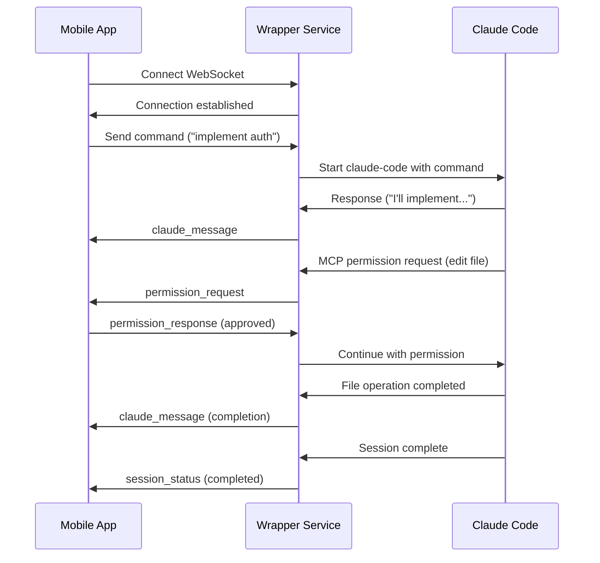
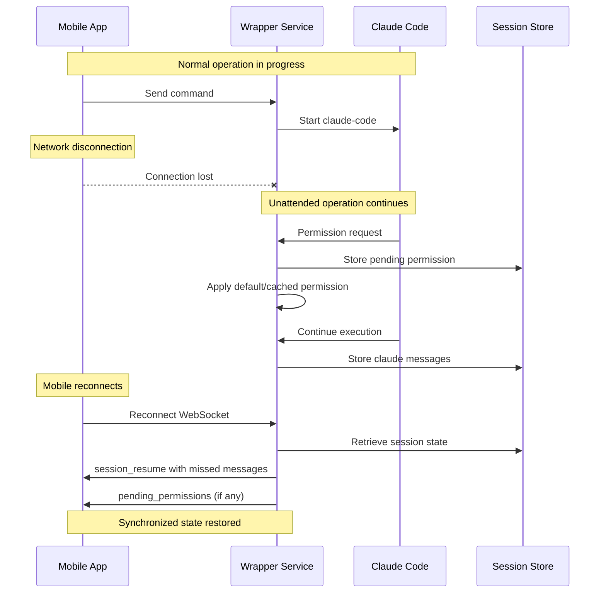
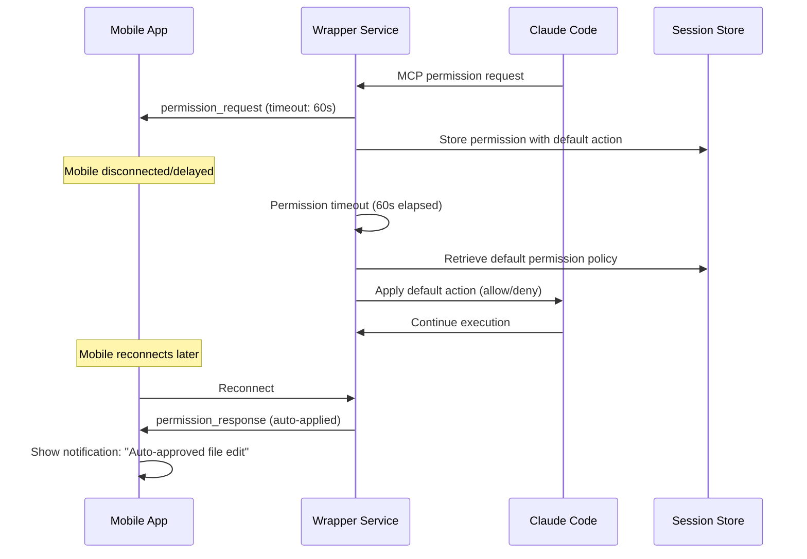

# Claude Code Mobile Remote Control
## Technical Specification v1.0

### Table of Contents
1. [System Overview](#system-overview)
2. [Architecture](#architecture)
3. [Communication Protocol](#communication-protocol)
4. [Sequence Diagrams](#sequence-diagrams)
5. [Resilience & Disconnection Handling](#resilience--disconnection-handling)
6. [Unattended Operation](#unattended-operation)
7. [Security Considerations](#security-considerations)
8. [Implementation Details](#implementation-details)

---

## System Overview

### Purpose
The Claude Code Mobile Remote Control system enables developers to operate Claude Code from mobile devices while maintaining full functionality including interactive permission requests. The system addresses the fundamental incompatibility between mobile connectivity patterns and terminal-based AI development tools.

### Key Requirements
- **Mobile-First Communication**: Structured data exchange instead of terminal UI parsing
- **Disconnection Resilience**: Handle frequent mobile network interruptions
- **Unattended Operation**: Continue Claude Code execution during mobile disconnections
- **Security**: Leverage existing SSH infrastructure without new attack vectors
- **Session Persistence**: Maintain conversation context across app lifecycle events

### Core Problems Solved
1. **TUI Incompatibility**: Claude Code's terminal interface cannot be reliably parsed on mobile
2. **Permission Bottleneck**: Interactive permission prompts block non-interactive execution
3. **Mobile Connectivity**: Frequent disconnections disrupt development workflows
4. **Context Loss**: Mobile app backgrounding/killing loses conversation state

---

## Architecture

### Component Overview
```
┌─────────────────┐    SSH Tunnel    ┌──────────────────────────────────┐
│   Mobile App    │◄─────────────────►│      Development Machine         │
│   (Android)     │   Port Forward    │                                  │
└─────────────────┘                   │  ┌─────────────┐  ┌─────────────┐│
                                      │  │   Wrapper   │  │ Claude Code ││
                                      │  │  Service    │◄─┤   Process   ││
                                      │  │             │  │             ││
                                      │  │ ┌─────────┐ │  └─────────────┘│
                                      │  │ │ MCP     │ │                 │
                                      │  │ │ Server  │ │                 │
                                      │  │ └─────────┘ │                 │
                                      │  │ ┌─────────┐ │                 │
                                      │  │ │WebSocket│ │                 │
                                      │  │ │ Server  │ │                 │
                                      │  │ └─────────┘ │                 │
                                      │  └─────────────┘                 │
                                      └──────────────────────────────────┘
```

### Technology Stack

#### Server Components (Development Machine)
- **Runtime**: Node.js with TypeScript
- **Claude Integration**: `@anthropic/claude-code` SDK
- **Permission Handling**: `@modelcontextprotocol/server`
- **Mobile Communication**: `ws` WebSocket library
- **Session Storage**: File-based persistence

#### Mobile App (Android)
- **Platform**: Native Android with Kotlin
- **WebSocket Client**: OkHttp3
- **SSH Client**: JSch
- **UI Framework**: Jetpack Compose
- **Local Storage**: Room Database + SharedPreferences

---

## Communication Protocol

### Message Types

#### Mobile → Wrapper
```json
{
  "type": "command",
  "id": "cmd_uuid",
  "content": "implement user authentication",
  "session_id": "session_uuid",
  "timestamp": "2025-07-06T14:32:00Z"
}

{
  "type": "permission_response",
  "id": "perm_uuid", 
  "approved": true,
  "timestamp": "2025-07-06T14:32:00Z"
}

{
  "type": "session_resume",
  "session_id": "session_uuid",
  "last_message_id": "msg_uuid"
}
```

#### Wrapper → Mobile
```json
{
  "type": "claude_message",
  "id": "msg_uuid",
  "session_id": "session_uuid",
  "content": "I'll implement the authentication system...",
  "metadata": {
    "turn_number": 1,
    "timestamp": "2025-07-06T14:32:05Z"
  }
}

{
  "type": "permission_request",
  "id": "perm_uuid",
  "session_id": "session_uuid", 
  "tool": "Editor",
  "context": {
    "file": "src/auth.py",
    "action": "create",
    "preview": "// Authentication module implementation..."
  },
  "timeout": 300,
  "timestamp": "2025-07-06T14:32:10Z"
}

{
  "type": "session_status",
  "session_id": "session_uuid",
  "status": "running|completed|error",
  "stats": {
    "total_turns": 3,
    "execution_time": 45.2
  }
}
```

### Connection States
- **Connected**: Real-time bidirectional communication
- **Disconnected**: Wrapper continues execution, queues mobile updates
- **Reconnecting**: Mobile attempts to restore connection with exponential backoff
- **Synchronizing**: Mobile catches up on missed messages after reconnection

---

## Sequence Diagrams

### Normal Operation Flow


### Disconnection & Recovery Flow


### Permission Timeout Flow


---

## Resilience & Disconnection Handling

### Mobile App Resilience

#### Connection Management
```kotlin
class ConnectionManager {
    private var reconnectAttempts = 0
    private val maxReconnectAttempts = 10
    private val baseBackoffDelay = 1000L // 1 second
    
    fun handleDisconnection() {
        when {
            reconnectAttempts < 3 -> immediateReconnect()
            reconnectAttempts < 10 -> exponentialBackoff()
            else -> userPromptReconnect()
        }
    }
    
    private fun exponentialBackoff() {
        val delay = baseBackoffDelay * (2.0.pow(reconnectAttempts)).toLong()
        scheduleReconnect(delay.coerceAtMost(30000L)) // Max 30s
    }
}
```

#### State Synchronization
- **Message ID tracking**: Mobile tracks last received message ID
- **Session resumption**: Request missed messages since last ID
- **Conflict resolution**: Server state always takes precedence
- **Local caching**: Store partial state for immediate UI updates

### Wrapper Service Resilience

#### Unattended Operation Policies
```typescript
interface PermissionPolicy {
  tool: string;
  action: 'allow' | 'deny' | 'prompt';
  timeout: number; // seconds to wait for mobile response
  context?: {
    file_patterns?: string[];
    command_patterns?: string[];
  };
}

const defaultPolicies: PermissionPolicy[] = [
  {
    tool: 'Editor',
    action: 'allow',
    timeout: 60,
    context: { file_patterns: ['src/**', 'tests/**'] }
  },
  {
    tool: 'Bash',
    action: 'prompt', 
    timeout: 30,
    context: { command_patterns: ['git *', 'npm test'] }
  }
];
```

#### Session Persistence
```typescript
interface SessionState {
  id: string;
  created_at: string;
  last_activity: string;
  status: 'active' | 'paused' | 'completed';
  claude_conversation_id: string;
  message_history: Message[];
  pending_permissions: PendingPermission[];
  user_preferences: PermissionPolicy[];
}
```

#### Message Queuing
- **Persistent queue**: File-based storage for mobile messages
- **Message ordering**: Timestamp-based sequence guarantees
- **Cleanup policy**: Remove messages older than 24 hours
- **Size limits**: Maximum 1000 queued messages per session

---

## Unattended Operation

### Permission Auto-Resolution

#### Default Policies
1. **File Operations**: Allow edits within project directories
2. **Safe Commands**: Allow git status, npm test, basic file operations
3. **Destructive Commands**: Require explicit approval (rm, system changes)
4. **Unknown Tools**: Deny by default, require user configuration

#### Intelligent Defaults
```typescript
class PermissionResolver {
  async resolvePermission(request: PermissionRequest): Promise<boolean> {
    // Check user-defined policies first
    const userPolicy = this.getUserPolicy(request);
    if (userPolicy) return userPolicy.action === 'allow';
    
    // Apply heuristics
    if (this.isSafeFileOperation(request)) return true;
    if (this.isDestructiveOperation(request)) return false;
    if (this.isWithinProjectScope(request)) return true;
    
    // Default to safe option
    return false;
  }
}
```

### Execution Continuity

#### Claude Code Process Management
- **Process supervision**: Restart Claude Code if it crashes
- **Resource monitoring**: Track memory/CPU usage
- **Timeout handling**: Kill runaway processes after configurable timeout
- **Logging**: Comprehensive logs for debugging disconnected sessions

#### Progress Tracking
```typescript
interface ExecutionProgress {
  session_id: string;
  current_turn: number;
  total_estimated_turns: number;
  operations_completed: string[];
  operations_pending: string[];
  estimated_completion: string;
}
```

### Mobile Notification Integration

#### Critical Events
- Session completion
- Error conditions requiring intervention
- Permissions requiring manual approval
- Security warnings

#### Notification Payload
```json
{
  "type": "session_complete",
  "session_id": "session_uuid",
  "summary": "Authentication system implemented successfully",
  "files_modified": 3,
  "completion_time": "2025-07-06T15:45:00Z"
}
```

---

## Security Considerations

### SSH Tunnel Security
- **Key-based authentication**: No password authentication allowed
- **Port binding**: WebSocket only binds to localhost interface
- **Ephemeral ports**: Use dynamic port allocation when possible
- **Connection limits**: Maximum concurrent connections per user

### Permission Validation
- **Scope enforcement**: Operations restricted to project directories
- **Command sanitization**: Input validation for all tool parameters
- **Audit logging**: All permissions and actions logged with timestamps
- **User confirmation**: Critical operations require mobile confirmation

### Data Protection
- **No persistent secrets**: SSH keys managed by mobile app
- **Session encryption**: All WebSocket communication over SSH tunnel
- **Local storage**: Session data encrypted at rest
- **Memory safety**: Clear sensitive data from memory after use

---

## Implementation Details

### Startup Sequence
1. **Wrapper Service**: Start WebSocket server on random port
2. **MCP Server**: Initialize permission handling server
3. **Mobile App**: Establish SSH tunnel with port forwarding
4. **WebSocket**: Connect mobile app to wrapper via tunnel
5. **Session**: Resume existing session or create new one

### Error Recovery
```typescript
class ErrorRecovery {
  async handleClaudeCodeCrash(sessionId: string) {
    // Save current state
    await this.saveSessionState(sessionId);
    
    // Restart Claude Code with session resume
    const newProcess = await this.startClaudeCode({
      resume: this.getClaudeConversationId(sessionId)
    });
    
    // Notify mobile of recovery
    this.notifyMobile({
      type: 'session_recovered',
      session_id: sessionId
    });
  }
}
```

### Performance Optimizations
- **Message batching**: Combine multiple Claude messages when mobile is disconnected
- **Compression**: gzip WebSocket messages over SSH
- **Connection pooling**: Reuse SSH connections when possible
- **Memory management**: Cleanup old sessions and message history

### Configuration Management
```typescript
interface WrapperConfig {
  websocket: {
    port?: number;
    max_connections: number;
    heartbeat_interval: number;
  };
  claude: {
    max_turns: number;
    timeout: number;
    default_permissions: PermissionPolicy[];
  };
  storage: {
    session_ttl: number; // hours
    max_message_history: number;
    cleanup_interval: number; // hours
  };
}
```

---

## Conclusion

This architecture provides a robust solution for mobile Claude Code operation by:

1. **Abstracting TUI complexity** through structured message protocols
2. **Handling mobile connectivity patterns** with intelligent disconnection recovery
3. **Enabling unattended operation** through configurable permission policies
4. **Maintaining security** by leveraging existing SSH infrastructure
5. **Preserving session context** across app lifecycle events

The system transforms Claude Code from a desktop-only tool into a mobile-accessible development assistant while maintaining full functionality and security.