# Pocket Agent - a remote coding agent mobile interface
## Technical Specification v1.0

### Table of Contents
1. [System Overview](#system-overview)
2. [Architecture](#architecture)
3. [Communication Protocol](#communication-protocol)
4. [Sequence Diagrams](#sequence-diagrams)
   - [Normal Operation Flow](#normal-operation-flow)
   - [Disconnection & Recovery Flow](#disconnection--recovery-flow)
   - [Permission Timeout Flow](#permission-timeout-flow)
   - [Complete Connection Establishment Flow](#complete-connection-establishment-flow)
   - [Background Service Lifecycle Flow](#background-service-lifecycle-flow)
   - [Security Authentication Flow](#security-authentication-flow)
   - [Error Recovery and Resilience Flow](#error-recovery-and-resilience-flow)
   - [Cross-Feature State Synchronization Flow](#cross-feature-state-synchronization-flow)
   - [Permission Policy and Audit Flow](#permission-policy-and-audit-flow)
   - [Project Setup and Repository Initialization Flow](#project-setup-and-repository-initialization-flow)
   - [Database Migration and Sync Flow](#database-migration-and-sync-flow)
   - [Sub-Agent Progress Monitoring Flow](#sub-agent-progress-monitoring-flow)
   - [Notification Interaction and Deep Linking Flow](#notification-interaction-and-deep-linking-flow)
   - [Battery Optimization and Performance Flow](#battery-optimization-and-performance-flow)
   - [App Lifecycle and State Preservation Flow](#app-lifecycle-and-state-preservation-flow)
5. [Resilience & Disconnection Handling](#resilience--disconnection-handling)
6. [Unattended Operation](#unattended-operation)
7. [Security Considerations](#security-considerations)
8. [Implementation Details](#implementation-details)

---

## System Overview

### Purpose
The Claude Code Mobile Remote Control system enables developers to operate Claude Code from mobile devices while maintaining full functionality including interactive permission requests. The system addresses the fundamental incompatibility between mobile connectivity patterns and terminal-based AI development tools.

### Key Requirements
- **Mobile-First Communication**: Structured data exchange instead of terminal UI parsing
- **Disconnection Resilience**: Handle frequent mobile network interruptions
- **Unattended Operation**: Continue Claude Code execution during mobile disconnections
- **Security**: SSH key authentication for WebSocket connections
- **Session Persistence**: Maintain conversation context across app lifecycle events

### Core Problems Solved
1. **TUI Incompatibility**: Claude Code's terminal interface cannot be reliably parsed on mobile
2. **Permission Bottleneck**: Interactive permission prompts block non-interactive execution
3. **Mobile Connectivity**: Frequent disconnections disrupt development workflows
4. **Context Loss**: Mobile app backgrounding/killing loses conversation state

---

## Architecture

### Component Overview
```
┌─────────────────┐     Direct WSS    ┌──────────────────────────────────┐
│   Mobile App    │◄─────────────────►│      Development Server          │
│   (Android)     │  SSH Key Auth     │                                  │
└─────────────────┘                   │  ┌─────────────┐  ┌─────────────┐│
                                      │  │   Wrapper   │  │ Claude Code ││
                                      │  │  Service    │◄─┤   Process   ││
                                      │  │             │  │             ││
                                      │  │ ┌─────────┐ │  └─────────────┘│
                                      │  │ │ MCP     │ │                 │
                                      │  │ │ Server  │ │                 │
                                      │  │ └─────────┘ │                 │
                                      │  │ ┌─────────┐ │                 │
                                      │  │ │WebSocket│ │                 │
                                      │  │ │ Server  │ │                 │
                                      │  │ └─────────┘ │                 │
                                      │  └─────────────┘                 │
                                      └──────────────────────────────────┘
```

### Technology Stack

#### Server Components (Development Machine)
- **Runtime**: Node.js with TypeScript
- **Claude Integration**: `@anthropic/claude-code` SDK
- **Permission Handling**: `@modelcontextprotocol/server`
- **Mobile Communication**: `ws` WebSocket library (WSS/TLS)
- **Session Storage**: File-based persistence

#### Mobile App (Android)
- **Platform**: Native Android with Kotlin
- **WebSocket Client**: OkHttp3 with SSH key authentication
- **SSH Key Management**: Bouncy Castle for key operations
- **UI Framework**: Jetpack Compose
- **Local Storage**: Encrypted JSON file with Android Keystore

---

## Entity Relationships

The mobile app manages three core entity types with clear hierarchical relationships:

### SSH Identity → Server Profile → Project

```
SSH Identity (1) ──────► (N) Server Profile ──────► (N) Project
     │                            │                        │
     ├─ id: String               ├─ id: String            ├─ id: String
     ├─ name: String             ├─ name: String          ├─ name: String
     ├─ keyAlias: String         ├─ hostname: String      ├─ serverProfileId: String
     ├─ publicKey: String        ├─ port: Int             ├─ projectPath: String
     └─ created: Instant         ├─ username: String      ├─ scriptsFolder: String
                                 ├─ sshIdentityId: String ├─ claudeSessionId: String?
                                 └─ lastConnected: Instant └─ lastActive: Instant
```

### Key Relationships:
- **SSH Identity**: Represents an imported SSH private key, encrypted and stored securely
- **Server Profile**: Connection details for a development server, references which SSH key to use
- **Project**: Individual Claude Code session on a specific server with its own working directory

### Example Usage:
- "Work SSH Key" → "Main Dev Server" → ["API Project", "Frontend Project"]
- "Personal SSH Key" → "Home Server" → ["Personal Website", "Side Project"]

---

## Communication Protocol

### Message Types

#### Authentication Messages
```json
// Server → Mobile: Authentication challenge
{
  "type": "auth_challenge",
  "nonce": "random_string",
  "timestamp": 1234567890,
  "serverVersion": "1.0.0"
}

// Mobile → Server: Authentication response  
{
  "type": "auth_response",
  "publicKey": "ssh-rsa AAAAB3...",
  "signature": "base64_signature",
  "clientVersion": "1.0.0",
  "sessionId": null // or existing session ID for resumption
}

// Server → Mobile: Authentication result
{
  "type": "auth_success",
  "sessionId": "session_uuid",
  "expiresAt": 1234567890
}
```

#### Command Messages (Mobile → Wrapper)
```json
{
  "type": "command",
  "id": "cmd_uuid",
  "timestamp": 1234567890,
  "command": "implement user authentication",
  "isShellCommand": false // true for shell commands like "git status"
}

{
  "type": "project_init",
  "projectPath": "/home/user/new-project",
  "repositoryUrl": "https://github.com/user/repo.git", // optional
  "accessToken": "ghp_..." // optional for private repos
}
```

#### Response Messages (Wrapper → Mobile)
```json
{
  "type": "claude_response",
  "id": "msg_uuid",
  "timestamp": 1234567890,
  "content": "I'll implement the authentication system...",
  "isPartial": false,
  "conversationId": "conv_uuid",
  "metadata": {
    "turnNumber": "1",
    "model": "claude-3.5-sonnet"
  }
}

{
  "type": "progress_update",
  "id": "prog_uuid",
  "timestamp": 1234567890,
  "operation": "Running tests",
  "progress": 75,
  "subOperations": [
    {"name": "Unit tests", "status": "completed"},
    {"name": "Integration tests", "status": "running"}
  ]
}
```

#### Permission Messages
```json
// Wrapper → Mobile: Permission request
{
  "type": "permission_request",
  "id": "perm_uuid",
  "timestamp": 1234567890,
  "tool": "Editor",
  "action": "create",
  "details": {
    "file": "src/auth.py",
    "preview": "# Authentication module\n..."
  },
  "timeout": 300
}

// Mobile → Wrapper: Permission response
{
  "type": "permission_response",
  "id": "resp_uuid",
  "timestamp": 1234567890,
  "requestId": "perm_uuid",
  "approved": true,
  "remember": false // for future auto-approval
}
```

#### Session Management
```json
// Mobile → Wrapper: Resume session
{
  "type": "session_resume",
  "sessionId": "session_uuid",
  "lastMessageId": "msg_uuid",
  "lastMessageTimestamp": 1234567890
}

// Wrapper → Mobile: Session status
{
  "type": "session_status",
  "sessionId": "session_uuid",
  "status": "running", // or "completed", "error"
  "totalTurns": 3,
  "executionTime": 45.2,
  "error": null // or error details
}
```

### Connection States
- **Connected**: Real-time bidirectional communication
- **Disconnected**: Wrapper continues execution, queues mobile updates
- **Reconnecting**: Mobile attempts to restore connection with exponential backoff
- **Synchronizing**: Mobile catches up on missed messages after reconnection

---

## Sequence Diagrams

### Normal Operation Flow
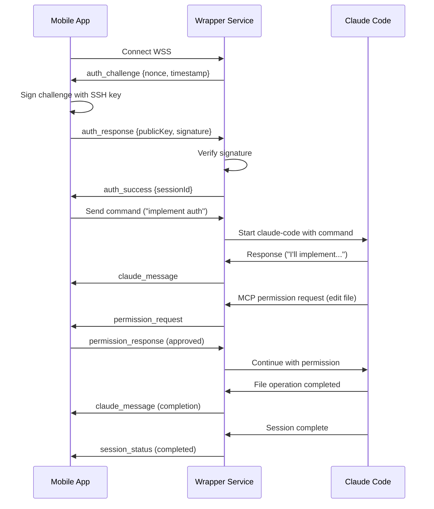
```mermaid
sequenceDiagram
    participant M as Mobile App
    participant W as Wrapper Service
    participant C as Claude Code
    
    M->>W: Connect WSS
    W->>M: auth_challenge {nonce, timestamp}
    M->>M: Sign challenge with SSH key
    M->>W: auth_response {publicKey, signature}
    W->>W: Verify signature
    W->>M: auth_success {sessionId}
    
    M->>W: Send command ("implement auth")
    W->>C: Start claude-code with command
    
    C->>W: Response ("I'll implement...")
    W->>M: claude_message
    
    C->>W: MCP permission request (edit file)
    W->>M: permission_request
    M->>W: permission_response (approved)
    W->>C: Continue with permission
    
    C->>W: File operation completed
    W->>M: claude_message (completion)
    
    C->>W: Session complete
    W->>M: session_status (completed)
```

### Disconnection & Recovery Flow
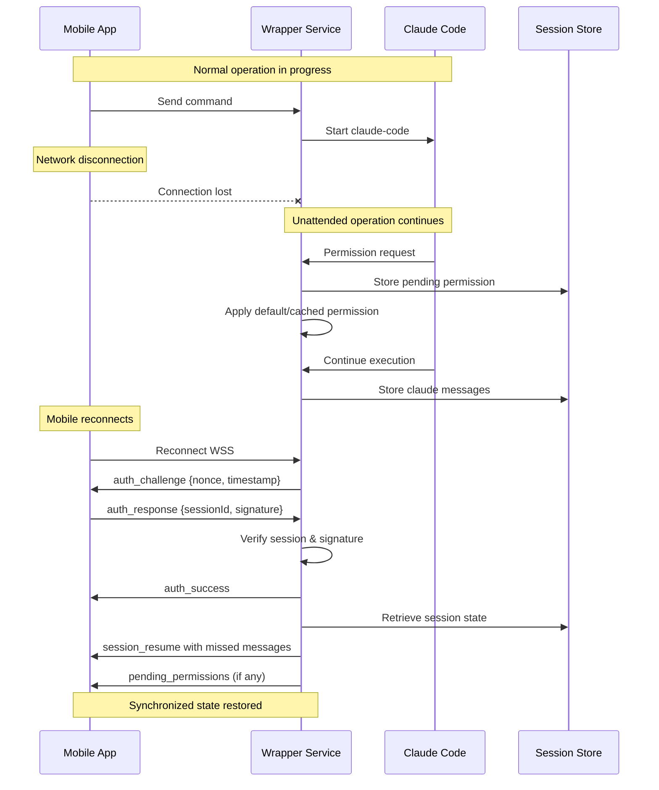
```mermaid
sequenceDiagram
    participant M as Mobile App
    participant W as Wrapper Service
    participant C as Claude Code
    participant S as Session Store
    
    Note over M,C: Normal operation in progress
    M->>W: Send command
    W->>C: Start claude-code
    
    Note over M: Network disconnection
    M--XW: Connection lost
    
    Note over W,C: Unattended operation continues
    C->>W: Permission request
    W->>S: Store pending permission
    W->>W: Apply default/cached permission
    C->>W: Continue execution
    W->>S: Store claude messages
    
    Note over M: Mobile reconnects
    M->>W: Reconnect WSS
    W->>M: auth_challenge {nonce, timestamp}
    M->>W: auth_response {sessionId, signature}
    W->>W: Verify session & signature
    W->>M: auth_success
    W->>S: Retrieve session state
    W->>M: session_resume with missed messages
    W->>M: pending_permissions (if any)
    
    Note over M,W: Synchronized state restored
```

### Permission Timeout Flow
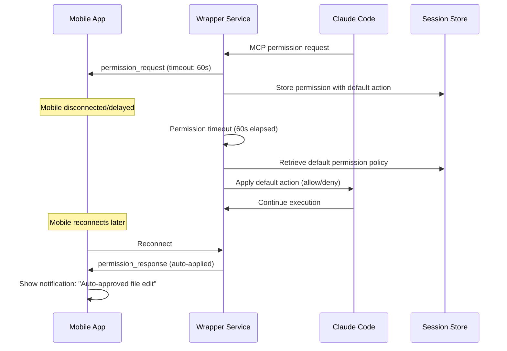
```mermaid
sequenceDiagram
    participant M as Mobile App
    participant W as Wrapper Service  
    participant C as Claude Code
    participant S as Session Store
    
    C->>W: MCP permission request
    W->>M: permission_request (timeout: 60s)
    W->>S: Store permission with default action
    
    Note over M: Mobile disconnected/delayed
    
    W->>W: Permission timeout (60s elapsed)
    W->>S: Retrieve default permission policy
    W->>C: Apply default action (allow/deny)
    C->>W: Continue execution
    
    Note over M: Mobile reconnects later
    M->>W: Reconnect
    W->>M: permission_response (auto-applied)
    M->>M: Show notification: "Auto-approved file edit"
```

### Complete Connection Establishment Flow
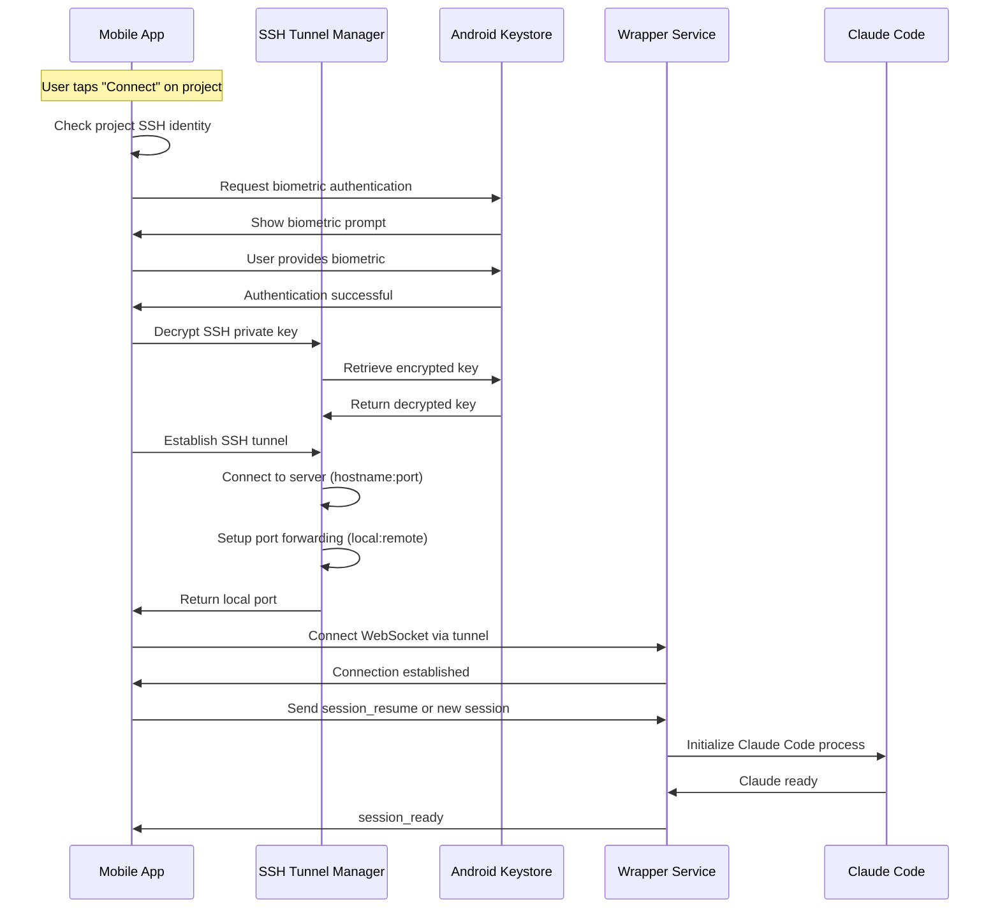
```mermaid
sequenceDiagram
    participant M as Mobile App
    participant SSH as SSH Tunnel Manager
    participant KS as Android Keystore
    participant W as Wrapper Service
    participant C as Claude Code
    
    Note over M: User taps "Connect" on project
    M->>M: Check project SSH identity
    M->>KS: Request biometric authentication
    KS->>M: Show biometric prompt
    M->>KS: User provides biometric
    KS->>M: Authentication successful
    
    M->>SSH: Decrypt SSH private key
    SSH->>KS: Retrieve encrypted key
    KS->>SSH: Return decrypted key
    
    M->>SSH: Establish SSH tunnel
    SSH->>SSH: Connect to server (hostname:port)
    SSH->>SSH: Setup port forwarding (local:remote)
    SSH->>M: Return local port
    
    M->>W: Connect WebSocket via tunnel
    W->>M: Connection established
    
    M->>W: Send session_resume or new session
    W->>C: Initialize Claude Code process
    C->>W: Claude ready
    W->>M: session_ready
```


### Background Service Lifecycle Flow
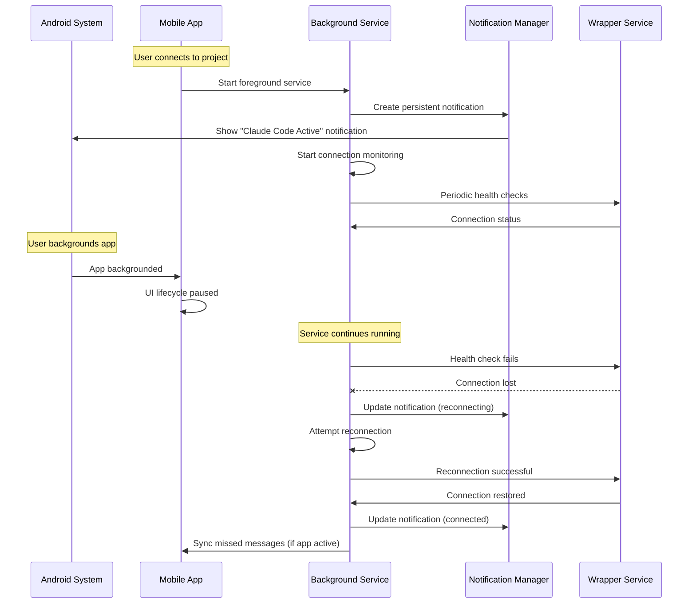
```mermaid
sequenceDiagram
    participant A as Android System
    participant M as Mobile App
    participant BS as Background Service
    participant N as Notification Manager
    participant W as Wrapper Service
    
    Note over M: User connects to project
    M->>BS: Start foreground service
    BS->>N: Create persistent notification
    N->>A: Show "Claude Code Active" notification
    
    BS->>BS: Start connection monitoring
    BS->>W: Periodic health checks
    W->>BS: Connection status
    
    Note over A: User backgrounds app
    A->>M: App backgrounded
    M->>M: UI lifecycle paused
    Note over BS: Service continues running
    
    BS->>W: Health check fails
    W--XBS: Connection lost
    BS->>N: Update notification (reconnecting)
    BS->>BS: Attempt reconnection
    
    BS->>W: Reconnection successful
    W->>BS: Connection restored
    BS->>N: Update notification (connected)
    BS->>M: Sync missed messages (if app active)
```

### Security Authentication Flow
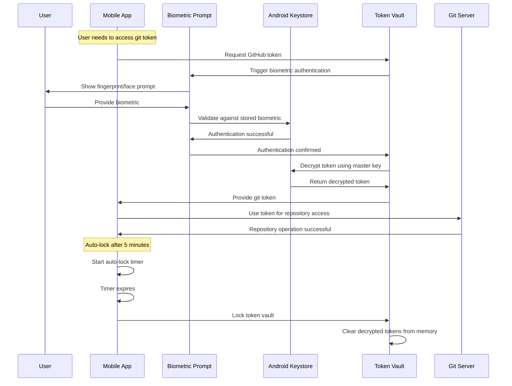
```mermaid
sequenceDiagram
    participant U as User
    participant M as Mobile App
    participant B as Biometric Prompt
    participant KS as Android Keystore
    participant TV as Token Vault
    participant Git as Git Server
    
    Note over M: User needs to access git token
    M->>TV: Request GitHub token
    TV->>B: Trigger biometric authentication
    B->>U: Show fingerprint/face prompt
    U->>B: Provide biometric
    B->>KS: Validate against stored biometric
    KS->>B: Authentication successful
    
    B->>TV: Authentication confirmed
    TV->>KS: Decrypt token using master key
    KS->>TV: Return decrypted token
    TV->>M: Provide git token
    
    M->>Git: Use token for repository access
    Git->>M: Repository operation successful
    
    Note over M: Auto-lock after 5 minutes
    M->>M: Start auto-lock timer
    M->>M: Timer expires
    M->>TV: Lock token vault
    TV->>TV: Clear decrypted tokens from memory
```

### Error Recovery and Resilience Flow
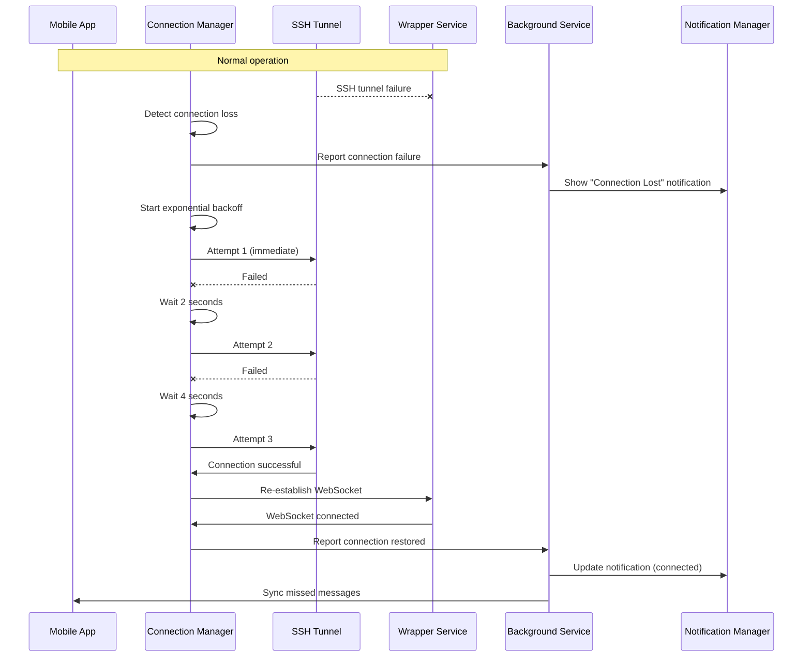
```mermaid
sequenceDiagram
    participant M as Mobile App
    participant CM as Connection Manager
    participant SSH as SSH Tunnel
    participant W as Wrapper Service
    participant BS as Background Service
    participant N as Notification Manager
    
    Note over M,W: Normal operation
    SSH--XW: SSH tunnel failure
    CM->>CM: Detect connection loss
    CM->>BS: Report connection failure
    BS->>N: Show "Connection Lost" notification
    
    CM->>CM: Start exponential backoff
    CM->>SSH: Attempt 1 (immediate)
    SSH--XCM: Failed
    
    CM->>CM: Wait 2 seconds
    CM->>SSH: Attempt 2
    SSH--XCM: Failed
    
    CM->>CM: Wait 4 seconds
    CM->>SSH: Attempt 3
    SSH->>CM: Connection successful
    
    CM->>W: Re-establish WebSocket
    W->>CM: WebSocket connected
    CM->>BS: Report connection restored
    BS->>N: Update notification (connected)
    BS->>M: Sync missed messages
```

### Cross-Feature State Synchronization Flow
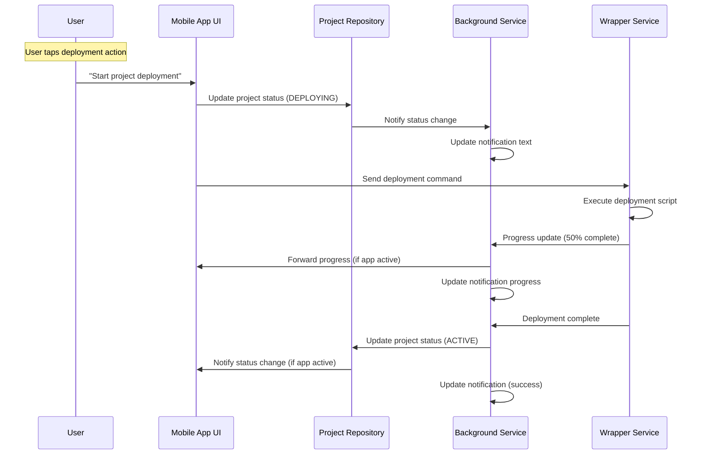
```mermaid
sequenceDiagram
    participant U as User
    participant M as Mobile App UI
    participant P as Project Repository
    participant BS as Background Service
    participant W as Wrapper Service
    
    Note over U: User taps deployment action
    U->>M: "Start project deployment"
    M->>P: Update project status (DEPLOYING)
    P->>BS: Notify status change
    BS->>BS: Update notification text
    
    M->>W: Send deployment command
    W->>W: Execute deployment script
    W->>BS: Progress update (50% complete)
    BS->>M: Forward progress (if app active)
    BS->>BS: Update notification progress
    
    W->>BS: Deployment complete
    BS->>P: Update project status (ACTIVE)
    P->>M: Notify status change (if app active)
    BS->>BS: Update notification (success)
```

### Permission Policy and Audit Flow
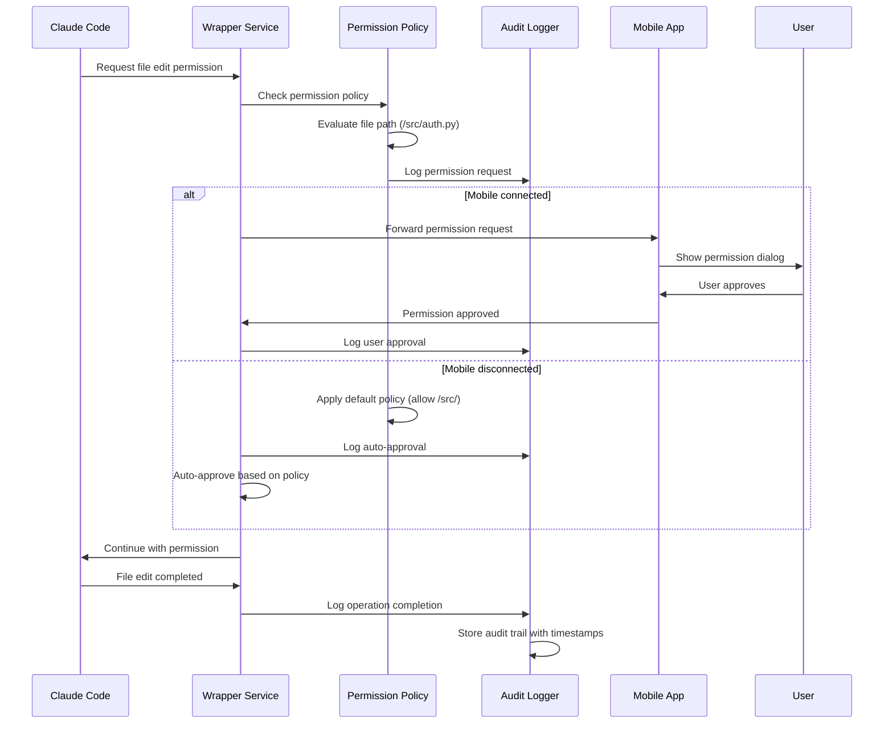
```mermaid
sequenceDiagram
    participant C as Claude Code
    participant W as Wrapper Service
    participant PP as Permission Policy
    participant AL as Audit Logger
    participant M as Mobile App
    participant U as User
    
    C->>W: Request file edit permission
    W->>PP: Check permission policy
    PP->>PP: Evaluate file path (/src/auth.py)
    PP->>AL: Log permission request
    
    alt Mobile connected
        W->>M: Forward permission request
        M->>U: Show permission dialog
        U->>M: User approves
        M->>W: Permission approved
        W->>AL: Log user approval
    else Mobile disconnected
        PP->>PP: Apply default policy (allow /src/)
        W->>AL: Log auto-approval
        W->>W: Auto-approve based on policy
    end
    
    W->>C: Continue with permission
    C->>W: File edit completed
    W->>AL: Log operation completion
    AL->>AL: Store audit trail with timestamps
```

### Project Setup and Repository Initialization Flow
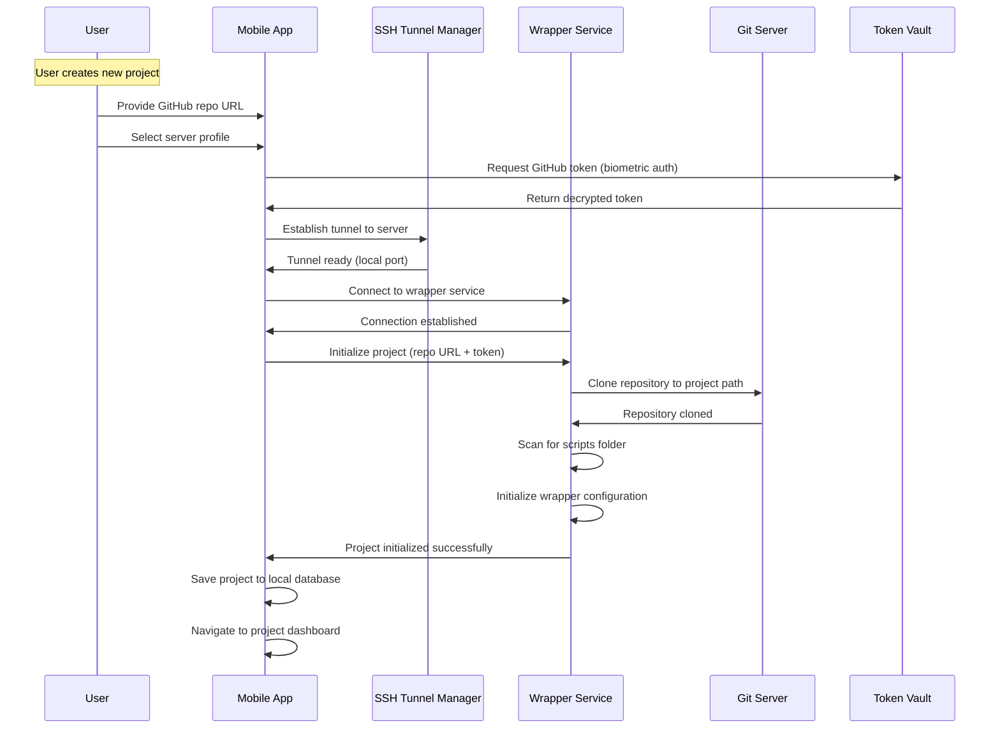
```mermaid
sequenceDiagram
    participant U as User
    participant M as Mobile App
    participant SSH as SSH Tunnel Manager
    participant W as Wrapper Service
    participant Git as Git Server
    participant TV as Token Vault
    
    Note over U: User creates new project
    U->>M: Provide GitHub repo URL
    U->>M: Select server profile
    M->>TV: Request GitHub token (biometric auth)
    TV->>M: Return decrypted token
    
    M->>SSH: Establish tunnel to server
    SSH->>M: Tunnel ready (local port)
    M->>W: Connect to wrapper service
    W->>M: Connection established
    
    M->>W: Initialize project (repo URL + token)
    W->>Git: Clone repository to project path
    Git->>W: Repository cloned
    W->>W: Scan for scripts folder
    W->>W: Initialize wrapper configuration
    W->>M: Project initialized successfully
    
    M->>M: Save project to local database
    M->>M: Navigate to project dashboard
```

### Database Migration and Sync Flow
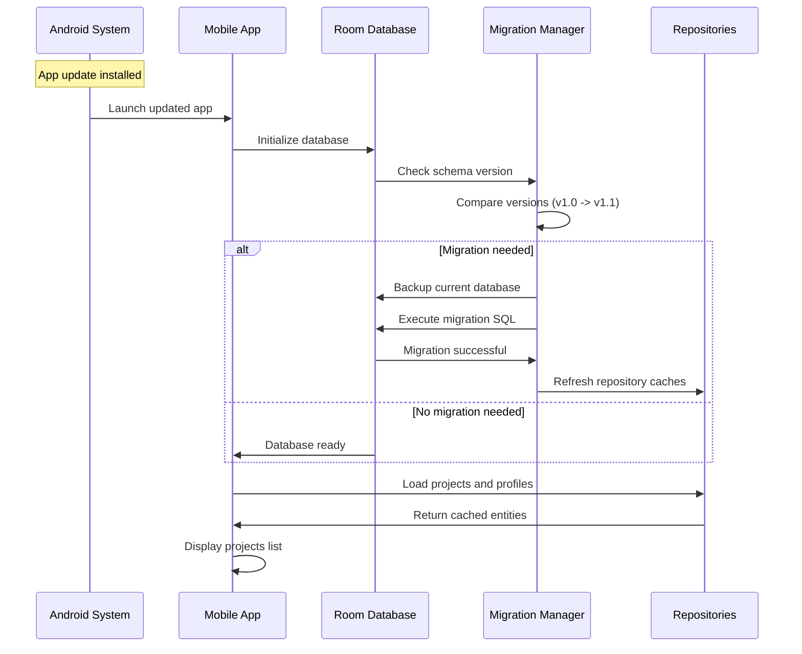
```mermaid
sequenceDiagram
    participant A as Android System
    participant M as Mobile App
    participant DB as Room Database
    participant MIG as Migration Manager
    participant REPO as Repositories
    
    Note over A: App update installed
    A->>M: Launch updated app
    M->>DB: Initialize database
    DB->>MIG: Check schema version
    MIG->>MIG: Compare versions (v1.0 -> v1.1)
    
    alt Migration needed
        MIG->>DB: Backup current database
        MIG->>DB: Execute migration SQL
        DB->>MIG: Migration successful
        MIG->>REPO: Refresh repository caches
    else No migration needed
        DB->>M: Database ready
    end
    
    M->>REPO: Load projects and profiles
    REPO->>M: Return cached entities
    M->>M: Display projects list
```

### Sub-Agent Progress Monitoring Flow
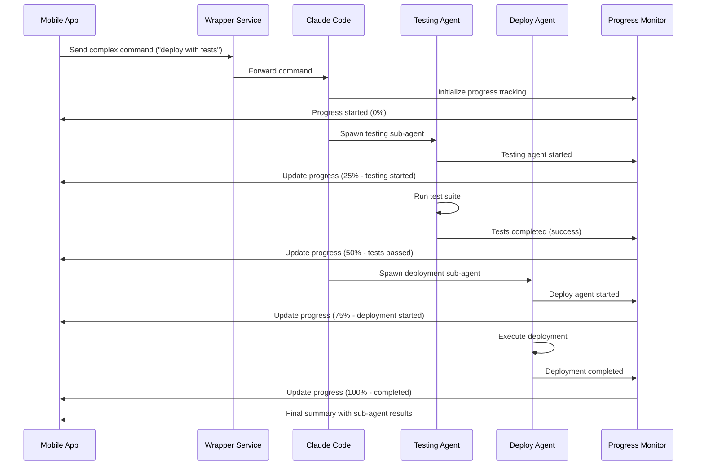
```mermaid
sequenceDiagram
    participant M as Mobile App
    participant W as Wrapper Service
    participant C as Claude Code
    participant SA1 as Testing Agent
    participant SA2 as Deploy Agent
    participant PM as Progress Monitor
    
    M->>W: Send complex command ("deploy with tests")
    W->>C: Forward command
    C->>PM: Initialize progress tracking
    PM->>M: Progress started (0%)
    
    C->>SA1: Spawn testing sub-agent
    SA1->>PM: Testing agent started
    PM->>M: Update progress (25% - testing started)
    
    SA1->>SA1: Run test suite
    SA1->>PM: Tests completed (success)
    PM->>M: Update progress (50% - tests passed)
    
    C->>SA2: Spawn deployment sub-agent
    SA2->>PM: Deploy agent started
    PM->>M: Update progress (75% - deployment started)
    
    SA2->>SA2: Execute deployment
    SA2->>PM: Deployment completed
    PM->>M: Update progress (100% - completed)
    PM->>M: Final summary with sub-agent results
```

### Notification Interaction and Deep Linking Flow
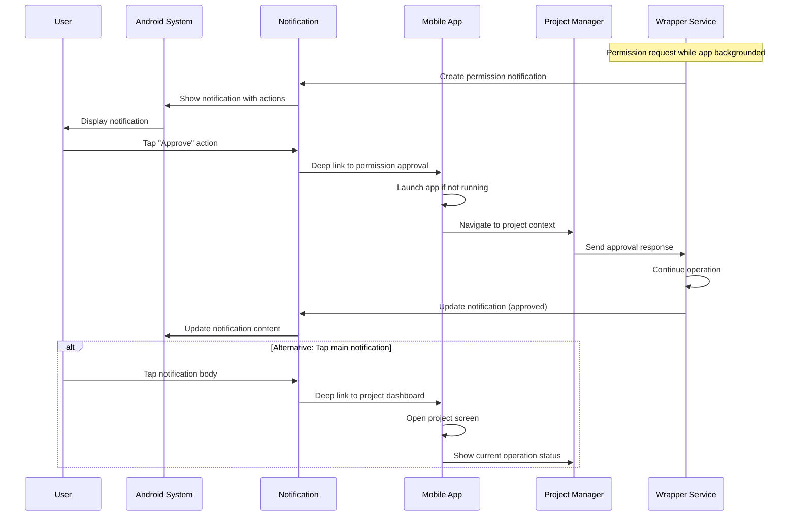
```mermaid
sequenceDiagram
    participant U as User
    participant A as Android System
    participant N as Notification
    participant M as Mobile App
    participant P as Project Manager
    participant W as Wrapper Service
    
    Note over W: Permission request while app backgrounded
    W->>N: Create permission notification
    N->>A: Show notification with actions
    A->>U: Display notification
    
    U->>N: Tap "Approve" action
    N->>M: Deep link to permission approval
    M->>M: Launch app if not running
    M->>P: Navigate to project context
    P->>W: Send approval response
    W->>W: Continue operation
    
    W->>N: Update notification (approved)
    N->>A: Update notification content
    
    alt Alternative: Tap main notification
        U->>N: Tap notification body
        N->>M: Deep link to project dashboard
        M->>M: Open project screen
        M->>P: Show current operation status
    end
```

### Battery Optimization and Performance Flow
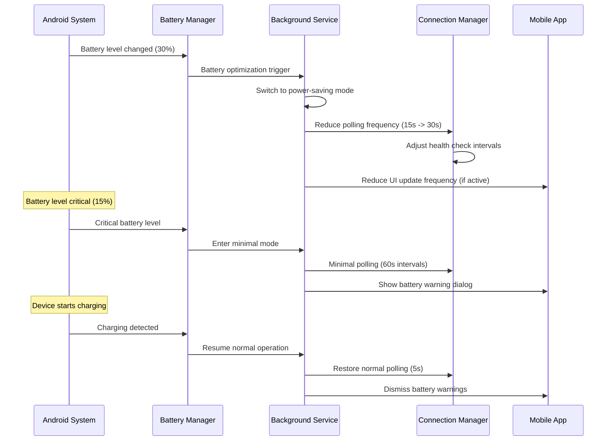
```mermaid
sequenceDiagram
    participant A as Android System
    participant BM as Battery Manager
    participant BS as Background Service
    participant CM as Connection Manager
    participant M as Mobile App
    
    A->>BM: Battery level changed (30%)
    BM->>BS: Battery optimization trigger
    BS->>BS: Switch to power-saving mode
    
    BS->>CM: Reduce polling frequency (15s -> 30s)
    CM->>CM: Adjust health check intervals
    BS->>M: Reduce UI update frequency (if active)
    
    Note over A: Battery level critical (15%)
    A->>BM: Critical battery level
    BM->>BS: Enter minimal mode
    BS->>CM: Minimal polling (60s intervals)
    BS->>M: Show battery warning dialog
    
    Note over A: Device starts charging
    A->>BM: Charging detected
    BM->>BS: Resume normal operation
    BS->>CM: Restore normal polling (5s)
    BS->>M: Dismiss battery warnings
```

### App Lifecycle and State Preservation Flow
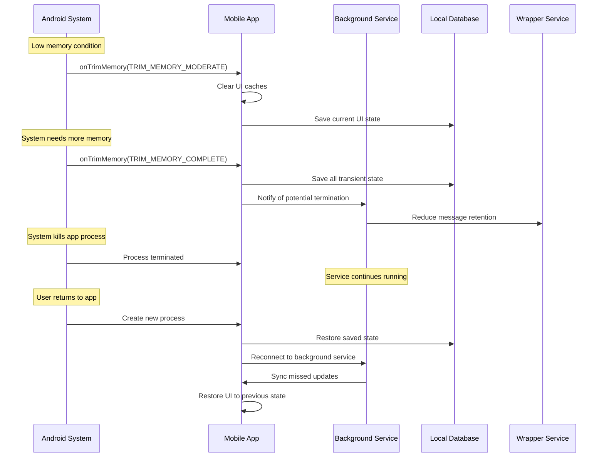
```mermaid
sequenceDiagram
    participant A as Android System
    participant M as Mobile App
    participant BS as Background Service
    participant DB as Local Database
    participant W as Wrapper Service
    
    Note over A: Low memory condition
    A->>M: onTrimMemory(TRIM_MEMORY_MODERATE)
    M->>M: Clear UI caches
    M->>DB: Save current UI state
    
    Note over A: System needs more memory
    A->>M: onTrimMemory(TRIM_MEMORY_COMPLETE)
    M->>DB: Save all transient state
    M->>BS: Notify of potential termination
    BS->>W: Reduce message retention
    
    Note over A: System kills app process
    A->>M: Process terminated
    Note over BS: Service continues running
    
    Note over A: User returns to app
    A->>M: Create new process
    M->>DB: Restore saved state
    M->>BS: Reconnect to background service
    BS->>M: Sync missed updates
    M->>M: Restore UI to previous state
```

---

## Resilience & Disconnection Handling

### Mobile App Resilience

#### Connection Management
```kotlin
class ConnectionManager {
    private var reconnectAttempts = 0
    private val maxReconnectAttempts = 10
    private val baseBackoffDelay = 1000L // 1 second
    private var lastSessionId: String? = null
    
    fun handleDisconnection() {
        when {
            reconnectAttempts < 3 -> immediateReconnect()
            reconnectAttempts < 10 -> exponentialBackoff()
            else -> userPromptReconnect()
        }
    }
    
    private fun exponentialBackoff() {
        val delay = baseBackoffDelay * (2.0.pow(reconnectAttempts)).toLong()
        scheduleReconnect(delay.coerceAtMost(30000L)) // Max 30s
    }
    
    suspend fun authenticate(sshKey: SshKey): String {
        // Handle SSH key authentication during connection
        return performSshKeyAuth(sshKey)
    }
}
```

#### State Synchronization
- **Message ID tracking**: Mobile tracks last received message ID
- **Session resumption**: Request missed messages since last ID
- **Conflict resolution**: Server state always takes precedence
- **Local caching**: Store partial state for immediate UI updates

### Wrapper Service Resilience

#### Unattended Operation Policies
```typescript
interface PermissionPolicy {
  tool: string;
  action: 'allow' | 'deny' | 'prompt';
  timeout: number; // seconds to wait for mobile response
  context?: {
    file_patterns?: string[];
    command_patterns?: string[];
  };
}

const defaultPolicies: PermissionPolicy[] = [
  {
    tool: 'Editor',
    action: 'allow',
    timeout: 60,
    context: { file_patterns: ['src/**', 'tests/**'] }
  },
  {
    tool: 'Bash',
    action: 'prompt', 
    timeout: 30,
    context: { command_patterns: ['git *', 'npm test'] }
  }
];
```

#### Session Persistence
```typescript
interface SessionState {
  id: string;
  created_at: string;
  last_activity: string;
  status: 'active' | 'paused' | 'completed';
  claude_conversation_id: string;
  message_history: Message[];
  pending_permissions: PendingPermission[];
  user_preferences: PermissionPolicy[];
}
```

#### Message Queuing
- **Persistent queue**: File-based storage for mobile messages
- **Message ordering**: Timestamp-based sequence guarantees
- **Cleanup policy**: Remove messages older than 24 hours
- **Size limits**: Maximum 1000 queued messages per session

---

## Unattended Operation

### Permission Auto-Resolution

#### Default Policies
1. **File Operations**: Allow edits within project directories
2. **Safe Commands**: Allow git status, npm test, basic file operations
3. **Destructive Commands**: Require explicit approval (rm, system changes)
4. **Unknown Tools**: Deny by default, require user configuration

#### Intelligent Defaults
```typescript
class PermissionResolver {
  async resolvePermission(request: PermissionRequest): Promise<boolean> {
    // Check user-defined policies first
    const userPolicy = this.getUserPolicy(request);
    if (userPolicy) return userPolicy.action === 'allow';
    
    // Apply heuristics
    if (this.isSafeFileOperation(request)) return true;
    if (this.isDestructiveOperation(request)) return false;
    if (this.isWithinProjectScope(request)) return true;
    
    // Default to safe option
    return false;
  }
}
```

### Execution Continuity

#### Claude Code Process Management
- **Process supervision**: Restart Claude Code if it crashes
- **Resource monitoring**: Track memory/CPU usage
- **Timeout handling**: Kill runaway processes after configurable timeout
- **Logging**: Comprehensive logs for debugging disconnected sessions

#### Progress Tracking
```typescript
interface ExecutionProgress {
  session_id: string;
  current_turn: number;
  total_estimated_turns: number;
  operations_completed: string[];
  operations_pending: string[];
  estimated_completion: string;
}
```

### Mobile Notification Integration

#### Critical Events
- Session completion
- Error conditions requiring intervention
- Permissions requiring manual approval
- Security warnings

#### Notification Payload
```json
{
  "type": "session_complete",
  "session_id": "session_uuid",
  "summary": "Authentication system implemented successfully",
  "files_modified": 3,
  "completion_time": "2025-07-06T15:45:00Z"
}
```

---

## Security Considerations

### WebSocket Security
- **SSH Key Authentication**: Challenge-response authentication using SSH keys
- **TLS Enforcement**: All connections must use WSS (TLS 1.3+)
- **Session Management**: Secure session tokens with expiration
- **Rate Limiting**: Authentication attempt limits per IP
- **Certificate Pinning**: Optional certificate pinning for known servers

### Permission Validation
- **Scope enforcement**: Operations restricted to project directories
- **Command sanitization**: Input validation for all tool parameters
- **Audit logging**: All permissions and actions logged with timestamps
- **User confirmation**: Critical operations require mobile confirmation

### Data Protection
- **No persistent secrets**: SSH keys managed by mobile app with biometric protection
- **Transport encryption**: All WebSocket communication over TLS
- **Authentication**: SSH key signatures for authentication
- **Local storage**: Session data encrypted at rest
- **Memory safety**: Clear sensitive data from memory after use

---

## Implementation Details

### Startup Sequence
1. **Wrapper Service**: Start WebSocket server with TLS on configured port
2. **MCP Server**: Initialize permission handling server
3. **Mobile App**: Connect to WSS endpoint
4. **Authentication**: Perform SSH key challenge-response
5. **Session**: Resume existing session or create new one

### Error Recovery
```typescript
class ErrorRecovery {
  async handleClaudeCodeCrash(sessionId: string) {
    // Save current state
    await this.saveSessionState(sessionId);
    
    // Restart Claude Code with session resume
    const newProcess = await this.startClaudeCode({
      resume: this.getClaudeConversationId(sessionId)
    });
    
    // Notify mobile of recovery
    this.notifyMobile({
      type: 'session_recovered',
      session_id: sessionId
    });
  }
}
```

### Performance Optimizations
- **Message batching**: Combine multiple Claude messages when mobile is disconnected
- **Compression**: WebSocket per-message deflate compression
- **Connection reuse**: Maintain persistent WebSocket connections
- **Memory management**: Cleanup old sessions and message history

### Configuration Management
```typescript
interface WrapperConfig {
  websocket: {
    port?: number;
    max_connections: number;
    heartbeat_interval: number;
  };
  claude: {
    max_turns: number;
    timeout: number;
    default_permissions: PermissionPolicy[];
  };
  storage: {
    session_ttl: number; // hours
    max_message_history: number;
    cleanup_interval: number; // hours
  };
}
```

---

## Conclusion

This architecture provides a robust solution for mobile Claude Code operation by:

1. **Abstracting TUI complexity** through structured message protocols
2. **Handling mobile connectivity patterns** with intelligent disconnection recovery
3. **Enabling unattended operation** through configurable permission policies
4. **Maintaining security** by leveraging existing SSH infrastructure
5. **Preserving session context** across app lifecycle events

The system transforms Claude Code from a desktop-only tool into a mobile-accessible development assistant while maintaining full functionality and security.