# Pocket Agent Server Architecture

This document provides detailed architectural diagrams and explanations of the Pocket Agent Server components and their interactions.

## Table of Contents

- [System Overview](#system-overview)
- [Component Architecture](#component-architecture)
- [Data Flow](#data-flow)
- [Sequence Diagrams](#sequence-diagrams)
- [State Management](#state-management)
- [Deployment Architecture](#deployment-architecture)

## System Overview

### High-Level Architecture

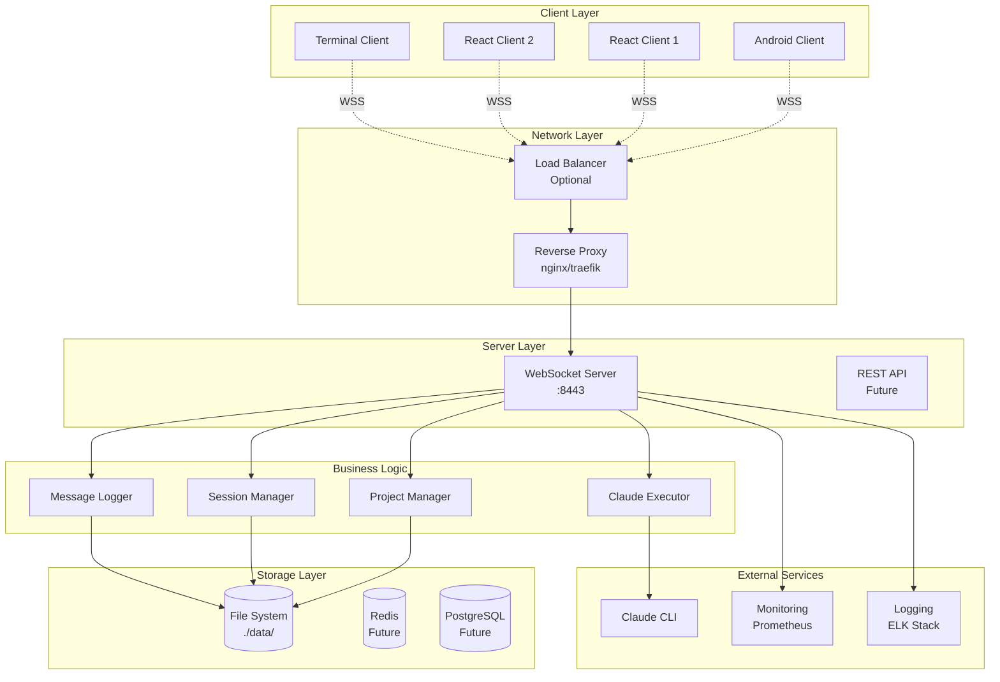

### Component Interaction

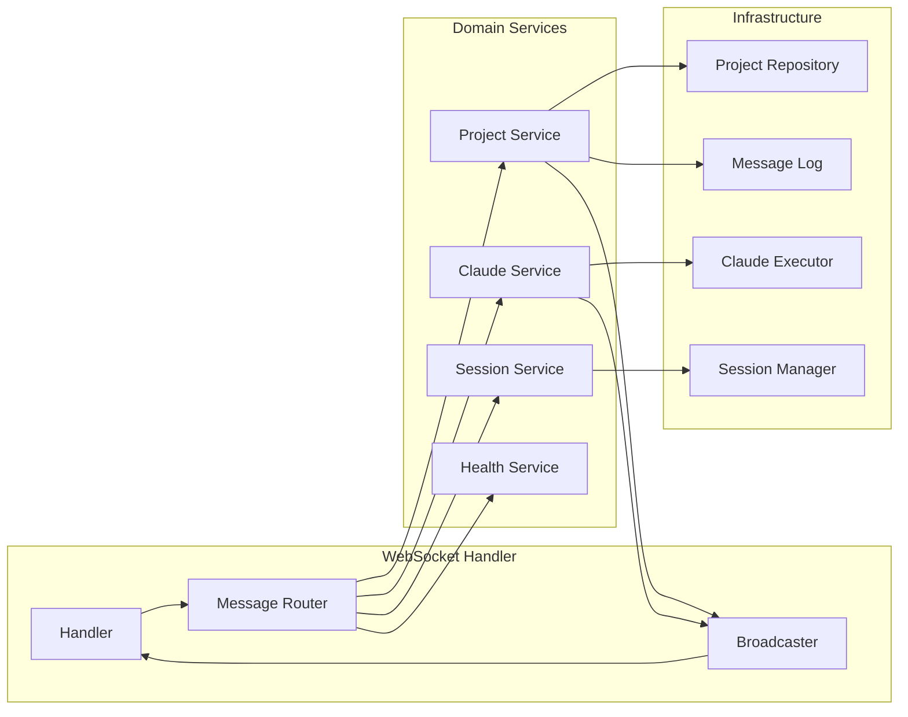

## Component Architecture

### Hexagonal Architecture Pattern

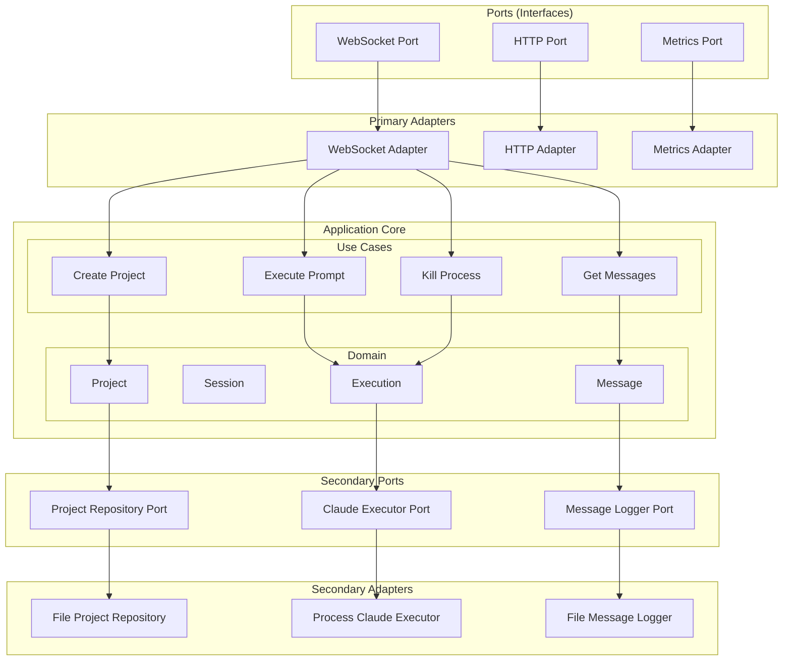

### Class Diagram

```mermaid
classDiagram
    class Server {
        -config Config
        -wsHandler WebSocketHandler
        -projectMgr ProjectManager
        -executor ClaudeExecutor
        -sessionMgr SessionManager
        +Start() error
        +Shutdown(ctx) error
        -setupRoutes()
        -broadcastStats()
    }
    
    class WebSocketHandler {
        -upgrader websocket.Upgrader
        -projectMgr ProjectManager
        -executor ClaudeExecutor
        -sessions map[string]Session
        -mu sync.RWMutex
        +HandleUpgrade(w, r)
        +RouteMessage(session, msg)
        +BroadcastToProject(projectID, msg)
        -addSession(session)
        -removeSession(sessionID)
    }
    
    class ProjectManager {
        -projects map[string]Project
        -dataDir string
        -mu sync.RWMutex
        -maxProjects int
        +CreateProject(path) (Project, error)
        +DeleteProject(id) error
        +GetProject(id) (Project, error)
        +ListProjects() []Project
        +UpdateSession(projectID, sessionID) error
        -validatePath(path) error
        -checkNesting(path) error
        -saveMetadata(project) error
        -loadProjects() error
    }
    
    class ClaudeExecutor {
        -processes map[string]Process
        -mu sync.Mutex
        -timeout time.Duration
        -claudePath string
        +Execute(ctx, project, cmd) (Response, error)
        +Kill(projectID) error
        -buildCommand(project, cmd) []string
        -parseOutput(data) (Message, error)
        -trackProcess(projectID, cmd)
        -untrackProcess(projectID)
    }
    
    class Project {
        +ID string
        +Path string
        +SessionID string
        +State ProjectState
        +CreatedAt time.Time
        +LastActive time.Time
        +MessageLog MessageLog
        +Subscribers map[string]Session
        +mu sync.RWMutex
        +SetState(state)
        +AddSubscriber(session)
        +RemoveSubscriber(sessionID)
        +BroadcastMessage(msg)
    }
    
    class Session {
        +ID string
        +Conn websocket.Conn
        +ProjectID string
        +CreatedAt time.Time
        +LastPing time.Time
        +send chan Message
        +done chan struct{}
        +SendMessage(msg) error
        +Close()
    }
    
    class MessageLog {
        -projectID string
        -logDir string
        -currentFile File
        -mu sync.Mutex
        -rotationSize int64
        -messageCount int
        +Append(msg) error
        +GetMessagesSince(time) []Message
        -rotateIfNeeded() error
        -openLogFile() error
        -writeMessage(msg) error
    }
    
    Server --> WebSocketHandler
    Server --> ProjectManager
    Server --> ClaudeExecutor
    
    WebSocketHandler --> ProjectManager
    WebSocketHandler --> ClaudeExecutor
    WebSocketHandler --> Session
    
    ProjectManager --> Project
    Project --> MessageLog
    Project --> Session
    
    ClaudeExecutor --> Project
```

## Data Flow

### Message Processing Flow

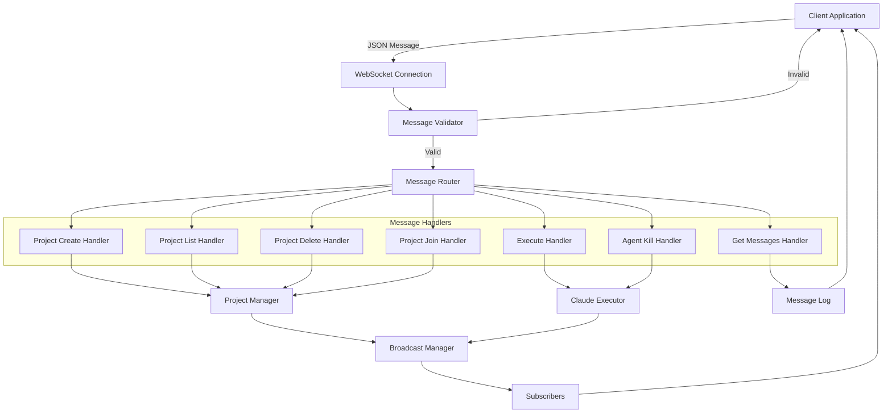

### Execution Flow

```mermaid
flowchart LR
    subgraph "Request Phase"
        RM[Receive Message]
        VP[Validate Prompt]
        GP[Get Project]
        CS[Check State]
    end
    
    subgraph "Execution Phase"
        AL[Acquire Lock]
        BC[Build Command]
        SP[Start Process]
        TO[Track Output]
    end
    
    subgraph "Output Phase"
        PO[Parse Output]
        BM[Broadcast Messages]
        US[Update Session]
        SM[Save Messages]
    end
    
    subgraph "Completion Phase"
        UP[Update Project]
        RL[Release Lock]
        NS[Notify Subscribers]
        CL[Cleanup]
    end
    
    RM --> VP
    VP --> GP
    GP --> CS
    CS --> AL
    AL --> BC
    BC --> SP
    SP --> TO
    TO --> PO
    PO --> BM
    BM --> US
    US --> SM
    SM --> UP
    UP --> RL
    RL --> NS
    NS --> CL
```

## Sequence Diagrams

### Project Creation and Execution

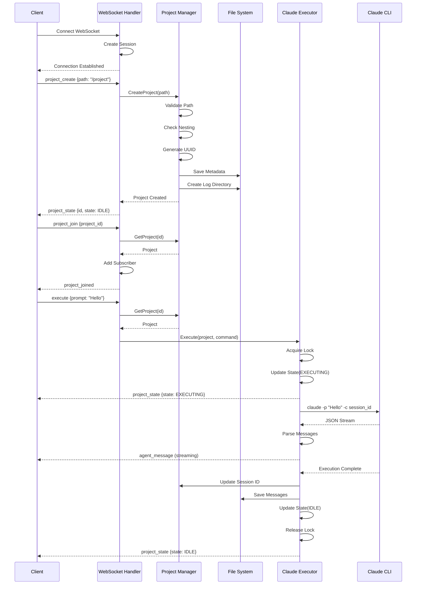

### Multi-Client Synchronization

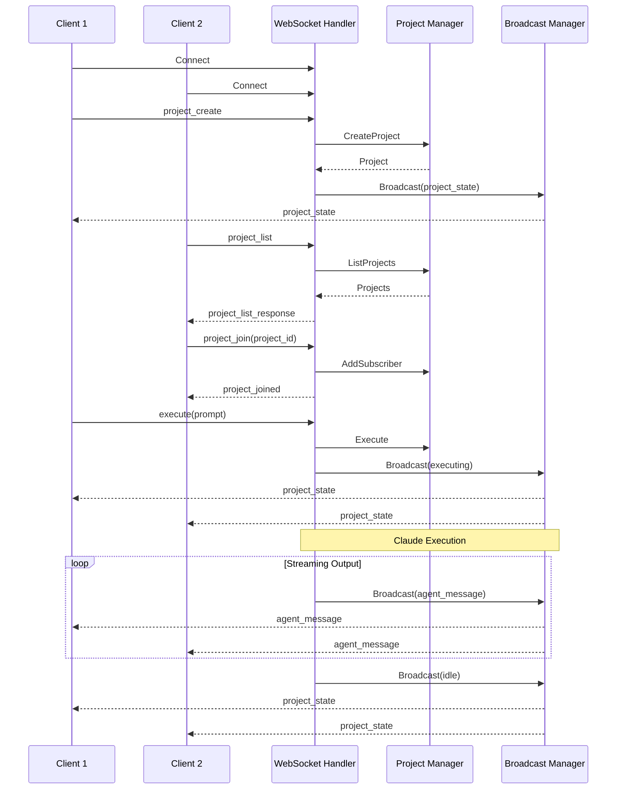

### Error Handling Flow

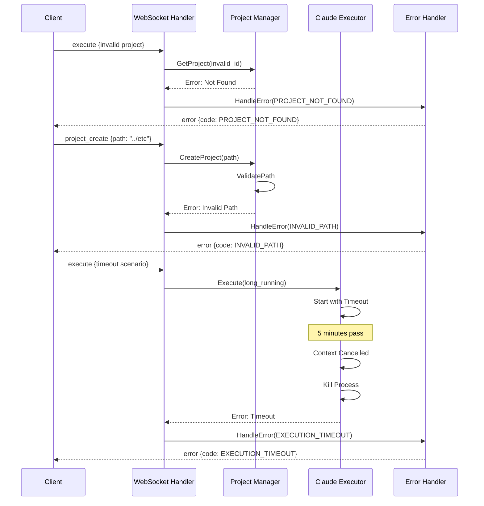

## State Management

### Project State Machine

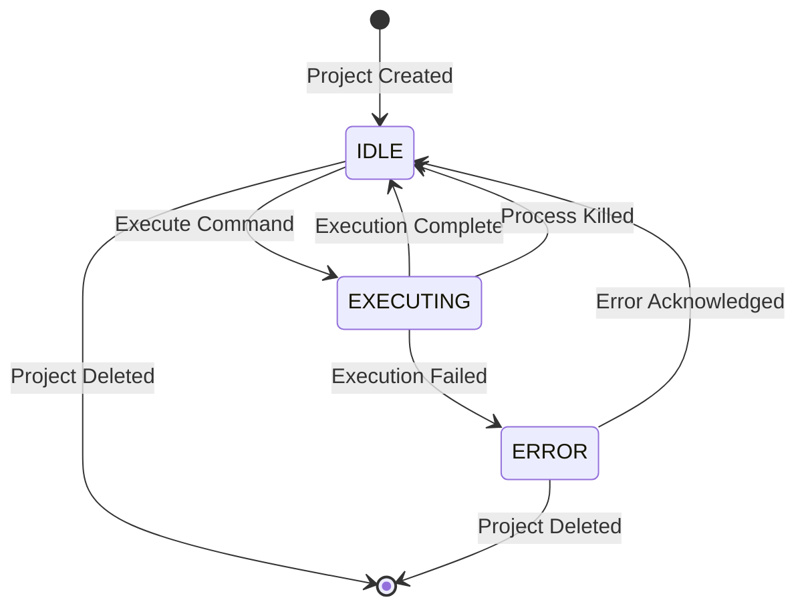

### Connection State Management

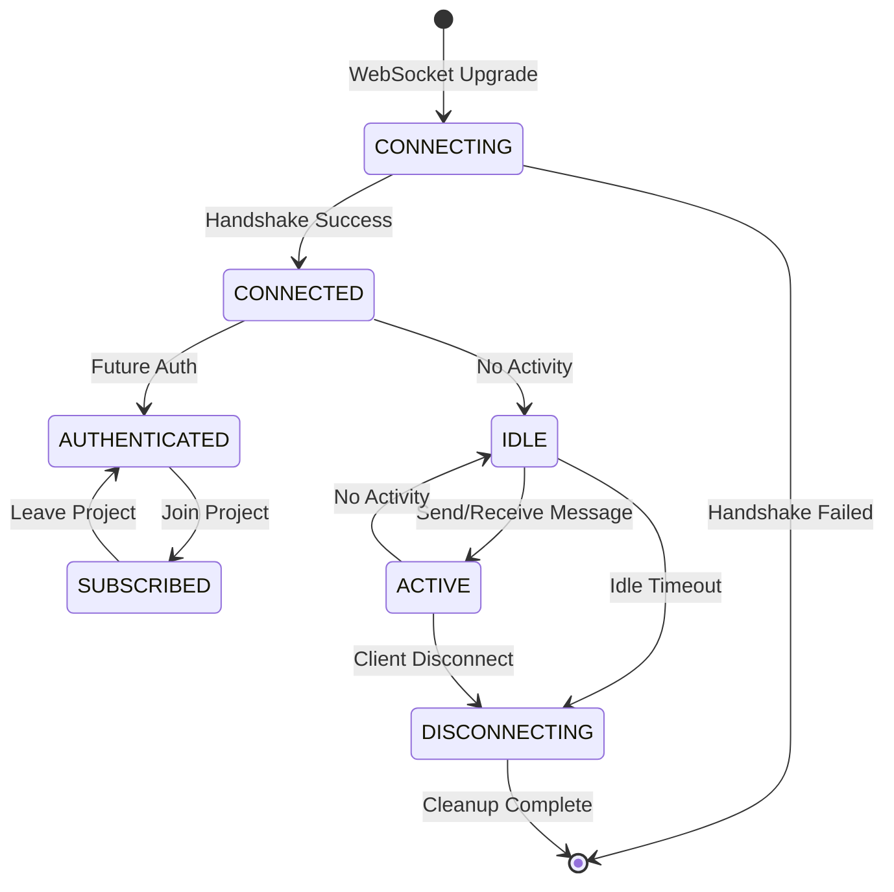

### Message Flow States

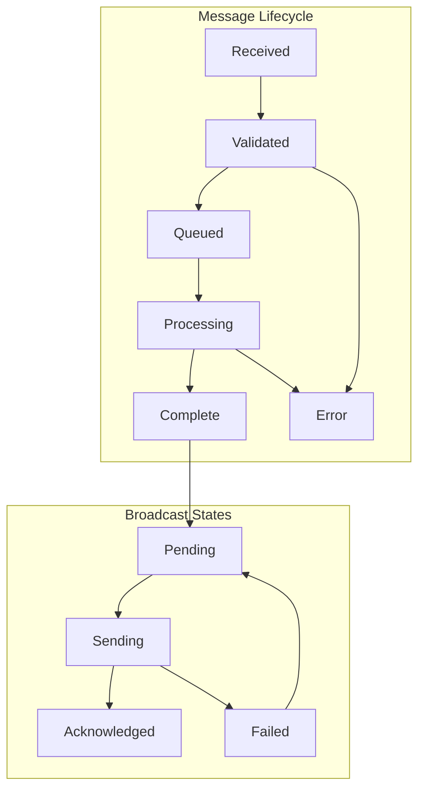

## Deployment Architecture

### Single Server Deployment

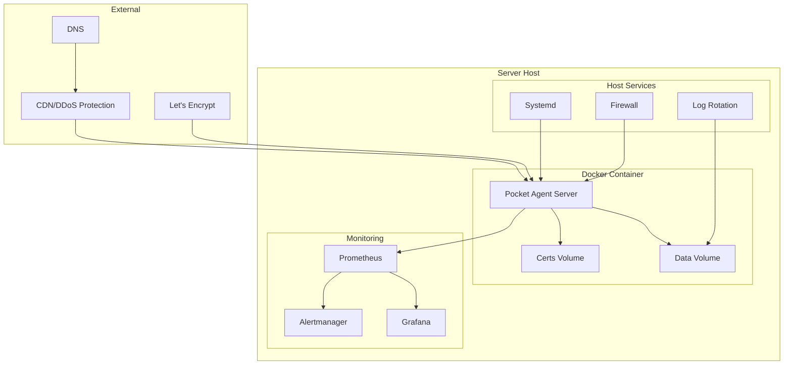

### High Availability Deployment (Future)

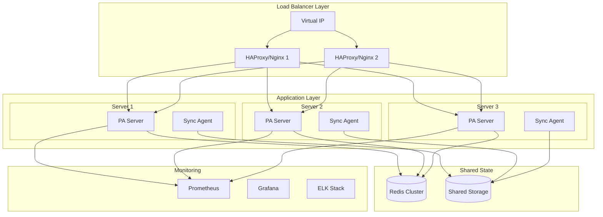

### Kubernetes Deployment (Future)

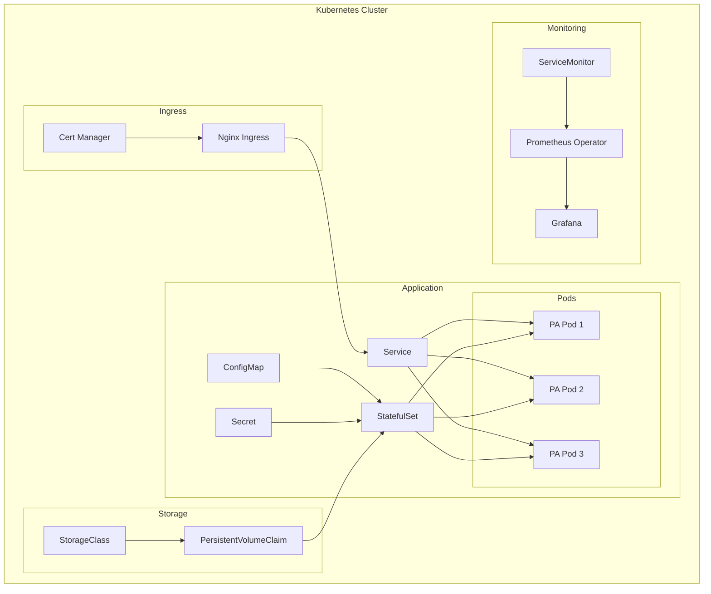

---

For more detailed information about specific components, see:
- [WebSocket API Design](../../documentation/modules/server/features/websocket-api/design.md)
- [Deployment Guide](../deployment/README.md)
- [Security Architecture](../security/README.md)