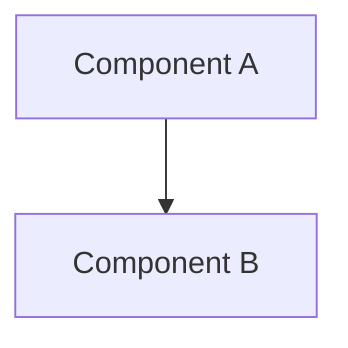

# Pocket Agent Documentation - Conversion Instructions

## Overview

This document provides detailed, step-by-step instructions for converting existing Pocket Agent documentation to the spec workflow format. Each section includes examples, templates, and specific transformation rules.

## Table of Contents

1. [Pre-Migration Setup](#pre-migration-setup)
2. [Creating architecture.md](#creating-architecturemd)
3. [Converting Individual Features](#converting-individual-features)
4. [Document-Specific Conversion Guides](#document-specific-conversion-guides)
5. [Templates for New Documents](#templates-for-new-documents)
6. [Example Conversions](#example-conversions)
7. [Common Patterns and Solutions](#common-patterns-and-solutions)

## Pre-Migration Setup

### 1. Create Directory Structure

```bash
# Create the new features directory
mkdir -p documentation/features

# Create archive directory for old docs (temporary)
mkdir -p documentation/archive/mobile-app-spec

# Create templates directory updates
mkdir -p documentation/templates/spec-workflow
```

### 2. Prepare Migration Workspace

1. **Clone/backup existing documentation**
2. **Set up migration branch**: `git checkout -b docs/spec-workflow-migration`
3. **Install any needed tools** (Markdown linters, link checkers)

## Creating architecture.md

### Step 1: Gather Source Content

Collect architectural information from these files:
- `/documentation/project.spec.md` - Sections: System Overview, Architecture, Technology Stack
- `/documentation/mobile-app-spec/frontend.spec.md` - Sections: Architecture, Development Guidelines
- `/documentation/mobile-app-spec/component-map.specs.md` - All content
- `/documentation/claude-code-sdk-messages.spec.md` - Integration patterns only

### Step 2: Structure the Document

```markdown
# Pocket Agent - System Architecture

## Table of Contents
1. [System Overview](#system-overview)
2. [Architecture Philosophy](#architecture-philosophy)
3. [Technology Stack](#technology-stack)
4. [Component Architecture](#component-architecture)
5. [Mobile Application Architecture](#mobile-application-architecture)
6. [Server Architecture](#server-architecture)
7. [Communication Patterns](#communication-patterns)
8. [Security Architecture](#security-architecture)
9. [Development Guidelines](#development-guidelines)
10. [Architecture Decision Records](#architecture-decision-records)

## System Overview
[Merge content from project.spec.md System Overview]

## Architecture Philosophy
[Extract principles from frontend.spec.md]

## Technology Stack
### Mobile Application (Android)
[From frontend.spec.md]

### Server Components
[From project.spec.md]

### Communication Layer
[From project.spec.md and SDK messages spec]

## Component Architecture
[Transform component-map.specs.md into narrative + diagrams]

[Continue with remaining sections...]
```

### Step 3: Transform Content

**Example Transformation**:

FROM (project.spec.md):
```markdown
#### Server Components (Development Machine)
- **Runtime**: Node.js with TypeScript
- **Claude Integration**: `@anthropic/claude-code` SDK
```

TO (architecture.md):
```markdown
### Server Components

The server-side architecture is built on Node.js with TypeScript, chosen for:
- Excellent WebSocket support through the `ws` library
- Type safety for message protocol definitions
- Direct integration with Claude Code SDK

#### Core Technologies
| Component | Technology | Version | Purpose |
|-----------|------------|---------|---------|
| Runtime | Node.js | 18+ | Server runtime environment |
| Language | TypeScript | 5.0+ | Type safety and modern JavaScript |
| Claude Integration | @anthropic/claude-code | Latest | Claude Code SDK integration |
| WebSocket | ws | 8.0+ | Real-time bidirectional communication |
```

## Converting Individual Features

### General Feature Conversion Process

For each feature, follow these steps:

#### Step 1: Create Feature Directory

```bash
# For split features (e.g., communication-layer)
mkdir -p documentation/features/communication-layer

# For single features (e.g., data-layer)
mkdir -p documentation/features/data-layer
```

#### Step 2: Create Required Files

Each feature needs exactly 5 files:
```bash
touch documentation/features/{feature-name}/context.md
touch documentation/features/{feature-name}/research.md
touch documentation/features/{feature-name}/requirements.md
touch documentation/features/{feature-name}/design.md
touch documentation/features/{feature-name}/tasks.md
```

#### Step 3: Extract and Transform Content

Use this mapping table for each document type:

| Target Document | Source Sections | Transformation Required |
|----------------|-----------------|------------------------|
| context.md | Overview, Introduction, Purpose | Rewrite in business/user terms |
| research.md | N/A - Create new | Analyze codebase for patterns |
| requirements.md | Feature descriptions, functional requirements | Convert to user stories + acceptance criteria |
| design.md | Architecture, Implementation, Components | Reorganize with clear sections |
| tasks.md | N/A - Create new | Generate from design components |

## Document-Specific Conversion Guides

### Converting to context.md

**Purpose**: Provide background and motivation for the feature

**Process**:
1. Extract overview/introduction sections
2. Rewrite from user/business perspective
3. Remove technical implementation details
4. Add historical context if available

**Example Conversion**:

FROM (feat.md):
```markdown
## Overview
The Communication Layer feature provides the core networking infrastructure 
for Pocket Agent. This feature implements direct WebSocket communication 
with SSH key authentication.
```

TO (context.md):
```markdown
# Communication Layer - Context

## Overview

The Communication Layer enables mobile developers to control Claude Code 
running on their development machines from anywhere. This feature addresses 
the fundamental challenge of maintaining persistent, secure connections 
between mobile devices and development servers across varying network 
conditions.

## Business Context

Mobile developers need the ability to:
- Monitor long-running Claude Code sessions while away from their desk
- Approve file changes and operations from their phone
- Maintain development momentum during commutes or meetings

The Communication Layer makes this possible by providing a robust, 
secure connection that handles the realities of mobile networking.

## Technical Context

This feature integrates with:
- The mobile app's background service architecture
- SSH key management for secure authentication
- Message queuing for offline resilience

## Historical Context

Initially considered using SSH tunneling, but this approach proved 
incompatible with mobile platform constraints. The WebSocket approach 
was chosen for better battery efficiency and platform compatibility.
```

### Converting to requirements.md

**Purpose**: Define what the feature must do in user stories and acceptance criteria

**Process**:
1. Identify all functional capabilities
2. Group into logical user stories
3. Convert technical requirements to EARS format
4. Add edge cases and error scenarios

**Example Conversion**:

FROM (feat.md):
```markdown
### WebSocket Implementation
- Must support WSS (WebSocket Secure) protocol
- Implement automatic reconnection with exponential backoff
- Handle message queuing during disconnections
```

TO (requirements.md):
```markdown
# Communication Layer - Requirements

## User Stories

### Story 1: Secure Connection Establishment
**As a** mobile app user  
**I want** to securely connect to my development server  
**So that** I can control Claude Code remotely without compromising security

#### Acceptance Criteria
1. WHEN user initiates connection to a server 
   THEN system SHALL establish connection using WSS protocol only
2. IF server requires authentication 
   THEN system SHALL present SSH key challenge-response dialog
3. WHEN connection is established 
   THEN system SHALL display connection status as "Connected"

### Story 2: Connection Resilience
**As a** mobile app user  
**I want** the app to automatically handle network disruptions  
**So that** I don't lose work progress when switching networks

#### Acceptance Criteria
1. WHEN network connection is lost 
   THEN system SHALL attempt automatic reconnection
2. IF reconnection fails 
   THEN system SHALL retry with exponential backoff (2s, 4s, 8s, up to 30s)
3. WHEN connection is restored 
   THEN system SHALL sync all missed messages
4. IF disconnection exceeds 5 minutes 
   THEN system SHALL notify user via notification
```

### Converting to design.md

**Purpose**: Technical architecture and implementation details

**Process**:
1. Consolidate all technical sections
2. Organize into standard structure
3. Add missing diagrams
4. Ensure all code examples are complete

**Structure Template**:
```markdown
# [Feature] - Design

## Overview
[High-level technical approach]

## Architecture
[Component structure and relationships]



## Component Specifications

### [Component Name]
[Detailed specification with full code]

## Data Models
[All data structures and validation]

## API Specifications
[Internal and external APIs]

## Error Handling Strategy
[Approach to errors and recovery]

## Security Considerations
[Security measures and constraints]

## Performance Considerations
[Optimization strategies]

## Testing Strategy
[How to test this feature]
```

### Creating research.md

**Purpose**: Document codebase analysis and pattern research

**Template**:
```markdown
# [Feature] - Research

## Codebase Analysis

### Existing Implementations
[Review of similar features in codebase]

### Code Locations
- Related feature: `app/src/main/java/com/example/similar`
- Shared utilities: `app/src/main/java/com/example/utils`

## Pattern Analysis

### Identified Patterns
1. **Repository Pattern**
   - Used in: Data layer, Settings management
   - Location: `data/repository/`
   - Benefits: Testability, separation of concerns

2. **Observer Pattern**
   - Used in: Network state monitoring
   - Implementation: Kotlin Flow
   - Benefits: Reactive updates

### Recommended Patterns for This Feature
1. **[Pattern Name]**: [Why it fits]

## Technology Research

### WebSocket Libraries Evaluated
1. **OkHttp WebSocket**
   - Pros: Integrated with existing HTTP client
   - Cons: Limited features
   - Decision: Selected for simplicity

2. **Scarlet**
   - Pros: Reactive, lifecycle-aware
   - Cons: Additional dependency
   - Decision: Deferred for future

## Integration Points

### Existing Systems
1. **Background Service**: Uses bound service pattern
2. **Security Manager**: Provides SSH key operations
3. **Message Queue**: Existing SQLite implementation

## Risk Analysis

### Technical Risks
1. **Battery Drain**: Persistent connections impact battery
   - Mitigation: Implement adaptive polling
   
2. **Platform Restrictions**: Android Doze mode
   - Mitigation: Foreground service with notification

### Implementation Risks
1. **Complexity**: WebSocket + SSH authentication
   - Mitigation: Phased implementation

## Recommendations

Based on this research:
1. Use OkHttp WebSocket for consistency
2. Implement connection state as Flow
3. Reuse existing message queue system
4. Follow repository pattern for persistence
```

### Creating tasks.md

**Purpose**: Break down implementation into executable steps

**Template**:
```markdown
# [Feature] - Implementation Tasks

## Overview
This document breaks down the implementation of [Feature] into executable tasks.

## Prerequisites
- [ ] Architecture.md reviewed and understood
- [ ] Requirements.md approved by stakeholders  
- [ ] Design.md reviewed by tech lead
- [ ] Development environment setup

## Phase 1: Foundation

### Data Models and Interfaces
- [ ] 1.1 Create core data models
  - Create `models/ConnectionState.kt`
  - Create `models/Message.kt`
  - Create `models/ServerProfile.kt`
  - Add kotlinx.serialization annotations
  - _Requirements: 1.1, 1.2_

- [ ] 1.2 Define repository interfaces
  - Create `repository/ConnectionRepository.kt`
  - Define CRUD operations
  - Add Flow return types for reactive updates
  - _Requirements: 2.1_

### Base Infrastructure
- [ ] 1.3 Set up dependency injection
  - Create `di/CommunicationModule.kt`
  - Configure Hilt bindings
  - Add @InstallIn annotations
  - _Requirements: All_

## Phase 2: Core Implementation

### WebSocket Client
- [ ] 2.1 Implement WebSocket client
  - Create `websocket/SecureWebSocketClient.kt`
  - Implement OkHttp WebSocket listener
  - Add SSL/TLS configuration
  - Handle connection lifecycle
  - _Requirements: 1.1, 1.3_

- [ ] 2.2 Add authentication flow
  - Create `auth/SshAuthenticator.kt`
  - Implement challenge-response protocol
  - Integrate with SSH key manager
  - _Requirements: 1.2_

### Connection Management
- [ ] 2.3 Implement connection state manager
  - Create `manager/ConnectionStateManager.kt`
  - Track connection status with StateFlow
  - Implement reconnection logic
  - Add exponential backoff
  - _Requirements: 2.1, 2.2_

## Phase 3: Integration

### Background Service Integration
- [ ] 3.1 Integrate with foreground service
  - Update `BackgroundService.kt`
  - Add connection monitoring
  - Implement notification updates
  - _Requirements: 3.1_

### Message Queue Integration
- [ ] 3.2 Connect to message queue
  - Update message queue for offline storage
  - Implement message sync on reconnection
  - Add message ordering guarantees
  - _Requirements: 2.3_

## Phase 4: Testing

### Unit Tests
- [ ] 4.1 Test WebSocket client
  - Mock OkHttp WebSocket
  - Test connection states
  - Verify error handling
  - _Requirements: All_

- [ ] 4.2 Test authentication flow
  - Mock SSH operations
  - Test challenge-response
  - Verify timeout handling
  - _Requirements: 1.2_

### Integration Tests
- [ ] 4.3 Test full connection flow
  - Use MockWebServer
  - Test reconnection scenarios
  - Verify message ordering
  - _Requirements: All_

## Phase 5: Polish and Documentation

### Error Handling
- [ ] 5.1 Implement comprehensive error handling
  - Add user-friendly error messages
  - Implement retry mechanisms
  - Add analytics tracking
  - _Requirements: 4.1_

### Documentation
- [ ] 5.2 Update documentation
  - Add code comments
  - Update API documentation
  - Create integration guide
  - _Requirements: All_

## Completion Checklist
- [ ] All unit tests passing
- [ ] All integration tests passing
- [ ] Code review completed
- [ ] Documentation updated
- [ ] Performance benchmarks met
```

## Templates for New Documents

### context.md Template

```markdown
# [Feature Name] - Context

## Overview
[2-3 paragraphs explaining what the feature does and why it matters to users]

## Business Context

### User Needs
- [Need 1]: [Description]
- [Need 2]: [Description]

### Business Value
- [Value proposition 1]
- [Value proposition 2]

## Technical Context

### System Integration
This feature integrates with:
- [System 1]: [How and why]
- [System 2]: [How and why]

### Dependencies
- Depends on: [List features this needs]
- Required by: [List features that need this]

### Constraints
- Platform: [Android-specific constraints]
- Performance: [Resource limitations]
- Security: [Security requirements]

## Historical Context

### Previous Approaches
[If applicable, describe what was tried before]

### Lessons Learned
[Key insights that shaped current approach]

### Future Considerations
[Known future requirements or extensions]
```

### research.md Template

```markdown
# [Feature Name] - Research

## Executive Summary
[Brief summary of research findings and recommendations]

## Codebase Analysis

### Related Existing Features
1. **[Feature Name]**
   - Location: `path/to/feature`
   - Relevance: [How it relates]
   - Patterns to reuse: [List patterns]

### Code Inventory
| Component | Location | Purpose | Reusable |
|-----------|----------|---------|----------|
| [Name] | `path/to/file` | [Purpose] | Yes/No |

## Pattern Research

### Applicable Patterns
1. **[Pattern Name]**
   - Description: [Brief description]
   - Usage in codebase: [Where it's used]
   - Applicability: [Why it fits this feature]

### Anti-Patterns to Avoid
1. **[Anti-pattern]**: [Why to avoid]

## Technology Evaluation

### Option 1: [Technology/Library]
- **Pros**: [List]
- **Cons**: [List]
- **Verdict**: [Selected/Rejected and why]

### Option 2: [Technology/Library]
- **Pros**: [List]
- **Cons**: [List]
- **Verdict**: [Selected/Rejected and why]

## Risk Assessment

### Technical Risks
| Risk | Probability | Impact | Mitigation |
|------|------------|---------|------------|
| [Risk] | High/Med/Low | High/Med/Low | [Strategy] |

### Implementation Complexity
- Estimated effort: [Time estimate]
- Key challenges: [List]
- Required expertise: [Skills needed]

## Recommendations

1. **Architecture**: [Recommended approach]
2. **Technology Stack**: [Recommended tools/libraries]
3. **Implementation Strategy**: [Phased approach]
4. **Testing Strategy**: [How to ensure quality]

## References
- [Link to relevant documentation]
- [Link to example implementations]
- [Link to library documentation]
```

## Example Conversions

### Example 1: Converting Communication Layer

Let's walk through converting the split Communication Layer feature:

#### Step 1: Analyze Current Structure
```
communication-layer/
├── communication-layer-index.md (6 KB)
├── communication-layer-overview.feat.md (8 KB)
├── communication-layer-websocket.feat.md (15 KB)
├── communication-layer-authentication.feat.md (12 KB)
├── communication-layer-messages.feat.md (10 KB)
└── communication-layer-testing.feat.md (8 KB)
Total: 59 KB of content
```

#### Step 2: Create New Structure
```bash
mkdir -p documentation/features/communication-layer
cd documentation/features/communication-layer
```

#### Step 3: Extract context.md
```markdown
# Communication Layer - Context

## Overview
[Extract from overview.feat.md introduction, rewritten for business context]

The Communication Layer enables developers to maintain full control over 
Claude Code sessions from their mobile devices, regardless of location...
```

#### Step 4: Create research.md
```markdown
# Communication Layer - Research

## Executive Summary
Research indicates that WebSocket with SSH authentication provides the 
optimal balance of security, performance, and battery efficiency for 
mobile-to-server communication...
```

#### Step 5: Transform requirements.md
- Extract all functional descriptions
- Convert to user stories
- Add acceptance criteria in EARS format

#### Step 6: Consolidate design.md
- Merge all technical content from WebSocket, authentication, and messages files
- Organize into coherent sections
- Ensure code examples are complete

#### Step 7: Generate tasks.md
- Break down each component from design
- Create logical implementation sequence
- Reference requirements

### Example 2: Converting Single-File Feature (Data Layer)

#### Current File Analysis
```
data-layer-entity-management.feat.md (25 KB)
- Overview section (2 KB)
- Architecture section (5 KB)  
- Implementation section (15 KB)
- Testing section (3 KB)
```

#### Conversion Process

1. **context.md**: Extract overview, expand with business context
2. **research.md**: Analyze existing data layer patterns in app
3. **requirements.md**: Transform functional descriptions
4. **design.md**: Use architecture + implementation sections
5. **tasks.md**: Generate from implementation components

## Common Patterns and Solutions

### Pattern 1: Handling Code Examples

**Problem**: Code snippets are incomplete or lack context

**Solution**:
```markdown
### Before (in feat.md):
```kotlin
fun connect() {
    websocket.connect(url)
}
```

### After (in design.md):
```kotlin
package com.pocketagent.communication.websocket

import okhttp3.OkHttpClient
import okhttp3.Request
import okhttp3.WebSocket
import okhttp3.WebSocketListener
import javax.inject.Inject
import javax.inject.Singleton

@Singleton
class SecureWebSocketClient @Inject constructor(
    private val okHttpClient: OkHttpClient,
    private val authManager: SshAuthManager
) {
    private var webSocket: WebSocket? = null
    
    fun connect(serverUrl: String) {
        val request = Request.Builder()
            .url(serverUrl)
            .build()
            
        webSocket = okHttpClient.newWebSocket(request, createListener())
    }
    
    private fun createListener() = object : WebSocketListener() {
        override fun onOpen(webSocket: WebSocket, response: Response) {
            // Implementation
        }
    }
}
```
```

### Pattern 2: Missing User Stories

**Problem**: Feature has only technical requirements

**Solution**: Ask these questions:
1. Who uses this feature? (Actor)
2. What do they want to do? (Action)
3. Why do they want it? (Benefit)

**Example**:
- Technical: "System must persist data locally"
- User Story: "As a mobile user, I want my data saved locally, so that I can access it offline"

### Pattern 3: Implicit Requirements

**Problem**: Requirements hidden in implementation details

**Solution**: Look for:
- Error handling code → Error scenario requirements
- Validation logic → Input requirements
- Configuration options → Flexibility requirements

### Pattern 4: Split Feature Consolidation

**Problem**: Information scattered across multiple files

**Solution**:
1. Create topic map of all content
2. Group by design sections (not by file)
3. Eliminate redundancy
4. Preserve all unique content

## Validation Checklist

After converting each feature, verify:

- [ ] **Content Preservation**: No technical details lost
- [ ] **Format Compliance**: Follows spec workflow structure
- [ ] **Completeness**: All 5 documents present
- [ ] **Cross-References**: All internal links updated
- [ ] **Code Quality**: All examples are complete and runnable
- [ ] **Requirements Traceability**: All tasks reference requirements
- [ ] **User Focus**: Context and requirements are user-centric
- [ ] **Technical Accuracy**: Design matches implementation reality

## Troubleshooting Guide

### Issue: Not enough content for research.md
**Solution**: 
- Analyze similar features in codebase
- Research Android best practices
- Document technology trade-offs
- Add risk analysis

### Issue: Requirements seem too technical
**Solution**:
- Reframe from user perspective
- Add business context
- Focus on outcomes, not implementation
- Use acceptance criteria for technical details

### Issue: Design.md becoming too large
**Solution**:
- Consider splitting into sub-features
- Move detailed specs to appendices
- Focus on essential architecture
- Reference external documentation

### Issue: Tasks too granular or too broad
**Solution**:
- Aim for 2-4 hour tasks
- Group related small tasks
- Split large tasks into phases
- Ensure each task has clear completion criteria

## Next Steps

1. Start with Phase 1 (Foundation) migrations
2. Use these instructions for each feature
3. Validate each conversion before proceeding
4. Update templates based on lessons learned
5. Document any new patterns discovered

Remember: The goal is transformation, not recreation. Preserve the excellent technical content while adding the structure and user focus of the spec workflow.