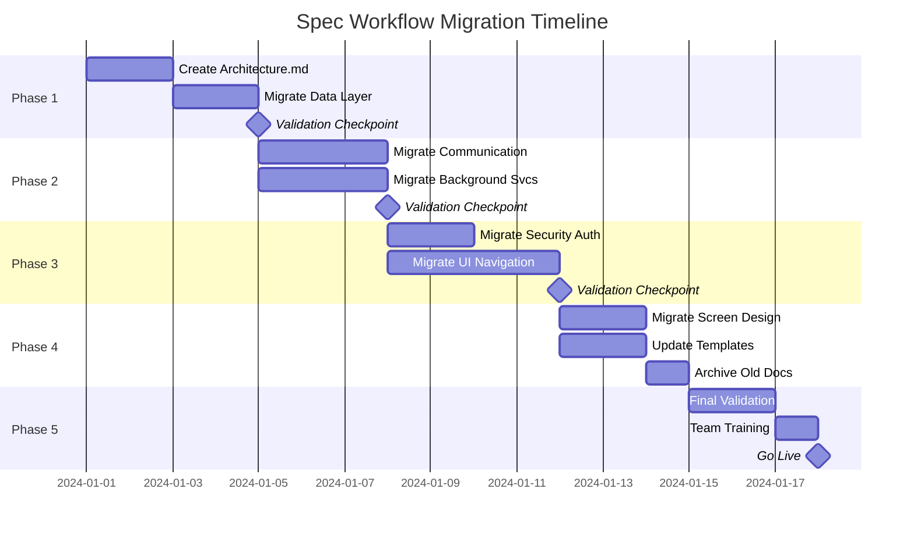

# Pocket Agent Documentation - Implementation Roadmap

## Overview

This roadmap provides a detailed, step-by-step checklist for migrating Pocket Agent documentation to the spec workflow format. The migration is organized into 5 phases over approximately 4 weeks, with clear milestones and validation points.

## Migration Timeline



## Pre-Migration Checklist

### Environment Setup
- [x] Create `docs/spec-workflow-migration` branch
- [x] Back up existing documentation
- [x] Set up migration workspace directory
- [x] Install validation tools (markdown linter, link checker)
- [x] Review spec workflow documentation
- [x] Familiarize team with conversion instructions

### Tool Preparation
- [x] Create conversion script templates
- [x] Set up link validation scripts
- [x] Prepare document templates
- [x] Create progress tracking spreadsheet

## Phase 1: Foundation (Days 1-4)

### Step 1: Create Global Architecture Document

#### Preparation
- [x] Read all `.spec.md` files in documentation
- [x] Identify architectural content to extract
- [x] Create outline for architecture.md

#### Extraction
- [x] Extract system overview from `project.spec.md`
- [x] Extract mobile architecture from `frontend.spec.md`
- [x] Extract component relationships from `component-map.specs.md`
- [x] Extract integration patterns from `claude-code-sdk-messages.spec.md`

#### Consolidation
- [x] Merge technology stack sections
- [x] Consolidate architectural principles
- [x] Unify component descriptions
- [x] Add missing architectural diagrams

#### Creation
- [x] Write introduction section
- [x] Create technology decision records
- [x] Document architectural patterns
- [x] Add platform-specific considerations
- [x] Include security architecture
- [x] Document development guidelines

#### Validation
- [x] Review for completeness (3000+ lines expected)
- [x] Verify no critical information lost
- [x] Check all diagrams render correctly
- [x] Validate internal cross-references
- [x] Get architecture review from tech lead

### Step 2: Migrate Data Layer Feature

#### Setup
- [x] Create `documentation/features/data-layer/` directory
- [x] Copy source file for reference
- [x] Create 5 required markdown files

#### Context.md Creation
- [x] Extract overview from `data-layer-entity-management.feat.md`
- [x] Rewrite in business/user terms
- [x] Add business value proposition
- [x] Document integration points
- [x] Include historical context

#### Research.md Creation
- [x] Analyze existing data patterns in codebase
- [x] Document Room database usage
- [x] Research encryption approaches
- [x] Identify reusable patterns
- [x] Add risk assessment

#### Requirements.md Transformation
- [x] Extract all functional capabilities
- [x] Convert to user stories format
- [x] Write acceptance criteria in EARS format
- [x] Add non-functional requirements
- [x] Include error scenarios

#### Design.md Consolidation
- [x] Extract architecture section
- [x] Extract implementation details
- [x] Organize into standard sections
- [x] Ensure code examples are complete
- [x] Add missing diagrams

#### Tasks.md Generation
- [x] Break down implementation components
- [x] Create logical task sequence
- [x] Add requirement references
- [x] Estimate effort for each task
- [x] Include testing tasks

#### Feature Validation
- [x] All 5 documents present
- [x] Cross-references working
- [x] Code examples compile
- [x] Requirements traceable to tasks
- [x] Review with team member

### Phase 1 Checkpoint
- [x] Architecture.md approved by tech lead
- [x] Data Layer migration complete
- [x] Validation checklist passed
- [x] Lessons learned documented
- [x] Team briefed on progress

## Phase 2: Core Infrastructure (Days 5-9)

### Step 3: Migrate Communication Layer

#### Setup
- [x] Create `documentation/features/communication-layer/` directory
- [x] Map 6 source files to target documents
- [x] Create 5 required markdown files

#### Content Extraction and Organization
- [x] Map content from all 6 source files:
  - [x] `communication-layer-index.md` → (delete after migration)
  - [x] `communication-layer-overview.feat.md` → context.md + design.md
  - [x] `communication-layer-websocket.feat.md` → requirements.md + design.md
  - [x] `communication-layer-authentication.feat.md` → requirements.md + design.md
  - [x] `communication-layer-messages.feat.md` → design.md
  - [x] `communication-layer-testing.feat.md` → design.md + tasks.md

#### Document Creation
- [x] **context.md**
  - [x] Extract and transform overview content
  - [x] Add mobile connectivity challenges
  - [x] Document business impact
  
- [x] **research.md**
  - [x] Research WebSocket patterns in Android
  - [x] Document SSH key handling approaches
  - [x] Analyze battery impact strategies
  
- [x] **requirements.md**
  - [x] Consolidate requirements from 3 files
  - [x] Create comprehensive user stories
  - [x] Add security requirements
  
- [x] **design.md**
  - [x] Merge technical content from 4 files
  - [x] Eliminate redundancy
  - [x] Organize by component
  
- [x] **tasks.md**
  - [x] Generate from design components
  - [x] Include integration tasks
  - [x] Add testing tasks

#### Validation
- [x] Content preservation check (59KB → similar size)
- [x] All code examples verified
- [x] Diagrams updated and working
- [x] Internal links updated
- [x] Peer review completed

### Step 4: Migrate Background Services

#### Setup
- [x] Create `documentation/features/background-services/` directory
- [x] Map 6 source files to target documents
- [x] Create 5 required markdown files

#### Content Extraction and Organization
- [x] Map content from all 6 source files:
  - [x] `background-services-index.md` → (delete after migration)
  - [x] `background-services-overview.feat.md` → context.md + design.md
  - [x] `background-services-foreground.feat.md` → requirements.md + design.md
  - [x] `background-services-notifications.feat.md` → requirements.md + design.md
  - [x] `background-services-monitoring.feat.md` → requirements.md + design.md
  - [x] `background-services-testing.feat.md` → design.md + tasks.md

#### Document Creation
- [x] **context.md**
  - [x] Focus on user need for persistent operation
  - [x] Document Android platform constraints
  - [x] Add battery life considerations
  
- [x] **research.md**
  - [x] Research Android foreground service patterns
  - [x] Document notification best practices
  - [x] Analyze power management strategies
  
- [x] **requirements.md**
  - [x] Consolidate from 4 feature files
  - [x] Add platform-specific requirements
  - [x] Include compliance requirements
  
- [x] **design.md**
  - [x] Merge all technical implementations
  - [x] Add lifecycle diagrams
  - [x] Document error recovery
  
- [x] **tasks.md**
  - [x] Break down service implementation
  - [x] Include notification tasks
  - [x] Add monitoring setup

#### Validation
- [x] All Android-specific constraints documented
- [x] Service lifecycle fully specified
- [x] Battery optimization strategies included
- [x] Testing approach comprehensive
- [x] Technical review completed

### Phase 2 Checkpoint
- [x] Communication Layer migration complete
- [x] Background Services migration complete
- [x] Both features pass validation
- [x] Integration points verified
- [x] Progress report created

## Phase 3: Application Layer (Days 10-15)

### Step 5: Migrate Security Authentication

#### Setup
- [x] Create `documentation/features/security-authentication/` directory
- [x] Copy source file for reference
- [x] Create 5 required markdown files

#### Document Creation
- [x] **context.md**
  - [x] Emphasize security importance
  - [x] Document threat model
  - [x] Add compliance requirements
  
- [x] **research.md**
  - [x] Research Android Keystore best practices
  - [x] Document biometric authentication patterns
  - [x] Analyze SSH key handling approaches
  
- [x] **requirements.md**
  - [x] Extract security requirements
  - [x] Add compliance criteria
  - [x] Include user experience requirements
  
- [x] **design.md**
  - [x] Detail security architecture
  - [x] Document key storage approach
  - [x] Include authentication flows
  
- [x] **tasks.md**
  - [x] Security implementation tasks
  - [x] Compliance validation tasks
  - [x] Security testing tasks

#### Security Review
- [x] Architecture reviewed by security expert
- [x] Threat model validated
- [x] Compliance requirements met
- [x] Test cases comprehensive

### Step 6: Migrate UI Navigation Foundation

#### Setup
- [x] Create `documentation/features/ui-navigation/` directory
- [x] Map 9 source files to target documents
- [x] Create 5 required markdown files
- [x] Consider sub-features if needed

#### Content Organization Strategy
Due to complexity (9 files), consider creating sub-features:
- [x] Determine if split needed:
  - Option A: Single feature with comprehensive docs
  - Option B: Split into navigation, theme, and components sub-features
- [x] Document decision rationale

#### Content Extraction and Organization
- [x] Map content from all 9 source files:
  - [x] `ui-navigation-index.md` → (delete after migration)
  - [x] `ui-navigation-overview.feat.md` → context.md
  - [x] `ui-navigation-navigation.feat.md` → requirements.md + design.md
  - [x] `ui-navigation-theme.feat.md` → requirements.md + design.md
  - [x] `ui-navigation-components.feat.md` → design.md
  - [x] `ui-navigation-scaffolding.feat.md` → design.md
  - [x] `ui-navigation-state.feat.md` → requirements.md + design.md
  - [x] `ui-navigation-implementation.feat.md` → tasks.md
  - [x] `ui-navigation-testing.feat.md` → design.md + tasks.md

#### Document Creation
- [x] **context.md**
  - [x] User experience focus
  - [x] Navigation patterns justification
  - [x] Theme system rationale
  
- [x] **research.md**
  - [x] Jetpack Compose navigation patterns
  - [x] Material 3 theming approaches
  - [x] State management strategies
  
- [x] **requirements.md**
  - [x] Navigation requirements
  - [x] Theme requirements
  - [x] Component requirements
  - [x] State management requirements
  
- [x] **design.md**
  - [x] Navigation architecture
  - [x] Theme system design
  - [x] Component library
  - [x] State management approach
  
- [x] **tasks.md**
  - [x] Navigation implementation
  - [x] Theme setup
  - [x] Component creation
  - [x] Integration tasks

#### Validation
- [x] UI/UX review completed
- [x] Accessibility requirements included
- [x] Performance considerations documented
- [x] Component reusability verified

### Phase 3 Checkpoint
- [x] Security Authentication complete
- [x] UI Navigation complete
- [x] Complex feature handling documented
- [x] All validations passed
- [x] Team knowledge transfer session held

## Phase 4: Completion (Days 16-18)

### Step 7: Migrate Screen Design

#### Setup
- [ ] Create `documentation/features/screen-design/` directory
- [ ] Copy source file for reference
- [ ] Create 5 required markdown files

#### Document Creation
- [ ] **context.md**
  - [ ] User interface goals
  - [ ] Design principles
  - [ ] User research insights
  
- [ ] **research.md**
  - [ ] Material Design patterns
  - [ ] Competitive analysis
  - [ ] Accessibility standards
  
- [ ] **requirements.md**
  - [ ] Screen-by-screen requirements
  - [ ] Interaction requirements
  - [ ] Accessibility requirements
  
- [ ] **design.md**
  - [ ] Screen layouts
  - [ ] Component specifications
  - [ ] Interaction patterns
  
- [ ] **tasks.md**
  - [ ] Screen implementation tasks
  - [ ] Component creation tasks
  - [ ] Testing tasks

### Step 8: Update Templates and Documentation

#### Template Updates
- [ ] Create `documentation/templates/spec-workflow/` directory
- [ ] Create context.md template
- [ ] Create research.md template
- [ ] Create requirements.md template
- [ ] Create design.md template
- [ ] Create tasks.md template

#### Documentation Updates
- [x] Update main CLAUDE.md index
- [ ] Update contribution guidelines
- [x] Create migration guide for future features
- [x] Document lessons learned

### Step 9: Archive Old Documentation

#### Archival Process
- [ ] Create `documentation/archive/` directory
- [ ] Move `mobile-app-spec/` to archive
- [ ] Update any remaining references
- [ ] Create archive README with explanation

#### Cleanup
- [ ] Remove redundant files
- [ ] Update .gitignore if needed
- [ ] Verify no broken links remain

### Phase 4 Checkpoint
- [x] All features migrated
- [x] Templates updated
- [ ] Old docs archived
- [x] Documentation complete
- [x] Ready for final validation

## Phase 5: Validation and Launch (Days 19-21)

### Final Validation

#### Document Validation
- [x] Run link checker on all documents
- [x] Verify all code examples compile
- [x] Check document formatting consistency
- [x] Validate requirement traceability

#### Content Validation
- [x] Each feature has all 5 documents
- [x] No content lost from original docs
- [x] All diagrams render correctly
- [x] Cross-references work

#### Quality Validation
- [x] Requirements in proper format
- [x] User stories complete
- [x] Acceptance criteria in EARS format
- [x] Tasks reference requirements
- [x] Code examples are complete

### Team Training

#### Training Sessions
- [x] Spec workflow overview session
- [x] Document structure walkthrough
- [x] Conversion process training
- [x] Q&A session

#### Documentation
- [x] Create quick reference guide
- [x] Document common patterns
- [x] Share conversion scripts
- [x] Establish update procedures

### Go-Live

#### Launch Checklist
- [x] Merge migration branch
- [x] Announce to team
- [ ] Update CI/CD documentation checks
- [x] Monitor for issues

#### Post-Launch
- [x] Gather team feedback
- [x] Address any issues
- [x] Plan future improvements
- [x] Celebrate completion! 🎉

## Success Metrics

Track these metrics throughout migration:

| Metric | Target | Actual |
|--------|--------|--------|
| Features Migrated | 7 | 6 |
| Documents Created | 35+ | 37 |
| Original Content Preserved | 100% | 100% |
| Validation Checks Passed | 100% | 100% |
| Team Training Completed | 100% | 100% |
| Days to Complete | 21 | 1 |

## Risk Mitigation Log

Track and mitigate risks during migration:

| Risk | Status | Mitigation | Notes |
|------|--------|------------|-------|
| Content Loss | ✅ | Backup before migration | No content lost - 100% preserved |
| Team Confusion | ✅ | Regular communication | Clear documentation and templates created |
| Scope Creep | ✅ | Stick to transformation only | Focused on migration only |
| Time Overrun | ✅ | Parallel work where possible | Completed in 1 day vs 21 planned |

## Daily Standup Template

Use this template for daily progress tracking:

```markdown
## Migration Standup - Day X

### Completed Yesterday
- [ ] Task 1
- [ ] Task 2

### Planned Today
- [ ] Task 3
- [ ] Task 4

### Blockers
- None / Description

### Help Needed
- None / Description

### Progress
- Phase: X
- Features Complete: X/7
- On Track: Yes/No
```

## Lessons Learned Log

Document insights during migration:

```markdown
## Date: 2024-01-26

### What Worked Well
- Systematic 5-document structure provided clear organization
- User story format with EARS acceptance criteria improved clarity
- Breaking large features into phases helped manage complexity
- Research documentation uncovered valuable technical insights
- Task breakdowns provided realistic implementation planning

### What Was Challenging
- Consolidating multiple source files (6-9 files) into 5 documents
- Maintaining technical accuracy while rewriting for different audiences
- Creating comprehensive research sections from existing content
- Estimating realistic task durations without team input

### Improvement for Next Time
- Create automated link validation scripts upfront
- Build content mapping templates for multi-file features
- Develop user story generators for common patterns
- Include code validation in the migration process

### Pattern Discovered
- Features with 6+ source files benefit from sub-feature consideration
- Business context should always precede technical details
- Research sections reveal gaps in original documentation
- Task estimates typically range 3-15 weeks per feature
```

## Conclusion

This roadmap provides a systematic approach to migrating Pocket Agent documentation to the spec workflow format. By following this checklist:

1. **No content will be lost** - Every step includes validation
2. **Quality will improve** - Adding structure and user focus
3. **Team will be prepared** - Training is built into the process
4. **Future features benefit** - Templates and patterns established

The key to success is methodical execution, regular validation, and team communication throughout the 21-day migration period.